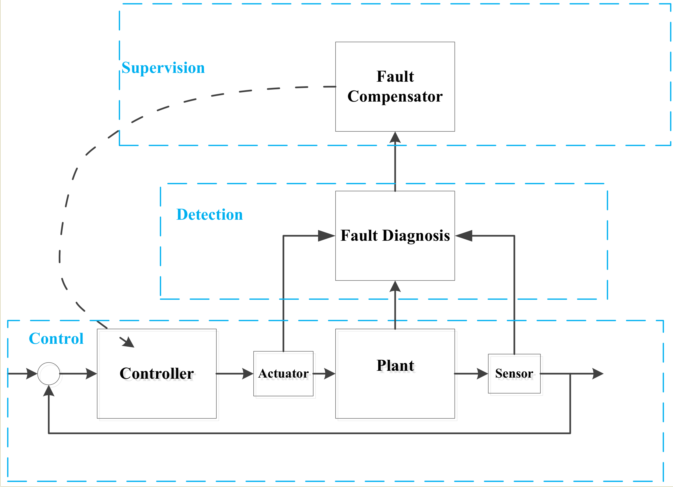

# Fault-Tolerant Control 容差控制

> 本篇文章来源于 [Fault-Tolerant Control | Encyclopedia MDPI](https://encyclopedia.pub/entry/2328)

## 摘要

容错控制器 (FTC) 可以定义为在出现故障时能够容忍故障并使控制性能保持在理想范围内的控制器。
FTC 方法可分为两大类：被动式 FTC 和主动式 FTC。
被动式 FTC 不依赖于故障检测和隔离 (FDI: fault detection and isolation) 模块，可以在不考虑故障类型和大小的情况下保持所需的控制器性能。
主动式 FTC 配备了 FDI 模块，对不同类型的故障表现不同。

## 引言

在经典控制理论中，假设所有部件都能正常而精确地工作。然而，经验告诉我们，这一假设不能一直得到保证，在许多情况下，系统组件在执行任务时可能会面临一些故障或故障。这些累积的故障会危及控制器的稳定性及其性能，这是 [鲁棒控制](.//) 理论无法解决的问题。随着人们对可靠、安全控制器的需求日益增加，容错控制系统成为先进控制理论领域最具吸引力的课题之一，受到了研究者的极大关注。

这一控制领域正在取得的成就导致了几篇有价值的评论文章来概述最新的技术。
Stengel[^1] 于 1991 年发表了 FTC 领域最早的综述论文之一，研究了 FTC 的基本概念和人工智能在 FTC 系统中的应用。1997 年，Patton 提出了对 FTC 技术的全面回顾，并分析了 FTC 设计的关键问题 [^2]。
Luze 和 Richter 介绍了基于重新配置的 FTC 设计入门教程，并回顾了该领域的最新成就 [^3]。
Alwi 等人回顾了控制系统中可能出现的各种故障和故障，并简要概述了故障检测和隔离 (FDI) 和 FTC 方法 [^4]。

在中，[^5][^6] 对外国直接投资方法进行了广泛的调查，他们将 FDI 技术划分为 4 个子类别：

- model-based
- signal-based
- knowledge-based
- hybrid/active approaches

尽管近几十年来为提供全面的 FTC 和 FDI 方法做出了宝贵的努力，但大多数工作只审查了基于硬件冗余的 FTC 方法。与此同时，据我们所知，近年来受到极大关注的分析冗余还没有得到调查。
此外，大多数工作分别考察了 FDI 和 FTC，而没有从技术上考察主动 FTC 和 FDI 之间的联系，以获得一个统一的 FTC 体系。此外，这一控制领域正在取得的成就以及开发可靠控制系统的日益需要是审查该领域最新工作的另一个原因。这些原因促使我们为当前的工作做准备。

## Passive and Active FTC

FTC 技术可分为两大类：主动和被动。
主动 FTC 使用检测技术来发现故障，然后，监控系统将决定如何修改控制结构和参数以补偿系统中故障的影响。然而，在被动 FTC 中，鲁棒补偿器被用来减少系统中的故障影响，或者至少在系统中存在故障的情况下稳定系统。

### Passive FTC

被动 FTC 系统不依赖于故障信息，其设计直接与冗余的概念相结合。被动 FTC 系统中硬件冗余的概念可以定义为应用具有相同输入信号的相同组件，以便复制的输出信号可以与主组件进行比较，以便在性能下降的情况下在 **冗余** 执行器之间切换，以减轻故障影响。

如图 1 所示，在被动 FTC 设计中，可以考虑在控制器、执行器、对象组件和传感器中存在冗余，FTC 系统可以在系统出现故障时切换到这些组件。

图 1.无源 FTC 结构：这种控制器可以通过考虑冗余控制器/执行器/对象/传感器来设计，并且在出现故障时切换到冗余元件。

从 [基本滑模控制简介和示例](./非线性控制/滑模控制/基本滑模控制简介和示例.md) 到 [H-Infinity control](./H-Infinity-control.md)、[Linear Quadratic control 线性二次型控制](./Linear-Quadratic-control-线性二次型控制.md)[^7]、[Fuzzy logic control 模糊控制](./Fuzzy-logic-control-模糊控制.md)、基于 [李雅普诺夫稳定性](./李雅普诺夫稳定性.md) 的控制，已有几种方法用于设计被动 FTC。

这种控制策略通常不那么复杂，因为它们在设计和应用上简单，故障发生和适应之间的滞后较小，以及它们的计算量很小。

被动 FTC 会面临的主要挑战可以概括为:
1. 对硬件冗余的极度依赖：虽然冗余硬件在提高系统可靠性方面有优势，但冗余硬件增加了产品成本，也增加了所需的空间 (产品尺寸) 和产品的重量。显然，关键部件需要冗余以避免故障，但考虑到重量和空间的限制，为整个系统应用冗余将成本高昂且难以应用。
2. 被动 FTC 策略依赖于系统在特定故障/故障场景下保持闭环系统渐近稳定的假设。然而，这一假设可能不足以防止系统在出现大量不可预见的故障时崩溃。
3. 由于在被动 FTC 设计中，需要同时考虑正常和故障情况，在性能方面，它们比主动 FTC 设计更为保守。换句话说，被动 FTC 系统关注的是系统的鲁棒性，而不是每个场景的最优性能，即为了保证系统在出现故障时的稳定性，即使在正常情况下，控制器的调整时间也会增加。因此，主动 FTC 系统受到了研究者的极大关注。

### Active FTC

与被动式 FTC 系统相比，主动式 FTC 系统对每个故障的反应是不同的。这种反应是基于主动 FTC 设计中使用的控制方法和从检测系统接收的信息。一般来说，主动 FTC 设计有三个主要步骤：
1. 检测
2. 监督
3. 控制

图 2 显示了设计主动 FTC 系统的三个主要步骤及其作用。

图 2.主动 FTC 系统的一般结构

一般来说，在设计一个高效的主动 FTC 系统时，应该考虑三个主要因素：
1. 检测单元应该准确。故障虚警和故障测量不准确直接影响有源 FTC 系统的性能。这种不准确会导致对故障的负面反应，甚至会危及系统的稳定性。
2. 所设计的有源 FTC 应对不完全故障检测信息具有鲁棒性。
3. 故障恢复花费的时间应该少于可用恢复时间。换句话说，控制重构/故障补偿应该足够快，以保证系统的稳定性和性能。

事实上，==一个主动FTC系统最重要的部分是它的FDI单元== ；因此，我们根据设计中使用的 FDI 方法对活跃的 FTC 系统进行分类。

在处理不同类型的故障时，主动 FTC 方法通常更有效；然而，控制器的性能主要取决于其 FDI 单元提供及时和准确的故障信息。
我们根据 FDI 系统设计中使用的方法将其分为三大类：
- 基于模型的方法
- 基于知识的方法
- 基于模型 - 知识的组合方法

- 基于模型的方法易于实现；然而，它们的性能高度依赖于系统数学模型的准确性。
- 基于知识的方法不依赖于系统的数学模型，但它们需要大量关于系统性能的历史数据来进行训练。
- 基于模型和知识的组合方法对模型精度的依赖性较小，需要较少的训练数据；但是，设计复杂性会增加，设计人员应该了解这两种方法，才能设计出高效的系统。

## 控制例子

参考 [@blankeConceptsMethodsFaulttolerant2001](.//)，我自己好些部分没看懂…

## 参考

##### 引文

- [@blankeConceptsMethodsFaulttolerant2001](.//)

##### 脚注

[^1]: Stengel, R. F. Intelligent failure-tolerant control. IEEE Control Syst. 1991, 11, 14–23.
[^2]: Patton, R. J. Fault-tolerant control: The 1997 situation. IFAC Proc. Vol. 1997, 30, 1029–1051.
[^3]: Lunze, J.; Richter, J. H. Reconfigurable fault-tolerant control: A tutorial introduction. Eur. J. Control 2008, 14, 359.
[^4]: Alwi, H.; Edwards, C.; Tan, C. P. Fault tolerant control and fault detection and isolation. In Fault Detection and Fault-Tolerant Control Using Sliding Modes; Springer: Berlin/Heidelberg, Germany, 2011; pp. 7–27.
[^5]: Gao, Z.; Cecati, C.; Ding, S. X. A survey of fault diagnosis and fault-tolerant techniques—Part I: Fault diagnosis with model-based and signal-based approaches. IEEE Trans. Ind. Electron. 2015, 62, 3757–3767
[^6]: Cecati, C. A survey of fault diagnosis and fault-tolerant techniques—Part II: Fault diagnosis with knowledge-based and hybrid/active approaches. IEEE Trans. Ind. Electron. 2015, 62, 1.
[^7]: Staroswiecki, M.; Yang, H.; Jiang, B. Progressive accommodation of parametric faults in linear quadratic control. Automatica 2007, 43, 2070–2076
