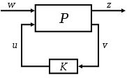

# H-Infinity control

# H-Infinity Control

> 本文来自于 [H-infinity methods in control theory - Wikipedia](https://en.wikipedia.org/wiki/H-infinity_methods_in_control_theory)

## Introduction

控制理论中采用 H-∞(即 H- 无穷大) 方法来综合控制器，以达到在保证性能的前提下达到稳定的目的。为了使用 H-∞方法，控制设计者将控制问题表示为数学优化问题，然后找到解决该优化问题的控制器。

与经典控制技术相比，H∞技术的优势在于，==H∞技术很容易应用于涉及具有交叉耦合的多变量系统的问题 (multivariate systems with cross-coupling between channels)== ；H∞技术的缺点包括成功应用它们所需的数学理解水平，以及需要被控制系统的合理良好模型。

重要的是要记住，所得到的控制器只是在规定的成本函数方面是最优的，而不一定就用于评估控制器的通常性能指标 (如建立时间、能耗等) 而言代表最好的控制器。此外，诸如饱和度之类的非线性约束通常没有得到很好的处理。

这些方法在 20 世纪 70 年代末 80 年代初由 George Zmes(灵敏度最小化/sensitivity minimization)[^1]、J.William Helton(带宽匹配/broadband matching)[^2]、Allen Tannenbaum(增益裕度优化/gain margin optimization)[^3] 引入控制理论。

H∞控制来自于在其上进行优化的数学空间的名称：H∞是矩阵值函数的 [Hardy space - Wikipedia](https://en.wikipedia.org/wiki/Hardy_space) 空间 ([Hardy Space](./../math/杂项/Hardy-space.md))，这些函数是解析的，并且在 Re (S)>0 定义的复平面的开右半平面上有界；**H∞范数是该空间上函数的最大奇异值**==(这可以解释为在任何方向和任何频率上的最大增益；对于SISO系统，这实际上是频率响应的最大幅度)== 。

H∞技术可用于最小化扰动的闭环影响：根据问题的表示，其影响将以稳定性或性能来衡量。

同时优化系统的鲁棒性能和鲁棒镇定是困难的，接近实现这一点的一种方法是 [H-infinity loop-shaping - Wikipedia](https://en.wikipedia.org/wiki/H-infinity_loop-shaping)（H∞环路整形），它允许控制设计者将经典的环路整形概念应用于多变量频率响应以获得良好的鲁棒性能，然后在系统带宽附近优化响应以实现良好的鲁棒稳定（Matlab 可以搞这个）。

## Problem Formulation

First, the process has to be represented according to the following standard configuration:

The plant _P_ has two inputs, the exogenous input _w_,  that includes reference signal and disturbances, and the manipulated variables _u_ . 

There are two outputs, the error signals _z_ that we want to minimize, and the measured variables _v_ , that we use to control the system. 
_v_ is used in _K_ to calculate the manipulated variables _u_ . Notice that all these are generally [vectors](https://en.wikipedia.org/wiki/Vector_(geometry) "Vector (geometry)") , whereas **P** and **K** are [matrices](https://en.wikipedia.org/wiki/Matrix_(mathematics) "Matrix (mathematics)") .

In formulae, the system is:

$$
\left[ \begin{array}{c}
	z\\
	v\\
\end{array} \right] =\mathbf{P}\left( s \right) \left[ \begin{array}{c}
	w\\
	u\\
\end{array} \right] \quad u=\mathbf{K}\left( s \right) v
$$

It is therefore possible to express the dependency of _z_ on _w_ as:

$$
z=F_l\left( \mathbf{P},\mathbf{K} \right) w
$$

Called the _lower [linear fractional transformation](https://en.wikipedia.org/wiki/Linear_fractional_transformation "Linear fractional transformation")_ , $F_l$ is defined (the subscript comes from _lower_ ):

$$
F_l\left( \mathbf{P},\mathbf{K} \right) =P_{11}+P_{12}\mathbf{K}\left( I-P_{22}\mathbf{K} \right) ^{-1}P_{21}
$$

::: note note
这里的linear fractional transformation 是凸函数，参考[@stephenConvexOptimization2004](.//)
:::

Therefore, the objective of $\mathcal{H} _{\infty}$ control design is to find a controller $\mathbf{K}$ such that $F_{l}(\mathbf{P} ,\mathbf{K})$ is minimised according to the ${\mathcal {H}}_{\infty}$ norm. 

The same definition applies to $\mathcal{H}_2$ control design. The infinity norm of the [transfer function matrix](https://en.wikipedia.org/wiki/Transfer_function_matrix "Transfer function matrix")  $F_{l}(\mathbf{P} ,\mathbf{K})$  is defined as:

$$
\left\| F_l\left( \mathbf{P},\mathbf{K} \right) \right\| _{\infty}=\underset{w}{\mathrm{sup}}\bar{\sigma}\left( F_l\left( \mathbf{P},\mathbf{K} \right) \left( jw \right) \right) 
$$

where $\sigma$ is the maximum [singular value](https://en.wikipedia.org/wiki/Singular_value "Singular value") of the matrix $F_{l}(\mathbf{P} ,\mathbf{K})(jw)$ .

The achievable H ∞ norm of the closed loop system is mainly given through the matrix _D_ 11 (when the system _P_ is given in the form ( _A_ , _B_ 1 , _B_ 2 , _C_ 1 , _C_ 2 , _D_ 11 , _D_ 12 , _D_ 22 , _D_ 21 )). There are several ways to come to an _H_ ∞ controller:

- A [Youla-Kucera parametrization](https://en.wikipedia.org/wiki/Youla-Kucera_parametrization "Youla-Kucera parametrization") of the closed loop often leads to very high-order controller.
- [Riccati](https://en.wikipedia.org/wiki/Riccati_equation "Riccati equation") -based approaches solve 2 [Riccati equations](https://en.wikipedia.org/wiki/Riccati_equation "Riccati equation") to find the controller, but require several simplifying assumptions.
- An optimization-based reformulation of the Riccati equation uses [linear matrix inequalities](https://en.wikipedia.org/wiki/Linear_matrix_inequality) and requires fewer assumptions.

## 参考

##### 引文
##### 脚注

[AAA=](.//)](https://sci-hub.ee/10.1109/tac.1981.1102603)
[^2]: Helton, J. William (1978). "Orbit structure of the Mobius transformation semigroup action on H-infinity (broadband matching)". _Adv. Math. Suppl. Stud_. **3**: 129–197.
[AAA=](.//)](https://sci-hub.ee/10.1080/00207178008922838).
