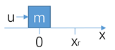
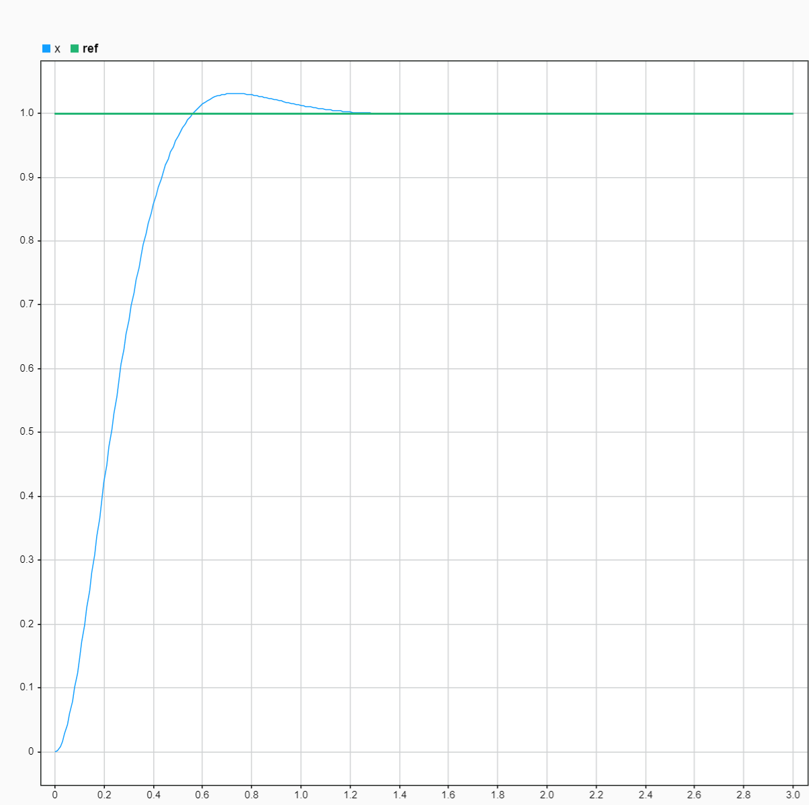

# MPC 控制

# MPC 控制

## 定义

### 从 PID 控制引入问题

对 PID 控制而言，我们可以将其控制律写为如下形式：

$$

u(n)=k_p e(n) + k_i \sum_{j=1}^{n} e(j)+k_d(e(n)-e(n-1))

$$

可以发现，PID 具有如下的几个问题：

- PID 控制器不具有“前瞻性”：参与计算的量存在当前的 error，上个控制周期的 error，以及之前所有的 error 累计和，但偏偏不存在未来的 error
- PID 属于无模型控制：无模型控制导致对不同物理情形产生不了不同的控制信号，忽略了模型本身的性质

因此我们自然地思考到，需要引入对模型未来的分析，这必然需要得到物理系统的模型，得到了 MPC 控制的思路。

## MPC 控制

### 物理问题

在无限光滑的一维水平直线上有一个质量为 $m$ 的滑块，初始位置与初始速度都是 0，现在需要设计一个控制器，使得在传感器测得滑块位置 $x$ 的基础上，为滑块提供外力 $u$，使其跟随参考点 $x_r$

### 建立模型

首先建立动力学模型：

$$

\ddot{x}=\frac{u}{m}

$$

选取状态向量 
$$
x=\left[
\begin{array}{c}
 x \\
 \dot{x} \\
\end{array}
\right]
$$
，得到状态方程：

$$

\dot{x} = Ax+Bu

$$

其中，

$$
A=\left[
\begin{array}{cc}
 0 & 1 \\
 0 & 0 \\
\end{array}
\right], B=\left[
\begin{array}{c}
 0 \\
 \frac{1}{m} \\
\end{array}
\right]
$$

接下来对模型离散化方便计算。

使用==前向欧拉法==离散状态方程：

$$

\begin{aligned}
\dot{x} &= \frac{x(k+1)-x(k)}{T}=Ax(k)+Bu(k)\\
\Rightarrow x(k+1) &= (I+TA)x(k) + TBu(k)=\bar{A}x(k) + \bar{B}u(k)\\
\end{aligned}

$$

其中，
$$
\bar{A}=\left[
\begin{array}{cc}
 1 & T \\
 0 & 1 \\
\end{array}
\right], \bar{B}=\left[
\begin{array}{c}
 0 \\
 \frac{T}{m} \\
\end{array}
\right]
$$
，T 代表控制周期。

### 预测控制

MPC 方法的一个独特之处就是需要==对未来系统状态进行预测==，我们记未来 $p$ 个控制周期内预测的系统状态为：

$$

X_k = [x(k+1|k)^T \quad x(k+2|k)^T \quad \cdots \quad x(k+p|k)^T ]^T

$$

$p$ 称为==预测时域==，括号中 $k+j|k$ 代表在当前 k 时刻预测 k+j 时刻的系统状态。此外，预测动态系统未来状态时，还需要知道预测时域内的控制量 $U_k$：

$$

U_k = [u(k|k)^T \quad u(k+1|k)^T \quad \cdots \quad u(k+p-1|k)^T ]^T

$$

$U_k$ 从当前状态的控制量开始，代表了我们需要优化的问题独立变量。

结合离散的控制方程，我们可以得到未来 p 个控制周期的系统状态：

$$

\begin{aligned}
x(k+1|k) &= \bar{A}x(k)+\bar{B}u(k|k)\\
x(k+2|k) &= \bar{A}^2x(k)+\bar{A}\bar{B}u(k|k)+\bar{B}u(k+1|k)\\
&\cdots\\
x(k+p|k) &= \bar{A}^px(k)+\sum_{i=0}^{p-1}\bar{A}^{p-1-i}\bar{B}u(k+i|k) \\
\end{aligned}

$$

因此整理为矩阵形式得到：

$$

X_k = \Psi x(k) + \Theta U_k

$$

其中，
$$
\Psi=\left[
\begin{array}{c}
 \bar{A}^1 \\
\bar{A}^2 \\ \vdots\\ \bar{A}^p \end{array}
\right]
$$
，
$$
\Theta=\left[\begin{array}{cccc}
\bar{A}^{1-1} \bar{B} & \cdots & \mathbf{0} & \mathbf{0} \\
\bar{A}^{2-1} \bar{B} & \bar{A}^{2-2} \bar{B} & \cdots & \mathbf{0} \\
\vdots & \vdots & \ddots & \vdots \\
\bar{A}^{p-1} \bar{B} & \bar{A}^{p-2} \bar{B} & \cdots & \bar{A}^{p-p} \bar{B}
\end{array}\right]
$$
.

上面式子中的下三角形式，反映的是时间上的因果关系，即 $k+1$ 时刻的输入对 $k$ 时刻的输出没有影响。

### 优化

这一小节我们求解==预测时域==内的控制输出 $U_k$，在求解优化问题之前，首先需要明确优化问题的数学描述。

首先明确我们的控制目标：使得系统的状态跟踪期望的一条轨迹，因此我们定义预测时域内地参考值序列为：

$$

R_k=[r(k+1)^T\quad r(k+2)^T\quad \cdots \quad r(k+p)^T]^T

$$

可以发现，为了满足我们的优化目标，必然需要在预测时域内的轨迹信息，这是 MPC 的优越性也是问题所在。

我们希望找到一个最佳的控制量 $U_k$，使得预测时域内的状态向量和参考值越接近越好，那么我们定义这样一个优化函数：

$$

J(U_k) = (X_k-R_k)^T Q (X_k-R_k) + U_k^TWU_k

$$

这一优化问题前面一项代表预测状态向量与参考值之间的累计误差，后面一项代表对控制动作的正则项，减少控制动作。

因此这一控制问题可以描述为如下：

$$

\begin{aligned}
\min _{U_{k}} J\left(U_{k}\right) & \\
s.t. |u(k+i \mid k)| &\leqslant u_{\max }, i=0,1,2, \cdots, p-1
\end{aligned}

$$

对优化函数进行展开得到：

$$

\begin{gathered}
J\left(U_{k}\right) \\
=\left(X_{k}-R_{k}\right)^{T} Q\left(X_{k}-R_{k}\right)+U_{k}^{T} W U_{k} \\
=(\overbrace{\Psi x(k)-R_{k}}^{E}+\Theta U_{k})^{T} Q\left(\Psi x(k)+\Theta U-R_{k}\right)+U_{k}^{T} W U_{k} \\
=\left(E+\Theta U_{k}\right)^{T} Q(E+\Theta U)+U_{k}^{T} W U_{k} \\
=E^{T} Q E+\left(\Theta U_{k}\right)^{T} Q\left(\Theta U_{k}\right)+2 E^{T} Q\left(\Theta U_{k}\right)+U_{k}^{T} W U_{k} \\
=U_{k}^{T} \Theta^{T} Q \Theta U_{k}+U_{k}^{T} W U_{k}+2 E^{T} Q \Theta U_{k}+E^{T} Q E \\
=U_{k}^{T}\left(\Theta^{T} Q \Theta+W\right) U_{k}+\left(2 E^{T} Q \Theta\right) U_{k}+E^{T} Q E
\end{gathered}

$$

其中式子 $E^TQE$ 为常数项，因此舍去该项。对于这样二次型优化问题，使用 matlab 提供的优化函数 quadprog，得到：

$$

\left\{\begin{array}{l}
H=2\left(\Theta^{T} Q \Theta+W\right) \\
f^{T}=2 E^{T} Q \Theta
\end{array}\right.

$$

求解问题为：

$$

J(U_k) = \frac{1}{2}U_k^THU_k+f^T U_k

$$

### 仿真

搭建 simulink 模型参考: [Simulink 模型](./../assets/MPC_Test.slx)

模型跟踪效果为：

需要注意的是，这里模型跟踪的序列是一个常数序列，因此实现起来较为简单，更复杂情形应该用实际期望轨迹实现。

## 参考

- [一个模型预测控制（MPC）的简单实现 - 知乎 (zhihu.com)](https://zhuanlan.zhihu.com/p/141871796)
- [Quadratic programming - MATLAB quadprog (mathworks.com)](https://www.mathworks.com/help/releases/R2021a/optim/ug/quadprog.html?s_tid=doc_srchtitle)
