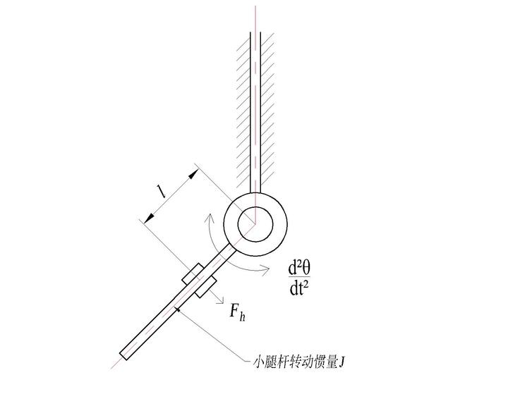
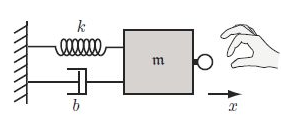
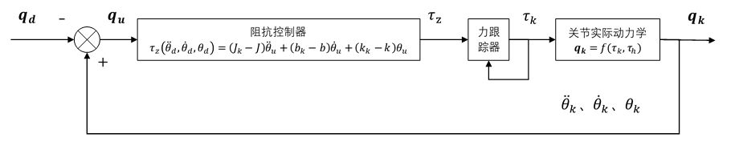
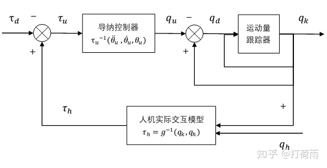
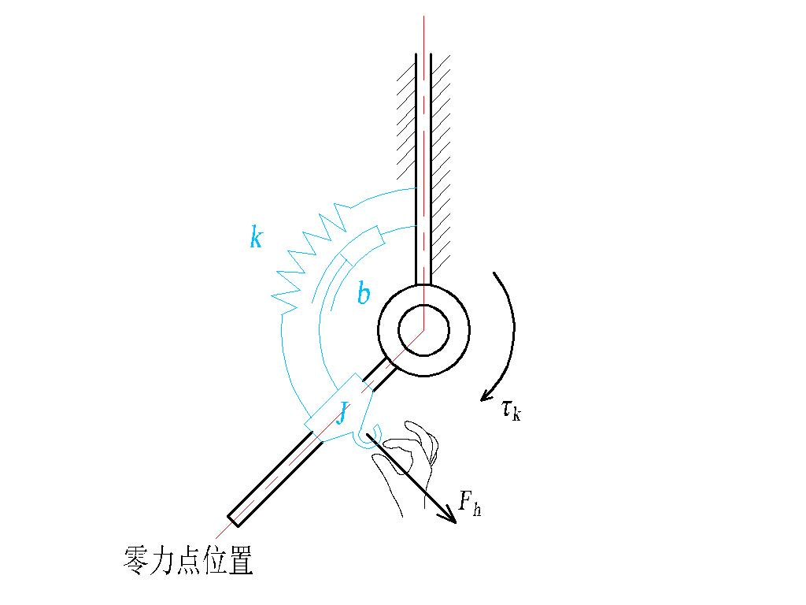
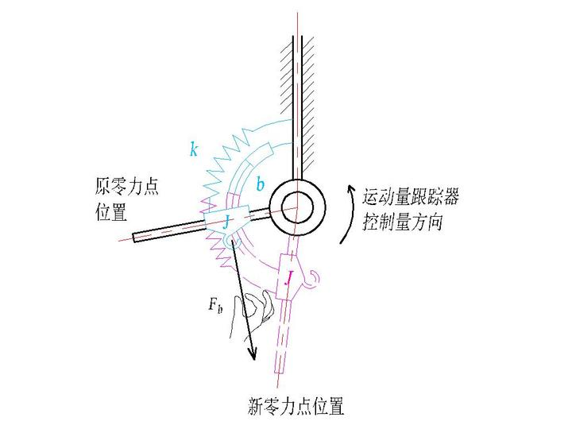

# 导纳_阻抗控制

# 导纳/阻抗控制

## 定义

==重点：人与机器人之间的交互关系==

从实际问题出发，问题背景：对外骨骼膝关节这样的一个关节进行柔顺算法控制，力图使得人能以很小的力带动外骨骼小腿摆动 (大腿看作固定坐标系)，即希望人使用小的交互力去控制外骨骼膝关节运动。

### 牛顿第二定律启发的控制

首先从牛二律开始，对于理想的一个小腿杆，可以看成下面这个图：

其中满足：$F_h\cdot l=J\cdot \ddot{\theta_k}$ ^a5d741

在一定的交互力下，这个转动惯量 J 越小，外骨骼膝关节的转动加速度越大，穿戴者的拖动体验越发轻快。

但实际情况下，我们控制外骨骼机器人是通过控制电机扭矩 $\tau_k$ 实现的，实际的转动惯量为 $J_k$，有：

$$
F_h\cdot l + \tau_k = J_k \cdot \ddot{\theta_k}
$$
 ^9dcbe6

我们期望的是交互力按照 [此式](./) 来体现，而另一方面实际的外骨骼关节动力学关系需要满足 [实际的力学方程](./)，因此可以认为 [理想交互力](./) 是一个约束条件，满足此约束下可以得到：

$$
\tau_k=(J_k-J)\cdot \ddot{\theta_k}
$$

此式中，只有实际的膝关节转动惯量 $J_k$ 未知，但可以通过系统辨识得到。

### 阻抗控制

物体的动力学关系除了牛二律之外，还有粘性定律，胡克定律。前者描述了力和速度的关系，通过阻尼系数 b 表征；后者描述的是力与位移的关系，使用刚度系数 k 表征。三者合一可以得到经典的阻抗模型，满足：

$$
\begin{aligned}
F&=m\ddot{x}+b\dot{x}+kx\quad (交互力与位移)\\
\tau &= J\ddot{\theta}+b\dot{\theta}+k\theta \quad (交互矩与转角)
\end{aligned}
$$

类似前面牛二定律启发的控制关系，让交互力和运动关系呈现牛二关系，该控制方法可以称为“牛二控制法”，那么如果使交互运动关系呈现阻抗模型，就引入了“阻抗控制法”。

具体来说，如果在关节参数已知的情况下，通过系统的运动量求出力/力矩，这就可以称为阻抗控制。

实际应用中，在机器人关节电机存在力矩控制器时，可以在其前面增加一个阻抗控制器，从而实现机器人关节和环境的柔性互动。

当期望轨迹为 0 时，即希望机器人关节不动，此时在阻抗控制下，整个关节呈现的动力学特性应该贴近于设计的阻抗模型，因此你可能会看到机器人关节像弹簧那样运动，或者带有一点阻尼在里面，又或者感受到很大的惯性。这些感受来自于阻抗模型中的刚度、阻尼、惯量参数。因此通过调节阻抗模型的这三个参数，可以获得丰富的“柔性”效果。

当人体穿戴外骨骼运动时，人体的运动总是先于外骨骼，外骨骼接收期望轨迹，使用阻抗模型输出关节力矩，驱动外骨骼腿杆运动。整个过程是一个轨迹跟踪的过程，其中加入的阻抗控制模型使得这个跟踪更加平滑。

外骨骼采用的方案如果是通过采集人机交互力来控制，那阻抗控制仍然不能使用，因此就需要用到与阻抗控制相对的 **导纳控制**。

### 导纳控制

阻抗控制是输入运动量，输出力量。如果反过来，知道力量 $\tau_h$，求膝关节运动量 $\ddot{\theta_k}、\dot{\theta_k}、\theta_k$，输出运动量，这个过程就是 **导纳控制**。

相对应的，导纳控制器必须与一个运动跟踪器合起来用，通常采用 PID 作为跟踪器。采集到的力量先输入导纳控制器，输出了期望的运动量，运动跟踪器接收它，然后输出机器人关节实际的运动。

==使用导纳控制的初衷是为了获得一个人机跟随效果，因此导纳控制所需要的力量就应该是人机交互力矩 $\tau_h$ 而不是外骨骼机器人关节电机施加或受到的力量。==因为外骨骼关节受到的力矩包括了交互力在关节处造成的交互力矩，也包括外骨骼和负载分摊在关节处的负载力矩。

其中：

$$
\tau_u(\ddot{\theta_k},\dot{\theta_k},\theta_k)=(J_k-J)\cdot \ddot{\theta_u}+(b_k-b)\cdot \dot{\theta_k} + (k_k-k)\cdot \theta_k
$$

相对于阻抗控制器直接代入求得力矩，导纳控制器需要求解二阶微分方程。由于控制系统一般都是离散系统，因此在求解微分方程上可以用一些数值迭代方法。

- 积分迭代方法

认为 $\dot \theta_u$ 和 $\theta_u$ 是上一周期的已知量，即 $\dot \theta_{un-1}、\theta_{un-1}$，因此上面的微分方程可以写为：

$$
\ddot \theta_{un}=(J_k-J)^{-1}\cdot (\tau_{un-1}-(b_k-b)\dot \theta_{un-1}+(k_k-k)\theta_{un-1})
$$

然后对于计算出来的 $\ddot \theta_{un}$ 进行两次积分有：

$$
\begin{aligned}
	\dot \theta_{un}&= \dot \theta_{un-1} + \ddot \theta_{un} \Delta t\\
	\theta_{un}&= \theta_{un-1} + \dot \theta_{un} \Delta t\\
\end{aligned}

$$

其初始条件可以根据实际情况设计。

- 微分迭代法

类似于积分迭代，只不过先求取 $\theta_{un}$，在通过离散微分求得 $\dot \theta_{un}、\ddot \theta_{un}$

这两种方法区别在于可以直接获得的运动量是什么，比如外骨骼机器人关节一般带有编码器，因此可以直接得到位移量，因此使用积分迭代法比较简单。

可以看到，导纳控制器中的输入力量 $\tau_u = \tau_h-\tau_d$，当想要使用小的交互力去控制外骨骼，乃至零力控制时，期望交互力矩 $\tau_d$ 可以设置为 0，这时人机交互例句就是导纳控制器的输入力矩，在通常的人机跟随的导纳控制中就直接将其作为导纳控制的输入了。否则就是需要一定的力量门限去拖动外骨骼，人先克服这个交互力门限，剩下的力气才是有效的交互力（类似于电路中的死区）。

## 总结

阻抗 - 导纳控制为何会被称为柔顺控制，其根本在于其控制模型中加入了柔性所具备的三个调节参数：刚度参数、阻尼参数、惯量参数。

- **刚度参数** 就像加入弹簧一样，影响人机交互“弹不弹”的特性。刚度大，弹性就越差，机械感就越强；刚度小，回弹性好，越容易拖动它。
- **阻尼参数** 就像加入阻尼器一样，影响人机交互“粘滞感”的特性。阻尼大，速度越快阻力越大，像是在搅浆糊；阻尼小，就越像空气。
- **惯量参数** 就像加入秤砣一样，影响人机交互“重不重”的特性。惯量大，初始静止时很难推动，运动中很难让它停下来；惯量小，犹如手表秒针快速地摆动。

从牛顿第二定律出发，能顺利推出阻抗控制中的单惯量形式的表达式，这说明了阻抗控制是一个普世的关于“物体交互的动力学”方法。阻抗模型也是一个经典的二阶控制模型，其等效模型关键在于零力点的位置不变，拖动机器人只是增加了非期望的偏移，因此修正。

而导纳控制因为涉及到通过力量求解运动量，需要求解微分方程，所以更难理解一些。导纳等效模型关键在于零力点是变动的，而且是根据人机交互力通过阻抗模型生成新的零力点，再用运动量跟踪器完成实际的位置变化。

## 参考

- [对阻抗-导纳控制的理解 - 知乎 (zhihu.com)](https://zhuanlan.zhihu.com/p/157853632)
