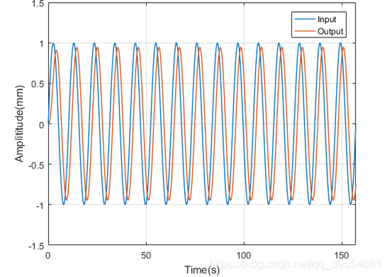
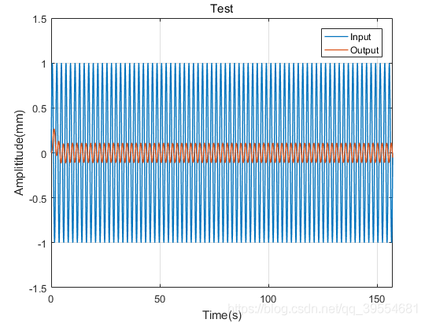
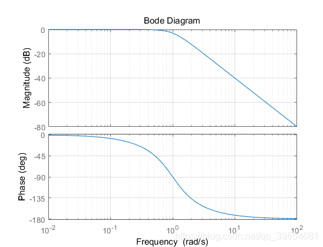
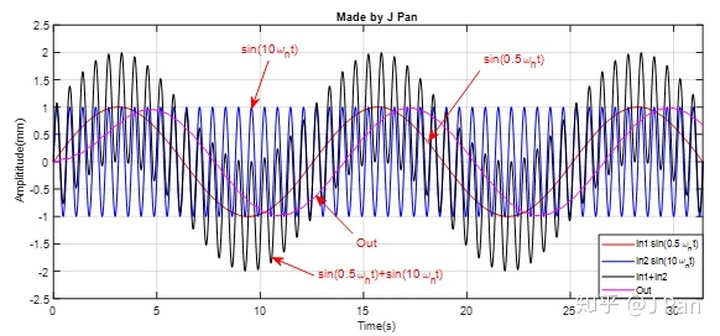
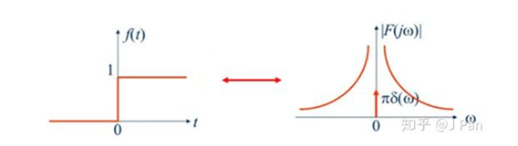
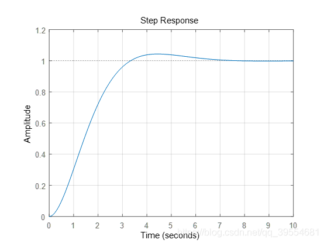
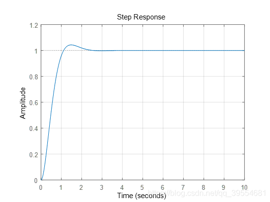
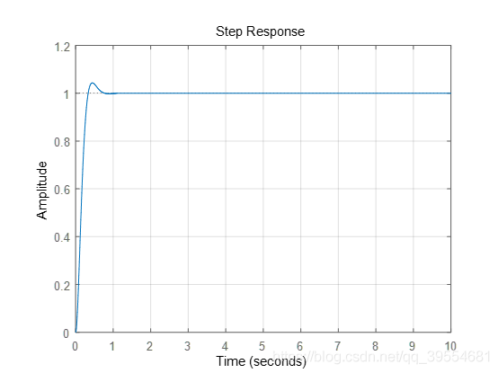

# 控制系统中带宽的理解

## 定义

- 带宽频率

	闭环截止频率，指当闭环幅频特性下降到频率为 0 时的 [分贝](./分贝.md) 值以下 3dB 时，对应的频率，记为 $w_b$。

- 开环截止频率

	也成为剪切频率，是闭环系统的开环幅频特性中，幅频特性曲线穿越 0dB 线的频率，记为 $w_c$。

- 开环截止频率与闭环截止频率具有同向性

	对一个闭环控制系统而言，其开环截止频率与闭环截止频率是两个完全不同的物理量，但他们之间存在一定的相关性，即：开环截止频率与其单位负反馈的闭环截止频率是通向增大的，且具有关系 $w_b>w_c$。

## 例子

首先介绍一个例子说明截止频率对系统性能的影响，在总结带宽对系统的影响。

以经典的弹簧阻尼系统为例，首先有动力学方程：

$$
m \frac{d^{2} x}{d t^{2}}=F(t)-b \frac{d x}{d t}-k x
$$

即有：惯性力 + 阻尼力 + 弹性力=外界激励

具体赋值为：b=$\sqrt{2}$ 为阻尼系数，$k=1$ 为弹性系数，因此写成传递函数形式为：

$$
\frac{X(s)}{F(s)}=\frac{1}{s^{2}+\sqrt{2} s+1}=\frac{w_{n}^{2}}{s^{2}+2 \zeta w_{n} s+w_{n}^{2}}
$$

使用一个交变的正弦力 $F(t)=F_0\sin \left( wt \right)$ 去激励系统，有响应为: 频率不变的正弦结果，改变的只是幅值、相位 (原因为 $e^(kt)$ 这种形式的解为拉普拉斯变换对应的特征值，自然界规定的)。对应的图像如下：

进一步修改频率，改变的也只有信号的幅值和相位：

对于系统，绘制其 [Bode 图](.//) 如下：

可以发现，在频率小于 1rad/s 时，系统的频率响应增益基本为 1，也就是幅值和输入基本一致，相位落后为 0-90 deg。当频率大于 1rad/s 时，幅值响应迅速衰减，当频率增加至 100rad/s 时，幅值响应为 -40dB，也就是输入幅值的 $1/10^{40/20}=1/100$，相位基本落后到 180deg.

由此可见，==对于一个一般的 [线性时不变系统](.//)，系统具有低通特性==。参考 [信号](./分贝.md#信号) 的定义，-3dB 对应于幅值缩小 $\sqrt{2}$，低于这个频率的认为信号可以通过，高于的认为存在大幅度的信号过滤。特别的，对于一个 [二阶系统](./系统的响应.md#二阶系统)，当阻尼比 $\zeta=\frac{1}{\sqrt{2}}$ 时，系统的自然频率 $w_n$ 代表了截止频率。 ^6f74f1

举个例子，输入存在 2 个正弦函数，为 $u=sin(0.5 w_c t)+sin(10 w_c t)$，一个分量是截止频率的 1/2，另一个是截止频率的 10 倍，对应的结果为：

可以发现，$0.5w_c$ 的份量可以比较好的通过。

更进一步，对于更加复杂的输入，响应如何？

对于 [常见信号](.//)，可以知道其频谱分布在整个频率轴上，且随着频率增加而减小。

得到系统的阶跃响应为：

总体来说，基本曾献阶跃信号特点。加入改变系统的截止频率，使得 $w_c=3rad/s$

$w_c=10rad/s$

==可以发现，随着截止频率增加，越来越多频率的信号可以通过系统，输出更加接近输入信号 ([^6f74f1](./#^6f74f1))==。

> 基于的是 LTI 系统一般是低通。比如静态增益不是 1 的，或者是高阶的系统，对低频出现了放大，这导致和原始信号不同了

控制系统种一般闭环系统比较多，对闭环系统而言，其截止频率就等于带宽。从时域的角度来看，系统的带宽越大，时域的响应速度也越快，系统跟踪输入信号的能力越强；带宽无穷大时，系统可以完全“复现”输入信号，当然物理不可以实现。

## 参考

- [如何入门自动控制理论 - 知乎 (zhihu.com)](https://zhuanlan.zhihu.com/p/42615269) #todo
- [控制系统中"带宽"的理解_Aromash的博客-CSDN博客_控制带宽](https://blog.csdn.net/qq_39554681/article/details/89364178)
