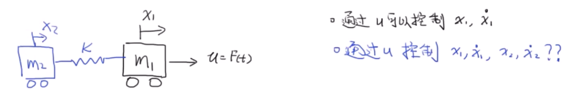
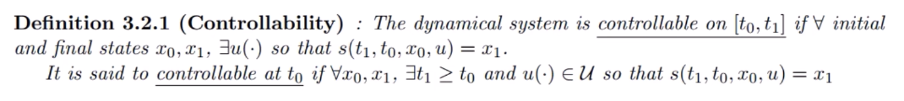
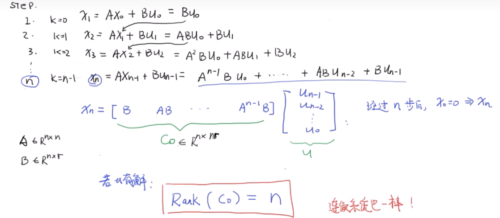
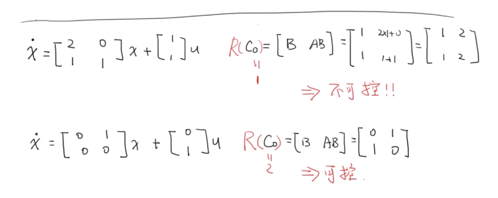
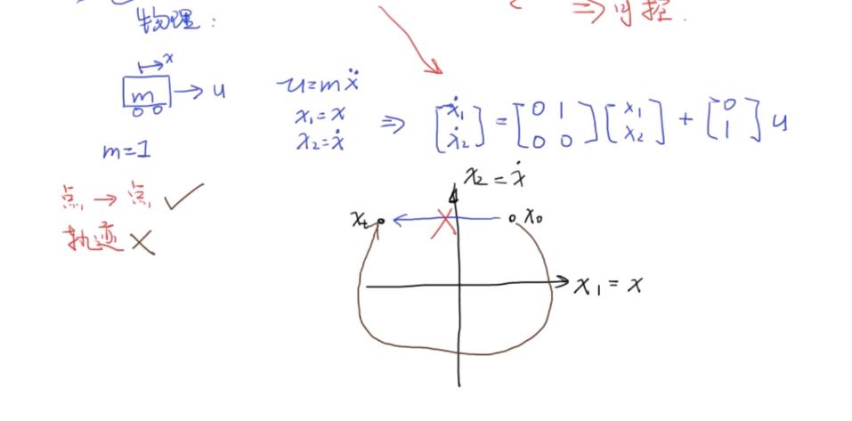
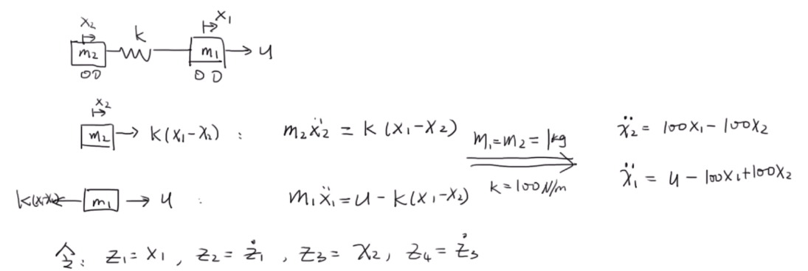
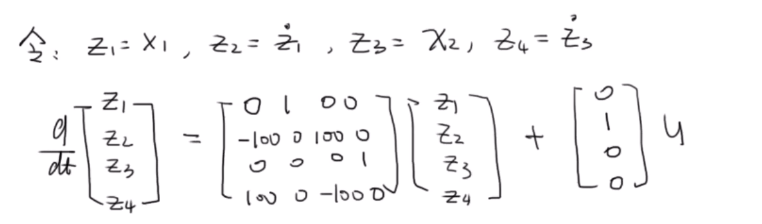

# Appendix1 状态空间方程

## 状态空间描述

状态空间是一个老生常谈的问题了，关于广义坐标以及相空间等部分可以从系统自由度的角度进行理解，也可以从微分几何的differential bundle进行理解。总之，其简单来说，选取一组**独立**的坐标来**完整**描述系统状态，这一描述方程一般来说都可以写成微分方程，更一步的地说，可以写成一阶微分方程，而这一微分方程就是我们所要描述的控制对象

距离来说，对弹簧阻尼系统：

$$

m\ddot{x}+B\dot{x}+kx=f\left( t \right)

$$

取：

$$

\begin{aligned}
	z_1&=x,z_2=\dot{x}\\
	\frac{\mathrm{d}}{\mathrm{d}t}\left[ \begin{array}{c}
	z_1\\
	z_2\\
\end{array} \right] &=\left[ \begin{matrix}
	0&		1\\
	-\frac{k}{m}&		-\frac{B}{m}\\
\end{matrix} \right] \left[ \begin{array}{c}
	z_1\\
	z_2\\
\end{array} \right] +\left[ \begin{array}{c}
	0\\
	\frac{1}{m}\\
\end{array} \right] f\left( t \right)\\
	y&=\left[ \begin{matrix}
	1&		0\\
\end{matrix} \right] \left[ \begin{array}{c}
	z_1\\
	z_2\\
\end{array} \right] +\left[ 0 \right] f\left( t \right)\\
\end{aligned}

$$

抽象来看有：

$$

\begin{array}{c}
	\dot{x}=Ax+Bu\\
	y=Cx+Du\\
\end{array}

$$

这里有：

$$

A=\left[ \begin{matrix}
	0&		1\\
	-\frac{k}{m}&		-\frac{B}{m}\\
\end{matrix} \right] , B=\left[ \begin{array}{c}
	0\\
	\frac{1}{m}\\
\end{array} \right] ,C=\left[ \begin{matrix}
	1&		0\\
\end{matrix} \right] , D=0

$$

使用拉普拉斯变换有：

$$

\begin{align}
X(s) & = (SI-A)^{-1}BU(s) \\
Y(s) & = CX(s) + DU(s) \\
	 & = (C(SI-A)^{-1}B + D) U(s) \\
\end{align}
\implies G(s)=\frac{Y(s)}{U(s)}=C(sI-A)^{-1}B + D

$$

带入计算出的A, B, C, D有：

$$

G(s) = \frac{\left( \frac{1}{m} \right)}{s^2+\frac{B}{m}s+\frac{k}{m}}

$$

和使用拉普拉斯变换得到的传递函数相同

### 性质分析

我们注意到，计算的 $G(s)$ 的分母部分实际上是 $|sI-A|$ ，这意味着再经典控制理论中的传递函数的极点对应的是这里行列式为0的根，即矩阵A的特征值。也就是说，系统的响应结果是和矩阵A的特征值息息相关的。从更加数学的角度来说，矩阵的特征值函数是对微分算子的不变量，其反映在系统的分析中就是其响应由特征值组成

## 可控性

::: warning problem

:::

### 基本分析

对离散系统进行简单的分析：

这表明如果一个系统可控，那么 $c_{0}$ 应该是行满秩的

按照这一思路，我们分析下面系统：

::: note remark

这表明，我们所说的可控是点对点的可控，不一定可以让其按照轨迹来运行
:::

### 应用例子

可以验证，
$$

C_o=\left[ \begin{matrix}
	B&		AB&		A^2B&		A^3B\\
\end{matrix} \right]

$$

是行满秩的，即系统是可控的

## 参考

##### 引文

##### 脚注
