# Chap1 线性系统可控性


## 背景简介

### 我们为什么不用[经典控制](./../经典控制/经典控制.md)

在[经典控制](./../经典控制/经典控制.md)中我们提到了传统控制理论研究中使用频域方法来分析研究控制问题的思路，其主要依赖的是以传递函数为核心的分析方法，通过将系统在频域进行表征，研究系统的稳定性，进一步研究其控制的期望效果

经典的控制方法催生了一些有用的控制手段，比如 [Chap3 根轨迹分析](./../经典控制/Chap3-根轨迹分析.md)中，通过调节极点位置来设计系统响应速率的手段

::: note note
需要注意，上面通过调节极点位置来设计系统响应速率的想法实际上是基于以下基本知识的：
1. 任何高阶系统可以分解成多个一阶、二阶系统的和(我们研究的一般都是被动系统，即分母的阶数高于分子)
2. 我们对一阶、二阶系统的系统响应有着良好的认知：其对外界输入响应的成分是完全依赖于极点的 => 高阶系统可以通过调节极点位置控制系统响应
3. 利用[Chap4 Nyquist稳定性判据](./../经典控制/Chap4-Nyquist稳定性判据.md)，我们可以快速地通过开环系统来判定闭环系统的稳定性；利用[Chap3 根轨迹分析](./../经典控制/Chap3-根轨迹分析.md)的方法，我们可以很容易地确定想要的极点依赖如何的控制器
:::


但是上面方法有下面一个比较大的问题：

1. 经典控制理论分析的对象是单自由度的，如果分析多个互相关联的微分方程，其理论难度就超出了经典控制理论的界限
	1. 经典控制理论中研究稳定性是通过拉普拉斯变换拿到的，而多状态的稳定性分析如何做？
	2. 确认不了稳定性，其他所有的控制都是*无意义的*
	3. 研究经典控制理论我们可以将一阶、二阶系统的响应推广到高阶系统上，但是如果系统是多状态的，这一响应如何拿到？
2. 有时我们的控制指标并不是可以通过系统响应时间、超调量等来描述的，比如LQR控制中的控制目标，我们期望的是时域上的一个函数的最优化问题，而在频域内不太好描述
	1. 当然在频域下也有别的好处，类似时域上可以定义最优化目标，在频域中定义主频上的响应幅值为优化目标，我们就得到了 $H_{\infty}$ 控制

我目前能够想到的2点就是如上，主要的矛盾就是之前经典控制理论中的对象相对简单，如果对象变得复杂，我们应该如何自处？


### 新方法的Motivation

首先坚持一个基本的简化，和经典理论中差不多：

::: note Assumption
1. 我们期望控制对象是**线性时不变的 (LTI)，至少得是线性的**。这意味着我们研究的对象的状态可以组成线性空间，而在线性空间上我们有很多好的数学工具，比如可以定义线性算子，可以对空间中的元素找到给定基下的唯一坐标，进一步可以定义空间上的运算

:::


我们的想法是，对一组线性的微分方程，我们可以在其组成的向量空间上的微分运算来进行描述，即我们确定了一组描述系统的最小状态，其线性性告诉我们之后任何时刻这组状态都是最小的描述集合。在这组状态上，再次由于其线性性，我们可以构造出一个向量空间，将其称为**状态空间**

既然系统状态处于状态空间内，我们就可以将这组微分方程在状态空间上表示，得到了一个标准的向量微分方程形式。接下来的道路（至少在形式上）回到了以前经典控制理论上：
- 直接大刀阔斧研究微分方程对解的响应，之后进一步研究其稳定性等
- 将问题转换到频域上利用经典的传递函数做分析（仔细想想拉普拉斯变换有要求对象是标量吗？）

作为后来者，我可以明确的告诉读者，传递函数那一套至少在我看来，使用得比较少。想想为什么我们要用传递函数？是为了利用其频域上的好的性质：
- 微分操作转化为代数运算

但是在向量空间上进行计算传递函数并不是一件容易的事，且后面我们从微分方程的研究中可以看到，直接研究矩阵的特征值可以拿到一样的结果

### 新方法的基本数学描述

我们说系统的状态是：

[Chap1 状态空间和状态方程](.//)

::: note note
看起来什么都没说，但其实隐含了一个重要的假设：
- 状态维数是不变的
	- 从逻辑上看，状态维数随着时间增长不会递增
	- 注意到线性系统，其时间具有反演特征。即对描述系统的方程，取 $t_{1}=-t$，那么我们可以完全重建所有状态；这意味着上面的推导和时间减少也是成立的
	- 这表明状态维数不变

:::


我们可以在状态空间下将系统描述为：


$$
\left[ \begin{array}{c}
	\dot{X}\\
	Y\\
\end{array} \right] =\left[ \begin{matrix}
	A&		B\\
	C&		D\\
\end{matrix} \right] \left[ \begin{array}{c}
	X\\
	U\\
\end{array} \right] 
$$


其中 $X(t)$ 是系统的状态，$U(t)$ 是系统的输入; $Y(t)$ 是系统的输出。一般来说，我们遇见的矩阵 $A,B,C,D$ 都是常数，此时系统为定常的，反之为时变的，为了降低分析问题难度，我们首先研究的是*线性定常系统*

#### 矩阵指数

[Chap1 状态空间和状态方程](.//)

如果系统是时变的，情况会复杂一些，但也不难理解：

::: note remark
[Chap1 状态空间和状态方程](.//)
:::


#### Laplace方法

::: note remark
在向量空间上定义微积分就可以绕过Laplace方法定义上的问题，等我学完[微分几何](./../../math/微分几何/微分几何.md)再补充数学上的缺陷
:::


[Chap1 状态空间和状态方程](.//)

#### 微分方程求解

[Chap1 状态空间和状态方程](.//)


### 对新方法的期望效果

通过 [微分方程求解](./#微分方程求解)，我们知道了目前要研究的微分方程的解的形式，这至少解决了以前在经典控制理论里面无法触及的一个问题。通过控制 $u(t)$ 的输入，我们期望能够：
1. 将不稳定的系统变得稳定
2. 实现控制器的期望目标

## 线性系统可控性分析

为了实现上面的效果，我们需要明确解决问题的目标是什么，即什么是我们期望的稳定？什么是我们期望的控制目标？

但是在考虑上面这个问题之前，我们先来对线性系统的特性进行一定的分析

### 线性系统的基本认知

#### 线性系统结构分解的Motivation

[新方法的基本数学描述](./#新方法的基本数学描述)介绍了如何通过系统运动方程求解系统的状态，进而得到系统的输出时间特性，从一般意义上来看，这样我们可以预测系统的性质，基本完成了需求的 *研究时域系统状态变化* 的目的

但实际上这是不够的，我们只研究了每个系统单独的性质变化，但就像我们研究线性映射的时候，并不止研究一个映射的结构，我们还有下面这几个想法：
- 从一个控制系统可以变到另一个控制系统，这两个系统之间有什么关系吗？或者说**如何度量不同系统之间的相似性**？会不会在别的空间下看系统求解会更简单？
- 可以**分解一个控制系统吗**？将控制系统切分在不同小子空间下研究可以简化系统吗？不同子空间直和变成整个空间，且控制方程在子空间下是不变的，这样研究系统维数就降下去了
- 经典控制理论从频域进行研究，而时域频域是可以互相转换的，**现代控制理论在频域下是什么结构？**

上面的几个问题实际上给出了我们的下面的几个主题：

- 状态转移矩阵的结构分解
- 传递函数反映了控制系统的什么性质

#### 结构分解方法

我们首先研究不同系统之间相似性的度量。我们知道，实际上矩阵可以看做是线性映射在空间下的表示，而线性映射是可以进行特征值分解的，从而我们研究特征值分解后的控制矩阵。我们将会发现，状态矩阵的特征值是度量控制系统的一个好方法

##### 特征值规范性

[Chap2 线性系统结构分解](.//)

##### Jordan标准型

[Chap2 线性系统结构分解](.//)


通过前面给出的2种控制系统的分解形式（实际上特征值算是Jordan形的一种特殊形式），我们可以将一个系统分解为更加容易观察的结构。前面提到了，我们可以通过观察其分解后的特征值来看出系统的响应情况，基本上来说其结果取决于Jordan块的形状和特征值的实部是否为负数。此外，后面我们定义可控性和可观性也可以受益于现在对Jordan标准型的分解

### 可控性的Motivation

回到正题，我们之前通过解微分方程得到了所研究线性系统的时域解，但是这并不能解决我们期望设计的控制器问题。我们所期望的无非是给定一个系统的描述，给出控制目标，我们设计一个控制器可以使得系统输出尽可能地快速准确跟随到控制目标上。通过研究微分方程的时域解，我们可以判定一个给定的控制器的好坏，但并不能反过来设计这样一个控制器

总之现在我们已经有了判别设计控制器好坏的手段，现在的目的是怎样设计一个好的控制器；我们将判断控制器好坏的准则抽象出来：

- 基础：控制器应该可以让被控系统稳定
- 好1：控制器应该可以让被控系统快速响应
- 好2：控制器应该可以让被控系统准确响应
- 好3：控制器应该可以在外界扰动下准确跟踪目标

我们可以预想到，不是所有的被控对象都存在好的控制器，一个系统自身应该有某种可以度量的属性，这个属性可以判定系统是不是一个可控/好控的系统。在前面研究系统时域响应的结果中，参考Jordan标准型的响应不难发现，系统的特征值、Jordan块会影响时域解的特征——一个系统如果自身就是稳定的，乃至就是可以自己跟踪输入的，那还要我们控制器做什么？

这也暗示我们，在目前我们研究的线性时不变系统下，系统的Jordan标准型和我们想要得到的这样一个度量有关系。事实也的确如此，我们可以大胆一点，给一个**超级棒的被控对象**，这样的被控对象有下面的性质：

- 控制输入 u (t) 对系统状态 x (t) 的支配能力
- 控制输入 u (t) 实现系统状态 x (t) 的任意转移能力
- 控制输入 u (t) 实现系统状态 x (t) 的运动 (模态) 特性的能力

这就是系统的可控性，完整定义为：

[Chap2 线性系统结构分解](.//)

为了避免麻烦，可以自行验证下面的可控性判据：

[Chap2 线性系统结构分解](.//)

### 使用可控性可以干什么

我们上面给了一个超级好的被控系统的性质——可控性，有了这个性质，我们可以说，这个系统任意给定输入，在有限时间内我都可以将其控制到期望输入条件上。显然不是所有系统都是完全可控的，我们之前用的 [结构分解方法](./#结构分解方法) 就有用武之地——将整体系统分解为子系统，从而分辨那些系统是完全可控，那些是不完全可控的

#### 可控性判断

[Chap2 线性系统结构分解](.//)

#### 控制案例

##### 可控子空间可视化

考虑前面提到的控制系统：


$$

A=\left[ \begin{matrix}
	-4&		1&		\\
	&		-4&		1\\
	&		&		-4\\
\end{matrix} \right] ,B=\left[ \begin{matrix}
	&		\\
	1&		1\\
	&		\\
\end{matrix} \right]

$$


此时由前面Jordan可控性分解的结果可以直接看出，前2个状态是可控的，做可控性分解有：

```mathematica
{p, cssm} = ControllableDecomposition[ssm]; p // MatrixForm
p\[Transpose] . A . p // MatrixForm
cssm
```

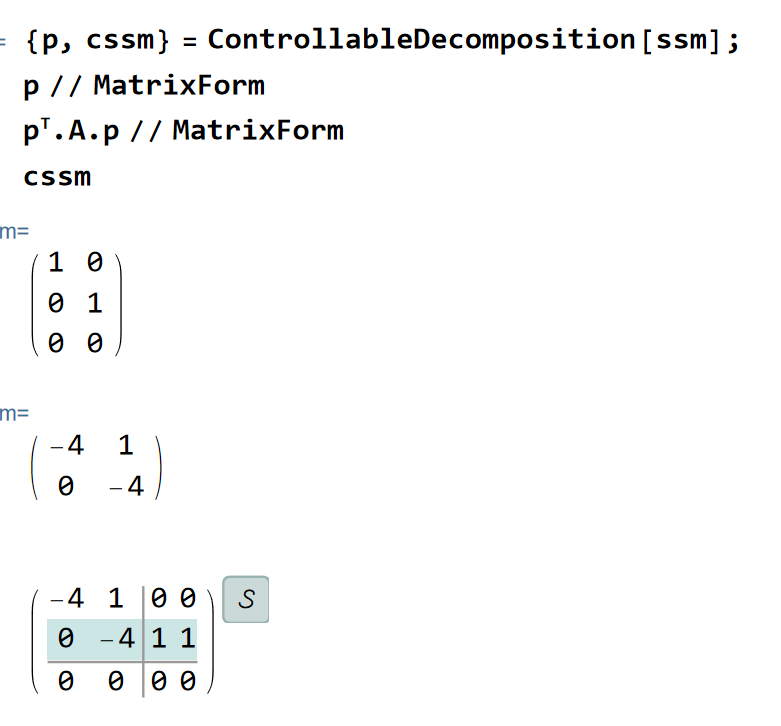

可以发现确实为前2个状态可控

::: note remark
系统变换可以理解为切换空间，我们可以认为矩阵是一个空间的标记，即：


$$

x = P \tilde{x} \implies \tilde{A} = P^T A P

$$

:::


我们期望的可控空间由矩阵P给出了，那么对应的不可控子空间就应该是x所在的空间对P矩阵空间的补空间。从线性映射的角度来看，可以实际上是零化子的同构，即不可控子空间为：

```mathematica
po = NullSpace[p\[Transpose]]\[Transpose]
```

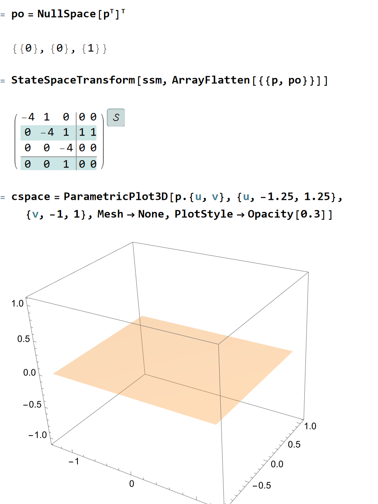

做出可控子空间在状态空间中的图形，可以发现是一个二维平面 (线性空间都是这种超平面形式)——我们能够完全控制的区域就在该超平面内

##### 可控子空间状态响应例子

考虑控制系统为：

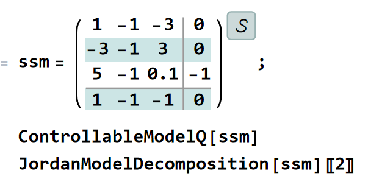

对其进行可控性校核可以发现其不可控，计算结果为：

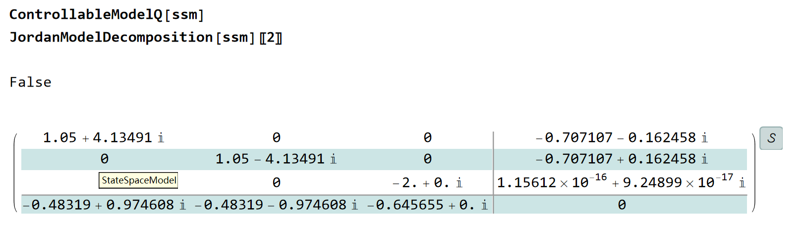

其结果也符合我们Jordan标准型判断的结果，前2个状态可控，而且特征值带有虚部，表示会震荡；特征值实部为正，表示会发散；不可控状态为负特征值，表示该状态会趋向于0

做可控性分解：

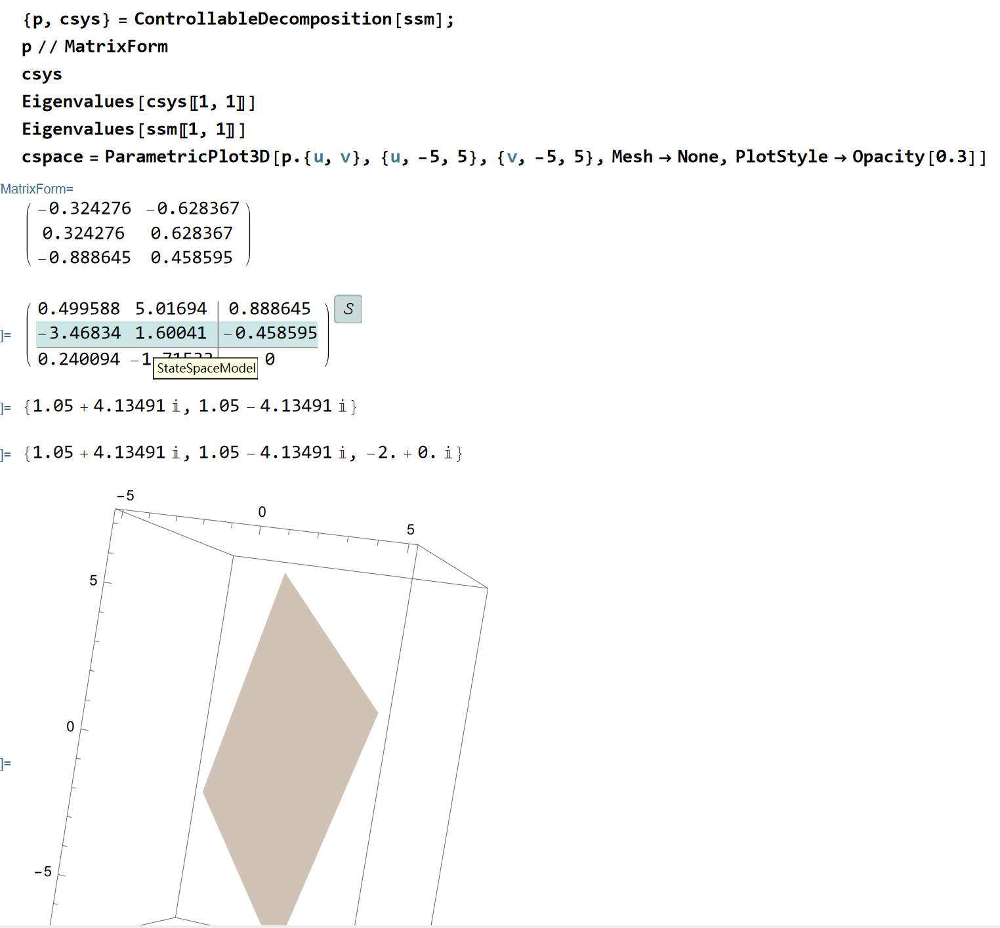

我们考虑在该可控平面内给定一组初值，观察其解的响应：

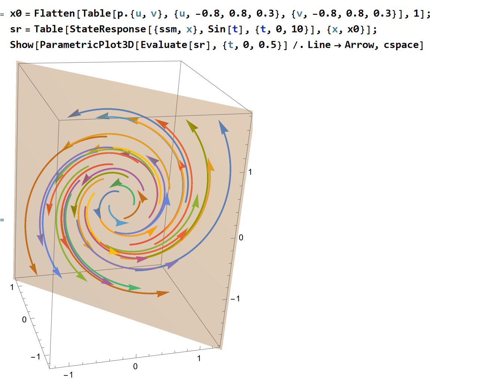

可以发现符合我们分析结果：在可控子空间内发散旋转

如果在可控平面外给定初值，有：
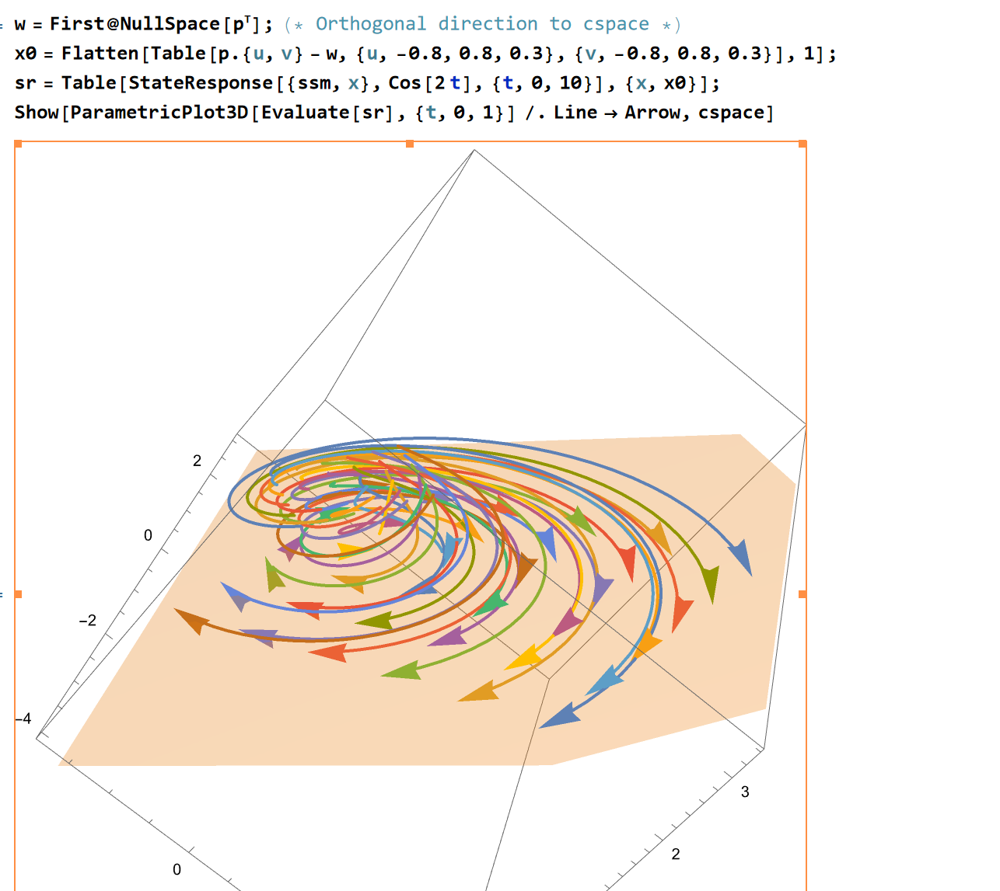

我们选取了可控子空间外的初始点，可以发现系统响应收敛到可控制空间上，并在子空间上旋转发散。这是因为不可控状态具有-2的特征值，从而会收敛到可控子空间上

##### 可控系统控制案例1——调节器设计

考虑一个控制系统，我们期望使用外力F将其稳定系统的平衡点，无论是否存在外力，这种问题被称为regulator problem：调节器，其基本目标为：

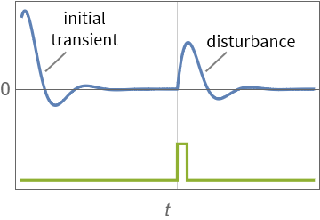

一般调节器的思想是直接对原系统的极点进行配置，使其靠近与其最接近的平衡点，其反馈模型为：

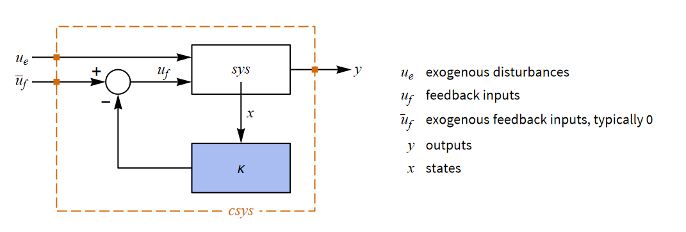


考虑下面这样一个控制对象：

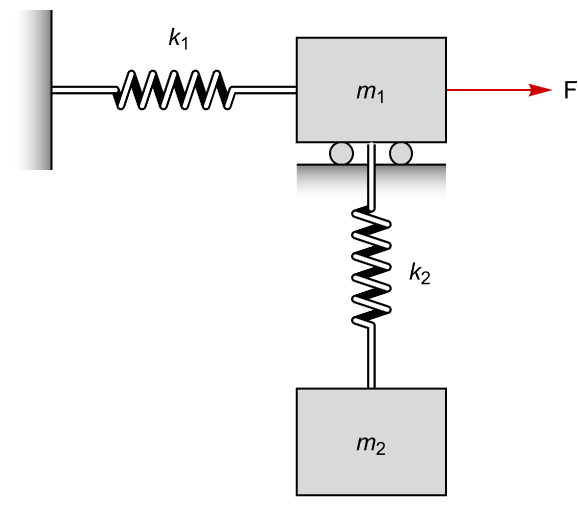

显然F只能对 $m_{1}$ 起控制效果，对竖直方向的坐标起不了影响，因此系统必定是不完全可控的

对系统建立动力学模型：

```mathematica
(*system test*)
q = {x[t], y[t]}; Fq = {f[t], 0}
pars = {Subscript[k, 1] -> 75, Subscript[k, 2] -> 100,
   Subscript[m, 1] -> 1, Subscript[m, 2] -> 0.5};
T = 1/2 Subscript[m, 1] x'[t]^2 +
  1/2 Subscript[m, 2] (x'[t]^2 + y'[t]^2)
V = - Subscript[m, 2] g y[t] + 1/2 Subscript[k, 1] x[t]^2 +
  1/2 Subscript[k, 2] y[t]^2
L = T - V;

eqns = Thread[Table[D[D[L, \!\(
\*SubscriptBox[\(\[PartialD]\), \(t\)]s\)], t] - D[L, s], {s, q}] ==
   Fq]
```

得到了系统的动力学模型为：


$$

\begin{aligned}
	k_1x(t)+m_1x''(t)+m_2x''(t)&=f(t)\\
	-gm_2+k_2y(t)+m_2y''(t)&=0\\
\end{aligned}

$$


进行可控性分析：

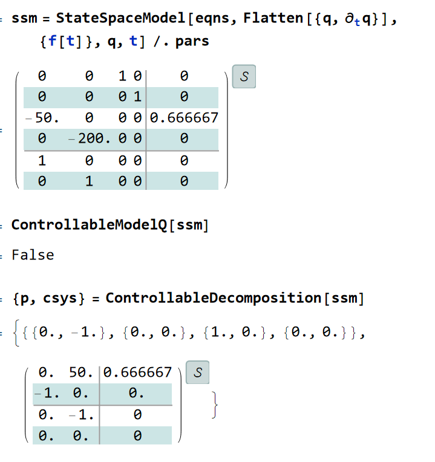

可以发现系统不是完全可控的，其中1, 3状态可控，即 $x,\dot{x}$ 可控

按照经典控制理论的思路，对可控系统，我们可以直接配置其极点来完成控制：

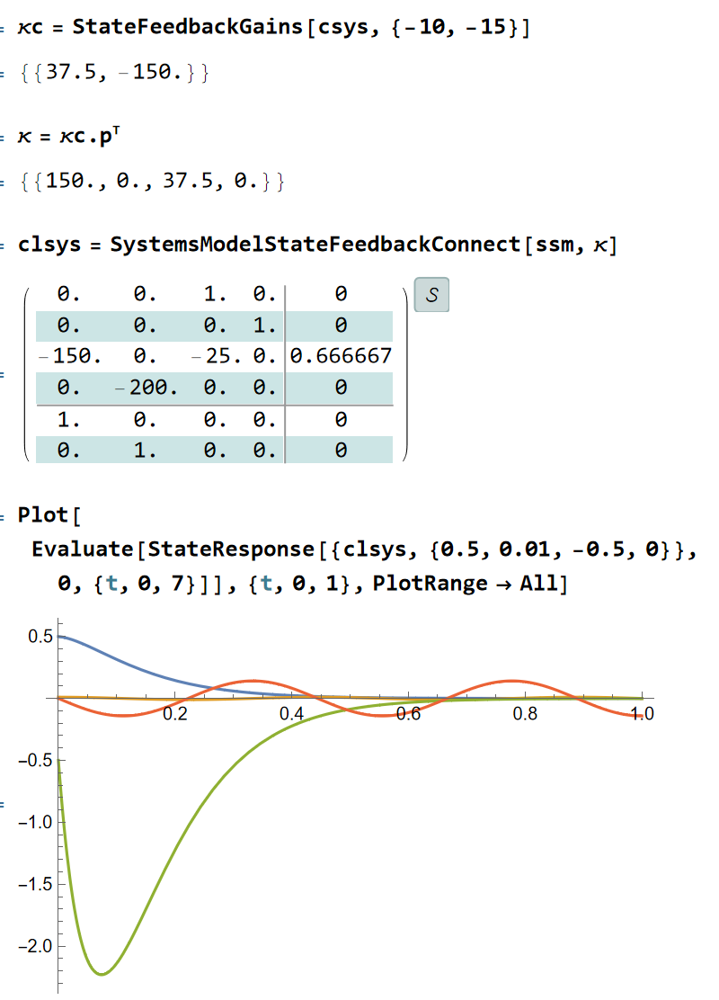

可以发现效果比较好，其中蓝线和绿线代表x和 $\dot{x}$，黄线代表y，红线代表 $\dot{y}$

[可控性分析](./assets/可控性分析.nb)

##### 可控系统控制案例2——跟踪器设计

可以认为跟踪器是调节器的进一步形式，我们期望控制对象能够不断跟随一个期望输入，如下图：

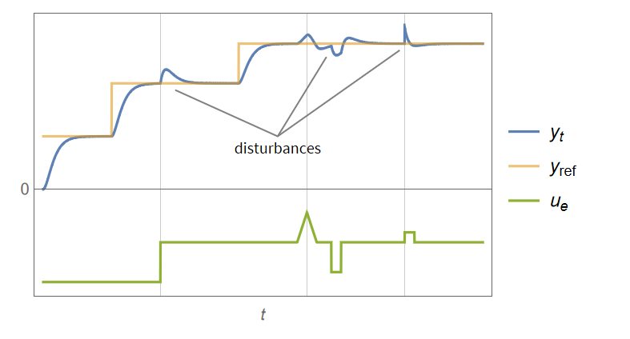

其控制框图一般为：

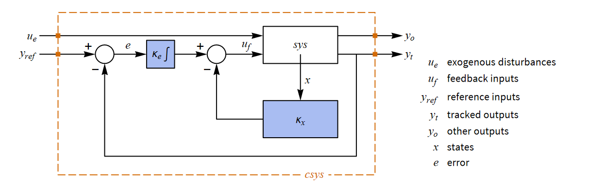

反馈输入一般形式为：


$$

u_{f}=-K_{x} x -K_{e} \int e \, dt

$$


这样可以保证系统的误差尽量贴近0，此时需要扩充系统的状态为：


$$

\tilde{x}^T = \left[ x, \int e \, dt \right]^T

$$


::: note note
这里和经典控制里的PI控制一个思路，增加积分环节才能消除静差——修改平衡点位置
:::


从而新系统的极点相比调节器问题变为了：


$$

poles=k+mq

$$


其中：
- k是被控对象的阶数，即系统原始阶数
- m是参考输入的阶数，即期望 $y_{ref}$ 的阶数
- q是参考输入的信号数目，即多少个期望状态

通过上面构造新系统，有3个极点，分别为2状态极点和1个误差极点，设计为-20，-21，-22，可以得到系统设计结果和对输入sin曲线的响应：

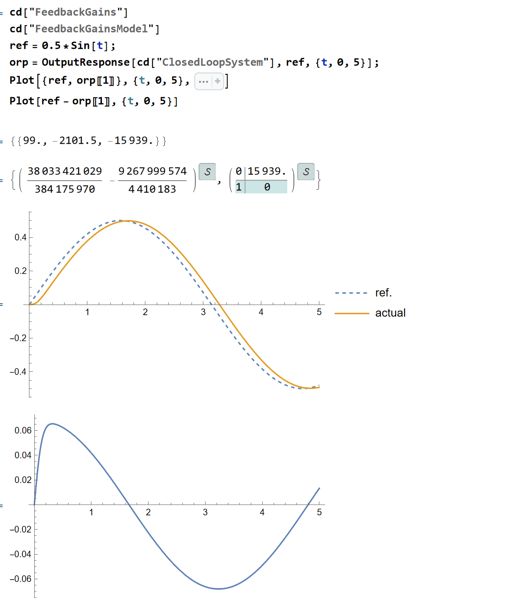

如果期望跟踪ramp信号：

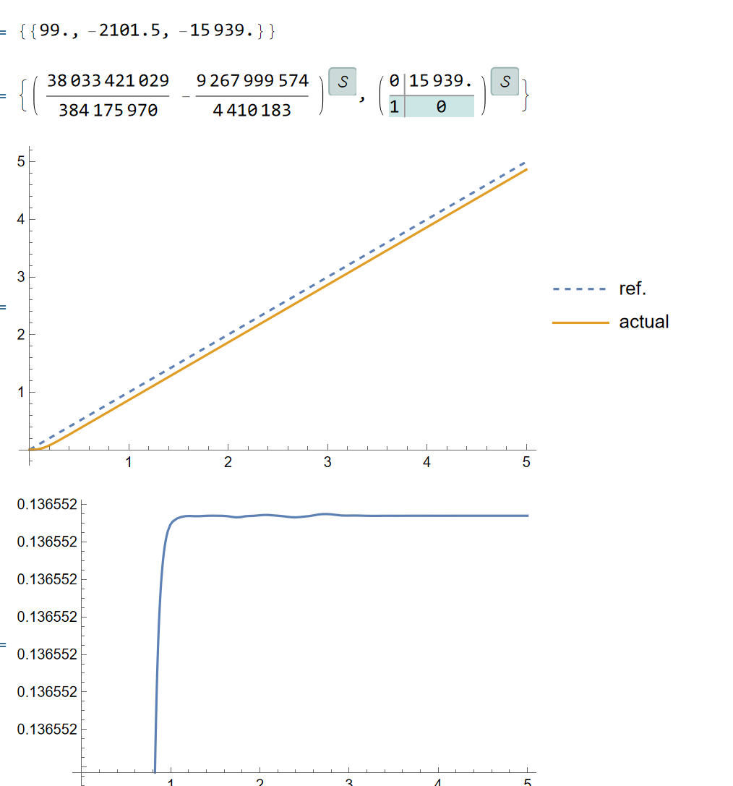

可以发现其实还存在静差，这应该是因为尽管增加了误差环节，但是整体系统平衡点还是有偏差


## 总结

本篇note主要针对了线行时不变系统的时域响应，并给出了可控性的定义和判据。在了解了系统的响应形式后，我们开始研究控制系统的分解，并给出了一个相当好的系统可控性指标。根据这一指标，我们研究了其判定方法和具体效果。最后，对一个给定的系统，进行了全状态反馈下的系统控制测试

## 参考

##### 引文

- [Chap1 状态空间和状态方程](.//)

##### 脚注
