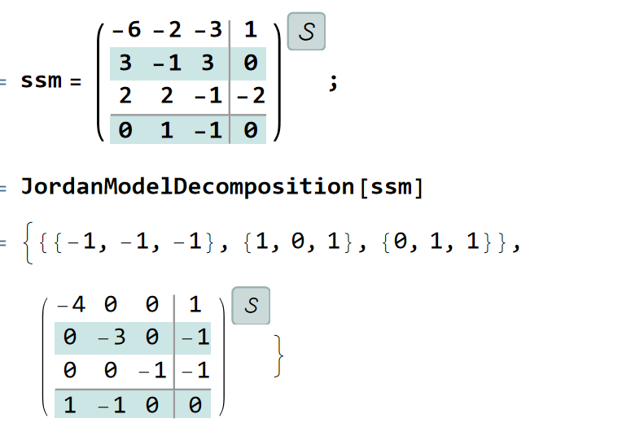
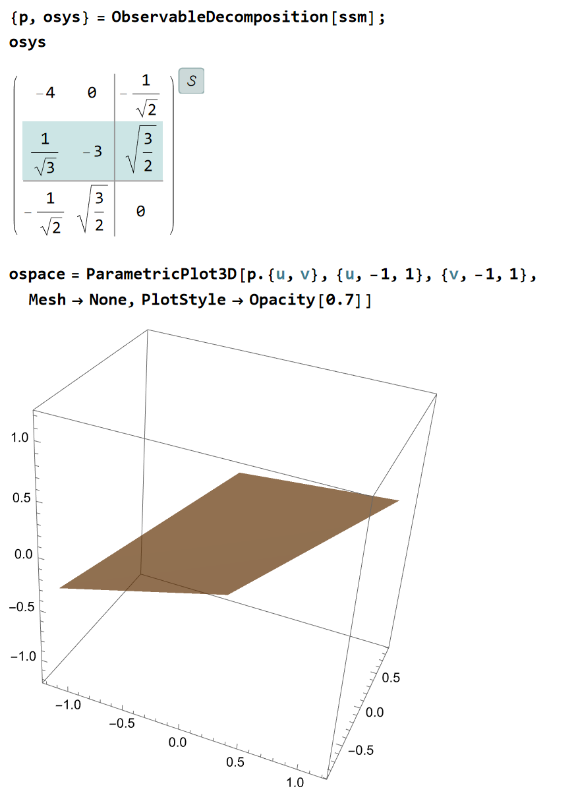
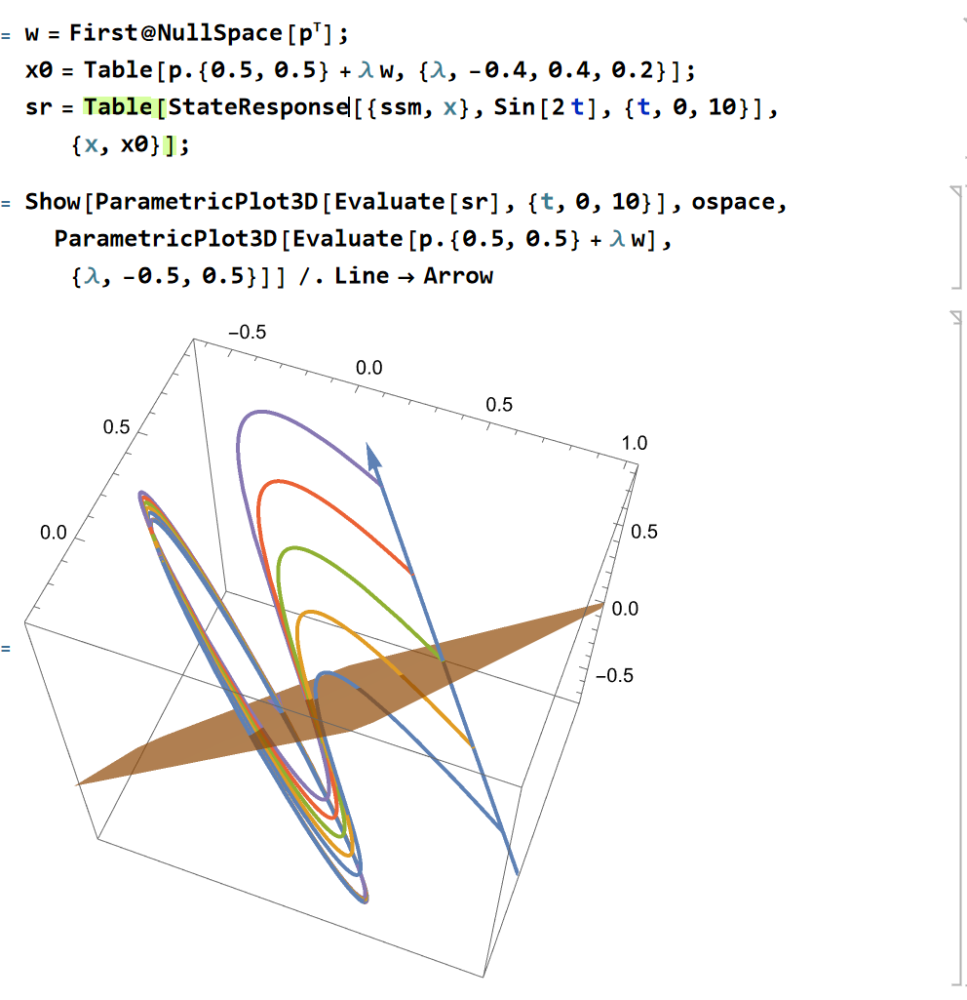
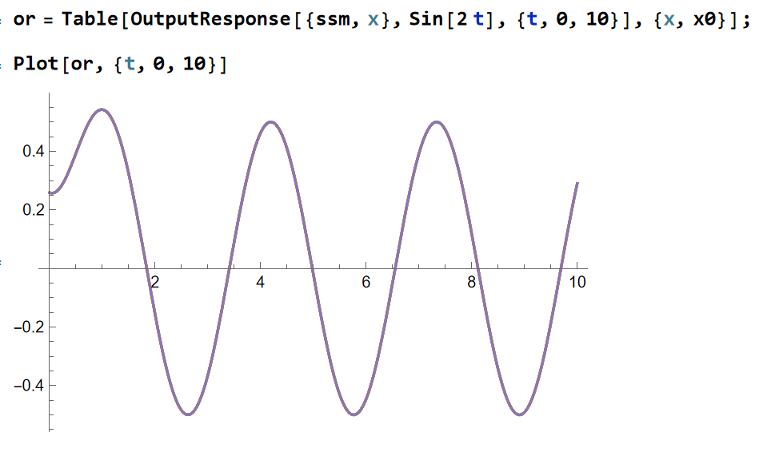
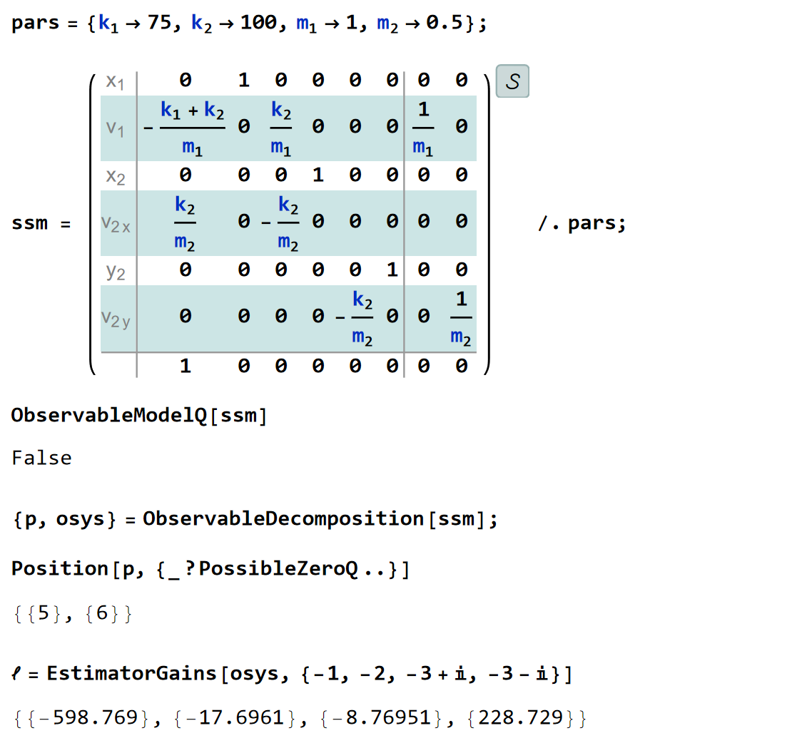
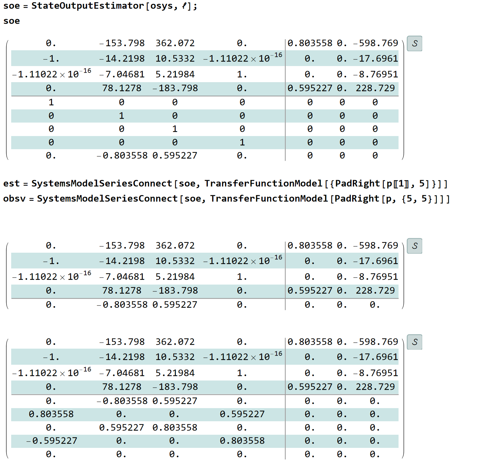
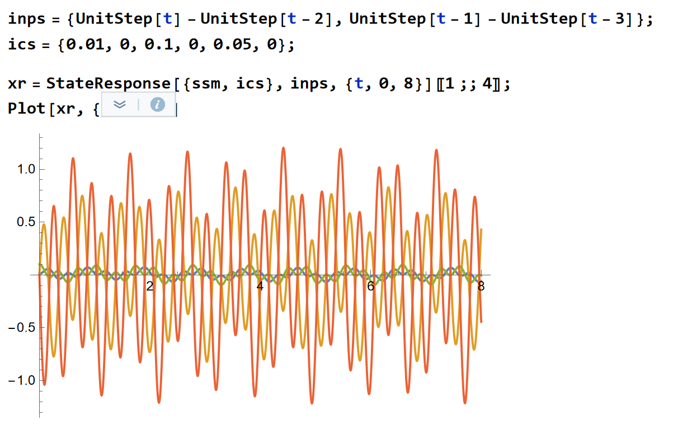
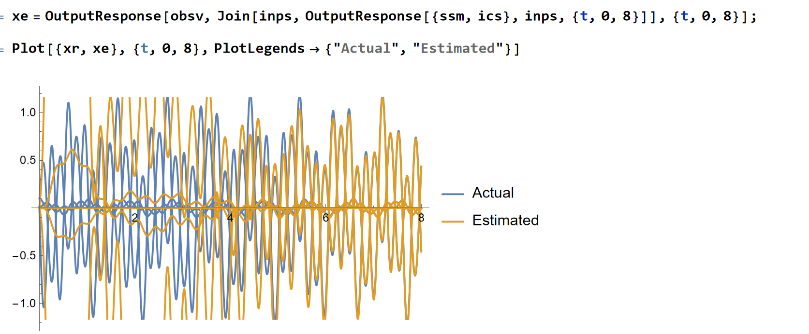
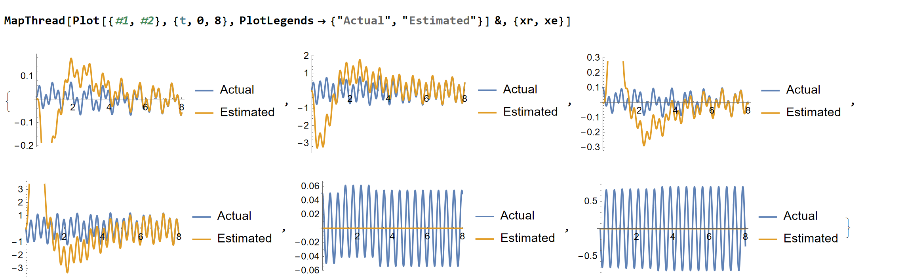
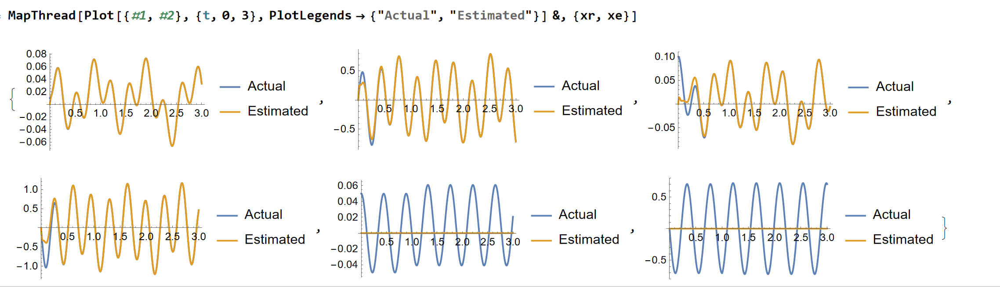

# Chap2 线性系统状态观测器

## 为什么需要状态观测器

> 那当然是因为全状态反馈控制爽啊！什么东西都知道，可操作空间可太多了！

全状态反馈是一个我们期望的理想条件，但实际过程中我们能够观测到的只有系统的输出，那么我们能否从输出估计出系统的部分状态？如果可以的话，我们就可以直接使用状态观测器+全状态反馈控制完成系统的控制了

### 系统可观性

[Chap2 线性系统结构分解](.//)

实际上，注意到线性系统具有下面的特性：

[Chap2 线性系统结构分解](.//)

完全可以通过对可控性的研究来分析可观性的问题

### 可观性案例

考虑系统：

对其做Jordan分解，利用**对偶原理**可以发现，第3个状态是不可观测的。对其使用可观性结构分解，可以得到：

符合我们的分析，其可观状态空间是一个2维平面

如果在可观子空间外选定几组初值，考虑系统的响应：

可以发现响应曲线的主法线和切线构成的平面和可观子空间垂直，观察这些不同初始状态下的系统输出：

可以发现完全重叠，即确实不能分辨

总之，我们得到的结论就是：

**我们观测到的状态是实际状态在可观子空间上的投影**

### 状态观测器

#### 全维观测器

一个直接的思路是做直接反馈：

[Chap6 状态观测器](.//)

### 状态观测器案例

考虑这样一个系统：

可以发现不是完全可观的

对可观性分解后的系统设计观测器极点有：

其中obsv是整个系统的完整状态输出，并将输出状态转换为了原始系统的输出

给定一组初值，观察系统的响应有：

观测器结果：

前4个状态可以完全观测，后面2个观测不到

如果修改极点，可以更快地反馈：

[可观性分析](./assets/可观性分析.nb)

## 带状态观测器的反馈控制系统

[Chap6 状态观测器](.//)
