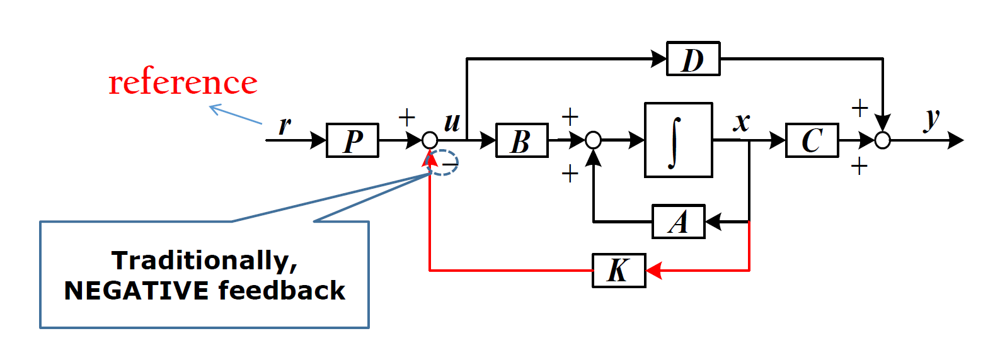
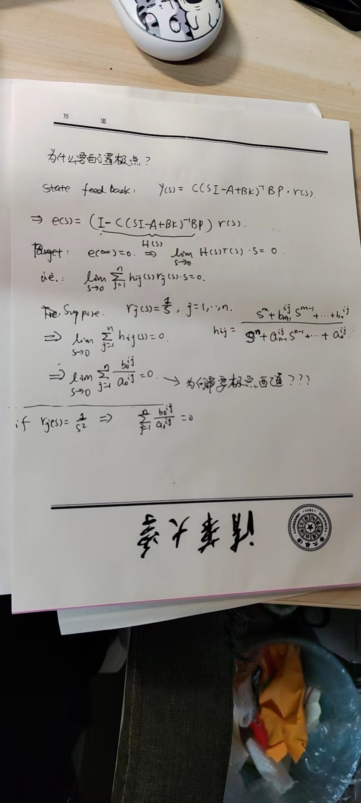

## 描述
[现代控制理论](.//) 中介绍了状态反馈这个概念，但是我对其中 P 矩阵的实现细节有些疑惑。

现代控制理论中 reference 前面乘了矩阵 P，上课的时候一般都是 P=I 就跳过了。但如果 P 不等于 I，此时如何配置状态反馈极点呢？

举例来说，大作业中的四旋翼无人机，输入向量为 4 维向量，线性化后的系统有 8 个可控状态向量，那么根据这 8 个状态向量设计状态反馈，计算出了反馈矩阵 K。但是这里的 P 应该怎么选取呢？

换句话说，
::: warning problem
**按照第二可控规范型的思路配置极点过后，怎么设计这样的 P 来将 8 维的向量转换为 4 维的输入向量呢？**

:::

^p1

问题在于，我期望的的轨迹是一个 12 维的向量，但是实际上输入是 4 维的，那如果 p 矩阵不影响状态反馈的配置的话，这个 p 应该怎么选取呢？
我感觉 p 矩阵承担的作用是将这个 12 维的期望轨迹映射到 4 维的输入力上面，我就不太清楚这个 p 应该怎么设计了

::: warning problem
我很好奇的一点是误差为6维的向量，控制量为4维。在状态反馈已经配置好极点过后，实际上可以通过**调节增益矩阵使得输入控制量u为6维误差向量的其中任意4个分量**。这样看起来相当于根本不需要设计6维的轨迹，设计4维的轨迹就够约束控制系统运动了，这和直观理解是不一样的。更进一步，如果状态更多，无论状态是多少，只需要设计4个轨迹就能实现完全可控我感觉很奇怪。
:::

^p2

## 解答

::: note note
By 现代控制理论 石宗英 老师
:::

1. 以四旋翼为例，四旋翼模型的输入 u 是升力（4 个分量），状态如果包含位置姿态及其变化率是 12 维。如果考虑轨迹跟踪问题，通常指三维空间的位置轨迹（速度包含在位置的变化里），而姿态角决定了四旋翼水平方向的受力（决定了水平方向加速度），所以四旋翼的控制系统通常由内环（姿态控制环）和外环（位置控制环）。以其中的姿态控制环来说，参考输入是理想的姿态角（随时间变化），需要设计控制输入 u 使实际姿态角跟上参考姿态角，所以一般是将参考输入与实际状态做差即得到跟踪误差，跟踪误差经过一个控制器产生控制量 u。如果这个控制器就是一个比例增益，根据框图的等效关系，把状态反馈的加和节点移到内侧，则参考输入通过增益矩阵作用到 u。增益矩阵可以不是方阵，但没关系，我们这里关心的是 u 对系统状态的可控性，而不是关心参考输入对系统状态的可控性，这和课上讨论的是不一样的
2. 是否用比例增益就可实现轨迹跟踪分析后才能下结论。姿态环的角位置轨迹是 3 维。如果增益矩阵不满足行满秩，只能说明 u 的几个分量之间可以相关，和能否实现期望的几点配置没关系。因为实际系统可能只需要 u 中的部分分量就能实现状态的任意调节。
3. 状态方程描述的是动态系统（有微分），不是代数系统，所以不能这样。如果系统状态是 6 维，控制量是 4 维，状态完全可控只意味着存在控制器能实现状态任意调节，但控制器应该是什么形式就是另一个问题了。6 个状态分量之间是线性独立的，假设讨论的是状态跟踪问题，无论哪一维有误差，都应该在 u 中有体现，否则不可能实现跟踪
4. 这里参考输入指希望系统跟踪的参考轨迹，由系统任务决定

针对 [^p2](./#^p2)，老师解答是：
- 一个系统，如果控制的维数少于状态的维数，也可以实现状态的任意调节，有一点以时间换“空间”的意思。比如一个离散系统，控制输入 1 维，状态 3 维，为将状态从原点转移到任意状态，1 步是做不到的，至少需要 3 步。连续时间系统没有节拍的概念，但道理类似

::: note hint
解答提示

:::

本质上我们做状态反馈的极点配置有 2 件事要干：
1. 根据系统控制方程 **配置极点**
	1. 这一步是为了保证系统状态的稳定性，至少可以让系统在给定输入下不至于发散，给我们做后面的稳态误差控制做基础
2. 根据设计的闭环系统状态方程，**设计 P 矩阵** 来控制系统静态增益
	1. 这一步才是核心！有了前面极点稳定的条件，可以在此基础上设计静态增益，来满足误差条件
	2. 使用终值定理的前提是 **系统状态稳定**
	3. 
	4. 忽略其中的 “为什么要配置极点” ，取其计算式子，这就是如何配置静态增益的方法

总之：
1. 所以说配置极点方法只能保证可控系统稳定，但是不保证输出误差趋近于 0；如果要趋于 0 需要更进一步的分析
2. 那可以理解为，如果用状态反馈来做轨迹跟踪控制比较困难，它用来做稳定器比较合适（因为设计 P 矩阵蛮麻烦的）
3. **P 矩阵是用来配置误差分量的静态增益的，配置极点是其必要条件**
	1. 闭环之外的 P 矩阵可调节静态误差，其实和配置极点没关系
	2. 如果将跟踪误差作为状态（分量），极点配置方法就有效了
4. 配置完极点还要再算增益矩阵 P 来消除静态误差

::: note note
还可以试试把状态反馈增益移到（参考位置与实际位置的差）的后面，就是比例控制，不必单独考虑P，可以进一步考虑如何定量计算
:::

## 参考

##### 引文
##### 脚注
