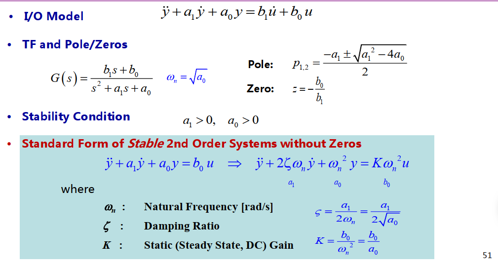

# 系统的响应

# 系统的响应

## 系统参数

### 一阶系统

对一阶系统，存在 [传递函数](.//) 表达式为：
$$
G(s)=\frac{K}{\tau s+1}
$$

- Unit Step Response=> $y(t)=K-Ke^{-\frac{1}{\tau}t}$

### 二阶系统

对二阶系统，存在传递函数表达式为：
$$
G(s)=\frac{b_1s+b_0}{s^2+a_1s+a_0}
$$

- Natural Frequency (rad/s)-> $w_n=\sqrt{a_0}$
- Damping Ratio -> $\zeta = \frac{a_1}{2w_n}=\frac{a_1}{2\sqrt{a_0}}$
- Static Gain -> $K=\frac{b_0}{w_n^2}=\frac{b_0}{a_0}$
- Poles: $p_{1,2}=-\zeta w_n \pm j w_n \sqrt{1-\zeta^2}$

