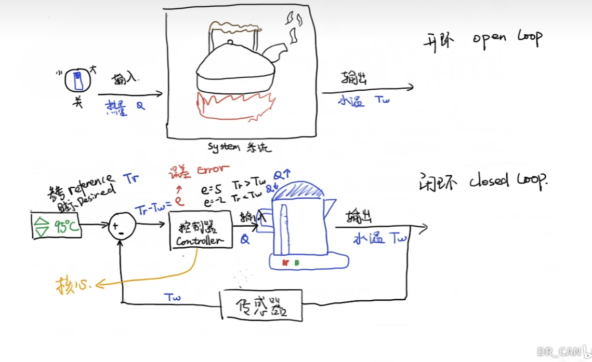
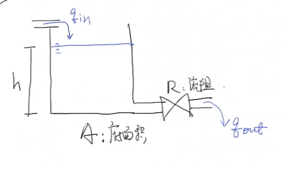
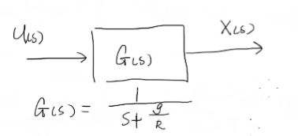
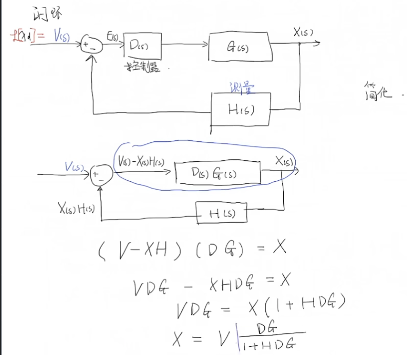
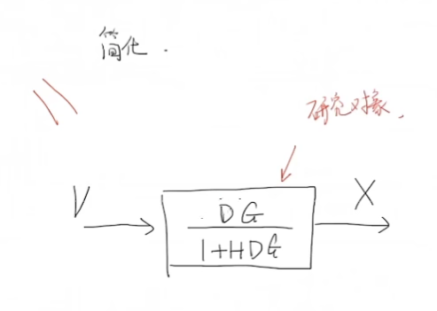

# Chap1 反馈控制综述

## 开环和闭环系统

可以将系统抽象为：
- 开环：Plant（水壶+水）的输入Q是和 $T_{w}$ 无关的
- 闭环：$Q=f(T_{w})$，由控制器进行控制

### 实际例子

流体系统如上，其系统方程为：

$$

\dot{h}=\frac{q_{in}}{A}-\frac{gh}{AR}

$$

简化系统为 $A=1$ ，那么：

- input: $u=q_{in}$
- output: $x=h$

系统可以画为框图：

#### 开环控制

对上面系统，如果考虑 $q_{in}=u=C$，那么其输出结果会缓慢趋近 $\frac{CR}{g}$

> 可以参考[系统的响应](./../系统的响应.md)

如果我们目标为 $h=x=x_{d}$，那么只需要让 $x_{d}=\frac{CR}{g}\implies C=\frac{x_{d} g}{R}$

这就是一个理想状态下的**开环系统**控制

但是上面的控制理论上是基于准确的模型参数的，然而现实生活中不存在这么好的模型，从而我们需要反馈

#### 闭环控制

带有反馈的控制框图为：

新系统的传递函数变为：

事实上这就把一个闭环系统变成了一个开环系统，其中的 $D$ 就是我们可以控制的部分，依赖这个我们可以对系统做：
- 稳定性分析
- 误差分析

## 参考

##### 引文

- [https://www.bilibili.com/medialist/play/230105574?from=space&business=space_series&business_id=1569593&desc=1&spm_id_from=333.999.0.0](https://www.bilibili.com/medialist/play/230105574?from=space&business=space_series&business_id=1569593&desc=1&spm_id_from=333.999.0.0)

##### 脚注
