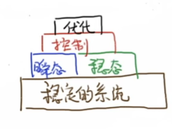
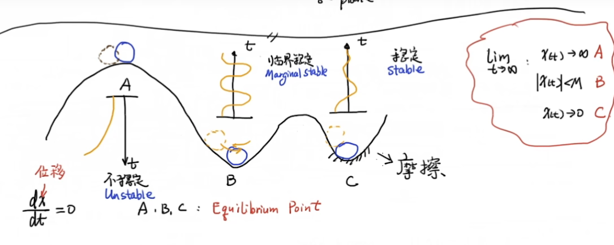
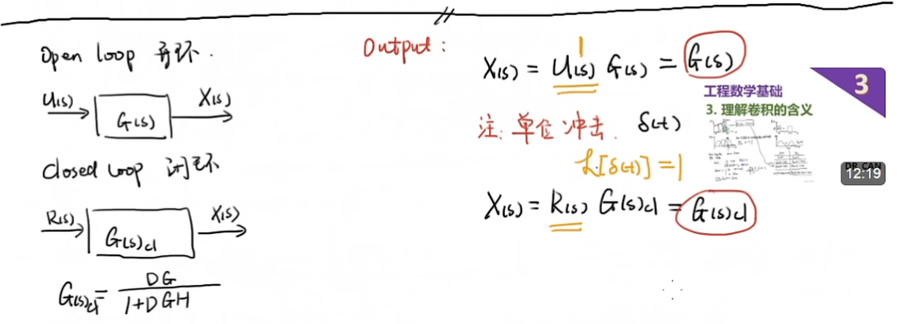
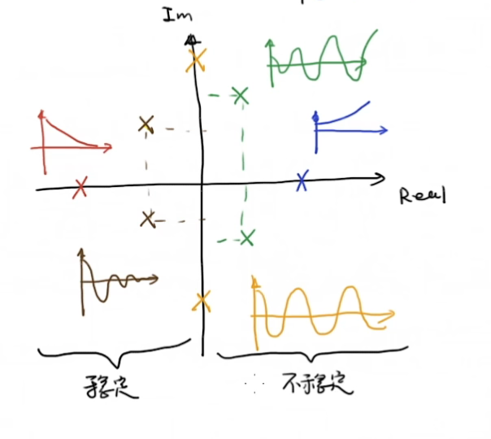
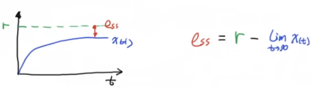

# Chap2 稳定性分析

## 问题引入

> 系统的稳定性是第一位的

### 稳定性例子

更进一步，我们考虑将小球化为一个系统，对B小球而言，如果给定其一个**有界输入**，那么可以期盼，其输出也是一个有界的，我们将这种系统称为：**BIBO稳定**

## 数学分析

> 我们一般通过给定单位冲击来研究系统的稳定性（这就够了）

为了研究一个系统的稳定性,，我们首先考虑一个特殊情况的响应 (对 $\delta$ 的响应) ：

考虑系统 $G(s)=\frac{1}{s^2+s-6}=\frac{1}{(s+3)(s-2)}$，其单位冲击响应为：

$$

\begin{align}
X(s) & =1 \cdot G(s) = \frac{c_{1}}{s+3} + \frac{c_{2}}{s-2} \\
x(t) & = \mathcal{L}^{-1}[X(s)]=c_{1}e^{-3t}+c_{2}e^{2t}
\end{align}

$$

这表明系统并不稳定

::: note remark
上面说系统的稳定性研究，实际上是基于极点的某种不变性的，也就是说一般来讲你给定一个输入，其不影响输出中的函数成分，只会影响成分之间的比例关系在；也就是说*输出的函数性质是由系统本身决定的*，稳不稳定也就只需要看系统的传递函数就可以了
:::

利用复数上的代数基本定理，我们可以得到：

又由于线性系统的可加性，我们可以说明：

::: danger corollary
极点在左半平面系统稳定
:::

## 终值定理和稳态误差

我们知道如果系统只是稳定的，并不能说明系统能够达到想要的reference位置，其中一个表征量是稳态误差，我们期望对常值输入的这种系统，可以有系统稳定后的稳态误差越接近0越好

为了分析稳态误差，我们有好用的**终值定理**：

::: info 终值定理

$$

\lim_{ t \to \infty } x(t) = \lim_{ s \to 0 } sX(s), X(s) = \mathcal{L}[x(t)]

$$

其适用性具有条件：

当$\lim_{ t \to \infty } x(t)$存在的时候，才可以适用FVT，这也意味着极点都在复平面的左半边
:::

## 参考

##### 引文

##### 脚注
