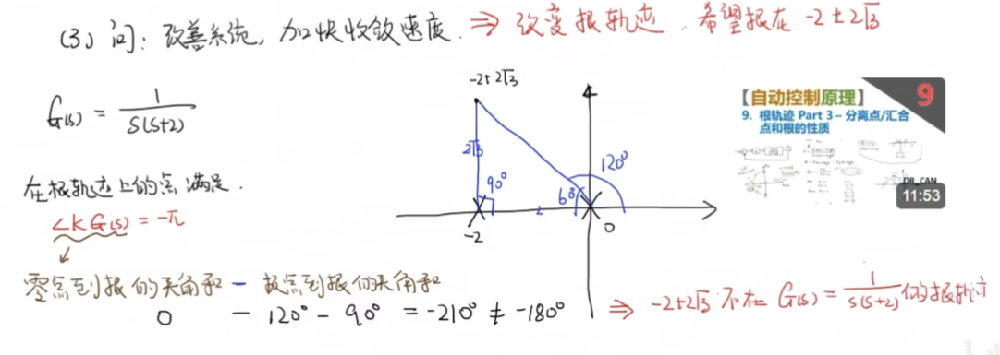

# Chap3 根轨迹分析


## 根的作用

所谓根就是极点，我们知道极点在复平面上的位置会很影响系统的时域响应，可以参考[系统的响应](./../系统的响应.md)。我们分析了一阶、二阶系统的系统响应特性，而注意到，*代数基本定理告诉我们高阶系统也就是多个一阶、二阶系统的叠加*，因此我们需要研究的所有线性时不变系统实际上都可以归类到对一、二阶系统中，而根对一、二阶系统的时域响应起了决定性作用

既然根如此重要，我们自然地可以想到，通过在系统前添加补偿器来调节根的位置，这就可以得到我们想要的系统特性，这就是研究根轨迹的出发点

## 根轨迹变化规律


对一个闭环系统，其闭环传递函数可以表示为：


$$

H(s) = \frac{kG(s)}{1+kG(s)}

$$


我们研究的是 $k$ 从 $0$ 到 $+\infty$ 变化时，系统 $H(s)$ 极点在复平面上的变化规律

> 
> 如果反馈也带了一项传递函数，那么分析对象就变为了 $1+kG(s)H(s)$

::: note note
我们通过根轨迹，分析的系统是开环系统$G(s)$的响应，也就是对控制对象的分析
:::


考虑极点：$1+kG(s)=0$，设：


$$

G(s)=\frac{N(s)}{D(s)}=\frac{(s-z_{1})(s-z_{2})\cdots (s-z_{m})}{(s-p_{1})(s-p_{2})\cdots (s-p_{n})}

$$


其中 $z_{i}$ 被称为零点，用⭕来表示，开环系统有m个零点，为m阶；$p_{i}$ 为极点，用❌来表示，有n个极点，为n阶

### 规则1：根轨迹数量

::: info theorem
如果n>m，那么有n条根轨迹；如果m>n，共有m条根轨迹

也就是说，具有零极点阶数最大的数目的根轨迹

:::


比如系统 $G(s)=\frac{s+2}{s^3+3s^2+s_{2}+1}$，其根轨迹如下图


### 规则2：极点向零点移动

::: info theorem
当n=m时，随着k从0到 $+ \infty$，根轨迹从G (s) 的极点向零点移动

:::


这从系统极点表达式可以直接看出


### 规则3：实轴上根轨迹存在于奇数点左边

::: info theorem


:::


::: note note
仅仅在实轴上有这个规则
:::


### 规则4：复数根轨迹通过实轴对称

::: info theorem
如果复数根存在，那么一定是共轭的，这表明其根轨迹通过实轴对称

:::


### 规则5：若n>m，那么有n-m个极点指向无穷；反之亦然

::: info theorem

:::


比如系统：$G(s)=\frac{s+2}{(s+1)(s+3)}$，根轨迹为：

反过来，$G(s)=\frac{(s+1)(s+3)}{s+2}$


### 规则6：根轨迹沿着渐近线移动

根轨迹沿着渐近线移动：
- 渐近线和实轴的交点 $\sigma=\frac{\sum p - \sum z}{n-m}$，其中p是极点，z是零点
- 渐近线和实轴的夹角 $\sigma = \frac{2 q+1}{n-m} \pi, q=0,1, \cdots , (n-m-1 \text{ or } m-n-1)$


上面系统的根轨迹为：


::: warning problem
出现一个奇怪的问题：matlab 仿真结果出现了相反的结果，明明是同一个系统？

:::


```matlab
z = [-1];
p = [0 -2 -3 -4];
k = 1;
sys1 = zpk(z, p, k)
rlocus(sys1)
q = 0:(abs(length(p)-length(z))-1);
theta = rad2deg((2.*q + 1)./ abs(length(p)-length(z)).* pi)

sys2 = tf([1 1], [1 9 26 24 0])
rlocus(sys2)
q = 0:(abs(length(p)-length(z))-1);
theta = rad2deg((2.*q + 1)./ abs(length(p)-length(z)).* pi)

```

仿真结果分别为：

- 
- 

根走向了不同的虚轴，这意味着相差了180°相位？

但是两个系统是一样的：


如果减少根中的-4的极点，两者就一样了…

::: note note
不过起始也无所谓，反正根轨迹的意义是在给定K之后极点的位置，那么实际上差180度相位代表着极点共轭，两个是对称的，对系统结果分析应该没有什么影响
:::


## 根轨迹的性质

### 根轨迹的应用案例

我们首先给一个根轨迹的应用例子，考虑下面这样一个2阶系统：


$$

\ddot{x} + 2 \zeta w_{n} \dot{x} + w_{n}^2 x = u

$$


我们期望使用根轨迹的方法来设计 $\zeta$ 从而控制响应结果，那么将其化为框图：

和 $k=\zeta$ 相关的项为原始系统的分子，那么有：


$$

\frac{1}{s^2+w_{n}^2}(s^2 + 2k w_{n} s + w_{n}^2)=0 \implies 1 + K \frac{2w_{n}s}{s^2+w_{n}^2}=0

$$


对系统 $G(s)$ 而言，其具有2个虚轴上共轭的极点和一个原点出的零点


我们来计算这个汇合点：


$$

\begin{align}
k & = -\frac{s^2+w_{n}^2}{2w_{n}s} \implies k(\sigma) = -\frac{\sigma^2+w_{n}^2}{2w_{n} \sigma} \\
\frac{dk}{dt} & =0 \implies \sigma = -w_{n}, k=1
\end{align}


$$


这也意味着汇合点在k=1时达到，有下面的分析结果，其和我们对二阶系统的分析结果一样


### 根轨迹的几何性质

注意到复数可以表示为幅角形式，那么对一个复数 $s=\sigma + jw$，将其带入系统 $G(s)=\frac{N(s)}{D(s)}$ 中后，得到的结果有：

- 幅值为复数 $s$ 到零点向量的幅值之积÷ $s$ 到极点向量的幅值之积
- 相位为复数 $s$ 到零点向量的相角之和- $s$ 到极点向量的相角之和

举例而言：$G(s)=\frac{s+2}{s(s+1)}$，我们期望求 $s=-1+\sqrt{ 3 }j$ 的结果：


现在回头观察我们的根轨迹的基本形式，有：


通过上面的几何角度的理解，我们可以通过调节根的位置得到新的控制器——超前补偿器 (Lead Compensator)

## 超前补偿器


我们对这个系统的性能进行分析，考虑输入一个单位冲激 $\delta$ ：


如果我们期望系统能够加快其收敛速度，那么我们需要调节根轨迹：

譬如说我们期望根在 $-2\pm 2\sqrt{ 3 }i$ 处，那么：



这表明这个期望根不在目前的根轨迹上，我们需要弥补这样的轨迹。一个简单的思路是：

*我们增加一个30°的零点，从而满足了相角限制*


这就变成了一个PD控制，一般来说实际控制中我们尽量不期望这样的控制：
1. 被动原件无法实现这样的控制 (微分项) #todo
2. 对高频噪声敏感，通过伯德图显然可以看出

为了避免这样的问题，就引出了我们对超前补偿器，其形式为：


$$

H(s)=\frac{s-z}{s-p}

$$


即引入零点的同时也引入极点，其中 $|z|<|p|$

其思路是：将期望的30°拆分为2部分：40°-10°，即一个40度的零点和10度的极点


我们可以计算加入了超前补偿器后的根轨迹，其汇聚点为：


$$

\sigma_{a} = \frac{(-2+p+0)-(z)}{2}=\frac{p-z}{2}-1

$$


注意到 $p-z<0$，这意味着将原来的-1位置的渐近线向左边拉，**根轨迹向左，提高稳定性，加快反应速度**

观察其伯德图，形式为：


注意到其在一部分频率处提前了相位，这也是其为什么叫超前补偿器


## 滞后补偿器

前面的 [超前补偿器](./#超前补偿器) 考虑的是对系统进行极点配置的控制器，其影响的是系统的动态响应特性；我们换个角度，从系统时域上的稳态误差入手，来看看有没有办法能够削减稳态误差？


考虑输入 $R(s)=\frac{1}{s}$ 为一个单位阶跃，那么稳态误差可以使用 [终值定理和稳态误差](./Chap2-稳定性分析.md#终值定理和稳态误差)进行计算：


$$

e_{ss}=\lim_{ t \to \infty } e(t)=\lim_{ s \to 0 }sE(s)=\lim_{ s \to 0 } s \frac{1}{s} \frac{1}{1+\frac{kN(s)}{D(s)}}=\frac{D(0)}{D(0)+kN(0)}

$$


如果引入补偿器 $\frac{s+z}{(s+p)}$，即：


那么稳态误差：


$$

e_{ssc}=\frac{D(0)p}{D(0)p+kN(0)z}

$$


如果 $p=0$，那么此时 $e_{ssc}\to 0$，这意味着稳态误差为0，补偿器形式上为：


$$

H(s)=1+\frac{z}{s}

$$


是一个PI控制

### 设计案例

对系统：


通过给定稳态误差上限，我们可以得到 $\frac{z}{p}$ 的比例，并不能确定完整的值。我们可以给一些例子值仿真看看结果形式：

| p   | z   | 结果 |
| --- | --- | ---- |
| 0.1 | 0.9 |      |
| 1   | 9   |  同上    |


其中黄线是没有补偿器的情况，对应第一行模型；蓝线代表极点-1的情况，红线代表极点-0.1的情况

这可以从根轨迹的角度来看：


这也确实是，黄线和红线的瞬态响应是很相似的，也就是说我们希望能够尽量的保证滞后补偿器的零极点贴近虚轴，这样相角差距不会太大，系统根轨迹变化不会很大


## 参考

##### 引文


##### 脚注
