# Chap4 Nyquist稳定性判据

## 模型背景

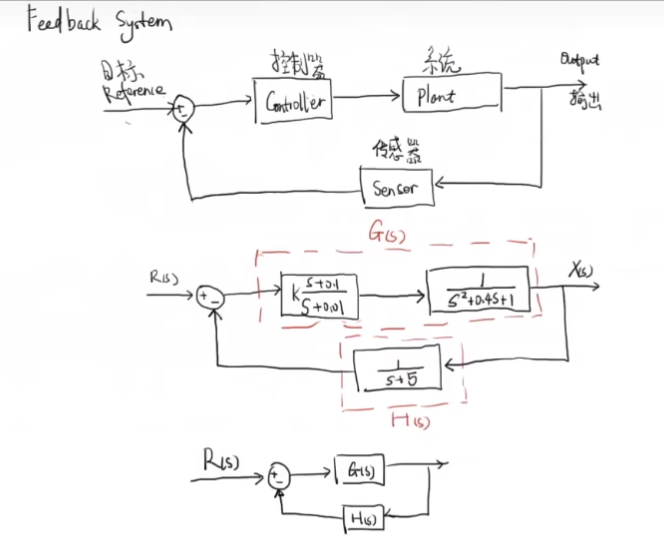

我们考虑一个如上图的控制系统，最终化简后的系统传递函数为：

- 开环传递函数：$G(s)H(s)$
- 闭环传递函数：$\frac{G(s)}{1+G(s)H(s)}$

令 $G(s)=\frac{N_{G}}{D_{G}}, H(s)=\frac{N_{H}}{D_{H}}$，那么可以发现：

- $GH=\frac{N_{G}N_{H}}{D_{G}D_{H}}$
- $1+GH=1+\frac{N_{G}N_{H}}{D_{G}D_{H}}=\frac{D_{G}D_{H}+N_{G}N_{H}}{D_{G}D_{H}}$
- $\frac{G(s)}{1+G(s)H(s)}=\frac{D_{H}N_{G}}{D_{G}D_{H}+N_{G}N_{H}}$

这表明，$GH$ 和 $1+GH$ 具有相同的极点，$1+GH$ 的零点和 $\frac{G(s)}{1+G(s)H(s)}$ 的极点相同

### 柯西幅角原理

#### 零点情形

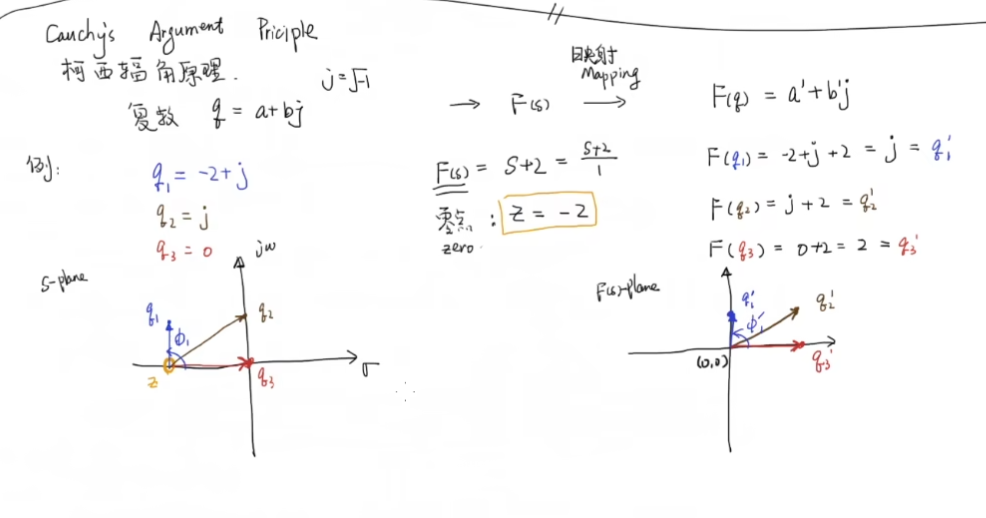

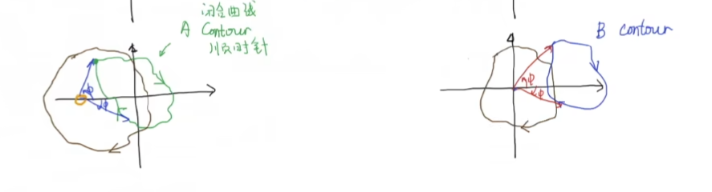

#### 极点情形

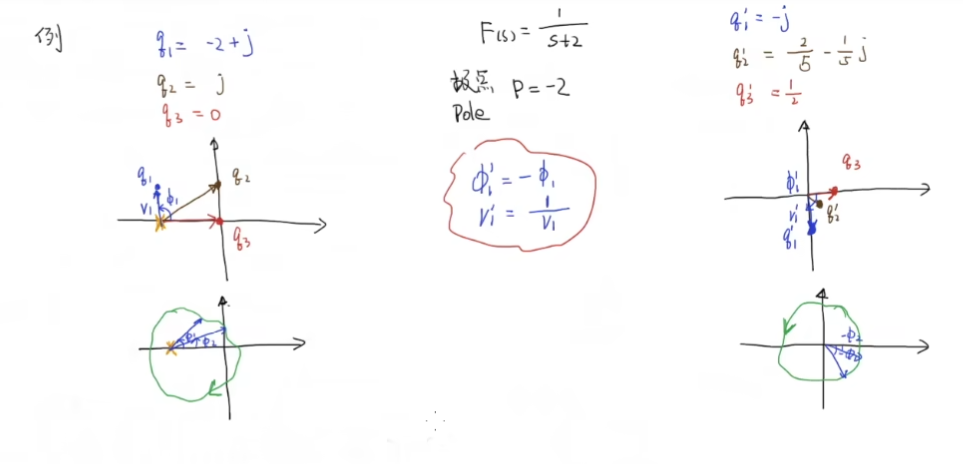

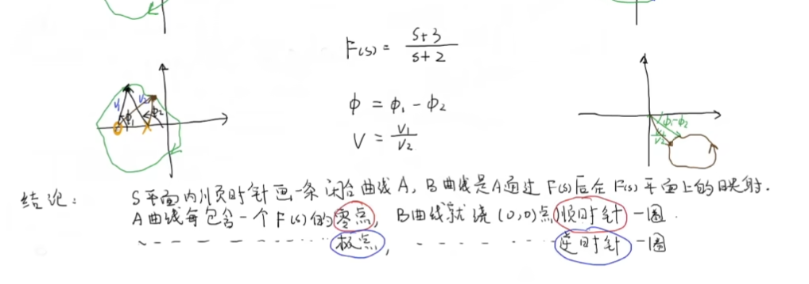

## Nyquist 稳定性判据

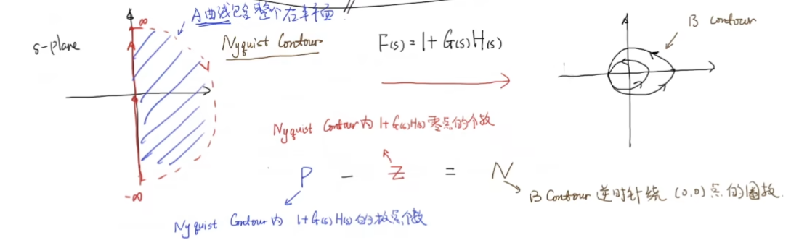

注意到在 [模型背景](./#模型背景)中我们提到了：
- GH和1+GH具有相同极点
- 1+GH零点和闭环传递函数极点相同

为了方便分析，将映射 $F=1+GH$ 换位 $F'=GH$， 这表明：

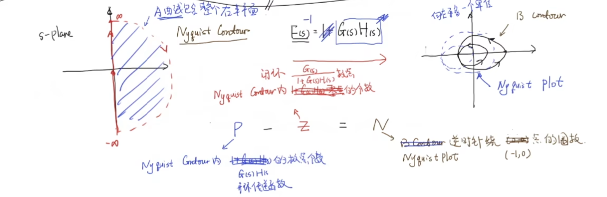

从上面的形式来看，我们给一个GH的函数映射，通过其可以计算闭环传递函数在右半平面的极点的个数，这一方法可以直接通过开环传递函数计算闭环传递函数的极点个数，从而判断系统稳定性

### 总结

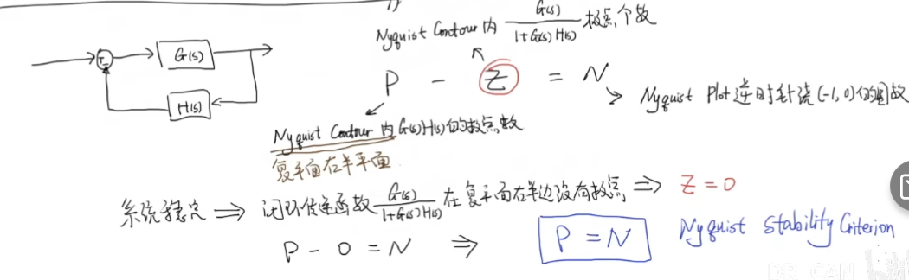

### 应用

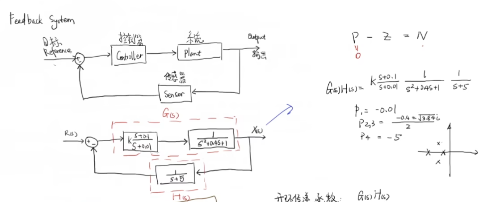

- k=1
	- 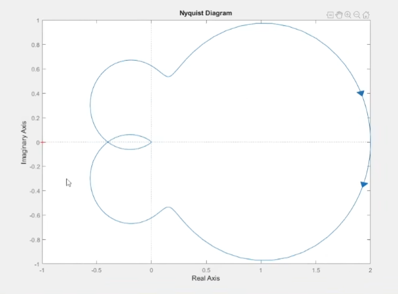
	- 这表明P=N=0，稳定
- k=5
	- 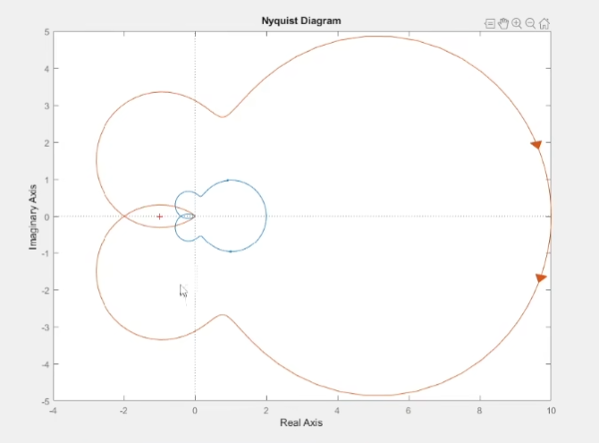
	- 这表明P=0, N=-2，从而Z=2，系统不稳定
	- Nyquist图对K是线性的，其实就是将前一张图按照中心放大5倍

> nyquist有点像大一学的绕中心旋转角度积分的结果，好像印象里就是可以判断转动圈数

## 参考

##### 引文

##### 脚注
