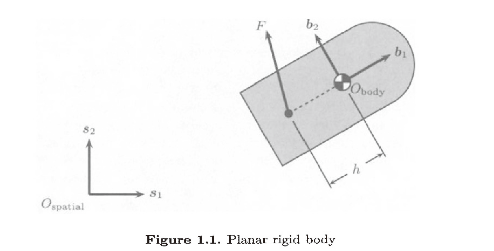

# Chap1 问题引入

## 书籍简介

> 提供一个统一的针对机械系统控制的方法论，从系统建模、分析到设计；这一流程是通过几何的角度来完成的（Riemannian and affine geometry）

本书的目录被分为 3 大块：
- 处理建模问题
- 处理控制系统的分析问题
- 处理控制系统的设计问题

## Motivations

### 刚体系统

对刚体系统，其中的控制问题可以是非线性的。一个简单的例子如下：

^fig-plannar-rigid-body-1

这一系统描述了一个简化的二维小船，显然它具有 3 个自由度。我们考虑通过其广义坐标来描述构型空间，广义坐标为：$q=(\theta ,x,y)$，也可以将其表示为：

$$

\left[\begin{matrix}
\cos(\theta) & -\sin(\theta) & x \\
\sin(\theta) & \cos(\theta) & y \\
0 & 0 & 1
\end{matrix}\right]

$$

::: note note
下面这种表示强调了构型空间的矩阵群结构，我们将在homogeneous representation中详细介绍这点
:::

这个系统的速度可以在惯性系 $\sum_{spatial}$ 下描述，也可以在随体坐标系 $\sum_{body}$ 下描述，记速度分别为：$\dot{q}=\left( \dot{\theta},\dot{x},\dot{y} \right)$ 和 $\left( \dot{w},\dot{v}_x,\dot{v}_y \right)$，那么有：

$$

\left[ \begin{array}{c}
	\dot{\theta}\\
	\dot{x}\\
	\dot{y}\\
\end{array} \right] =\left[ \begin{matrix}
	1&		&		\\
	&		\cos \theta&		-\sin \theta\\
	&		\sin \theta&		\cos \theta\\
\end{matrix} \right] \left[ \begin{array}{c}
	\dot{w}\\
	\dot{v}_x\\
	\dot{v}_y\\
\end{array} \right]

$$

通过坐标 $q$ 和 $\dot{q}$，可以决定这个系统的状态。从而我们可以将系统的能量给表述出来：

$$

\mathrm{KE}=\frac{1}{2}\dot{q}^T\mathbb{G} (q)\dot{q},\mathbb{G} (q)=\left[ \begin{matrix}
	J&		&		\\
	&		m&		\\
	&		&		m\\
\end{matrix} \right]

$$

::: note note
利用动能和势能可以直接构造出拉格朗日方程，从而完成系统动力学建模
:::

$$

\begin{aligned}
	J\ddot{\theta}&=-hu_2\\
	m\ddot{x}&=u_1\cos \theta -u_2\sin \theta\\
	m\ddot{y}&=u_1\sin \theta +u_2\cos \theta\\
\end{aligned}

$$

其中 $u_{i}$ 是 F 在 i 上的分量

根据这个动力学方程，我们可以考虑下面的问题：

> 是否可能从一个给定的状态控制到另一个任意的期望状态

## 参考

##### 引文

##### 脚注
