# 基本滑模控制简介和示例

# 基本滑模控制

## 定义

滑模控制是在控制系统相空间下考虑实现的一种控制方法，相当简单且控制性能优越，具有以下优点：
- **滑动模态可以进行设计**。调节的参数少，响应速度快。
- **对扰动不灵敏**。滑模控制对扰动有很强的抑制能力，这对于在复杂环境工作下的机器来说非常友好。

滑模控制本质上是一种非线性控制手段，简单来说，其非线性表现为控制的不连续性，也即系统的结构不固定，可以在动态的过程中根据系统当前状态有目的地不断变化，迫使系统按照设计的“滑模面”的状态轨迹进行运动。

用一个例子进行介绍：假设在一个光滑的平面上有小木块，他在坐标 X=2 处，其存在一个初始速度 v 向着坐标轴反方向运动，目的是设计一个控制器，使其能够最后停在坐标原点。

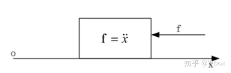

**写出系统状态方程**

$$
\begin{aligned}\dot{x_1} &= x_2\\ \dot{x_2} &= u\end{aligned}
$$

其中 $x_1$ 代表物体的位置，$x_2$ 代表物体的速度，u 代表控制器的输出，也就是作用力 f。控制目标是使得物体停在坐标原点，即 $x_1=0, x_2=0$。

**设计滑模面**

$$
s = c x_1+x_2
$$

滑模面是什么？可以看成在物体相空间内的一个流行，这里简单来说是一个平面。这样设计是为什么呢？

之前我们设计控制器的目的是使得 $x_1=0, x_2=0$，考虑在设计的滑模面上物体的运动：

$$
\begin{cases}
	cx_1+x_2=0\\
	\dot{x}_1=x_2\\
\end{cases}\Longrightarrow cx_1+\dot{x}_1=0\Longrightarrow \begin{cases}
	x_1=x_1\left( 0 \right) e^{-ct}\\
	x_2=-cx_1\left( 0 \right) e^{-ct}\\
\end{cases}
$$

可以发现，这样的设计使得状态量都会趋近于 0，并且以指数形式趋近，这可能是滑模面中模态的意义——特征值引起的指数收敛。用相平面表示这个趋近过程如下图：

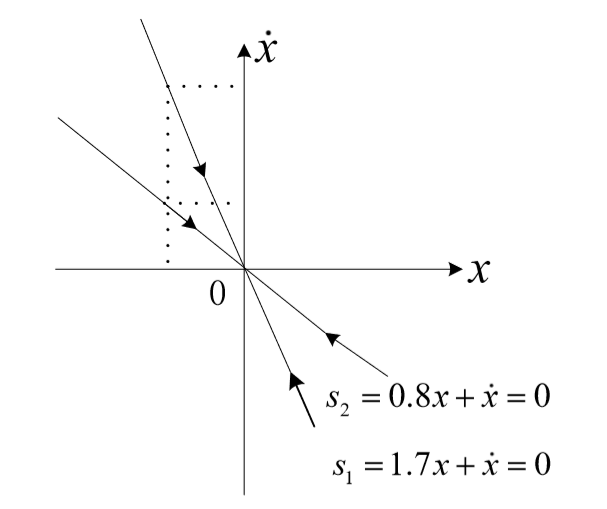

**设计趋近律，寻找 s 与控制 u 之间的关系**

上面介绍了设计选取滑模面 s，因此需要对控制律进行设计使系统在滑模面上运行。

由于 $s=cx_1+x_2$，因此有：$\dot{s}=cx_2+u$

由于设计的滑模面是一个平面，线性的结构使得控制律 u 可以通过趋近律 $\dot{s}$ 控制，一般可以这样设计：

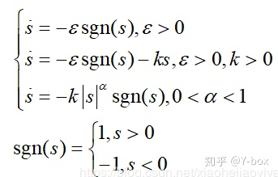

根据上面设计的趋近律可以求出控制器 u 的表达式。e.g. $\dot{s}=-\varepsilon sgn(s), s>0$，有：$u = -cx_2 - \varepsilon sgn(s), s=cx_1+x_2$，对木块施加这样的 u 的控制，可以使得木块稳定在原点。

为什么如此选取控制律可以使得 s=0？

在控制原理中，我们经常使用 [李雅普诺夫稳定性](./../../李雅普诺夫稳定性.md) 来对系统的稳定性进行判断，特别的其中使用 Lyapunov 函数作为判据。

对当前的系统，我们关心的是 s 是否能在我们给定的控制律下保持为 0，即对于控制系统，以 s 作为变量，使用 Lyapunov 函数进行判断。其判定方法为：对于一个 s 为变量的系统，如果存在一个连续函数 V 满足：

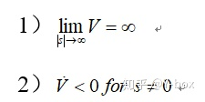

那么系统可以在平衡点 s=0 处稳定。

设计李雅普诺夫函数 $v(s,t) = 1/2s^2$，显然对第一个条件满足。对于第二个条件，$\dot{V} = s \dot{s} = -s\varepsilon sgn(s) =-\varepsilon |s| <0$，因此也满足第二个条件。根据李雅普诺夫判据,s 会最终稳定于滑模面，使得 s=0。

**总结一下滑模控制的设计步骤**

首先根据被控对象的状态方程设计滑模面，状态一旦到达滑模面 $s=CX$，，将以指数趋近方式达到稳定状态。然后设计趋近律求出控制器的表达，李雅普诺夫函数作为稳定性的保证，即保证 s=0 可达，（相平面中的其他点能到达滑模面）。

---

**一些问题和改进**

控制问题除了保证其能够收敛，还需要考虑响应时间，尽管之前的李雅普诺夫函数保证了 s 最终会稳定于 0，但并没有保证什么时候到达，这对控制系统是没有意义的。

因此对 Lyapunov 函数的第二个条件 (相平面点可达性) 进行修改，让他能够有限时间到达稳定点。

$$
\dot{V}<0 \Rightarrow \dot{V}<-\alpha V^{1/2}
$$

对于改进后的第二个条件，分离变量后积分，假设积分时间为 t，有：

$$
\int_0^t{\frac{\dot{V}}{V^{1/2}}}dt \leq -\alpha t \Rightarrow V^{1/2}(t) \leq -\frac{1}{2}\alpha t + V^{1/2}(0)
$$

进一步得到收敛时间 $t_c$ 满足 $t_c\leq \frac{2V^{1/2}(0)}{\alpha}$

因此，由于李雅普诺夫条件的改变，控制器 u 也要发生相应的改变：

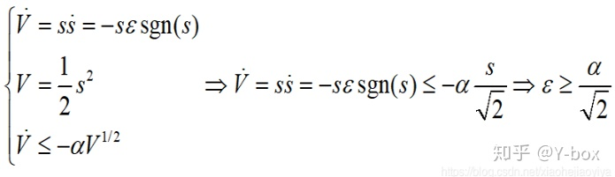

只有满足 $\varepsilon > \frac{\alpha}{\sqrt{2}}$ 才能使得有限时间到达滑模面。

---

**对于干扰项的响应**

加入干扰项后，有新的状态方程：

$$
\begin{aligned}\dot{x_1} &= x_2\\ \dot{x_2} &= u + d\end{aligned}
$$

干扰项引入并不影响滑模面设计，仍然有：$s=cx_1+x_2$，变化的是趋近律 $\dot{s}$，有：$\dot{s}=cx_2+u+d$，控制律 u 满足上面不考虑 d 的形式：
$u = -cx_2 - \varepsilon sgn(s), s=cx_1+x_2$。

为了满足李雅普诺夫函数，有：

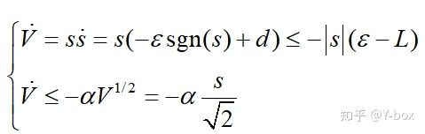

其中 L 表示干扰的上届，d<L。对比上面的条件，因此有 $\varepsilon \geq L + \frac{\alpha}{\sqrt{2}}$ 时 Lyapunov 函数既满足有限时间收敛又负定。因此，系统仍按照先滑动到滑模面，再沿滑模面做指数趋近运动。干扰没有对系统造成影响 ^78b303

> [^78b303](./#^78b303) 是否应为：$\varepsilon \geq max(L, \frac{\alpha}{\sqrt{2}})$

## Formal 的介绍

考虑二阶系统

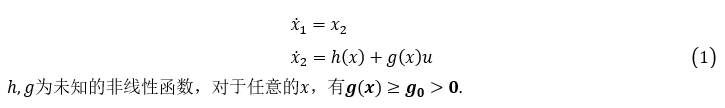

u 是控制律，控制目的：设计一个状态反馈控制器以稳定原点。

控制方法和思路：

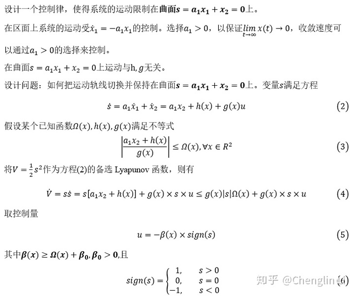

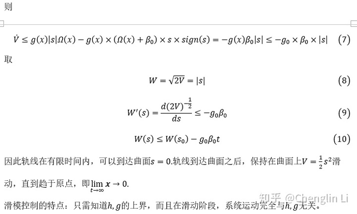

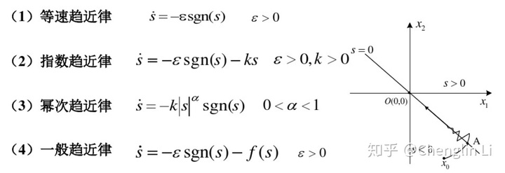

**2 滑动曲面**

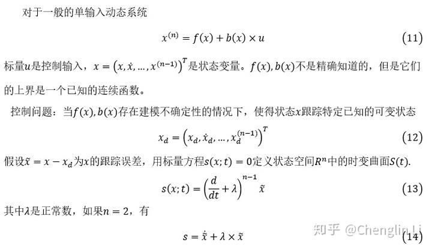

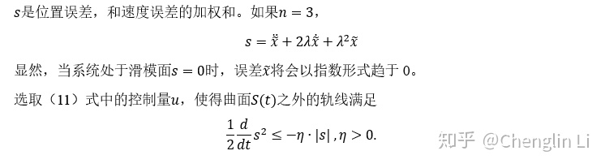

**3 滑模面设计**

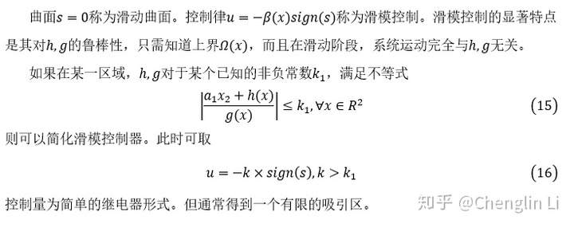

**4 抖动现象**

由于实际系统中开关器件和继电器的非理想性，或者由于惯性、滞后的因素存在，使得滑模控制常常出现抖动。

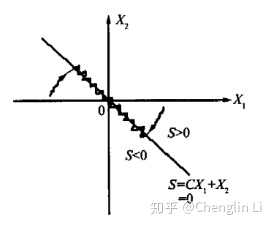

（1）消除抖动的方法一：将控制分解为连续控制和切换控制两部分，以减少切换部分的幅度。

（2）方法二：采用陡峭的饱和函数，代替符号函数。

为了提高精度，应选择尽可能小的 $\epsilon$ ，但是当有时间延迟或者未建模的快速动力学因素时， $\epsilon$ 太小会引发抖动。

## 实例

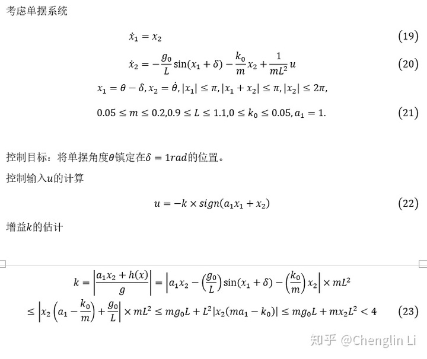

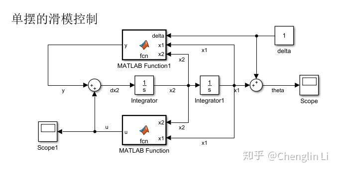

## 参考

- [滑模控制器最强解析 - 知乎 (zhihu.com)](https://zhuanlan.zhihu.com/p/78549442)
- [非线性系统（十三）滑模控制解析 - 知乎 (zhihu.com)](https://zhuanlan.zhihu.com/p/138860110)
