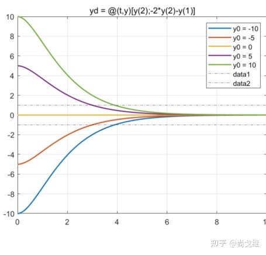

# 滑模控制思考

## 滑模控制率设计

针对 MIMO 的系统，介绍如何根据 [基本滑模控制简介和示例](./基本滑模控制简介和示例.md) 提到的滑模控制设计思路建立滑模面，注意如果输入可以解耦的话，可以直接针对每个输入进行单独的设计就可以了

考虑这样的一个系统模型：


$$
\begin{array}{l}
	\dot{x}=f\left( x \right) +g\left( x \right) u\\
	y=h\left( x \right)\\
\end{array}
$$


定义其滑模面为：


$$
s=\sum{\lambda _iy^{\left( i \right)}}
$$


其中滑模面需要满足 2 个条件：
- 当 s=0 时，有 y→0；如果是跟踪问题 y 替换为 e 就可以
- **relative degree = 1**

relative degree 的意思是 $\dot{s}$ 中显含 u，因为只有这样我们才可以根据 $\dot{s}$ 的形式推出 u 的表达式，使得滑模变量按照设计的滑模面趋向 0

### 一种设计滑模面的方法

考虑一个 relative degree = 4 的系统，这意味着在 $y^{(4)}$ 中首次显含 u，因此为了 *使得滑模面 s 的 relative degree = 1, s 中必然包含 $y^{(3)}$，或者说 $\dddot{y}$*

对上面系统，考虑这样一个 3 阶的系统：


$$
\left[ \begin{array}{c}
	\dot{y}\\
	\ddot{y}\\
	\ddddot{y}\\
\end{array} \right] =\left[ \begin{matrix}
	&		1&		\\
	&		&		1\\
	&		&		\\
\end{matrix} \right] \left[ \begin{array}{c}
	y\\
	\dot{y}\\
	\ddot{y}\\
\end{array} \right] +\left[ \begin{array}{c}
	\\
	\\
	1\\
\end{array} \right] v
$$


先不考虑滑模控制，注意到系统是完全可控的，使用经典的 [全状态反馈](./../../现代控制理论状态反馈的思考.md)，有：


$$
v=-F\left[ \begin{array}{c}
	y\\
	\dot{y}\\
	\ddot{y}\\
\end{array} \right] =-\left[ \begin{matrix}
	F_1&		F_2&		F_3\\
\end{matrix} \right] \left[ \begin{array}{c}
	y\\
	\dot{y}\\
	\ddot{y}\\
\end{array} \right] 
$$

此时闭环系统结构为：


$$
\left[ \begin{array}{c}
	\dot{y}\\
	\ddot{y}\\
	\ddddot{y}\\
\end{array} \right] =\left[ \begin{matrix}
	&		1&		\\
	&		&		1\\
	-F_1&		-F_2&		-F_3\\
\end{matrix} \right] \left[ \begin{array}{c}
	y\\
	\dot{y}\\
	\ddot{y}\\
\end{array} \right] 
$$

^eqn-control-structure

事实上这就是配置闭环系统的极点，此时设计 $F_i$ 可以使得闭环系统稳定，从而期望的状态收敛为 0

::: note note
关于状态反馈的实现可以参考[四旋翼无人机轨迹控制](.//)
:::


上面的设计思路给我们这样的启发，如果只看 [^eqn-control-structure](./#^eqn-control-structure) 的最后一行，实际上给我们这样一个系统的等价表达形式：


$$
\ddddot{y}=-F_1y-F_2\dot{y}-F_3\ddot{y}
$$


而如果取这个为滑模面，就可以保证其收敛，其形式为：


$$
s=\ddddot{y}+F_1y+F_2\dot{y}+F_3\ddot{y}
$$

^eqn-sliding-mode

::: note note
我个人的想法是，滑模面实际上是一个状态空间中的几何结构。如果采用状态反馈可以实现系统稳定控制，那么这个几何结构就包含了状态空间中的零点。换句话说，存在一条在该滑模面上的光滑曲线使得初始状态作为曲线起点，零点作为终点
:::


^630fc4

::: note remark
如果使用这样的状态反馈来生成滑模面结构，实际上就启发我们可以使用其余的控制方式来生成滑模面，比如PID。 

[@liuSecondOrderSlidingMode2021](./../../../paper/@liuSecondOrderSlidingMode2021.md)好像就是用PID滑模面做的
:::


除了上面的选取方法，还有一种思路是研究系统：


$$
\ddddot{y}+F_1y+F_2\dot{y}+F_3\ddot{y}=u
$$


然后计算 u 带入控制方程后的系统的稳定性，就是经典控制理论中的传递函数分析

### 控制量设计

在确定好了滑模面结构后，我们期望将滑膜变量控制在滑模面上，因此可以通过这个 **滑模面的约束关系** 导出控制量 ^e88787

对 [^eqn-sliding-mode](./#^eqn-sliding-mode) 设计约束关系为：


$$
\dot{s}=-k\mathrm{sign}\left( s \right) 
$$


如果按照这个约束方程，可以通过 [李雅普诺夫稳定性](./../../李雅普诺夫稳定性.md) 来证明滑模变量是大范围渐进稳定的

因此有：


$$
\begin{array}{l}
	\dot{s}={\color{red} \ddddot{y}}+F_1\dot{y}+F_2\ddot{y}+F_3\ddddot{y}\\
	\dot{s}=\bar{f}\left( x \right) +\bar{g}\left( x \right) u+F_1\dot{y}+F_2\ddot{y}+F_3\ddddot{y}\\
	\dot{s}=-k\mathrm{sign}\left( s \right)\\
\end{array}
$$

^eqn-control-law

从而可以得到：


$$
u=\frac{1}{\bar{g}\left( x \right)}\left( -\bar{f}\left( x \right) -\left( F_1\dot{y}+F_2\ddot{y}+F_3\ddddot{y} \right) -k\mathrm{sign}\left( s \right) \right) 
$$


根据上式，为了计算控制向量，我们需要系统的全状态 x 以及输出的各阶导数，这意味着需要 **观测器 + 求导**，会引入很多误差

### 误差分析

为了考虑观测误差、传感器误差、计算误差带来的影响，将 [^eqn-control-law](./#^eqn-control-law) 改写为：


$$
\begin{array}{l}
	\dot{s}=\left( a+\Delta a \right) +\left( b+\Delta b \right) u\\
	u=\frac{1}{b}\left( -a-k\mathrm{sign}\left( s+\Delta s \right) \right)\\
\end{array}
$$

^eqn-sliding-mode-with-error

其中 a, b 是观测、测量、计算出的值 (将其汇总)，s 代表真值，$s+\Delta s$ 代表我们实际使用的 s 的值，$\Delta a, \Delta b, \Delta s$ 代表用于计算控制输入的值和对应真值的差

可以根据上面的示意式子推得：


$$
\dot{s}=\left( \Delta a-\frac{\Delta b}{b}a \right) +\left( 1+\frac{\Delta b}{b} \right) \left( -k\mathrm{sign}\left( s+\Delta s \right) \right) 
$$

^eqn-ds-with-error

可以搭建一个 **滑模变量收敛** 的示意模型，展示 s 收敛的情况：


其中 band width white noise 的 noise power 设置为 0.01，s 初始值为 5


可以发现，在设计的反馈结构下，其滑膜变量在未知干扰下还是可以快速收敛

## 什么事滑模控制的有限时间收敛

### 微分方程解释

知乎上 [^1] 给了从微分方程角度的解释，摘录如下：

考虑这样一个微分方程：


$$
y'+y=0
$$


其解析解为：


$$
y=e^{-t+c_1}
$$


不同初值情况下 $y$ 的变化情况如下：


但是可以发现，这个情况 **并不是有限时间收敛的指数收敛/渐进收敛**，因为永远得不到严格的 $y=0$

但是如果考虑：

$y'+y=-2$

此时系统可以表示成一个一节系统的传递函数：

$\frac{Y(s)}{U(s)} =\frac{1}{1+s}\quad with \quad u(t)=-2$


这种情况下虽然依旧是指数收敛，但是如果以收敛为 0 为目标，可以看到最上面的两种初始情况都能保证在有限时间内有 y=0 ，但同时，引入这个常数偏置项的后果是，**最终收敛的值并不是 0**。

考虑这样一个系统：


$$
y'+y=-2\mathrm{sign}(y)
$$


这样的系统就是有限时间收敛

---

有了上面的基础我们可以开始讨论滑模控制的有限时间收敛了

滑模控制具有 2 个阶段：
- 系统收敛到滑模面：$s\rightarrow 0$
- 系统在滑模面上收敛至原点：$y\rightarrow 0$

**滑模控制的有限时间收敛，主要是让第一个过程有限时间收敛**，因为两者是先后发生的，如果两个过程都是渐进收敛，那么系统 *整体的收敛到有界的时间* 就不好计算，但是如果第一个过程有限时间收敛，第二个过程有限时间有界收敛，那么整体的收敛到有界的时间也就比较好算，系统性能有保证。

当然也可以让第一个和第二个过程都有限时间收敛，但个人认为意义不大。因为现实中不可能存在真的收敛为 0。只需要研究对应的滑模面，通过设计常数保证有界收敛足够快就可以。

比如：


$$
y''=-2y'-y
$$




而 $y''=-y'-2y$


通过设计滑模面的参数，可以控制到达滑模面之后的系统表现：抖动、速度、稳态值。

### 实现方法

使用 [李雅普诺夫稳定性](./../../李雅普诺夫稳定性.md) 方法，构造并证明其方法

考虑滑模面动态满足：
[^eqn-sliding-mode-with-error](./#^eqn-sliding-mode-with-error)

推导得到：
[^eqn-ds-with-error](./#^eqn-ds-with-error)

构造李雅普诺夫函数：


$$
\begin{array}{l}
	V=s^2\\
	\dot{V}=s\dot{s}=s\left[ \left( \Delta a-\frac{\Delta b}{b}a \right) +\left( 1+\frac{\Delta b}{b} \right) \left( -k\mathrm{sign}\left( s+\Delta s \right) \right) \right]\\
\end{array}
$$


参考 [定义](./基本滑模控制简介和示例.md#定义)，为了使得有限时间收敛，构造条件：


$$
\dot{V}=s\dot{s}<-\epsilon s
$$


从而需要有：


$$
\left( \Delta a-\frac{\Delta b}{b}a \right) +\left( 1+\frac{\Delta b}{b} \right) \left( -k\mathrm{sign}\left( s+\Delta s \right) \right) <-\epsilon 
$$


最终控制参数 $k$ 需要满足：


$$
\begin{array}{l}
	k>\frac{\alpha +\epsilon}{\beta}\\
	\alpha =\left( \Delta a-\frac{\Delta b}{b}a \right)\\
	\beta =\left( 1+\frac{\Delta b}{b} \right)\\
\end{array}
$$


实验参考代码：

```matlab
%研究不同的滑模面设计s(x)和不同的滑模面初值s(x(t_0)) 对x的影响
clear all
close all
clf

tspan = [0 10];
num_line = 5;
initial_value_range = 10;
y0list = linspace(-initial_value_range,initial_value_range,num_line);


% example 1 : y' = - y
% fun = @(t,y) -2*sign(y) ;
% order = 1;
% 
% % example 2 : y'' = -2y' - y  => (y)' = (y') & (y')' = -2(y') - (y) 
fun = @(t,y) [y(2);-1*y(2)-2*y(1)];
order = 2;

% example 3 : y'' = -y' - 2y  
% fun = @(t,y) [y(2);-y(2)-2*y(1)];
% order = 2;

for i = 1:1:num_line
    
    %这里对于高阶的系统，只有0阶导有初值，高阶导皆为0
    %如果需要测试高阶导也有初值的情况，更改下面y0的表达式
    y0 = y0list(i)*[1,zeros(order-1,1)];
    [t,y] = ode45(fun, tspan, y0);
    plot(t,y(:,1),'linewidth',1.5,'DisplayName',['y0 = ',num2str(y0list(i))])
    hold on
    
end

title(['yd = ',func2str(fun)])
yline(-.5,'-.')
yline(.5,'-.')
legend
grid on
```


## 离散时间滑模控制的时延问题

### 问题构造

考虑这么一个系统，这里用的是高阶的滑膜，但其实先不考虑滑膜的问题，只把它当一个普通的系统来看，这里主要说明的问题也与高阶滑模控制无关。


$$
\begin{array}{c}
	\dot{z}_1=z_2,\quad \dot{z}_2=u\\
	u\left( z_1 \right) =-K\mathrm{sign}\left( z_1 \right)\\
	K>0\\
\end{array}
$$


如果不考虑采样时间，这个系统的相轨线如下图是一个稳定的闭合曲线：


如果系统如下式子：


$$
\begin{array}{c}
	\dot{z}_1=z_2,\quad \dot{z}_2=a\left( \cdot \right) +b\left( \cdot \right) \cdot u\left( z_1 \right)\\
	u\left( z_1 \right) =-K\mathrm{sign}\left( z_1 \right)\\
	0<b_m<b\left( x \right) <b_M\quad \left| a\left( x,t \right) \right|\leqslant a_M\\
\end{array}
$$


此时系统稳定的条件是


$$
K>\frac{a_M}{b_M}
$$


同样不考虑采样时间，系统的相轨线为：


但是如果考虑了采样时间之后，系统的真实相轨线为：


因为在 z1 变号之后的下一个时刻，负责计算控制信号的处理器还不知道 z1 变号，所以 sign(-) 还是用的之前的符号，这就导致一个时延，也即图中方框里的内容，结果是系统发散了，这很明显不是我们想要的。

### 解决方法

有一个非常简单粗暴但实用的方法


写得很复杂，原理一句话就能说清楚：

在”处理器“（或者说计算单元）察觉到 z1 变号之后的计算下一个 u 的时候，把 k 增大。**注意只在这一步增大，没有变号的时候就用正常的 k**。

结合图来解释这个原理：

- 考虑采样时间，且全程不改变 k 值，那么就是 A->B->D->....系统逐渐发散
- 考虑采样时间，且使用这里上面提出的方法：在 B 点，处理器察觉到 z1 变号了，把 K 增大，把相轨线“扭”过去，这样能保证系统依旧稳定。

如果仿真地久一点


可见这个离散时间系统保持稳定，逐渐收敛到有界，z1 和 z2 都在 0.001 以内波动。

## 参考

##### 引文

- [滑模控制的一些思考-滑模面设计和进阶滑模控制 - 知乎](https://zhuanlan.zhihu.com/p/344953874)
- [滑模控制的一些思考-有限时间收敛和离散滑模控制的时延问题 - 知乎](https://zhuanlan.zhihu.com/p/346671826)
##### 脚注

[^1]: [滑模控制的一些思考-有限时间收敛和离散滑模控制的时延问题 - 知乎](https://zhuanlan.zhihu.com/p/346671826)
