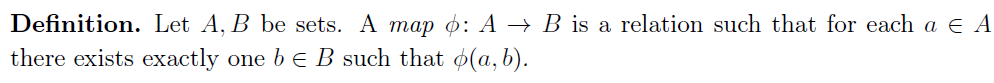
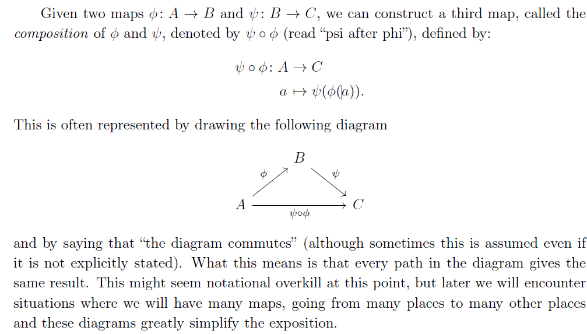
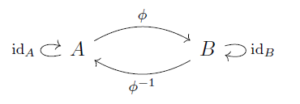
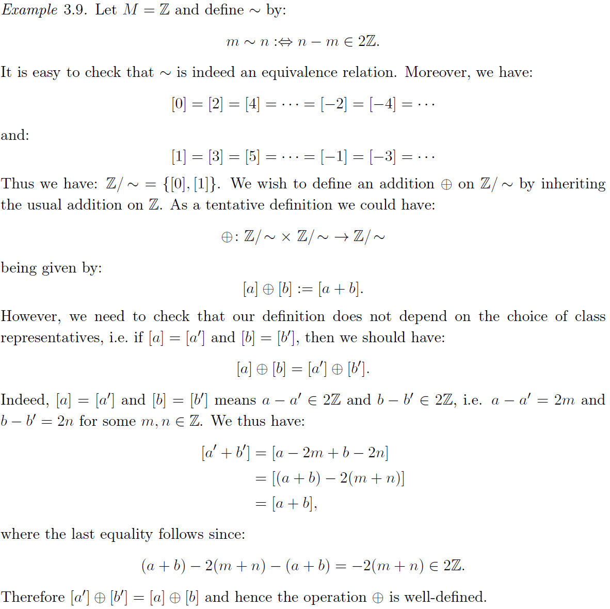
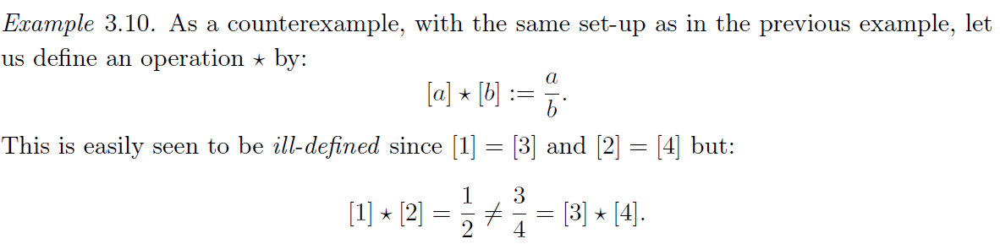

# Chap1 基础集合论

## 基本逻辑

### Proposition

::: tip proposition

A proposition p is a variable that can take the values true (T) or false (F), and no others.
:::

[^1]

一个 proposition 如果一直是 true 被称为 *tautology*，反之被称为 *contradiction*

在一些 proposition 基础上，可以通过不同的 *logical operator* 来构造新的 proposition。有 4 种 unary operator，将其真值表列在下面：

| p   | $\lnot p$ | id(p) | $\top{p}$ | $\bot{p}$ |
| --- | --------- | ----- | --------- | --------- |
| F   | T         | F     | T         | F         |
| T   | F         | T     | T         | F          |

考虑 2 元的运算符 (binary operator )，基本的有 3 种：

| p   | q   | $p\land q$ | $p \lor q$ | $p \veebar q$ |
| --- | --- | ---------- | ---------- | ------------- |
| F   | F   | F          | F          | F             |
| F   | T   | F          | T          | T             |
| T   | F   | F          | T          | T             |
| T   | T   | T          | T          | F             |

除了上面的 3 个 binary operator (*and or exclusive*)，还有 2 个常用的运算符：

| p   | q   | $p \Rightarrow q$ | $p \Leftrightarrow q$ |
| --- | --- | ----------------- | --------------------- |
| F   | F   | ==T==               | T                     |
| F   | T   | T               | F                     |
| T   | F   | F                 | F                     |
| T   | T   | T                 | T                      |

注意到上面的 $\Rightarrow$ 在前提条件为 False 的情况下会直接得出 True 的结论，这也就是俗语”Ex falso quod libet”

::: info theorem
p, q are propositions, then:
$\left( p\Rightarrow q \right) \Leftrightarrow \left( \left( \lnot q \right) \Rightarrow \left( \lnot p \right) \right)$
:::

^1-1-proposition-false

Hint: 使用真值表可以显然地证明

### Predicate Logic

::: tip definition
A predicate logic is (informally) a proposition-valued function of some variable or variables. In particular, a predicate of two variables is called a *relation*
:::

^def-predicate-logic-relation

Note that just like propositional logic, it’s not the task of predicate logic to examine how predicates are built from the variables on which they depend.

As with propositions, we can construct new predicates from given ones by using the operators define in the previous section. For example, we might have:

$$
Q\left( x,y,z \right) :\Leftrightarrow P\left( x \right) \land R\left( y,z \right) 
$$

Actually, we can write propositions from predicates, like:

$$
\forall x:\quad P\left( x \right) 
$$

is a proposition , which we read as “for all x, P of x(is true)”.

By define the $\forall$ operator, we can the define $\exists$ operator as :

$$
\exists x:P\left( x \right) :\Leftrightarrow \lnot \left( \forall x:\lnot P\left( x \right) \right) 
$$

::: danger corollary
Let $P(x)$ be a predicate. Then:

$$
\forall x:P\left( x \right) \Leftrightarrow \lnot \left( \exists x: \lnot P\left( x \right) \right) 
$$

:::

This can be seen from [^1-1-proposition-false](./#^1-1-proposition-false)

::: details example
Let P(x,y) be a predicate. Then, for fixed y, P(x,y) is a predicate of one variable and we define:

$$
Q\left( y \right) :\Leftrightarrow \forall x:P\left( x,y \right) 
$$

Hence we have the following:

$$
\exists y:\forall x:P\left( x,y \right) :\Leftrightarrow \exists y:Q\left( y \right) 
$$

:::

::: note remark
**the order of quantification matters**

$$
\exists y:\forall x:P\left( x,y \right) \qquad \forall x:\exists y:P\left( x,y \right) 
$$

are not necessarily equivalent
:::

## 集合论公理

### The $\in$ -relation
we give 9 axioms and above them define $\in$ and sets

using the $\in$ -relation we can define the following relation:
- $x\notin y:\Leftrightarrow \lnot \left( x\in y \right)$
- $x\subseteq y:\Leftrightarrow \forall a:\left( a\in x\Rightarrow a\in y \right)$
- $x=y\Leftrightarrow \left( x\subseteq y \right) \land \left( y\subseteq x \right)$
- $x\subset y:\Leftrightarrow \left( x\subseteq y \right) \land \lnot \left( x=y \right)$

::: note remark
A comment about the notation. Since $\in$ is a relation(predicate), for consistency of notation we need to write as $\in(x,y)$. However, we define:

$$
x\in y :\Leftrightarrow \in(x,y)
$$

:::

### Zermelo-Fraenkel Axioms of Set Theory

##### Axiom on the $\in$ -relation

::: tip Axiom on the $\in$ -relation

The expression $x\in y$ is a **proposition** if and only if **both x and y are sets**, in symbols:

$$
\forall x:\forall y:\left( x\in y \right) \veebar \lnot \left( x\in y \right) 
$$

:::

*We remarked, previously, that it is not the task of predicate logic to inquire about the nature of the variables on which predicates depend*

this axiom seems trival, but it tells us when something is not a set:

::: details Russell's paradox

Suppose that there is some u which has the following property:

$$
\forall x:\left( x\notin x\Leftrightarrow x\in u \right) 
$$

ie. *u contains all the sets that are not elements of themselves, and no others.*  We wich to determine whethere u is a set or not. In order to do so, consider the expression $u\in u$. If u is a set then, by the first axiom , $u\in u$ is a proposition.

However, we will show that it is not the case.

1. Suppose first that $u\in u$ is true. Then $\lnot \left( u\notin u \right)$ is true and thus $u$ does not satisfy the condition for being an element of u, and hence is not an element of u. Thus:

$$
u\in u\Rightarrow \lnot \left( u\in u \right) 
$$

and this is a contradiction. Therefore, $u\in u$ cannot be ture. 

2. Then, if it is a proposition, it must be false. However, if $u\notin u$, then u satisfy the condition for being a member of u and thus:

$$
u\notin u\Rightarrow \lnot \left( u\notin u \right) 
$$

which is, again, a contradictio\n. Therefore, $u \in u$ does not have the property of being either true or false and hence it is not a proposition. Thus, **our first axiom implies taht u is not set**, for if it were, then $u\in u$ would be a proposition.
:::

##### Axiom on the Existence of an Empty Set

::: tip axiom on the existence of an empty Set

There exists a set that contains no elements. In symbols: 

$$
\exists y:\forall x:x\notin y
$$

:::

Notice that the use of **an** above. we have all the tools to prove that there is only one empty set, and hence we do not this to be an axiom.

##### Axiom on Pair Sets

::: tip axiom on pair sets

Let x and y be sets. Then there exists a set that contains as its elements precisely x and y. In symbols:

$$
\forall x:\forall y:\exists m:\forall u:\left( u\in m\Leftrightarrow \left( u=x\lor u=y \right) \right) 
$$

:::

The set m is called the pair of set x and y and it is denoted by $\left\{x,y\right\}$.

Note that in our definition, the choose order doesn’t effect the result, i.e. , if we swap x and y to obtain $\left\{y,x\right\}$, the pair set remains unchanged.

Indeed, by definition, we have:

$$
\left( a\in \left. \left\{ x,y \right. \right\} \Rightarrow a\in \left. \left\{ y,x \right. \right\} \right) \land \left( a\in \left. \left\{ y,x \right. \right\} \Rightarrow a\in \left. \left\{ x,y \right. \right\} \right) 
$$

independently of a, hence

$$
\left( \left. \left\{ x,y \right. \right\} \subseteq \left. \left\{ y,x \right. \right\} \right) \land \left( \left. \left\{ y,x \right. \right\} \subseteq \left. \left\{ x,y \right. \right\} \right) \Rightarrow \left. \left\{ x,y \right. \right\} =\left. \left\{ y,x \right. \right\} 
$$

This means **the pair set $\left\{x,y\right\}$ is unordered pair.**

However, using the axiom on pair sets, it is also possible to define an *ordered pair* $(x,y)$ such that $(x,y)\neq (y,x)$. The definition is the following:

$$
\left( x,y \right) =\left( a,b \right) \Leftrightarrow x=a\land y=b
$$

One candidate which satisfies this property is $(x,y) := \left\{x,\left\{x,y\right\}\right\}$, which is a set by axiom of pair sets.

::: note remark
The pair set axiom also gurantees the existence of one-element sets, called *singletons*.
:::

##### Axiom on Union Sets

::: tip axiom on union sets

Let x be a set. Then there exists a set whose elements are precisely the elements of the elements of x. In symbols:

$$
\forall x:\exists u:\forall y:\left( y\in u\Leftrightarrow \exists s:\left( y\in s\land s\in x \right) \right) 
$$

the set u is denoted as $\cup x$

:::

it seems trival, eg. $a,b$ are sets, so because of [Axiom on Pair Sets](./#axiom-on-pair-sets), we know that $\left\{a\right\}, \left\{b\right\}$ are sets, and then $x:=\left\{\left\{a\right\}, \left\{b\right\}\right\}$ is a set again by the [Axiom on Pair Sets](./#axiom-on-pair-sets). So the expression

$$
\cup x = \left\{a,b\right\}
$$

is a set by union axiom.

You mat argue that one can construct such set just by the pair set axiom, because that a, b are already set. However, consider the situation which have more than 2 elements, the union axiom is useful.

::: details example
let a, b, c are sets, we could immediately concluded that $\left\{b,c\right\}$ is a set by the pair set axiom. Then $\left\{a\right\}$ and $\left\{b,c\right\}$ are sets and hence $x\,\,\coloneqq \left. \left\{ \left\{ a \right. \right\} ,\left. \left\{ b,c \right. \right\} \right\}$ is a set. Then the expression:

$$
\cup x\coloneqq \left. \left\{ a,b,c \right. \right\} 
$$

is a set by the union set axiom. This time the union set axiom is useful to construct such set, i.e. in order to use it meaningfully in conjuction with the [The in -relation](./#the-in--relation)
:::

Based on such spirit, we give following definition :

::: tip definition
Let $a_{1}, a_{2}, \cdots, a_{N}$ be sets. We define *recursively* for all $N\geq 2$ :

$$
\left. \left\{ a_1,a_2,\cdots ,a_{N+1} \right. \right\} \coloneqq \cup \left. \left\{ \left\{ a_1,a_2,\cdots ,a_N \right. \right\} ,\left. \left\{ a_{N+1} \right. \right\} \right\} 
$$

:::

::: note remark
Because the union set axiom requires the x need to be a **set**, so we cant take the union set of the sets that doesn’t contain themselves, i.e. the russell paradox. 
:::

##### Axiom of Replacement

::: tip Axiom of Replacement

Let R be a **functional relation ** and m be a set. The the **image of m under R** denoted by $\mathrm{im}_R\left( m \right)$ is again a set
:::

of course we need to define some new terms of above axiom.

::: tip funcional relation

A relation R is said to be functional if:

$$
\forall x:\exists !y:R\left( x,y \right) 
$$

:::

::: tip image of functional relation

Let m be a set and let R be a functional relation. The image of m under R consists of all those y for which there is an $x\in m$ such that $R(x,y)$
:::

Based on above axiom, we can give out one equivalent form:

::: info theorem
Let P(x) be a predicate, and let m be a set. Then elements $y\in m$ such that P(y) is true constitue a set, denoted by:

$$
\left. \left\{ y\in m|P\left( y \right) \right. \right\} 
$$

:::

with above form, we can give **intersection** and **complement** definition:

::: tip intersection

Let x be set. Then we define the intersection of x by:

$$
\cap x\coloneqq \left. \left\{ a\in \cup x|\forall b\in x:a\in b \right. \right\} 
$$

If $a,b\in x$ and $\cap x = \oslash$ and then a,b are said to be disjoint
:::

::: tip complement

Let u and m be sets such that $u \subseteq m$. Then the complement of u relative to m is defined as:

$$
m\setminus u\coloneqq \left. \left\{ x\in m|x\notin u \right. \right\} 
$$

:::

##### Axiom on the Existence of Power Sets

::: tip axiom on the existence of power sets

Let m be a set. Then there exists a set, denoted by $\mathcal{P} \left( m \right)$, whose elements are precisely the subsets of m. In symbols:

$$
\forall x:\exists y:\forall a:\left( a\in y\Leftrightarrow a\subseteq x \right) 
$$

:::

Some examples are as following:

::: details example
- 
$$
m=\left\{ a,b \right\} , \mathcal{P} \left( m \right) =\left\{ \oslash ,\left\{ a \right\} ,\left\{ b \right\} ,\left\{ a,b \right\} \right\} 
$$

- If somebody define $\left( a,b \right) \coloneqq \left\{ a,\left\{ a,b \right\} \right\}$, then the cartesian product $x\times y$ of two sets x and y, which is informally the set of all ordered pairs of elements of x and y, satisfies:

$$
x\times y\subseteq \mathcal{P} \left( \mathcal{P} \left( \cup \left\{ x,y \right\} \right) \right) 
$$

Hence, the existence of $x\times y$ as a set follows from the axioms on unions, pair sets, power sets and the principle of restricted comprehensions
:::

::: note note
上面这么写实际上是先给出了carestian product对元素的定义/在集合上的定义，然后对这个定义意义下的carestian product进行构造，得出了上面的基于公理的结果。如果不是按照这个结构构造的可能是不是就有问题？
:::

##### Axiom of Infinity

::: tip axiom of infinity

There exists a set that contains the empty set and, together with every other element y, it alos contains the set {y} as an element. In symbols:

$$
\exists x:\oslash \in x\land \forall y:\left( y\in x\Rightarrow \left\{ y \right\} \in x \right) 
$$

:::

Based on upon definition, since it contains $\oslash$, so $\{\oslash\} \in x$. Thus, we have:

$$
x=\left\{ \oslash ,\left\{ \oslash \right\} ,\left\{ \left\{ \oslash \right\} \right\} ,\cdots \right\} 
$$

we can introduce the following notation for the element of x:

$$
0\coloneqq \oslash ,1\coloneqq \left\{ \oslash \right\} ,2\coloneqq \left\{ \left\{ \oslash \right\} \right\} ,\cdots 
$$

::: danger corollary
The "set" $\mathbb{N} \coloneqq x$ is a set according to axiomatic set theoy
:::

::: note remark
- based on the definition of N, one can easily define real number with $\mathbb{R}\coloneqq \mathcal{P}(\mathbb{N})$
	- image the 2-dim table to form the real number
- The version of axiom of infinity tat we stated is first put forward by Zermelo. A more modern formulation is the following:
	- There exists a set that contains the emoty set and, together with every other element y, it also contains the set $y\cup \{y\}$ as an element:
	- 
$$
x\cup y\coloneqq \cup \left\{ x,y \right\} 
$$

	- In this sence, the natural numbers look like:
	- 
$$
\mathbb{N} \coloneqq \left\{ \oslash ,\left\{ \oslash \right\} ,\left\{ \oslash ,\left\{ \oslash \right\} \right\} ,\left\{ \oslash ,\left\{ \oslash \right\} ,\left\{ \oslash ,\left\{ \oslash \right\} \right\} \right\} ,\cdots \right\} 
$$

	- This is nicer for 2 reasons:
		- the natural number n is represented by an n-element set rather than a one-element set
		- it generalizes much more naturally to the system of transfinite ordinal numbers where the successor operation $s\left( x \right) =x\cup \left\{ x \right\}$ applies to transfinite ordinals as well as natural numbers

:::

##### Axiom of Choice

::: tip Axiom of Choice

Let x be a set whose element are non-empty and mutually disjoint. Then there exits a set y which contains exactly one element of each element of x. In symbols:

$$
\forall x:P\left( x \right) \Rightarrow \exists y:\forall a\in x:\exists !b\in a:a\in y
$$

where $P\left( x \right) \Leftrightarrow \left( \exists a:a\in x \right) \land \left( \forall a:\forall b:\left( a\in x\land b\in x \right) \Rightarrow \cap \left\{ a,b \right\} =\oslash \right)$

:::

::: note remark
notice that this axiom is independent of the other 8 axioms, which means that one could have set theory with/without the axiom of choice.

However, standard mathematics use this axiom of choice and hence so will we. There is a number of theorems that can only be proved by using the axiom of choice:
- every vector space has a basis
- there exists a complete system of representatives of an equivalence relation
:::

##### Axiom of Foundation

::: tip Axiom of Foundation

Every non-empty set x contains an element y that has none of its elements in common with x. In symbols:

$$
\forall x:\left( \exists a:a\in x \right) \Rightarrow \exists y\in x:\cap \left\{ x,y \right\} =\oslash 
$$

:::

An immdiate consequence of such axiom is that there is no set that contains itself as an element.

The totality of all these nine axioms are called ZFC set theory, which is a shoryhand for Zermelo-Fraenkel set theoy with the axiom of Choice.

- [Axiom on the in -relation](./#axiom-on-the-in--relation)
- [Axiom on the Existence of an Empty Set](./#axiom-on-the-existence-of-an-empty-set)
- [Axiom on Pair Sets](./#axiom-on-pair-sets)
- [Axiom on Union Sets](./#axiom-on-union-sets)
- [Axiom of Replacement](./#axiom-of-replacement)
- [Axiom on the Existence of Power Sets](./#axiom-on-the-existence-of-power-sets)
- [Axiom of Infinity](./#axiom-of-infinity)
- [Axiom of Choice](./#axiom-of-choice)
- [Axiom of Foundation](./#axiom-of-foundation)

## 集合分类

### 集合之间的映射

我们常常会利用映射 (特别是 structure preserving maps) 来研究空间的分类。

首先给出空间的简略理解：一个空间 (space) 通常是说一个具有某种结构的集合，这个结构通常是另外一些集合。

我们首先定义映射 (map)

很显然，关于 map 的一个直观的例子是:

$$
\begin{aligned}
	\mathrm{id}_M:&\phantom{=}M\rightarrow M\\
	&\phantom{=}m\mapsto m\\
\end{aligned}
$$

我们对一个映射 $\phi :A\rightarrow B$ 具有下面的术语简介：
- set A 被称为 domain of $\phi$ (定义域?)
- set B 被称为 target of $\phi$ (值域?)
- set $\phi \left( A \right) \equiv \mathrm{im}_{\phi}\left( A \right) \coloneqq \left\{ \phi \left( a \right) |a\in A \right\}$ 被称为 image of A under $\phi$ (像)

对 map 本身我们也可以整理出一些分类：

- injective(单射): $\forall a_1,a_2\in A:\phi \left( a_1 \right) =\phi \left( a_2 \right) \Rightarrow a_1=a_2$
- surjective(满射): $\mathrm{im}_{\phi}(A)=B$
- bijective(双射): is both injective and surjective

根据对 map 的定义，我们可以得到集合之间的第一个关系：isomorphic(set-theory ) / (同构) 堂堂登场！

::: tip isomorphic(set-theory )/同构

两个集合 A 和 B 被称为 isomorphic(set-theory )/(同构)，如果存在一个 **双射** $\phi: A\rightarrow B$. 在此意义下，我们将同构的两个集合表示为：$A\cong _{\mathrm{set}}B$.

:::

::: note remark
上面同构的意思，从bijective map的角度来看，朴素的说就是两个集合一样，一一对应

既然一一对应，也就是前面所说的"保持结构"的映射了，这对无限元素的集合也是适用的

:::

上面的 remark 提到了无限元素集合，那我们就得考虑什么是无限元素的集合？如果有无限元素的集合，他们之间是相似的吗？可以进行比较吗？

这就给出了下面的定义：

::: tip 无限元素集合和有限元素集合

一个集合是无限的 (infinite)：如果存在一个真子集 (proper subset) $B\subset A$ 使得 $B\cong_{\mathrm{set}}A$. 更进一步的，如果 A 是无限的，那么：
- 可数无穷 (countably infinite): $A\cong_{\mathrm{set}} \mathbb{N}$
- 不可数无穷 (uncountably infinite): 其余的 infinite set

有限集合：不是无限集合。一般的，我们可以有 $A\cong _{\mathrm{set}}\left\{ 1,2,\cdots ,N \right\}$，其中 $N\in \mathbb{N}$，我们称集合 A 的 cardinality(势) 为 $|A|\coloneqq N$

:::

### 映射之间的关系

考虑到多个映射之间的关系，我们可以定义映射的 composition:

不难证明，*映射的组合是可交换的*

在给出了映射的复合后，我们可以进一步研究 **映射的逆**：

::: tip 映射的逆

映射 $\phi: A\rightarrow B$ 是 **双射**，那么映射 $\phi$ 的逆 $\phi^{-1}$ 被 (唯一的) 定义为：

$$
\begin{array}{c}
	\phi ^{-1}\comp \phi =\mathrm{id}_A\\
	\phi \comp \phi ^{-1}=\mathrm{id}_B\\
\end{array}
$$

等价的可以使用这样的形式进行描述：

:::

::: note remark
注意上面的逆映射定义在双射上，而双射是一个很好的性质，很少有这样好的映射。我们在后面 (拓扑中) 会给出一些针对所有映射定义的“逆映射”

#todo 补充逆映射进一步定义
:::

::: tip pre-image

映射 $\phi :A\rightarrow B$，且 $V\subseteq B$，定义 **pre-image**(原像？)：

$$
\mathrm{preim}_{\phi}\left( V \right) \coloneqq \left\{ a\in A|\phi \left( a \right) \in V \right\} 
$$

:::

可以证明，pre-image 具有下面性质：

::: info theorem
映射$\phi: A\rightarrow B$, $U,V\subseteq B$, $C=\{C_{j}|j \in J\}\subseteq \mathcal{P}(B)$

1. $\mathrm{preim}_{\phi}\left( \oslash \right) =\oslash , \mathrm{preim}_{\phi}\left( B \right) =A$
2. $\mathrm{preim}_{\phi}\left( U\backslash \mathrm{V} \right) =\mathrm{preim}_{\phi}\left( U \right) \backslash \mathrm{preim}_{\phi}\left( V \right)$
3. 
$$
\begin{array}{c}
	\mathrm{preim}_{\phi}\left( \cup C \right) =\bigcup_{j\in J}{\mathrm{preim}_{\phi}\left( C_j \right)}\,\,\\
	\mathrm{preim}_{\phi}\left( \cap C \right) =\bigcap_{j\in J}{\mathrm{preim}_{\phi}\left( C_j \right)}\,\,\\
\end{array}
$$

:::

### 等价关系

[集合分类](./#集合分类) 中介绍了一些给集合进行分类的手段，那针对这些分类实际上是说这个类型中的元素是有相等的地方的，这就引出了抽象的：等价关系 (equivalence relation)

::: tip equivalence relation

M 是一个集合，$\sim$ 是一个 [关系(relation)](./)，满足:
- reflexivity(反身性): $\forall m\in M:m\sim m$
- symmetry(对称性): $\forall m,n\in M:m\sim n\Leftrightarrow n\sim m$
- transitivity(传递性): $\forall m,n,p\in M:\left( m\sim n\land n\sim p \right) \Rightarrow m\sim p$
称这样的关系 $\sim$ 为 M 上的 equivalence relation

:::

^def-equivalence-relation

根据上面的想法，一个等价关系如果作用在一个集合上，自然就可以划分出几类不同的子集，利用这一想法定义：

::: tip 等价类

$\sim$ 是集合M上的等价关系，对任意 $m\in M$，定义集合：

$$
\left[ m \right] \coloneqq \left\{ n\in M|m\sim n \right\} 
$$

为m的等价类(equivalence class)

:::

^def-equivalence-class

容易证明，这样的等价类具有下面的性质：
- $a\in \left[ m \right] \Rightarrow \left[ a \right] =\left[ m \right]$
- $either\,\,\left[ m \right] =\left[ n \right] \,\,or\,\,\left[ m \right] \cap \left[ n \right] =\oslash$

从而我们可以根据等价类划分集合 M：

::: tip 集合的商集

$\sim$ 是集合 M 上的等价关系，定义集合 M 相对 $\sim$ 的商集 (quotient set):

$$
M/\sim \coloneqq \left\{ \left[ m \right] |m\in M \right\} 
$$

实际上注意到 $[m]\subseteq \mathcal{P}(M)$, 从而可以更精准的表示为：

$$
M/\sim \coloneqq \left\{ \left[ m \right] \in \mathcal{P} \left( M \right) |m\in M \right\} 
$$

:::

::: note remark
- 根据 [Axiom of Choice](./#axiom-of-choice), 存在一个完整对等价关系 $\sim$ 的表述：存在一个集合 R 使得 $R\cong _{\mathrm{set}}M/\sim$
	- 原文：Due to the axiom of choice, there exists a complete system of representatives for $\sim$, i. e., a set R such that $R\cong _{\mathrm{set}}M/\sim$
- 在定义以商集作为 domain/定义域的映射时需要小心，为了保证映射是 well–defined，需要表明选取的映射和选取的商集的表示元素 (比如 $[m]$ 中的 m) 无关

:::

::: details example

:::

### 构造 N, Z, Q, R

注意到，根据 [Axiom of Infinity](./#axiom-of-infinity)，我们定义：

$$
\mathbb{N} \coloneqq \left\{ 0,1,2,\cdots \right\} 
$$

其中 $0\coloneqq \oslash , 1\coloneqq \left\{ \oslash \right\} , 2\coloneqq \left\{ \left\{ \oslash \right\} \right\} , \cdots$，在此基础上，我们期望能够构造更复杂的运算，一个基础的操作就是在 N 上定义加法

为了方便定义，首先引入一些辅助运算：

定义 successor map S on N (N 上的后继运算)：

$$
\begin{array}{c}
	S:\\
	\\
\end{array}\begin{array}{l}
	\mathbb{N} \rightarrow \mathbb{N}\\
	n\rightarrow \left\{ n \right\}\\
\end{array}
$$

此外，还要定义 predecessor map，注意其只定义在 $\mathbb{N} ^*\coloneqq \mathbb{N} \backslash \left\{ \oslash \right\}$ 上：

$$
\begin{array}{l}
	P:\mathbb{N} ^*\rightarrow \mathbb{N}\\
	\quad n\mapsto m\quad \mathrm{such} \mathrm{that} m\in n\\
\end{array}
$$

容易发现，$P(2)=P\left( \left\{ \left\{ \oslash \right\} \right\} \right) =\left\{ \oslash \right\} =1$.

将上面的操作重复多次可以得到：n 此后继运算：

$$
\begin{array}{l}
	S^n\coloneqq S\comp S^{P\left( n \right)}\quad \mathrm{if} n\in \mathbb{N} ^*\\
	S^0\coloneqq \mathrm{id}_{\mathbb{N} }\\
\end{array}
$$

从而我们可以定义 N 上的加法运算：

$$
\begin{array}{l}
	+:\mathbb{N} \times \mathbb{N} \rightarrow \mathbb{N}\\
	\quad \left( m,n \right) \mapsto m+n\coloneqq S^n\left( m \right)\\
\end{array}
$$

可以发现，我们定义的 N 上的加法运算具有 neutral element: 0

注意到目前我们定义的加法在 N 上不存在逆元，即 $m+n=0$，这促使我们拓展数域到 Z。为了扩展数域，首先定义 $N\times N$ 上的一个关系：

$\sim$ 是 $N\times N$ 上的一个关系，定义为：

$$
\left( m,n \right) \sim \left( p,q \right) :\Leftrightarrow m+q=p+n
$$

容易发现其满足 [ 等价关系性质](./)，也就是可以利用其划分集合，从而得到 Z 的定义：

$$
\mathbb{Z} \coloneqq \left( \mathbb{N} \times \mathbb{N} \right) /\sim 
$$

::: note remark
上面的定义的直觉实际上来自于定义的等价关系$\sim$实际上代表了减法：$(m,n)$基本上意思是$m-n$

从这个角度上来看，定义的$-1$可以表示为$(1,2),(2,3),(114514,114515)$都可以，而且$(1,2)\sim (2,3), (2,3)\sim (114514, 114515 )$
:::

在定义了 Z 后，回顾前面的教育我们会认为 N 是 Z 的子集，但是在我们这里从集合角度定义的 Z 和 N 这里，两个集合包含的元素完全不是可比的。为了得到上面那个直观理解，我们需要一个映射来证明这点：

$$
\begin{array}{c}
	s:\mathbb{N} \rightarrow \mathbb{N}\\
	n\mapsto \left[ \left( n,0 \right) \right]\\
\end{array}
$$

这一映射定义就表示其至少是一个 injective ，从而 N 包含于 Z

更进一步的，我们定义 $n\coloneqq \left[ \left( n,0 \right) \right] , -n\coloneqq \left[ \left( 0,n \right) \right]$ 来方便表示

从而我们可以从 N 上继承 + 到 Z 上：

$$
+_{\mathbb{Z}}\coloneqq \left[ \left( m,n \right) \right] +_{\mathbb{Z}}\left[ \left( p,q \right) \right] \coloneqq \left[ \left( m+p,n+q \right) \right] 
$$

可以自行验证满足 + 在 N 上的条件。

根据上面类似的需求，我们进一步拓展 Z 到 Q，依赖相似的操作：

$$
\mathbb{Q} \coloneqq \left( \mathbb{Z} \times \mathbb{Z} ^* \right) /\sim 
$$

其中 $\mathbb{Z} ^*\coloneqq \mathbb{Z} \backslash \left\{ 0 \right\}$，$\sim$ 是定义在 $\mathbb{Z} \times \mathbb{Z} ^*$ 上的 relation:

$$
\left( p,q \right) \sim \left( r,s \right) :\Leftrightarrow ps=qr
$$

::: note note
注意这里直接给出了Z上的乘法，但实际上需要进行定义的。也比较简单，直接按照加法的定义给出就可以了
:::

类似我们从 N→Z 的操作，我们将 Q 中的元素 表示为:

$$
\frac{2}{3}\coloneqq \left[ \left( 2,3 \right) \right] =\left[ \left( 4,6 \right) \right] =\cdots 
$$

类似的也可以证明 Z 嵌在 Q 中：

$$
\begin{array}{c}
	\mathbb{Z} \rightarrow \mathbb{Q}\\
	p\mapsto \left[ \left( p,1 \right) \right]\\
\end{array}
$$

将 + 扩展到 Q 上：

$$
\left[ \left( p,q \right) \right] +_{\mathbb{Q}}\left[ \left( r,s \right) \right] \coloneqq \left[ \left( ps+rq,qs \right) \right] 
$$

并给出乘法的定义：

$$
\left[ \left( p,q \right) \right] \cdot _{\mathbb{Q}}\left[ \left( r,s \right) \right] \coloneqq \left[ \left( pr,qs \right) \right] 
$$

现在最后一个数域 R。关于从 Z→R 的构造方法有很多，其中一个是定义一个集合 $\mathscr{A}$ 和 Z 几乎同态 (a set $\mathscr{A}$ of almost homomorphisms on $\mathbb{Z}$)，进一步可以定义：

$$
\mathbb{R} \coloneqq \mathscr{A} /\sim 
$$

其中 $\sim$ 是一个 $\mathscr{A}$ 上的”suitable”等价关系，相关链接可以参考 [^2][^3]

::: note note
关于 **almost homomorphism** 是什么以及如何自然的从 Z 构造 R 可以参考

目前还没看懂...

:::

## 参考

### 引文

- 

### 脚注

[^1]: By this we mean a formal expression, with no extra structure assumed.
[^2]: [elementary set theory - Constructing the reals using almost homomorphisms - Mathematics Stack Exchange](https://math.stackexchange.com/questions/2824879/constructing-the-reals-using-almost-homomorphisms#:~:text=As%20I%20currently%20understand%2C%20an%20almost%20homomorphism%20is,class%20of%20the%20set%20of%20all%20those%20functions.)
[^3]: [https://pub.math.leidenuniv.nl/~jongrsde/bachsem-2018/qh.pdf](https://pub.math.leidenuniv.nl/~jongrsde/bachsem-2018/qh.pdf)
