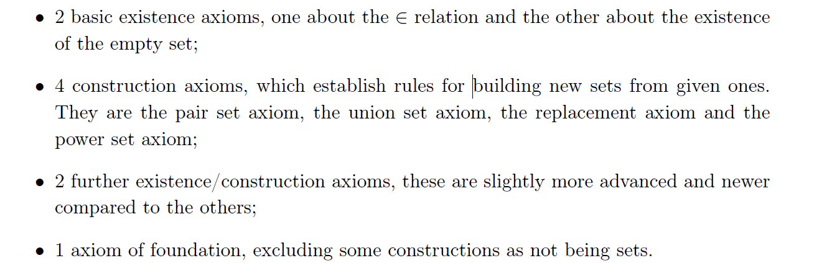

# Chap1 基础集合论

## 基本逻辑

### Proposition

::: tip proposition

A proposition p is a variable that can take the values true (T) or false (F), and no others.
:::

[^1]

一个 proposition 如果一直是 true 被称为 *tautology*，反之被称为 *contradiction*

在一些 proposition 基础上，可以通过不同的 *logical operator* 来构造新的 proposition。有 4 种 unary operator，将其真值表列在下面：

| p   | $\lnot p$ | id(p) | $\top{p}$ | $\bot{p}$ |
| --- | --------- | ----- | --------- | --------- |
| F   | T         | F     | T         | F         |
| T   | F         | T     | T         | F          |

考虑 2 元的运算符 (binary operator )，基本的有 3 种：

| p   | q   | $p\land q$ | $p \lor q$ | $p \veebar q$ |
| --- | --- | ---------- | ---------- | ------------- |
| F   | F   | F          | F          | F             |
| F   | T   | F          | T          | T             |
| T   | F   | F          | T          | T             |
| T   | T   | T          | T          | F             |

除了上面的 3 个 binary operator (*and or exclusive*)，还有 2 个常用的运算符：

| p   | q   | $p \Rightarrow q$ | $p \Leftrightarrow q$ |
| --- | --- | ----------------- | --------------------- |
| F   | F   | ==T==               | T                     |
| F   | T   | T               | F                     |
| T   | F   | F                 | F                     |
| T   | T   | T                 | T                      |

注意到上面的 $\Rightarrow$ 在前提条件为 False 的情况下会直接得出 True 的结论，这也就是俗语”Ex falso quod libet”

::: info theorem
p, q are propositions, then:
$\left( p\Rightarrow q \right) \Leftrightarrow \left( \left( \lnot q \right) \Rightarrow \left( \lnot p \right) \right)$
:::

^1-1-proposition-false

Hint: 使用真值表可以显然地证明

### Predicate Logic

::: tip definition
A predicate logic is (informally) a proposition-valued function of some variable or variables. In particular, a predicate of two variables is called a *relation*
:::

Note that just like propositional logic, it’s not the task of predicate logic to examine how predicates are built from the variables on which they depend.

As with propositions, we can construct new predicates from given ones by using the operators define in the previous section. For example, we might have:

$$
Q\left( x,y,z \right) :\Leftrightarrow P\left( x \right) \land R\left( y,z \right) 
$$

Actually, we can write propositions from predicates, like:

$$
\forall x:\quad P\left( x \right) 
$$

is a proposition , which we read as “for all x, P of x(is true)”.

By define the $\forall$ operator, we can the define $\exists$ operator as :

$$
\exists x:P\left( x \right) :\Leftrightarrow \lnot \left( \forall x:\lnot P\left( x \right) \right) 
$$

::: danger corollary
Let $P(x)$ be a predicate. Then:

$$
\forall x:P\left( x \right) \Leftrightarrow \lnot \left( \exists x: \lnot P\left( x \right) \right) 
$$

:::

This can be seen from [^1-1-proposition-false](./#^1-1-proposition-false)

::: details example
Let P(x,y) be a predicate. Then, for fixed y, P(x,y) is a predicate of one variable and we define:

$$
Q\left( y \right) :\Leftrightarrow \forall x:P\left( x,y \right) 
$$

Hence we have the following:

$$
\exists y:\forall x:P\left( x,y \right) :\Leftrightarrow \exists y:Q\left( y \right) 
$$

:::

::: note remark
**the order of quantification matters**

$$
\exists y:\forall x:P\left( x,y \right) \qquad \forall x:\exists y:P\left( x,y \right) 
$$

are not necessarily equivalent
:::

## 集合论公理

### The $\in$ -relation
we give 9 axioms and above them define $\in$ and sets

using the $\in$ -relation we can define the following relation:
- $x\notin y:\Leftrightarrow \lnot \left( x\in y \right)$
- $x\subseteq y:\Leftrightarrow \forall a:\left( a\in x\Rightarrow a\in y \right)$
- $x=y\Leftrightarrow \left( x\subseteq y \right) \land \left( y\subseteq x \right)$
- $x\subset y:\Leftrightarrow \left( x\subseteq y \right) \land \lnot \left( x=y \right)$

::: note remark
A comment about the notation. Since $\in$ is a relation(predicate), for consistency of notation we need to write as $\in(x,y)$. However, we define:

$$
x\in y :\Leftrightarrow \in(x,y)
$$

:::

### Zermelo-Fraenkel Axioms of Set Theory

##### Axiom on the $\in$ -relation

::: tip Axiom on the $\in$ -relation

The expression $x\in y$ is a **proposition** if and only if **both x and y are sets**, in symbols:

$$
\forall x:\forall y:\left( x\in y \right) \veebar \lnot \left( x\in y \right) 
$$

:::

*We remarked, previously, that it is not the task of predicate logic to inquire about the nature of the variables on which predicates depend*

this axiom seems trival, but it tells us when something is not a set:

::: details Russell's paradox

Suppose that there is some u which has the following property:

$$
\forall x:\left( x\notin x\Leftrightarrow x\in u \right) 
$$

ie. *u contains all the sets that are not elements of themselves, and no others.*  We wich to determine whethere u is a set or not. In order to do so, consider the expression $u\in u$. If u is a set then, by the first axiom , $u\in u$ is a proposition.

However, we will show that it is not the case.

1. Suppose first that $u\in u$ is true. Then $\lnot \left( u\notin u \right)$ is true and thus $u$ does not satisfy the condition for being an element of u, and hence is not an element of u. Thus:

$$
u\in u\Rightarrow \lnot \left( u\in u \right) 
$$

and this is a contradiction. Therefore, $u\in u$ cannot be ture. 

2. Then, if it is a proposition, it must be false. However, if $u\notin u$, then u satisfy the condition for being a member of u and thus:

$$
u\notin u\Rightarrow \lnot \left( u\notin u \right) 
$$

which is, again, a contradictio\n. Therefore, $u \in u$ does not have the property of being either true or false and hence it is not a proposition. Thus, **our first axiom implies taht u is not set**, for if it were, then $u\in u$ would be a proposition.
:::

##### Axiom on the Existence of an Empty Set

::: tip axiom on the existence of an empty Set

There exists a set that contains no elements. In symbols: 

$$
\exists y:\forall x:x\notin y
$$

:::

Notice that the use of **an** above. we have all the tools to prove that there is only one empty set, and hence we do not this to be an axiom.

##### Axiom on Pair Sets

::: tip axiom on pair sets

Let x and y be sets. Then there exists a set that contains as its elements precisely x and y. In symbols:

$$
\forall x:\forall y:\exists m:\forall u:\left( u\in m\Leftrightarrow \left( u=x\lor u=y \right) \right) 
$$

:::

The set m is called the pair of set x and y and it is denoted by $\left\{x,y\right\}$.

Note that in our definition, the choose order doesn’t effect the result, i. e, if we swap x and y to obtain $\left\{y,x\right\}$, the pair set remains unchanged.

Indeed, by definition, we have:

$$
\left( a\in \left. \left\{ x,y \right. \right\} \Rightarrow a\in \left. \left\{ y,x \right. \right\} \right) \land \left( a\in \left. \left\{ y,x \right. \right\} \Rightarrow a\in \left. \left\{ x,y \right. \right\} \right) 
$$

independently of a, hence

$$
\left( \left. \left\{ x,y \right. \right\} \subseteq \left. \left\{ y,x \right. \right\} \right) \land \left( \left. \left\{ y,x \right. \right\} \subseteq \left. \left\{ x,y \right. \right\} \right) \Rightarrow \left. \left\{ x,y \right. \right\} =\left. \left\{ y,x \right. \right\} 
$$

This means **the pair set $\left\{x,y\right\}$ is unordered pair.**

However, using the axiom on pair sets, it is also possible to define an *ordered pair* $(x,y)$ such that $(x,y)\neq (y,x)$. The definition is the following:

$$
\left( x,y \right) =\left( a,b \right) \Leftrightarrow x=a\land y=b
$$

One candidate which satisfies this property is $(x,y) := \left\{x,\left\{x,y\right\}\right\}$, which is a set by axiom of pair sets.

::: note remark
The pair set axiom also gurantees the existence of one-element sets, called *singletons*.
:::

##### Axiom on Union Sets

::: tip axiom on union sets

Let x be a set. Then there exists a set whose elements are precisely the elements of the elements of x. In symbols:

$$
\forall x:\exists u:\forall y:\left( y\in u\Leftrightarrow \exists s:\left( y\in s\land s\in x \right) \right) 
$$

the set u is denoted as $\cup x$

:::

it seems trival, eg. $a,b$ are sets, so because of [Axiom on Pair Sets](./#axiom-on-pair-sets), we know that $\left\{a\right\}, \left\{b\right\}$ are sets, and then $x:=\left\{\left\{a\right\}, \left\{b\right\}\right\}$ is a set again by the [Axiom on Pair Sets](./#axiom-on-pair-sets). So the expression

$$
\cup x = \left\{a,b\right\}
$$

is a set by union axiom.

You mat argue that one can construct such set just by the pair set axiom, because that a, b are already set. However, consider the situation which have more than 2 elements, the union axiom is useful.

::: details example
let a, b, c are sets, we could immediately concluded that $\left\{b,c\right\}$ is a set by the pair set axiom. Then $\left\{a\right\}$ and $\left\{b,c\right\}$ are sets and hence $x\,\,\coloneqq \left. \left\{ \left\{ a \right. \right\} ,\left. \left\{ b,c \right. \right\} \right\}$ is a set. Then the expression:

$$
\cup x\coloneqq \left. \left\{ a,b,c \right. \right\} 
$$

is a set by the union set axiom. This time the union set axiom is useful to construct such set, i.e. in order to use it meaningfully in conjuction with the [The in -relation](./#the-in--relation)
:::

Based on such spirit, we give following definition :

::: tip definition
Let $a_{1}, a_{2}, \cdots, a_{N}$ be sets. We define *recursively* for all $N\geq 2$ :

$$
\left. \left\{ a_1,a_2,\cdots ,a_{N+1} \right. \right\} \coloneqq \cup \left. \left\{ \left\{ a_1,a_2,\cdots ,a_N \right. \right\} ,\left. \left\{ a_{N+1} \right. \right\} \right\} 
$$

:::

::: note remark
Because the union set axiom requires the x need to be a **set**, so we cant take the union set of the sets that doesn’t contain themselves, i.e. the russell paradox. 
:::

##### Axiom of Replacement

::: tip Axiom of Replacement

Let R be a **functional relation ** and m be a set. The the **image of m under R** denoted by $\mathrm{im}_R\left( m \right)$ is again a set
:::

of course we need to define some new terms of above axiom.

::: tip funcional relation

A relation R is said to be functional if:

$$
\forall x:\exists !y:R\left( x,y \right) 
$$

:::

::: tip image of functional relation

Let m be a set and let R be a functional relation. The image of m under R consists of all those y for which there is an $x\in m$ such that $R(x,y)$
:::

Based on above axiom, we can give out one equivalent form:

::: info theorem
Let P(x) be a predicate, and let m be a set. Then elements $y\in m$ such that P(y) is true constitue a set, denoted by:

$$
\left. \left\{ y\in m|P\left( y \right) \right. \right\} 
$$

:::

with above form, we can give **intersection** and **complement** definition:

::: tip intersection

Let x be set. Then we define the intersection of x by:

$$
\cap x\coloneqq \left. \left\{ a\in \cup x|\forall b\in x:a\in b \right. \right\} 
$$

If $a,b\in x$ and $\cap x = \oslash$ and then a,b are said to be disjoint
:::

::: tip complement

Let u and m be sets such that $u \subseteq m$. Then the complement of u relative to m is defined as:

$$
m\setminus u\coloneqq \left. \left\{ x\in m|x\notin u \right. \right\} 
$$

:::

##### Axiom on the Existence of Power Sets

> P14

## 集合分类

## 参考

[^1]: By this we mean a formal expression, with no extra structure assumed.
