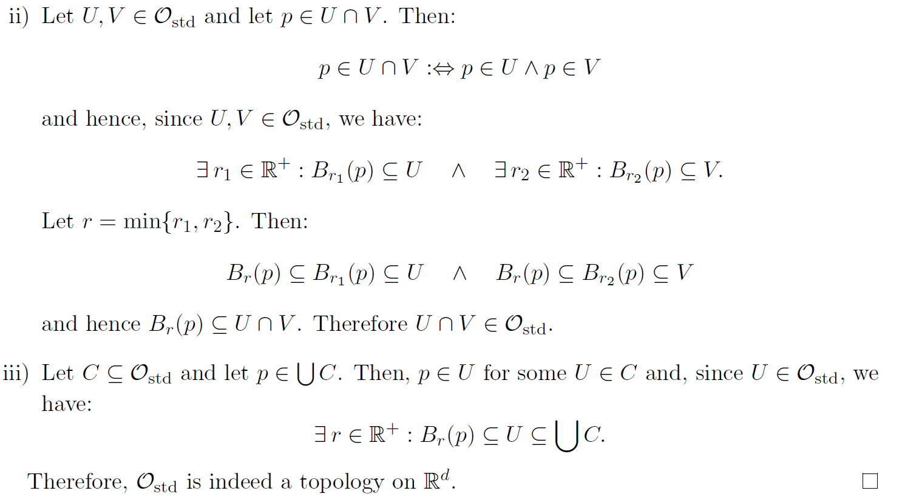

# Chap2 拓扑空间


## 拓扑空间定义和性质

### 什么事拓扑

::: note note
我们引入拓扑空间(topology space)的想法是：

一个几何上的拓扑给我们提供了一个具有下面2个性质的最弱的结构：
- 集合中点集的**收敛**(convergence of sequences to points in a set)
- 两个集合之间的映射的**连续性**(continuity of maps between 2 sets)

:::

^note-why-topo

::: tip 拓扑空间


集合 M 上定义一个拓扑 (topology) $\mathcal{O}$，为：$\mathcal{O} \subseteq \mathcal{P} \left( M \right)$ 且：
1. $\oslash \in \mathcal{O} \,\,\mathrm{and} M\in \oslash$
2. $\left\{ U,V \right\} \subseteq \mathcal{O} \Rightarrow \cap \left\{ U,V \right\} \in \mathcal{O}$
3. $C\subseteq \mathcal{O} \Rightarrow \cup C\in \mathcal{O}$

这个配对 $\left( M,\mathcal{O} \right)$ 就是我们所说的拓扑空间 (topology space).

:::

^def-topo

::: note remark
注意正如前面定义 N, Z, R 这些数域使用集合的角度来定义，这里的拓扑也是一个集合的角度来定义的。实际上我们所说的很多结构，都是一些具有特殊性质的集合

:::


::: note remark
除非 $|M|=1$, 一般来说对一个集合M我们有很多种选取拓扑的方法：

| 集合M的势 |拓扑数量|
| --- | -------- |
| 1   | 1        |
| 2   | 4        |
| 3   | 29       |
| 4   | 355      |
| 5   | 6942     |
| 6   | 209527   |
| 7   | 9535241  |

:::


::: note remark
- 假定 $M=\{a,b,c\}$，那么我们可以选取 $\mathcal{O} =\left\{ \oslash ,\left\{ a \right\} ,\left\{ b \right\} ,\left\{ a,b \right\} ,\left\{ a,b,c \right\} \right\}$ 就是一个可行的拓扑
- 假定 M 是一个集合，那么我们可以选取拓扑 $\mathcal{O} =\left\{ \oslash ,M \right\}$ 是一个合理的拓扑
	- 按照这样构造的拓扑被称为 **chaotic topology**，显然可以应用在任何集合上
- 假定 M 是一个集合，那么我们可以选取拓扑 $\mathcal{O} =\mathcal{P} \left( M \right)$
	- 这样构造的拓扑显然是合适的，我们称其为**discrete topology**
- 如果 $\mathcal{O} _1,\mathcal{O} _2$ 是集合M上的2个拓扑，如果 $\mathcal{O} _1\subset \mathcal{O} _2$，那么我们称 $\mathcal{O} _1$ 是比 $\mathcal{O} _2$ 更弱的(coarser/weaker topology). 等价的，我们称 $\mathcal{O} _2$ 是更强的(finer/stronger topology)
	- 显然chaotic topology 是最弱的，discrete topology是最强的
	- 后面展开讲[拓扑空间性质](./)的时候会明白为什么说最强/最弱
:::

^remark-chaotic-discrete-topo

### 拓扑空间性质展开


#### 集合开集

::: tip 开集


如果 $\left( M,\mathcal{O} \right)$ 是一个拓扑空间，那么可以定义 M 的子集 S 是 **开的**(open with respect to $\mathcal{O}$): 集合 $S\in \mathcal{O}$；反过来，子集 S 是闭的 (with respect to $\mathcal{O}$)，如果 $M\backslash S\in \mathcal{O}$(补集是开集)

:::

^def-open-set

::: note remark
很容易误解的一点是，*开集和闭集不是互斥的*，一个集合可以是开集也可以是闭集。此外，根据我们的定义，开集是*依赖于拓扑的*，相同的子集在不同的拓扑下可能会在开集和闭集之间变换
:::


::: details example
- $\left( M,\mathcal{O} \right)$ 是一个拓扑空间，$\oslash$ 是开的因为 $\oslash \in \mathcal{O}$。但是 $\oslash$ 也是闭的因为 $M\backslash \oslash = M \in \mathcal{O}$。对 M 也是一样的
- 假定 $M=\{a,b,c\}$，那么我们可以选取 $\mathcal{O} =\left\{ \oslash ,\left\{ a \right\},\left\{ a,b \right\} ,\left\{ a,b,c \right\} \right\}$，那么 $\left\{ a \right\}$ 是开的，但不是闭的， $\left\{ b \right\}$ 是既不是开的也不是闭的

:::


##### 标准拓扑

为了将拓扑更容易地应用到技术上，即定义在 $\mathbb{R}^d$ 上的 **标准拓扑 (standard topology)**，其中 $\mathbb{R}$ 为：


$$
\mathbb{R} ^d\coloneqq \underset{d\,\,\mathrm{times}}{\underbrace{\mathbb{R} \times \mathbb{R} \times \cdots \mathbb{R} }}
$$


我们给出一些辅助的定义：

::: tip 开球

对 $x\in \mathbb{R} ^d$ 且 $r\in \mathbb{R} ^+\coloneqq \left\{ s\in \mathbb{R} |s>0 \right\}$，我们定义在点 x 处的 **开球**(open ball)：


$$
B_r\left( x \right) \coloneqq \left\{ y\in \mathbb{R} ^d|\sqrt{\sum_{i=1}^d{\left( y_i-x_i \right) ^2}}<r \right\} 
$$


其中 $x\coloneqq \left( x_1,x_2,\cdots ,x_d \right)$ 而且 $y\coloneqq \left( y_1,y_2,\cdots ,y_d \right)$ 其中 $x_i,y_i\in \mathbb{R}$

:::

^def-open-ball

::: note remark
上面的 $\sqrt{\sum_{i=1}^d{\left( y_i-x_i \right) ^2}}$ 实际上是 2 范数，但考虑到范数的定义依赖于集合上的 **线性空间结构**，而我们还没有定义。不过我们这套定义的思路可以延展到不同的范数上去，*这些范数导出的开球导出的标准拓扑具有相同的结构*

:::


::: tip 标准拓扑


$\mathbb{R}^d$ 上的标准拓扑 $\mathcal{O} _{\mathrm{std}}$ 被定义为：


$$
U\in \mathcal{O} _{\mathrm{std}}:\Leftrightarrow \forall p\in U:\exists r\in \mathbb{R} ^+:B_r\left( p \right) \subseteq U
$$


:::

^def-standard-topo

直观上来看，我们定义的标准拓扑是说其中任取一个点，这个点周围可以构造一个开球，这个开球也在拓扑范围中。我们将证明，定义的标准拓扑 $\mathcal{O} _{\mathrm{std}}$ 和 $\mathbb{R} ^d$ 构成的 $\left( \mathbb{R} ^d,\mathcal{O} _{\mathrm{std}} \right)$ 是一个拓扑空间：

::: info theorem



:::


##### 从现有拓扑构造新的拓扑

###### Induced Topology

假设我们已经有了一个拓扑 $\left( M,\mathcal{O} \right)$，集合 $M$ 有子集 $N\subset M$，那么我们定义：


$$
\mathcal{O} |_N\coloneqq \left\{ U\cap N|U\in \mathcal{O} \right\} \subseteq \mathcal{P} \left( N \right) 
$$

^def-sub-top

可以证明，这是一个在 $N$ 上的拓扑，被称为**induced(subset) topology **


::: details example
考虑配备了 [标准拓扑](./) 的 $R$，考虑：


$$
N=\left[ -1,1 \right] \coloneqq \left\{ x\in \mathbb{R} |-1\leqslant x\leqslant 1 \right\} 
$$


那么根据 [子集拓扑](./) 定义，我们有 $\left( N,\mathcal{O} _{\mathrm{std}}|_N \right)$ 是一个拓扑空间。考虑集合 $(0,1]$，其在 $\left( \mathbb{R} ,\mathcal{O} _{\mathrm{std}} \right)$ 显然不是开集；然而，在 $\left( N,\mathcal{O} _{\mathrm{std}}|_N \right)$ 上：


$$
\left( 0,1 \right] =\left( 0,2 \right) \cap \left[ -1,1 \right] 
$$


这意味着 $\left( 0,1 \right] \in \mathcal{O} _{\mathrm{std}}|_N$，从而 $\left( 0,1 \right]$ 在 $\left( N,\mathcal{O} _{\mathrm{std}}|_N \right)$ 上是开集。集合，很神奇吧！


:::


###### Quotient Topology

::: note note
详细的介绍可以参考[^2]


:::


::: tip quotient topology


假设我们已经有了一个拓扑 $\left( M,\mathcal{O} \right)$，$\sim$ 是 M 上的一个等价关系，那么在 M 上可以定义等价类/商集：


$$
M/\sim =\left\{ \left[ m \right] \in \mathcal{P} \left( M \right) |m\in M \right\} 
$$


对商集我们按照 [Induced Topology](./#induced-topology) 类似的思路，装备拓扑：


$$
\mathcal{O} _{M/\sim}\coloneqq \left\{ U\in M/\sim |\left( \cup U \right) =\left( \bigcup_{\left[ a \right] \in U}{ a} \right) \in \mathcal{O} \right\} 
$$


针对上式的一个等价定义是：

考虑映射


$$
\begin{array}{c}
	q:M\rightarrow M/\sim\\
	m\mapsto \left[ m \right]\\
\end{array}
$$


新拓扑可以表示为：


$$
\mathcal{O} |_{M/\sim}\coloneqq \left\{ U\in M/\sim |\mathrm{preim}_q\left( U \right) \in \mathcal{O} \right\} 
$$


:::

^def-quotient-topo

这里的 quotient topology 定义确实看起来比较奇怪，可以参考 [^1] 进行解释：


想象我们有一个 $R$ 上的集合 $M\coloneqq [0,1]$，其继承了 R 上的标准拓扑。在这个集合上考虑一个简单的等价关系 $\sim$，其将这个集合划分为两类，一类为 2 点 $\{0,1\}$.

::: note note
literally 就只有这 2 个点，代表着这个拓扑空间 M 上的起点和终点，这个说法是想象我们是住在这个空间 M 上的生物，所谓的内蕴几何
:::


另一类是其余的 $\{x\in M|0<x<1\}$。显然这构成了一个等价类。考虑在这个商集上定义一个映射，可以将其 *一一映射* 到圆环上：


$$
h:\left[ 0,1 \right] /\sim \rightarrow S^1:p\mapsto \begin{cases}
	\left( \cos 2\pi x, \sin 2\pi x \right) ,\\
	\left( 1,0 \right) ,\\
\end{cases}\begin{array}{l}
	\mathrm{if} p=\left\{ x \right\}\\
	\mathrm{if} p=\left\{ 0,1 \right\}\\
\end{array}
$$


这显然是一个定义在该商集上的一一映射 (毕竟一共 2 个元素)，而对于这个商集来说，确实就和圆环构成了一一映射，表示这两个空间是同构的。

现在来看我们对 [quotient topology](./) 的定义。由于一共只有 2 个元素，首先对 $\{x\}$ 进行检验，有：


$$
\left( \cup \left\{ x \right\} \right) =\left( 0,1 \right) \in \mathcal{O} 
$$


这里的 $(0,1)$ 代表的是集合 M 的子集，确实是一个开集嘛，因此 $\left\{ x \right\} \in \mathcal{O} |_{M/\sim}$

对于元素 $\{0,1\}$ 进行检验：


$$
\left( \cup \left\{ 0,1 \right\} \right) =\left\{ 0,1 \right\} \notin \mathcal{O} 
$$


因为在 R 上不存在一个开集使得其交 $[0,1]$ 为其两端点，因此这表示这个 quotient topology 为：


$$
\mathcal{O} |_{M/\sim}=\left\{ \oslash ,M/\sim ,\left\{ x \right\} \right\} 
$$


一共这 3 个元素。

如果脱离我们 " 生活在 M 上的视角 "，将其放到圆环的角度来看。由于存在一一映射 h，表明这个商集和圆环是同构的，从而其上的拓扑可以完全一样的延展到圆环上。这样延展过去的拓扑是：


$$
h\left( \mathcal{O} |_{M/\sim} \right) =\left\{ \oslash ,S^1,S^1-\left( 1, 0\right) \right\} 
$$


这里的 $S^1-\left( 1, 0\right)$ 的意思是排除了 $(1,0)$ 点的圆环。


如果将圆环上的拓扑看成从 $R^2$ 上的标准拓扑继承下来的，那么其拓扑为圆环上所有圆弧的集合，显然包含了上面的拓扑，这也体现了视角的不同。


::: danger corollary
可以将商空间和quotient topology看成一个*弯折*的过程，在上面的例子中就是将线段首尾相接粘到一起。
:::


::: note note
更进一步的，参考[连续性](./#连续性)的定义后，我们定义的quotient topology实际上是使得变换h连续的最大拓扑，相关说理参考 [^1] ：


:::


::: details example
考虑一个圆环 (1-sphere) 集合：


$$
S^1\coloneqq \left\{ \left( x,y \right) \in \mathbb{R} ^2|x^2+y^2=1 \right\} 
$$


在其上装备继承于 $R^2$ 的标准拓扑。在该圆环上的开集就是一些开圆弧；在其上的单独的点显然不是开集，因为无法在 $R^2$ 上找到一个开集使其与该圆环只交于该点；但这样的单点是闭集，因为其补集是开圆弧，是开集。

针对上面这个圆环集合，还可以换一个角度考虑。考虑 $R$ 上的等价关系 $\sim$ ：


$$
x\sim y:\Leftrightarrow \exists n\in \mathbb{Z} :x=y+2\pi n
$$


那么这个圆环可以看成集合 $S^1\coloneqq \mathbb{R} /\sim$ 装备上其对应的 quotient topology

:::

^example-quotient-2

::: warning problem
#todo 
如果我们定义原集合M上的等价关系不是那么简单，参考[^example-quotient-2](./#^example-quotient-2)中的集合和等价关系，按照定义，其quotient topology似乎是[chaotic topology](./)?
:::


###### Product Topology

考虑 $\left( A,\mathcal{O}_A \right) ,\left( B,\mathcal{O}_B \right)$ 是 2 个拓扑空间，那么考虑 A 和 B 的笛卡尔积构成的新集合，给此新集合构造拓扑：


$$
\mathcal{O} _{A\times B}:\Leftrightarrow \forall p\in U:\exists \left( S,T \right) \in \mathcal{O} _A\times \mathcal{O} _A:S\times T\subseteq U
$$


具体解释参考：


::: note remark
这一product topology 很容易拓展到n-fold 的cartestian product 上，而这一结果的直接体现就是：


$$
\mathcal{O} _{\mathrm{std}}=\mathcal{O} _{\underset{d\,\,\mathrm{times}}{\underbrace{\mathbb{R} \times \mathbb{R} \times \cdots \times \mathbb{R} }}}
$$

:::


#### 收敛性


为了定义收敛性，我们首先定义所谓的序列：

假定 M 是一个集合，M 中的一个序列 (sequence of points) 是一个映射 $q:\mathbb{N}\rightarrow M$

据此我们给出收敛的定义：

::: tip Convergence


假定 $\left( M,\mathcal{O} \right)$ 是一个拓扑空间，称 M 中的一个序列 q 是收敛到一个极限点 a：


$$
\forall U\in \mathcal{O} :a\in U\Rightarrow \exists N\in \mathbb{N} :\forall n>N:q\left( n \right) \in U
$$


:::

^def-convergency

::: note note
本身这一定义就很想大一的极限定义：对极限点的任意开邻域，存在足够大的N，使得对序列的N之后的点其落在这个开邻域中
:::


现在我们将初步解答 [chaotic topology](./) 为什么这么“弱”, [discrete topology](./) 为什么这么”强“：

::: details example
考虑给 M 装备 chaotic topology $\left( M,\left\{ \oslash ,M \right\} \right)$，那么 *M 中的任何序列收敛到 M 中的任何点*，因为这个 chaotic topology 只有 1 个非空元素就是其本身

反过来，考虑装备 discrete topology$\left( M,\mathcal{P} \left( M \right) \right)$，那么 *只有基本上是常值的序列可以收敛*，因为可以考虑极限点 a 的一个开邻域 $\left\{ a \right\}$(这确实是开邻域，既是开的，又包含 a)，这意味着在足够大的 N 之后吗，序列就是 a

:::


::: details example
考虑一个集合 $\mathbb{R}$，在其上考虑一个序列 $q=1-\frac{1}{n+1}$，那么 q 不是基本常值，因此在 $\left( \mathbb{R} ,\mathcal{P} \left( \mathbb{R} \right) \right)$ 其不是收敛的，但是在 $\left( \mathbb{R} ,\mathcal{O} _{\mathrm{std}} \right)$ 上其是收敛的

:::


#### 连续性

::: tip continuity


$\left( M,\mathcal{O} _M \right) ,\left( N,\mathcal{O} _N \right)$ 是 2 个拓扑空间，且 $\phi :M\rightarrow N$ 是一个映射。那么我们说 $\phi$ 是 **连续的**(针对其对应的拓扑)，当且仅当：


$$
\forall S\in \mathcal{O} _N,\mathrm{preim}_{\phi}\left( S \right) \in \mathcal{O} _M
$$


其中 $\mathrm{preim}_{\phi}\left( S \right) \coloneqq \left\{ m\in M|\phi \left( M \right) \in S \right\}$ 是 S 在映射 $\phi$ 下的原相

总结来说，我们说映射$\phi$是连续的，当且仅当开集的原相也是开集

:::

^def-continuity

::: warning 我的理解


 #todo 
或许反过来说上面的定义可能就不对了(约束太强)。比如考虑 $M=R^2$, $N=R$，两者装备标准拓扑。映射 $\psi$ 在这个3维空间中是一根直线，那么根据连续性定义，其不是连续的？因为对N中的一个开集，其原相对应的是一个开线段，在 $R^2$ 的标准拓扑中似乎不是开的？

更进一步，考虑 $M=N=R$，映射 $\psi$ 是一个直线，比如y轴，那么类似的理由，逆映射是一个点，也不是开的。

这两点共同在于似乎降维了，不知道对不对。和我们一般的理解连续可能不太一样

注意上面的映射并不是在M上所有元素有定义，是不是不符合我们定义？因为一般我们会有$\mathrm{preim}_{\phi}\left( N \right) =M$这暗示我们*映射是在M上所有元素有定义的*
:::


::: details example
我们考虑 M 装备 discrete topology 或者 N 装备 chaotic topology，那么任意映射 $\psi:M\rightarrow N$ 都是连续的。


:::


#### 同胚

::: tip homeomorphism


我们考虑 $\left( M,\mathcal{O} _M \right) ,\left( N,\mathcal{O} _N \right)$ 是 2 个拓扑空间，有一个双射 $\phi :M\rightarrow N$ 是一个 **同胚**(homeomorphism)，如果：$\phi :M\rightarrow N$ 和 $\phi ^{-1}:N\rightarrow M$ 是连续的

:::

^def-homeomorphism

同胚是在拓扑意义下保持 *结构* 的变换，类似于集合意义上的双射，不过保持了更多的结构信息。


如果在 $\left( M,\mathcal{O} _M \right) ,\left( N,\mathcal{O} _N \right)$ 之间存在同胚，我们说这两个空间是同胚的 (homeomorphic) 或者说是拓扑同态的 (topologically isomorphic)，记为 $\left( M,\mathcal{O} _M \right) \text{≌}_{\mathrm{top}}\left( N,\mathcal{O} _N \right)$

### 拓扑空间上的不变量

我们说不变量意思是说，两个 [homeomorphic](./) 的 space 共享这一个性质.

#### 拓扑空间的分离性质

::: tip T1


我们称一个拓扑空间 $\left( M,\mathcal{O} \right)$ 是 T1 的，如果对任意两个 M 中的不同的点 $p\neq q$ ：


$$
\exists U\left( p \right) \in \mathcal{O} :q\notin U\left( p \right) 
$$


这里的 $U(p)$ 代表一个包含 p 的开邻域。

:::

^def-T1-topo

::: tip T2/hausdorff


我们称一个拓扑空间 $M, \mathcal{O}$ 是 T2 的 (Hausdorff)，果如 M 中任意两个不同的点 $p\neq q$ ：


$$
\forall p,q\in M,p\ne q\Rightarrow \exists U\left( p \right) ,V\left( q \right) \in \mathcal{O} :U\left( p \right) \cap V\left( q \right) =\oslash 
$$


:::

^def-T2-topo

容易发现，标准 d 维空间 $\left( R^d,\mathcal{O} _{\mathrm{std}} \right)$ 是 T2 的，因此是 T1 的；拓扑空间 $\left( M,\left\{ \oslash ,M \right\} \right)$ 不是 T1 也不是 T2 的。

::: note remark
除了T1, T2之外，还有很多Tx，比如 $T2\frac{1}{2}$ 和T2很想，只不过邻域是闭的
:::


::: note note
并不是说是T1的一定是T2，比如Zariski topology on an algebraic variety 是T1的而不是T2的
:::


#### 紧性和仿紧性


::: tip cover


对一个拓扑空间 $(M, \mathcal{O})$，称一个集合 $C\subseteq \mathcal{P}(M)$ 是集合 M 的一个覆盖 (cover):


$$
\cup C=M
$$


更进一步，如果 $C\subseteq \mathcal{O}$，称 C 是一个开覆盖 (open cover)

:::

^def-cover

::: tip subcover

针对 cover C，如果其中有一个子集 $\tilde{C}\subseteq C$ 使得 $\tilde{C}$ 也是一个覆盖，那么将 $\tilde{C}$ 称为一个子覆盖 (subcover)。如果这个子集 $\tilde{C}$ 是有限的 (作为集合 [Axiom of Infinity](./Chap1-基础集合论.md#axiom-of-infinity))，称是一个有限子覆盖

:::

^def-subcover

在上面两个基础上，我们可以定义拓扑空间的 **紧性**：

::: tip compact

一个拓扑空间 $(M, \mathcal{O})$ 是紧的 (compact)，如果任何一个开覆盖存在有限子覆盖

:::

^def-compact

根据 [Induced Topology](./#induced-topology) 的思想，我们自然会研究其上子集的紧性：

::: tip definition
如果拓扑空间 $(M, \mathcal{O})$ 是拓扑空间，$N\subseteq M$ 被称为紧的，如果拓扑空间 $(N,\mathcal{O}|_N)$ 是紧的


:::


从紧性的定义来看，其涉及到一个存在性的证明，一般而言是不易证明的。但是，针对装备了标准拓扑的 $R^d$ 而言，可以通过简单的判断方法决定其是否是紧的：

::: info Heine-Borel


假定 $R^d$ 装备了标准拓扑 $\mathcal{O}_{\mathrm{std}}$，那么 $R^d$ 的一个子集是紧的，当且仅当其是闭的且有界的 (closed and bounded)

这里的有界指的是：$\exists r\in \mathbb{R} ^+:S\subseteq B_r\left( 0 \right)$

:::


对上面的结论，也可以推广到任意的度量空间 (metric space)。

::: tip metric space


我们说一个度量空间是一个组 (pair)：(M,d)，其中 M 是一个集合，$d:M\times M\rightarrow \mathbb{R}$ 是一个映射，对 $\forall x,y,z\in M$ 有：
- $d\left( x,y \right) \geqslant 0$
- $d\left( x,y \right) =0\Leftrightarrow x=y$
- $d\left( x,y \right) =d\left( y,x \right)$
- $d\left( x,y \right) \leqslant d\left( x,z \right) +d\left( z,y \right)$


:::

^def-metrix-space

::: note remark
对带有度量的集合 M，可以按照前面 [标准拓扑](./#标准拓扑) 的思路构造开球，从而得到拓扑


$$
U\in \mathcal{O} _d:\Leftrightarrow \forall p\in U:\exists r\in \mathbb{R} ^+:B_r\left( p \right) \subseteq U
$$


其中开球定义为：


$$
B_r\left( p \right) \coloneqq \left\{ x\in M|d\left( p,x \right) <r \right\} 
$$


在此意义下，我们可以证明，度量空间 $(M,d)$ 的子集 $S\subseteq M$ 是紧的，当且仅当其是 complete 的且有界的。

:::


关于这个的讨论可以参考 [泛函分析](.//) 和一些博客 [^3][^4]

::: details example


注意例子5.7中的$(-1,2)$确实是一个单元素集合：$\{(-1,2)\}\in \mathcal{O}$，是R上标准拓扑的一个单元素子集，是开集，其势=1，因此是有限的
:::


研究了子集的紧性后，还是按照延展拓扑性质的思想，考虑笛卡儿积的紧性：

::: info theorem
假设 $(M,\mathcal{O}_M)$ 和 $(N,\mathcal{O}_N)$ 是 2 个紧的拓扑空间，那么装备了[Product Topology](./#product-topology)的笛卡尔积空间$\left( M\times N, \mathcal{O} _{M\times N} \right)$是一个紧的拓扑空间

:::


因为紧性是一个相当强的条件，很多时候我们没办法保证空间具有这个性质，因此退而求其次我们考虑一些更弱的性质。从而引出 refinemet 的定义：

::: tip refinement


假设 $(M,\mathcal{O})$ 是一个拓扑空间，C 是一个覆盖。A refinement of C 是一个覆盖 R 使得：


$$
\forall U\in R:\exists V\in C:U\subseteq V
$$


:::


直觉上来看，R 确实可以说的 C 的一个“精炼”，我们前面定义的子覆盖就是 refinement 的一个特例，但是反过来并不一定。

refinement 可以具有一些特性：
- 开的：如果 refinement R 满足 $R\subseteq \mathcal{O}$
- locally finite：如果任意 $p\in M$ 存在一个开邻域 $U\left( p \right)$ 使得集合 $\left\{ V\in R|V\cap U\left( p \right) \ne \oslash \right\}$ 是有限的

根据上面的性质，可以提出 **paracompact** 的定义：

::: tip paracompact


一个拓扑空间 $(M,\mathcal{O})$ 是 paracompact 的，如果：任意开覆盖具有一个 open refinement 而且其是 locally finite 的

:::

^def-paracompact

::: danger corollary
如果一个拓扑空间是紧的，那么他也是paracompact的
:::


如果使用 paracompact 的定义，我们很难进行分析，因此给出下面一个简单的判断准则。

::: info Stone


任何metrisable space 都是 paracompact的


其中 metrisable space 定义为：

一个拓扑空间 $(M, \mathcal{O})$ 是 metrisable 的，如果存在一个度量 d 使得其导出的拓扑就是 $\mathcal{O}$，也即 $\mathcal{O}=\mathcal{O}_d$

:::


::: details example
举例来说，我们知道 $\left( \mathbb{R} ^d,\mathcal{O} _{\mathrm{std}} \right)$ 是 metrisable 的，因为其对应度量 $\|\cdot\|_2$，从而其是 paracompact 的。

:::


paracompactness 是一个非常普遍的性质，以至于找到的不具有这个性质的空间都是 " 人工雕琢 " 的，其中一个例子是 *long line(Alexandroff line)*。为了构造这一空间，我们首先注意到可以通过 $\mathbb{Z} \times \left[ 0,1 \right)$ 来构造 $\mathbb{R}$，而这个 long line L 就是被定义为：$w_1\times \left[ 0,1 \right)$，其中 $\omega_1$ 是一个不可数的无限集合。

---

现在我们有了 paracompact 和 compact，可以开始研究两者之间的关系了：

- 一个 paracompact 空间 $(M,\mathcal{O}_M)$ 和 compact 空间 $(N, \mathcal{O}_N)$，考虑 $M\times N$ 装备上 product topology, 可以证明结果是 paracompact 的
- 这意味着，paracompact 是可传染的…


假设 $(M,\mathcal{O}_M)$ 是拓扑空间，定义 M 上的 **partition of unity** 是一个集合 F，其中包含的是从 M 到区间 $[0,1]$ 的连续映射，且对 $\forall p\in M$ 满足：
- 存在开邻域 $U(p)$ 使得集合 $\left\{ f\in \mathcal{F} |\forall x\in U\left( p \right) :f\left( x \right) \ne 0 \right\}$ 是有限的
- $\sum_{f\in \mathcal{F}}{f\left( p \right) =1}$

如果 C 是一个开覆盖，称 $\mathcal{F}$ 是 **subordinate** to the cover C，如果：

$$
\forall f\in \mathcal{F} :\exists U\in C:f\left( x \right) \ne 0\Rightarrow x\in U
$$


关于这一点的讨论可以参考 [^5]

::: note remark


定义 partition of subordinate实际上是为了后面定义积分来做的，重点在于finite上来避免convergency的讨论

:::


通过上面定义的 partition of unity 和 subordinate，我们可以更快的判断一些特殊空间是不是 paracompact 的：

::: info theorem
假设 $(M,\mathcal{O}_M)$ 是一个 [Hausdorff](./) 拓扑空间，那么 $(M,\mathcal{O}_M)$ 是 paracompact 的当且仅当任何开覆盖 admits a partition of unity subordinate to that cover


:::


::: details example

:::


::: note note
感觉有种分段讨论的意思，可以将不同部分分开看？说不清楚...
:::


#### Connectedness And Path-connectedness

从直觉上我们可以给出连通的定义：

::: tip connectedness


一个拓扑空间是连通的，除非存在 2 个非空、不相交的 **开集**A,B 使得：$M=A\cup B$

:::

^def-connect

::: note note
注意既然是开集，那么连通与否自然和拓扑选取有关，比如我们选取chaotic topology, 那么所有的空间都是连通的

> 移动：我有话说

考虑 $\left\{ \mathbb{R} \backslash \left\{ 0 \right\} ,\mathcal{O} _{\mathrm{std}}|_{\mathbb{R} \backslash \left\{ 0 \right\}} \right\}$，这个拓扑空间不是连通的，因为可以找到 2 个不相交的非空开集：$(-\infty, 0)$ 和 $(0,\infty)$ 满足条件


:::


根据定义，容易发现，一个拓扑空间 $(M, \mathcal{O})$ 是连通的，当且仅当其既开又闭的子集仅为：$\oslash, M$

拓展定义，考虑定义：**path-connectedness**

::: tip path-connectedness


一个拓扑空间 $(M, \mathcal{O})$ 被称为 path-connectedness, 如果任何一对点 $p, q \in M$，存在一条连续的曲线 $\gamma :\left[ 0,1 \right] \rightarrow M$ 使得 $\gamma \left( 0 \right) =p$，$\gamma \left( 1 \right) =q$。这里的连续性在 [^def-continuity](./#^def-continuity) 中定义

:::

^def-path-connectedness

`::: note remark
path-connectedness 是比 connectedness 更强的性质，连通的不一定可以找到这样的连续曲线，比如：

考虑 $S\coloneqq \left\{ \left( x,\sin \frac{1}{x} \right) |x\in \left( 0,1 \right] \right\} \cup \left\{ \left( 0,0 \right) \right\}$，且装备了从 $R^2$ 继承的拓扑，那么 $\left( S,\mathcal{O} _{\mathrm{std}}|_S \right)$ 是连通的，但不是 path-connectedness

:::
functionplot
---
title: test
xLabel: 
yLabel: 
bounds: [0,1,-1,1]
disableZoom: false
grid: true
---
f(x)=sin(1/x)
```

````


#### Homotopic Curves and the Fundamental Group

::: tip definition
考虑 $(M,\mathcal{O})$ 中的 2 条曲线， $\gamma ,\delta :\left[ 0,1 \right] \rightarrow M$ 使得：


$$
\gamma \left( 0 \right) =\delta \left( 0 \right) \quad \gamma \left( 1 \right) =\delta \left( 1 \right) 
$$


且存在一个连续映射 $h:[0,1]\times [0,1]\rightarrow M$，使得对所有的 $\lambda\in [0,1]$:


$$
h(0,\lambda)=\gamma(\lambda)\quad h(1,\lambda)=\delta(\lambda)
$$

称这两条曲线是 **homotopic/同伦**


:::

^def-homotopic

容易发现，同伦其实是一种 *等价关系*，那么我们可以在任意的拓扑空间上定义其对应的等价类，这就可以诱导出某种不变量。为此我们先定义 Space of loops

::: tip space of loops


考虑拓扑空间 $(M, \mathcal{O})$, 对 M 中的所有点 $p\in M$ 定义 **space of loops**

$$
\mathscr{L} _p\coloneqq \left\{ \gamma :\left[ 0,1 \right] \rightarrow M|\gamma \,\,\mathrm{is continious and} \gamma \left( 0 \right) =\gamma \left( 1 \right)=p \right\} 
$$


:::

^def-space-of-loop

在 space of loops 上，我们定义 concatenation 连接操作 (某种意义上的加法？)：


$$
*:\mathscr{L} _p\times \mathscr{L} _p\rightarrow \mathscr{L} _p
\\
\left( \gamma *\delta \right) \left( \lambda \right) \coloneqq \begin{cases}
	\gamma \left( 2\lambda \right)\\
	\delta \left( 2\lambda -1 \right)\\
\end{cases}\quad \begin{array}{c}
	\mathrm{if} 0\leqslant \lambda \leqslant \frac{1}{2}\\
	\mathrm{if} \frac{1}{2}\leqslant \lambda \leqslant 1\\
\end{array}\quad
$$


从而我们可以导出一个等价类：

::: tip fundamental group


考虑 $(M,\mathcal{O})$ 是拓扑空间，定义该空间的 p 点的 fundamental group $\pi_{1}(p)$ 是集合：


$$
\pi _1\left( p \right) \coloneqq \mathscr{L} _p/\sim =\left\{ \left[ \gamma \right] |\gamma \in \mathscr{L} _p \right\} 
$$


这里的等价关系 $\sim$ 指的是 homotopic(同伦)

在fundamental group上附带一个运算：


$$
\begin{array}{c}
	\bullet :\pi _1\left( p \right) \times \pi _1\left( p \right) \rightarrow \pi _1\left( p \right)\\
	\quad \left( \gamma ,\delta \right) \mapsto \left[ \gamma \right] \bullet \left[ \delta \right] \coloneqq \left[ \gamma * \delta \right]\\
\end{array}
\\

$$


:::

^def-fundamental-group

::: note remark
注意，我们说一个群是一个集合附带一个 (双目) 运算构成的 pair$(G,\bullet)$：

- $\forall a,b,c\in G:\left( a\bullet b \right) \bullet c=a\bullet \left( b\bullet c \right)$
- $\exists e\in G:\forall g\in G:g\bullet e=e\bullet g=g$
- $\forall g\in G:\exists g^{-1}\in G:g\bullet g^{-1}=g^{-1}\bullet g=e$

此外，如果可交换 $a\bullet b=b\bullet a :\forall a,b\in G$ ，那么称这个群是阿贝尔群 (abelian/commutative)

类似集合的同构，可以定义群的 isomorphism：

在两个群 $(G,\bullet)$ 和 $(H,\circ)$ 之间的 group isomorphism 是一个双射 $\phi: G\rightarrow H$ 使得：


$$
\forall a,b\in G:\phi \left( a\bullet b \right) =\phi \left( a \right) \circ \phi \left( b \right) 
$$


如果 2 个群 $(G,\bullet)$ 和 $(H,\circ)$ 之间存在 group isomorphism，我们称这两个群是 isomorphic(group)，记为：


$$
G\cong _{\mathrm{grp}}H
$$


参考 [Chap2 群](./../线性代数/抽象代数基础教程/Chap2-群.md)

:::


考虑一个 2-sphere(球面) 为:


$$
S^2\coloneqq \left\{ \left( x,y,z \right) \in \mathbb{R} ^3|x^2+y^2+z^2=1 \right\} 
$$


其上装备了从 $R^3$ 上继承的拓扑。

该球面具有性质：任意一个点的任意 loop 都是 homotopic 的，从而我们知道在该球面上的 fundamental group(在任意点出) 是：


$$
\forall p\in S^2:\pi _1\left( p \right) =1\coloneqq \left\{ \left[ \gamma _e \right] \right\} 
$$


考虑一个无限长圆柱 $C\coloneqq \mathbb{R} \times S^1$，装备了 [Product Topology](./#product-topology).


在 C 上的 loop 可以分为 2 种：绕着中心轴的，或者不绕中心轴的 (可以被连续地变形为一个点)。我们称绕着圆柱的次数为 *winding number*，具有不同 winding number 的 loop 是不同伦的

进一步，我们可以给出其 fundamental group 的结构:


$$
\forall p\in C:\left( \pi _1\left( p \right) ,\bullet \right) \cong _{\mathrm{grp}}\left( \mathbb{Z} ,+ \right) 
$$


考虑更复杂
的结构：2-torus：$T^2\coloneqq S^1\times S^1$，其上装备了 product topology：


类似地可以发现，其 fundamental group 可以表示为：


$$
\forall p\in T^2:\left( \pi _1\left( p \right) ,\bullet \right) \cong _{\mathrm{grp}}\left( \mathbb{Z} \times \mathbb{Z} ,+ \right) 
$$


其中 $\mathbb{Z}\times \mathbb{Z}$ 上的 + 是 pairwise addition.


## 参考

##### 引文
##### 脚注

[^1]: [metric spaces - Understanding quotient topology - Mathematics Stack Exchange](https://math.stackexchange.com/questions/366281/understanding-quotient-topology#:~:text=The%20quotient%20topology%20is%20exactly%20the%20one%20that,not%20sure%20exactly%20what%20you%20want%20to%20know.%29)
[^2]: [https://faculty.etsu.edu/gardnerr/5210/notes/Munkres-22.pdf](https://faculty.etsu.edu/gardnerr/5210/notes/Munkres-22.pdf)
[^3]: [怎么通俗的理解有界闭集，紧集，列紧集？ - 知乎](https://www.zhihu.com/question/58904993)
[^4]: [（I）Banach空间和不动点定理 3: 紧性 - 知乎](https://zhuanlan.zhihu.com/p/26519111)
[^5]: [怎么理解拓扑的仿紧性？ - 知乎](https://www.zhihu.com/question/400483716)
