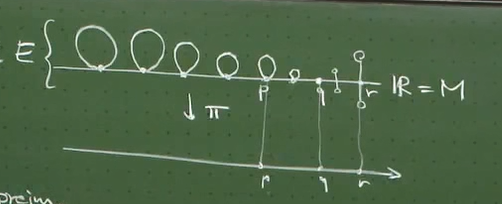

# Chap3 Topological manifolds and bundles

## 拓扑流形和 Bundle

### Manifold

::: tip manifold

一个 [paracompact](./Chap2-拓扑空间.md), [Hausdorff](./Chap2-拓扑空间.md) 的拓扑空间 $(M,\mathcal{O})$ 被称为 **d-dimensional(topological) manifold** 如果：

对 M 中任意点 $p\in M$，存在一个邻域 $U(p)$ 还有一个同胚 (homeomorphism)$x:U\left( p \right) \rightarrow x\left( U\left( p \right) \right) \subseteq \mathbb{R} ^d$。我们也表示为：$\text{dim} M=d$

:::

^def-manifold

直观上来看，一个 d 维拓扑流形指的是一个 (任意点) 局部类似于 $R^d$ 的拓扑空间。

::: note note
注意，我们目前实际上看到的是实拓扑流形，如果要考虑复的情形，只需要将同胚x改成映射到$C^d$上的开集就可
:::

::: info theorem
考虑 M 是一个 d 维拓扑流形，$U,V\subseteq M$ 且是开的，相交的 $U\cap V\ne \oslash$。如果 x，y 是 2 个 homeomorphism，且：

$$
\begin{array}{c}
	x:U\rightarrow x\left( U \right) \subseteq \mathbb{R} ^d\\
	y:V\rightarrow y\left( V \right) \subseteq \mathbb{R} ^{d'}\\
\end{array}
$$

那么 $d=d'$

:::

这个定理告诉我们，dimension 这个概念定义是没问题的，即 well-defined。它在任意一点 (任意连通的部分的一点) 上是相同的

类似定义子拓扑空间的思路，我们也可以定义子流形：

::: tip definition
$(M,\mathcal{O})$ 是一个拓扑流形，$N\subseteq M$，那么 $\left( N,\mathcal{O} |_N \right)$ 被称为 $(M,\mathcal{O})$ 的一个子流形 (如果它本身是一个流形)

:::

^def-sub-manifold

一些简单的关于子流形的例子：

- $S^1$ 是 $R^2$ 的子流形
- $S^2,C,T^2$ 是 $R^3$ 的子流形

同样的，拓扑空间可以 product，那么拓扑流形也可以这么操作：

::: tip definition
$\left( M,\mathcal{O} _M \right)$ 和 $\left( N,\mathcal{O} _N \right)$ 是 2 个维数为 m 和 n 的流形，那么 $\left( M\times N,\mathcal{O} _{M\times N} \right)$ 是一个维数为 $m+n$ 的流形

:::

^def-product-manifold

举例来说，我们有：

- $T^2=S^{1}\times S^1$ (可以证明其不仅是拓扑空间，还是拓扑流形)；进一步：$T^n\coloneqq \underset{n\,\,\mathrm{times}}{\underbrace{S^1\times S^1\times \cdots S^1}}$ 是一个 n 维流形
- $C=S^1\times \mathbb{R}$ 是一个 2 维流形

### Bundle

一点题外话，在 **物理** 中经常用到 Product 这个操作，直观上来看，两个流形的 product 可以看成在第一个流形的每一点上粘上另一个流形的复制，但是并不是所有的流形都可以看成流形的 prouct，一个经典的例子就是莫比乌斯环：很像是 $S^{1}\times[0,1]$ 但是被扭曲了一面，从而和圆柱完全不同

::: tip bundle

一个拓扑流形的 bundle 是一个三元组: $(E,\pi, M)$ 其中 E 和 M 是拓扑流形，分别记为 total space 和 base space，$\pi$ 是一个 [连续的](./Chap2-拓扑空间.md) 满射 $\pi: E\rightarrow M$，被称为 projection map

我们通常记 bundle $(E,\pi,M)$ 为 $E\xrightarrow{\pi}M$

:::

^def-bundle

::: tip fibre

bunlde$E\xrightarrow{\pi}M$，M 上存在一点 $p\in M$，那么称 $F_p\coloneqq \mathrm{preim}\left( \left\{ p \right\} \right)$ 为在 p 点的 fibre

:::

^def-fibre

直观上来看，在 p 点的 fibre 是 E 中 (通过映射 $\pi$) 连接到 p 点的点集 $F_{p}$

一个直观的 bundle 是 product bundle，可以通过 product manifold 构造：

$$
\begin{array}{c}
	\pi :M\times N\rightarrow M\\
	\left( p,q \right) \mapsto p\\
\end{array}
$$

从而得到 bundle $\left( M\times N,\pi ,N \right)$

根据我们的定义，bundle 是比 product 更宽泛的结构，可以通过下面例子解释：

::: details example
考虑 total space E 为莫比乌斯环，M 是 circle ($S^1$)，如下图示意：

 

其中这个矩形代表未折叠的莫比乌斯环，可以发现这是一个 bundle 但不是一个 product

:::

^example-mobius-bundle

bunlde 可以具有更奇怪的结构，一个 manifold 上可以具有完全不同的 bundle:

::: details example

观察这个 bundle 对应的 fibre：

$$
F_p:=\operatorname{preim}_\pi(\{p\}) \cong{ }_{\mathrm{top}} \begin{cases}S^1 & \text { if } p<0 \\ \{p\} & \text { if } p=0 \\ {[0,1]} & \text { if } p>0\end{cases}
$$

:::

::: tip fibre bundle

$E\xrightarrow{\pi}M$ 是一个 bundle，F 是一个流形，那么称 $E\xrightarrow{\pi}M$ 是一个 fibre bundle(纤维丛)，with (typical) fibre F，如果：

$$
\forall p \in M: \text{preim}_{\pi}(\{p\})\cong_{\text{top}}F
$$

可以将一个纤维丛表示为：

$$
\begin{array}{r}
	F\longrightarrow E\\
	\downarrow ^{\pi}\\
	M\\
\end{array}
$$

:::

^def-fibre-bundle

从定义上来看，这个定义直观上就是把 fibre 具象化出来，可以参考示例：

- $M\times N\xrightarrow{\pi}M$ 是一个 fibre bundle，with fibre $F\coloneqq N$
- 莫比乌斯带是一个 fibre bundle: $E\xrightarrow{\pi}S^1, F\coloneqq \left[ 0,1 \right]$，其中 $E\neq S^{1}\times [0,1]$

::: tip section

考虑 $E\xrightarrow{\pi}M$ 是一个 bundle，映射 $\sigma: M\rightarrow E$ 是一个 (cross-)section of the bundle，如果：

$$
\pi\circ \sigma = \text{id}_{M}
$$

:::

^def-section

直观上来看，一个 section 是一个映射 $\sigma$ 可以将 base space 中的每个点 P 送到 E 中的纤维 $F_{p}$ 上的某个点 $\sigma(p)$ 处，从而有 $\sigma(p)\in F_{p} \subseteq E$ 可以通过 $\pi$ 回到 $p\in M$

还是用最简单的 product bundle 来说明，考虑 product bundle $(M\times F, \pi, M)$ ，那么这个 Bundle 的 section 是这样一个映射：

$$
\begin{array}{c}
	\sigma :M\rightarrow M\times F\\
	p\mapsto \left( p,s\left( p \right) \right)\\
\end{array}
$$

其中 $s:M\rightarrow F$ 是任意一个映射

在完成了 bundle 的定义后，考虑子流形上的 bundle：

::: tip sub-bundle

一个 bundle $(E,\pi, M)$ 的 sub-bundle 是一个三元组 $(E',\pi',M')$，其中 $E'\subseteq E,M'\subseteq M$ 是子流形，$\pi '\coloneqq \pi |_{E'}$

:::

^def-sub-bundle

为了引出 bundle 之间的同构，我们补充定义 restricted bundle:

::: tip restricted bundle

一个 bundle $(E,\pi, M)$，$N\subseteq M$ 是一个子流形，那么 restricted bundle (to N) 是一个三元组 $(E,\pi',N)$ 其中：

$$
\pi '\coloneqq \pi |_{\mathrm{preim}_{\pi}\left( N \right)}
$$

:::

^def-restricted-bundle

现在我们可以考虑 bundle 之间的同构了：

::: tip bundle morphism

有 $E\xrightarrow{\pi}M$ 和 $E’\xrightarrow{\pi'}M'$ 是 bundle，考虑映射 $u: E\rightarrow E'$ 和 $v: M\rightarrow M'$，称二元组 $(u,v)$ 是一个 bundle morphism 下面的映射成立：

$$
\pi'\circ u=v\circ \pi
$$

或者说：

$$
\begin{matrix}
	E&		\xrightarrow{u}&		E'\\
	\downarrow \pi&		&		\downarrow \pi '\\
	M&		\xrightarrow{v}&		M'\\
\end{matrix}
$$

:::

^def-bundle-morphism

容易证明，如果存在 2 个 bundle morphism $(u,v)$ 和 $(u,v')$，那么 $v=v'$ (但是 u 不一样似乎就没办法了)。这表明，如果 u 确定了，那么使得 (u,v) 是 Bundle morphism 的 v 是唯一的

在上面的 bundle morphism 基础上，我们可以构造 bundle 之间的同构 (isomorphism)

::: tip bundle isomorphism

两个 bundle $E\xrightarrow{\pi}M$ 和 $E'\xrightarrow{\pi'}M'$ 被称为 isomorohic(as bundles) 如果存在 bundle morphism $(u,v)$ 和 $(u^{-1},v^{-1})$ 使得：

$$
\begin{matrix}
	E&		\xleftrightharpoons[u^{-1}]{u}&		E'\\
	\downarrow \pi&		&		\downarrow \pi '\\
	M&		\xleftrightharpoons[v^{-1}]{v}&		M'\\
\end{matrix}
$$

这样的 $(u,v)$ 被称为 bundle isomorphism，我们记为：$E\xrightarrow{\pi}M\cong _{\mathrm{bdl}}E'\xrightarrow{\pi '}M'$

:::

^def-bundle-isomorphism

::: note note
正如前面各种isomorphism所表示的，bundle isomorphism是对bundle保持结构不变的映射
:::

全局的 isomorphic 可能要求比较苛刻，我们可以考虑局部的 isomorphic：

::: tip locally isomorohic

我们称一个 bundle $E\xrightarrow{\pi}M$ 是 locally isomorohic (as a bundle) to a bundle $E'\xrightarrow{\pi'}M'$，如果对任意点 $p\in M$ 有邻域 $U(p)$ 使得 [restricted bundle](./)：

$$
\mathrm{preim}_{\pi}\left( U\left( p \right) \right) \xrightarrow{\pi |_{\mathrm{preim}\left( U\left( p \right) \right)}}U\left( p \right) 
$$

和 bundle $E'\xrightarrow{\pi'}M'$ 是 isomorphic 的

:::

^def-locally-bundle-isomorphism

由于 product bundle 的简单性质，我们可以将与之 isomorphic 的 bundle 都提出来，记
bundle $E\xrightarrow{\pi}M$ 是

- trivial，如果其和一个 product bundle 同构
- locally-trivial，如果和 product bundle locally isomorphic

可以发现，我们之前定义的 [莫比乌斯映射](./) 是 locally trivial 的但不是 trivial 的，而 Cylinder C 则是 trivial 的

::: note note
在我们的应用种，我们一般考虑的是*locally trivial bundles*
:::

::: tip pull-back bundle

考虑 $E\xrightarrow{\pi}M$ 是一个 bundle，f 是从一个流形 M’出发的映射，$f: M'\rightarrow M$。定义从 bundle $E\xrightarrow{\pi}M$ 使用 映射 f 诱导出的 pull-back bundle：$E'\xrightarrow{\pi'}M'$ ：

$$
E'\coloneqq \left\{ \left( m',e \right) \in M'\times E|f\left( m' \right) =\pi \left( e \right) \right\} 
$$

且$\pi '\left( m',e \right) \coloneqq m'$

:::

^def-pull-back-bundle

从定义中可以看出来，这就是一个 product bundle 的形式，我们可以很轻松的构建出 bundle morphism：

$$
\begin{matrix}
	E'&		\xrightarrow{u}&		E\\
	\downarrow ^{\pi '}&		&		\downarrow ^{\pi}\\
	M'&		\xrightarrow{f}&		M\\
\end{matrix}
$$

其中 $u: E'\rightarrow E$ 就是一个投影映射：$(m',e)\mapsto e$

注意到我们构造的 pull-back bundle 是 trivial 的 product bundle，从而我们可以很容易的得到其上的 section 的形式，如下 [式子](./) 所示：

$$
\begin{matrix}
	E'&		\xrightarrow{u}&		E\\
	^{\sigma '}\uparrow \downarrow ^{\pi '}&		^{\sigma \circ f}\nearrow&		^{\sigma}\uparrow \downarrow ^{\pi}\\
	M'&		\xrightarrow{f}&		M\\
\end{matrix}
$$

^eqn-pull-back-bundle-section

其中 $u$ 和 $\pi'$ 都是二元组 $(m',e)$ 的 projection 映射。对 bundle $E\xrightarrow{\pi}M$ 上的 section $\sigma$，考虑映射 $\sigma \circ f$，其构成了一个 $M'$ 到 $E$ 的映射。注意到：

$$
\pi \left( \sigma \left( f\left( m' \right) \right) \right) =\left( \pi \circ \sigma \circ f \right) \left( m' \right) =f\left( m' \right) 
$$

根据 [^def-pull-back-bundle](./#^def-pull-back-bundle) 的 $E'$ 的构造定义，$(m',\sigma(f(m')))\in E'$，而又考虑到我们构造的 $\pi'(m',e)=m'$，从而在 pull-back bundle 上的 section 可以直接构造为：

$$
\begin{array}{l}
	\sigma ':M'\rightarrow E'\\
	m'\mapsto \left( m',\left( \sigma \circ f \right) \left( m' \right) \right)\\
\end{array}
$$

显然其满足 section 的定义，且也满足 $u\circ \sigma '=\sigma \circ f$

### Atlas & Manifold

::: tip chart of manifold

$(M,\mathcal{O})$ 是一个 d 维流形，称一个 pair $(U,x)$ 是该 Manifold 的 chart，其中 $U\in \mathcal{O}$, $x:U\rightarrow x\left( U \right) \subseteq \mathbb{R} ^d$ 是一个 [homeomorphism](./Chap2-拓扑空间.md)

称component functions(maps) of $x:U\rightarrow x(U)\subseteq \mathbb{R}^d$ 为：

$$
\begin{array}{l}
	x^i:U\rightarrow \mathbb{R}\\
	p\mapsto \mathrm{proj}_i\left( x\left( p \right) \right)\\
\end{array}
$$

其中$1\leqslant i\leqslant d$，而$\mathrm{proj}_i\left( x\left( p \right) \right)$是$x(p)$的第i个分量。我们称$x^{i}(p)$为点$p\in U$针对chart $(U,x)$的co-ordinates(坐标)

:::

^def-chart-of-manifold

在全局意义上我们可以将 chart 收集起来，从而得到了 **Atlas**

::: tip atlas

一个流形 M 的 atlas 是一个 chart 的集合：

$$
\mathscr{A} \coloneqq \left\{ \left( U_{\alpha},x_{\alpha} \right) |\alpha \in \mathcal{A} \right\} 
$$

且满足：

$$
\bigcup_{\alpha \in \mathcal{A}}{U_{\alpha}}=M
$$

:::

^def-atlas

显然不同的 chart 之间会有 overlap，在 Overlap 中的点在不同的 chart 下会有不同的坐标，这就是我们希望研究的：

::: tip C0-compatible

两个 charts $(U,x)$ 和 $(V,y)$ 被称为 $C^0-compatible$ 的如果：

- 要么 $U\cap V=\oslash$
- 要么映射：$y\circ x^{-1}:x\left( U\cap V \right) \rightarrow y\left( U\cap V \right)$ 是 [continious](./Chap2-拓扑空间.md) 的

可以看成下面这样一个图成立：

:::

^def-C0-compatible

注意到映射 x, y 都是 homeomorphism，那么复合映射 $y\circ x^{-1}$ 也是 homorphism，从而必定是 continuous 的，这意味着一个流形上的任意 2 个 chart 都是 C0-compatible 的

我们称一个流形上的 $C^0-altas$ 是所有 C0-compatible 的 chart 的集合，那么任何 atlas 都是 C0-atlas

从名字就可以看出来，后面还会有 Ck-compatible 这类的定义 (实际上就是 differentiability)

我们称一个 C0-atlas $\mathscr{A}$ 是一个 maximal atlas 如果：对任意 chart $(U,x)\in \mathscr{A}$，我们有：所有的和 $(U,x)$ C0-compatible 的 chart $(V,y)$ 都属于 $\mathscr{A}$，即 $(V,y)\in \mathscr{A}$ 。 ^c172db

显然，不是所有的 C0-atlas 都是 maximal atlas，比如考虑流形 $\left( \mathbb{R} ,\mathcal{O} _{\mathrm{std}} \right)$，atlas 为 $\mathscr{A} \coloneqq \left( \mathbb{R} ,\mathrm{id}_{\mathbb{R}} \right)$，那么这就不是一个 maximal atlas，因为考虑 chart $\left( \left( 0,1 \right) ,\mathrm{id}_{\mathbb{R}} \right)$ 是和 $\left( \mathbb{R} ,\mathrm{id}_{\mathbb{R}} \right)$ C0-compatible 的，但是并不在 $\mathscr{A}$ 中

在有了 atlas 之后，我们终于可以跳出 manifold 观察物体了，现在分析问题就可以从 manifold 上或者利用 atlas 从 $R^d$ 上分析了。举例来说，考虑研究一个 curve $\gamma: \mathbb{R}\rightarrow M$ 是否为连续的：

- 从 manifold 上，我们有以往的定义，即 curve $\gamma: \mathbb{R}\rightarrow M$ 是否为连续的依赖于映射 $\gamma$ 是否是从拓扑空间 $\mathbb{R}$ 到拓扑空间 $M$ 的连续的映射
- 使用 atlas 可以有我们更加熟悉的结果：

我们首先考虑空间 M 的一个开子集，并将映射 $\gamma: \mathbb{R}\rightarrow M$ 替换，考虑复合映射：

$$
x\circ \gamma :\mathrm{preim}_{\gamma}\left( U \right) \rightarrow x\left( U \right) \subseteq \mathbb{R} ^d
$$

现在我们更希望直接 check 新的欧式空间 $\mathbb{R}^d$ 上的曲线是不是连续的，即每个分量的连续性。

这么做把问题转换到了熟悉的欧式空间中，方便我们计算，但也存在问题：如果选取了 2 个 chart 怎么办？

[Chap3 Topological manifolds and bundles 2022-09-04 11](.//)

如上图，可以使用简单的映射完成转换。更“抽象”地说，映射 $y\circ x^{-1}$ 实际上允许我们不依赖原流形 M 的结构 (比如 U, x, y) 来考虑问题，因为实际上这是 $R^d$ 之间的
映射。

## 参考

##### 引文
##### 脚注
