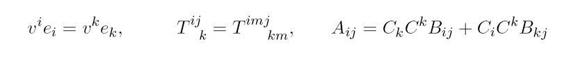
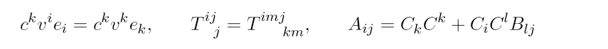
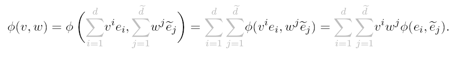
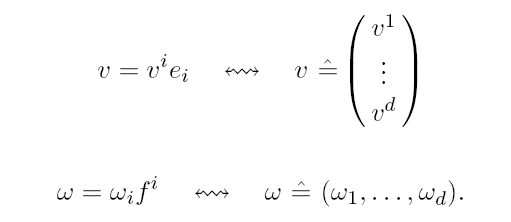
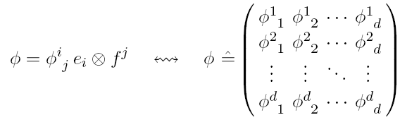

# Chap5 张量空间

## 什么事张量

### 向量空间和其对偶

详细的关于向量空间的介绍可以参考 [从线性映射理解线性代数](./README.md) 和 [抽象代数基础教程](./../线性代数/抽象代数基础教程/抽象代数基础教程.md)[抽象代数基础教程](./../线性代数/抽象代数基础教程/抽象代数基础教程.md)，这里给出一些简单的介绍

#### 域

::: tip field/域

一个 (algebraic) field 事一个三元组 $(K,+,\cdot)$，其中 K 是一个集合，$+,\cdot$ 是双目运算：$K\times K\to K$ 且满足下面性质：

1. $(K,+)$ 是一个阿贝尔群，即：
	1. $\forall a,b,c \in K: (a+b)+c=a+(b+c)$
	2. $\exists 0\in K: \forall a\in K: a+0=0+a=a$
	3. $\forall a\in K: \exists -a\in K:a+(-a)=(-a)+a=0$
	4. $\forall a,b \in K: a+b=b+a$
2. $(K^{*},\cdot)$，其中 $K^{*}\coloneqq K \backslash \left\{ 0 \right\}$，是一个阿贝尔群，即：
	1. $\forall a,b,c \in K^{*}: \left( a\cdot b \right)\cdot c=a\cdot(b\cdot c)$
	2. $\exists 1\in K^{*}: \exists a\in K^{*}:a\cdot 1=1\cdot a=a$
	3. $\forall a\in K^{*}: \exists a^{-1} \in K^* ：a\cdot a^{-1} = a^{-1}\cdot a =1$
	4. $\forall a,b \in K^*: a\cdot b=b\cdot a$
3. 映射 $+$ 和 $\cdot$ 满足分配律:
	9. $\forall a,b,c\in K: (a+b)\cdot c=a\cdot c+b\cdot c$

:::

^def-group-field

::: note remark
一个阿贝尔群是一个比较好的数学结构，与之相似的但是更弱的是环 (ring)，其虽然也是一个三元组，不需要性质 2.2,2.3,2.4。如果一个环满足性质 2.2，那么称其为 unital ring(单位环)，如果其满足性质 2.4，那么称其为 commutative ring(交换环)，我们一般考虑的是 unital ring，而且一般就称为 ring

:::

- 一个三元组 $(\mathbb{Z},+,\cdot)$ 是一个交换的单位环，然而其不是一个域 (field)，因为其中仅有 $1,-1$ 可以做逆运算 (性质 2.3)
- 集合 $\mathbb{Q},\mathbb{R},\mathbb{C}$ 装备常规的 $+,\cdot$ 就是一个域
- 实 $m\times n$ 矩阵 $M_{m\times n}(\mathbb{R})$ 是一个非交换的环

#### 向量空间

::: tip K-vector space

假定 $(K,+,\cdot)$ 是一个域，在 K 上的一个 K-vector space 被定义为一个三元组：$\left( V,\oplus ,\odot \right)$，其中 V 是一个集合，且：

$$

\begin{align}
\oplus:V\times V\to V \\
\odot:K\times V\to V
\end{align}

$$

满足：

- $(V,\oplus)$ 是一个阿贝尔群
- 映射 $\odot$ 是一个在 $(V,\odot)$ 上的对 K 的 action：
	- $\forall \lambda \in K:\forall v,w\in V:\lambda \odot (v \oplus w)=(\lambda \odot v)\oplus(\lambda \odot w)$
	- $\forall \lambda ,\mu \in K:\forall v\in V:\left( \lambda +\mu \right) \odot v=\left( \lambda \odot v \right) \oplus \left( \mu \odot v \right)$
	- $\forall \lambda ,\mu \in K:\forall v\in V:\left( \lambda \cdot \mu \right) \odot v=\lambda \odot \left( \mu \odot v \right)$
	- $\forall v\in V:1\odot v=v$

:::

^def-k-vector-space

vector space 也被称为 linear space，其中的元素被称为向量，域 K 中的元素被称为标量，映射 $\odot$ 被称为标量乘法 (scalar multiplication)

上面的定义和我们之前对线性代数的操作是兼容的，因此可以预见到一些剩余的定义：

::: tip 线性子空间

假定 $(V,\oplus,\odot)$ 是一个 K 上的线性空间，集合 $U\subseteq V$ 是非空的，那么我们可以构造线性子空间 $(U,\oplus|_{U\times U},\odot|_{K\times U})$ ：
- $\forall u_{1},u_{2}\in U:u_{1}\oplus u_{2} \in U$
- $\forall u\in U: \forall \lambda \in K: \lambda \odot u\in U$

也可以写为：$\text{if}~ \forall u_{1},u_{2}\in U: \forall \lambda \in K: (\lambda \odot u_{1})\oplus u_{2}\in U$

:::

^def-vector-subspace

和研究拓扑空间的思路一样，除了向内探求，扩充子空间的方式来增加空间种类，还可以向外探求，通过笛卡尔积来 product 空间

在基本的空间构造完了后，现在来研究映射保证空间上结构不变

#### 线性映射

::: tip 线性映射

如果 $(V,\oplus,\odot),(W,\boxplus,\boxdot)$ 是在域 K 上的向量空间，映射 $f:V\to W$，我们说 f 是一个线性映射，如果 $\forall v_{1},v_{2}\in V, \forall \lambda \in K$ :

$$

f((\lambda \odot v_{1})\oplus v_{2})=(\lambda \boxdot f(v_{1}))\boxplus f(v_{2})

$$

:::

^def-linear-map

为了方便，我们将不再使用类似 $\odot,\boxplus$ 之类的特殊符号，直接使用 $\cdot,+$ 来表示标量乘法和向量加法，其作用域隐含在 context 中

::: tip 线性同构

我们称一个线性双射是一个线性空间上的线性同构 (linear isomorphism)，2 个线性空间被称为isomorphic，记为$V\cong_{\text{vec}}W$

:::

^def-linear-isomorphic

::: note note
可以直接证明，一个线性映射 $\phi$，如果是双射，那么其逆映射 $\phi^{-1}$ 也是线性的
:::

根据我们之前学习线性代数的思路，在完善了线性映射的定义后，下面可以来研究线性映射构成的新空间，之前的结论告诉我们，这也是一个线性空间

#### 对偶空间

::: tip 线性映射的空间

$V,W$ 是 K 上的线性空间，集合：

$$

\text{Hom}(V,W)\coloneqq {f|f:V\xrightarrow{\sim} W}

$$

其中记号 $f:V\xrightarrow{\sim}W$ 代表 f 是 V 到 W 的线性映射

:::

^def-linear-map-space

容易构造出一个新的线性空间，其上的 $+,\cdot$ 分别定义为：

$$

\begin{align}
\oplus:\text{Hom}(V,W)\times \text{Hom}(V,W) & \to \text{Hom}(V,W) \\
(f,g) & \mapsto f\oplus g
\end{align}

$$

其中：

$$

\begin{align}
f \oplus g: V & \xrightarrow{\sim}W \\
v & \mapsto (f\oplus g)(v)\coloneqq f(v)+g(v)
\end{align}

$$

$$

\begin{align}
\odot : K\times \text{Hom}(V,W) & \to \text{Hom}(V,W) \\
(\lambda,f) & \mapsto \lambda \odot f
\end{align}

$$

其中：

$$

\begin{align}
\lambda \odot f: V & \xrightarrow{\sim}W \\
v & \mapsto (\lambda \odot f)(v)\coloneqq \lambda f(v)
\end{align}

$$

::: note remark
注意到，在我们证明向量空间的性质时，实际上并没有使用到全部的域的性质，事实上只需要K是一个(unital) ring 就足够了。在ring上的向量空间被称为 modules (模)

尽管在域上，Hom(V,W) 可以被很好的构造出来，但是如果是在环上定义的模，Hom 就不一定是向量空间了，因为证明其为向量空间利用到了乘法的交换性，但在环上不一定成立
:::

介绍了 Hom 的构造，熟悉线性代数思路的 boy 应该会想到将其“特殊化”，考虑特殊的线性映射，这会诱导我们构造出所谓的对偶空间！

::: tip endomorphism

V 是一个线性空间，称 V 上的一个 endomorphism 是一个线性映射集合 $V\to V$，记为：$\text{End}(V)\coloneqq \text{Hom}(V,V)$

:::

^def-endomorphism

::: tip automorphism

如果 V 是一个线性空间，称 V 上的一个 automorphism 是一个线性同构集合$V\to V$，记为：
$\text{Aut}(V)\coloneqq \left\{ f\in \text{End}(V)|f \text{ is an isomorphism} \right\}$

:::

^def-automorphism

::: note remark
$\text{Aut}(V)$并不是一个线性空间，而$\text{End}(V)$是一个线性空间；但是$\text{Aut}(V)$是一个[group](./)，在线性映射复合的运算下
:::

终于我们可以给出对偶空间的定义：

::: tip 对偶空间

V 是 K 上的一个线性空间，称其对偶空间 $V^*$ 为：

$$

V^*\coloneqq \text{Hom}(V,K)

$$

此时 K 作为一个线性空间来考虑，可以证明域 K 就是一个线性空间

:::

^def-dual-space

对偶空间中的元素是那些将 V 映射到 K 上的线性映射，一般也可以被称为线性算子 (linear functionals, covectors, or one-forms on V)

我们在线性空间的基础上导出了其对偶空间，接下来将介绍，通过研究向量空间和其对偶空间，我们可以构造出更抽象的张量空间和张量积

### 张量和张量空间

为了研究张量，我们首先给出所谓的 **双线性** 的定义，可以参考 [^1]

::: tip 双线性

假定 $V,W,Z$ 是在 K 上的向量空间，映射 $f:V\times W\to Z$ 被称为双线性的 (bilinear)，如果：

- $\forall w\in W:\forall v_{1},v_{2}\in V: \forall \lambda \in K: f(\lambda v_{1}+v_{2},w)=\lambda f(v_{1},w)+f(v_{2},w)$
- $\forall v\in V:\forall w_{1},w_{2}\in W: \forall \lambda \in K: f(v,\lambda w_{1}+w_{2})=\lambda f(v,w_{1})+f(v,w_{2})$

即对映射 $v \mapsto f(v,w)$ 和 $w \mapsto f(v,w)$ 对任意固定的 w 和 v 都是线性的

:::

::: note remark
如果将 $V\times W$ 看成一个整体，考虑线性映射 $f:V\times W \xrightarrow{\sim} Z$ ：

$$

\forall x,y\in V\times W: \forall \lambda \in K: f(\lambda x+y)=\lambda f(x) + f(y)

$$

如果展开来看，$x=(v_{1},w_{1}),y=(v_{2},w_{2})$，有：

$$

f(\lambda (v_{1},w_{1})+(v_{2},w_{2}))=\lambda f((v_{1},w_{1}))+f((v_{2},w_{2}))

$$

对比我们定义的双线性：

$$

\begin{align}
f(\lambda v_{1}+v_{2},\mu w_{1}+w_{2}) & =\lambda f(v_{1},\mu w_{1}+w_{2})+f(v_{2},\mu w_{1}+w_{2}) \\
 & = \lambda (\mu f(v_{1},w_{1})+f(v_{1},w_{2}))+(\mu f(v_{2},w_{1})+f(v_{2},w_{2}) \\
 \end{align}

$$

显然和线性映射不同，这意味着双线性其实是一种特殊的非线性

:::

::: details example
映射 $f:\mathbb{R}^{2}\to \mathbb{R}$ ，定义为 $(x,y)\mapsto x+y$，可以验证这是一个线性映射：

$$

f(\lambda(x_{1},y_{1})+(x_{2},y_{2}))=(\lambda x_{1}+x_{2})+(\lambda y_{1}+y_{2})=\lambda f(x_{1},y_{1})+f(x_{2},y_{2})

$$

而对定义为 $(x,y)\mapsto xy$，其不是一个线性映射，但是是一个双线性映射：

$$

\begin{align}
f(\lambda x_{1}+x_{2},y)=(\lambda x_{1}+x_{2})y & =\lambda f(x_{1},y)+f(x_{2},y) \\
f(x,\lambda y_{1}+y_{2})=x(\lambda y_{1}+y_{2}) & =\lambda f(x,y_{1})+f(x,y_{2})
\end{align}

$$

:::

根据双线性的思想 (对单个 index 线性)，我们可以拓展到多重线性映射 (通过笛卡尔积)，从而可以给出张量的定义了：

::: tip 多重线性映射/张量

V 是一个 K 上的向量空间，一个 $(p,q)$-tensor T 在 V 上是一个多重线性映射：

$$

T:\underbrace{ V^{*}\times \cdots V^{*} }_{ p \text{ copies} } \times \underbrace{ V\times \cdots \times V }_{ q \text{ copies} } \to K

$$

我们可以记为：

$$

T^{p}_{q}V\coloneqq \underbrace{ \underbrace{ V\otimes \cdots \otimes V }_{ p \text{ copies} }\otimes \underbrace{ V^{*}\otimes \cdots \otimes V^{*} }_{ q \text{ copies} } }_{ \text{just a notation now} } \coloneqq \left\{ T|T \text{ is a }(p,q) \text{-tensor on }V \right\}

$$

:::

^def-tensor

我们称 $(p,0)$ 张量是协变张量 (covariant p-tensor)，$(0,q)$ 是逆变张量 (contravariant q-tensor)

::: note remark
传统上来说，$(0,0)$ 张量就是 K 上的一个元素，因此记为$T^{0}_{0}=K$
:::

::: note remark
注意，为了定义 $T_{q}^{p}V$ 是一个集合，回顾我们集合的定义，我们需要写出一个形式化的，反映集合元素特征的定义。注意到，我们目前讲的映射实际上是一个 relation，即：$f:A\to B$ 是一个 relation $A\times B$ 的子集，因此满足某个特征 $p$ 的映射 $f$ 可以表示为：

$$

\left\{ f\in \mathcal{P}(A\times B)|(f:A \to B)\land p(f) \right\}

$$

因此，对 $T^{p}_{q}$ 的集合表示，实际上指的是：

$$

T^{p}_{q}V\coloneqq \left\{ T\in \mathcal{P}(\underbrace{ V^{*}\times \cdots V^{*} }_{ p \text{ copies} } \times \underbrace{ V\times \cdots \times V }_{ q \text{ copies} } \times K) | T \text{ is a }(p,q) \text{-tensor on }V\right\}

$$

:::

::: note remark
对集合 $T_{q}^{p}V$ 上可以装备一个 K-vector space，定义 $\oplus , \odot$ 如下：

$$

\begin{align}
\oplus: T^{p}_{q}V\times T^{p}_{q}V \to & T^{p}_{q}V \\
(T,S) \to & T \oplus S
\end{align}

$$

$$

\begin{align}
\odot: K\times T^{p}_{q}V \to & T^{p}_{q}V \\
(\lambda, T)\to & \lambda \odot T
\end{align}

$$

其中 $T\oplus S,\lambda \odot T$ 是逐元素定义的，可以参考 [Hom(V,W)](./) 的定义，完全一样的思路

:::

^remark-tensor-linear-space

为了从现有的线性空间 tensor space 中构造新的 tensor，正如我们一贯的思路：
- 向内找子空间
- 向外找 product

这次向内似乎不好找，或者说目前看来意义不大 (张量空间上目前也没有什么结构可以继承到子空间上？)，我们向外探索 product，因此：张量积，堂堂登场！

::: tip 张量积

取张量 $T\in T^{p}_{q}V, S\in T_{s}^{r} V$，定义 T 和 S 的张量积 $T\otimes S \in T_{q+s}^{p+r}V$：

$$

\begin{align}
(T\otimes S)({\color{red} w_{1},\cdots,w_{p}}, & {\color{blue} w_{p+1},\cdots,w_{p+r}},{\color{red} v_{1},\cdots,v_{q}},{\color{blue} v_{q+1},\cdots,v_{q+s}})\coloneqq \\
	 & T({\color{red} w_{1},\cdots,w_{p},v_{1},\cdots,v_{q}})S({\color{blue} w_{p+1},\cdots,w_{p+r},v_{q+1},\cdots,v_{q+s}})
\end{align}

$$

其中 $w_{i}\in V^{*}, v_{i}\in V$

:::

^def-tensor-product

::: note note
#todo 这里的张量积和前面的符号 $\otimes$ 是混用的？？？[^def-tensor](./#^def-tensor)

关于张量积的引入，可以参考：
- [为什么要定义张量积? - 知乎](https://www.zhihu.com/question/484753848/answer/2127894944)
:::

::: details example
- $T^{0}_{1}V\coloneqq \left\{ T|T:V\xrightarrow{\sim} K\right\} = \text{Hom}(V,K) = V^{*}$
- $T^{1}_{1}V\coloneqq V\otimes V^{*} \coloneqq \left\{ T|T \text{ is a bilinear map} V^{*}\times V\to K \right\}$，我们可以证明其和 $\text{End}(V^*)$ 是一样的。具体来说，取 $T\in V\otimes V^*$，我们可以构造一个 $\hat{T}\in \text{End}(V*)$：

$$

\begin{align}
\hat{T}:V^{*} \xrightarrow{\sim} & V^{*} \\
w \mapsto & T(w,-)
\end{align}

$$

其中 $T(w,-): V\to K \in V^*$，这表明构造成立；反过来也是类似的构造，且构造的映射的线性可以直接从双线性性得到。从而我们构造了一个双射，从而有 $T^{1}_{1}V\cong_{\text{vec}} \text{End}(V^*)$
- $T^{1}_{0}V\ncong_{\text{vec}} V$，一般来说这是不成立的，有限维的时候成立
- $T^{1}_{1}V\ncong_{\text{vec}} \text{End}(V)$
- $(V^*)^*\cong_{\text{vec}} V$，当 V 有限维时成立，所谓的自然同构

:::

在线性空间中，为了确定坐标，我们需要给出一组基底，而唯一的不依赖任何额外的结构的基底是 Hamel basis

::: details Hamel basis

如果 $(V,+,\cdot)$ 是在 K 上的线性空间，子集 $\mathcal{B}\subseteq V$ 被称为 V 的 Hamel basis，如果：
- $\mathcal{B}$ 的每个有限子集 $\left\{ b_{1},\cdots,b_{N} \right\}$ 都是线性不相关的，即 $\sum_{i=1}^{N}\lambda^{i} b_{i}=0\Rightarrow \lambda^{i}=0$
- $\mathcal{B}$ 是 V 的一个 generating/spanning set，即：$\forall v\in V: \exists v^{1},\cdots,v^{M}\in K,\exists b_{1},\cdots,b_{M}\in \mathcal{B}: v=\sum_{i=1}^M v^{i}b_{i}$
	- 上面定义也可以转换为如下表示：

$$

\text{span}_{K}(\mathcal{B})\coloneqq\left\{ \sum_{i=1}^{n}\lambda^{i}b_{i}|\lambda^{i}\in K \land b_{i}\in \mathcal{B} \land n\geq 1 \right\}

$$

从而有 $V=\text{span}_{K}(\mathcal{B})$

:::

^def-hamel-basis

Hamel Basis 有一些有用的性质：

- V 是一个向量空间，$\mathcal{B}$ 是 V 的一组 hamel basis，那么 $\mathcal{B}$ 是一个 minimal spanning and maximal independent subset of V，即，如果 $S \subseteq V$，有
	- $\text{span}(S)=V\Rightarrow \left| S \right|\geq \left| \mathcal{B} \right|$
	- S 是线性独立的 $\Rightarrow \left| S \right|\leq \left| \mathcal{B} \right|$

我们定义线性空间的维数为：$\left| V \right|\coloneqq \left| \mathcal{B} \right|$，其中 $\mathcal{B}$ 是线性空间 V 的 Hamel basis，我们可以证明，对一个给定的线性空间，其不同的 hamel basis 具有相同的势，那么表明我们的定义是 well-defined

如果我们对有限维线性空间 V 选取了 hamel basis 有：$\mathcal{B}=\left\{ e_{1},\cdots,e_{dim V} \right\}$，那么可以构造 $v^*$ 上的对偶基: $\mathcal{B}'=\left\{ f^{1},\cdots,f^{dim V} \right\}$ ：

$$

\forall 1\leq i,j\leq dimV:~f^i(e_{j})=\delta^{i}_{j}\coloneqq \begin{cases}
1 & \text{if~}i=j \\
0 & \text{if~}i\neq j
\end{cases}

$$

^eqn-induced-dual-basis

可以证明，这是满足定义的对偶基，这也给我们信息：在有限维的情形，V 和 V\* 和 (V\*)\* 都是同构的，且保持了线性性

一旦我们有了空间中的基底，我们就可以将空间中的元素在基底下进行表示，从而将坐标对这种东西扩展到张量上：

::: tip tensor components

V 是一个 K 上的有限维线性空间，有基底 $\mathcal{B}=\left\{ e_{1},\cdots,e_{dimV} \right\}$，取张量 $T\in T^p_{q}V$，我们定义 T 在基底 B 下的 components 为：

$$

T^{a_{1} \cdots a_{p}}_{b_{1} \cdots b_{q}}\coloneqq T(f^{a_{1}},\cdots,f^{a_{p}},e_{b_{1}},\cdots,e_{b_{q}})\in K

$$

其中 $1\leq a_{i},b_{j}\leq dimV$是数，$\left\{ f^{1},\cdots,f^{dimV} \right\}$ 是 B 的对偶基

:::

^def-tensor-componenets

::: note remark
一般来说，我们取 B 对偶基是从 B 的基里面诱导出的 (虽然你可以取不一样的)，即：

[^eqn-induced-dual-basis](./#^eqn-induced-dual-basis)

:::

如果我们将一个 tensor T 表示成了一堆数字 $(a_{1},\cdots,a_{p}|b_{1},\cdots,b_{q})\coloneqq T^{a_{1},\cdots,a_{p}}_{b_{1},\cdots,b_{q}}$，那么应该如何将其重构回一个抽象的多重线性映射呢？

根据张量的 components，我们可以重构张量：

$$

T= \underbrace{ \sum_{a_{1}=1}^{d}\cdots\sum_{b_{q}=1}^{d} }_{ p+q \text{times} }T^{a_{1} \cdots a_{p}}_{b_{1} \cdots b_{q}} \odot e_{a_{1}} \otimes \cdots \otimes e_{a_{p}} \otimes f^{b_{1}}\otimes \cdots \otimes f^{b_{q}}

$$

^eqn-reconstruct-tensor

其中 $e_{a_{i}}$ 代表 $T^{1}_{0}\cong_{\text{vec}}V$ 的元素，$f^{b_{i}}$ 代表 $T^{0}{1}V\cong_{\text{vec}}V^*$ 的元素。根据我们定义的张量积计算方法，[^def-tensor-product](./#^def-tensor-product)，$e_{a_{1}} \otimes \cdots \otimes e_{a_{p}} \otimes f^{b_{1}}\otimes \cdots f^{b_{q}}$ 是 p 个 $T^1_{0}$ 张量和 q 个 $T^0_{1}$ 之张量积，因此结果为一个 $T^p_{q}$ 张量。我们在前面已经给出了 tensor space 作为 [线性空间的结构](./)，其中给出了其上的 scalar 运算符号 $\odot$。根据我们张量积的定义，将还原后的结果丢进去算，可以发现结果正确，这表明我们的还原映射操作大成功！

::: note note
在表示[^eqn-reconstruct-tensor](./#^eqn-reconstruct-tensor)时，其中的求和符号我们一般省略掉，根据后面的求和指标约定。

简单来说，V的基底放在下方，$V^*$的基底放在上方，一旦出现上方下方一样指标，就直接求和。

具体可以参考后面部分[Einstein Summation Convention](./#einstein-summation-convention)
:::

我们完成了在给定基底下张量的分量表示，并对分量表示进行了还原。下面我们可以考虑，如果有 2 个不同的基底，那么基底之间的转换应该如何表示？

考虑一个有限维向量空间，$dim V=d$，有基底：$e_{1},\cdots,e_{d}$，新基底为：

$$

\overline{e}_{a} = \sum_{b=1}^{d}A_{a}^b \cdot e_{b}, a=1,\cdots,d

$$

，其中 $A^b_{a}\in K$(输入 2 个变量，输出一个 scalar)，而其对应的运算 $\cdot = \odot$，即在线性空间 V 上定义的 scalar product。为了保证新基底确实是一个基底，应该还可以转换回去，即：

$$

e_{a}= \sum_{b=1}^{d}B_{a}^b \cdot \overline{e}_{b}, a=1,\cdots,d

$$

如果采用矩阵记号，我们有 $A^{-1}=B$

#### Einstein Summation Convention

首先展示基本例子：

我们写出：

$$

v=v^{i}e_{i}\qquad T=T^{ij}_{k}e_{i} \otimes e_{j} \otimes f^k

$$

而不是：

$$

v=\sum_{i=1}^{d}v^i e_{i}\qquad T=\sum_{i=1}^{d}\sum_{j=1}^{d}\sum_{k=1}^{d}T^{ij}_{k}e_{i} \otimes e_{j} \otimes f^k

$$

我们将上下重复的指标称为哑指标 (dummy indices)，他们总是成对出现在上下部分，我们将其加起来；不是哑指标的 indices 我们称为自由指标 (free indices)；包含自由指标的式子代表多个表达式，每一个自由指标代表一个 slot 的位置 (对应该 slot 上多个值对应的表达式)，且自由指标必须在等式两边匹配：

- 正确式子：
	- 
- 不正确式子：
	- 

一般来说：

- V 的基底写在下方
- V 对偶基底写在上方

举例来说：

- $f^a(v)=f^a(v^be_{b})=v^b f^a(e_{b})=v^b \delta^{a}_{b} = v^a$
- $w(e_{b})=(w_{a}f^a)e_{b}=w_{a}f^a(e_{b})=w_{b}$
- $w(v)=(w_{a}f^a)(v^be_{b})=w_{a}v^a$

其中 $v\in V,w \in V^*$, $\left\{e_{i} \right\}$ 是 V 的基，$\left\{ f^j \right\}$ 是 V 的对偶基

::: note remark
注意，Einstein 的求和规则只适用于线性空间和多重线性映射，否则看下面这个情况：

考虑一个映射 $\phi:V\times W\to Z$，取 $v=v^ie_{i}\in V$，$w=w^i\overline{e}_{i}\in W$，从而有：

注意上面式子推出最后一步依赖于 $\phi$ 是双线性的 (从而针对每个 slot 都是线性的，才能提出 $v^i,w^j$)

:::

线性代数里面我们给出了行向量和列向量。我们在了解了指标过后很容易想到这样的理解：

考虑 $v=v^ie_{i}\in V$，$w=w_{i}f^i\in V^*$，将其看成下面的情况：

注意到 $T^1_{1}V\cong_{vec} End(V)$，因此取 $\phi \in End(V)$，利用张量的分解我们有：$\phi=\phi^i_{j} e_{i} \otimes f^j$，其中 $\phi^i_{j} \coloneqq \phi(f^i,e_{j})$ 是映射 $\phi$ 在给定基地下的分量。回忆矩阵的想法，我们或许会写成：

表示成这样带来了结构上的复杂性，但是也有一定的好处

考虑有限维线性空间 V，我们有：$\phi \in T^1_{1}(V)\cong_{\text{vec}} End(V)$，那么有：

$$

\phi(w,v)\coloneqq w(\phi(v))

$$

因此对 $\phi \in End(V)$ 的分量，我们可以写为：$\phi^a_{b}\coloneqq f^a(\phi(e_{b}))$

注意到如果 $\phi,\psi \in End(V)$，那么考虑复合 $\phi \circ \psi$：

$$

\begin{align}
(\phi\circ \psi)^a_{b} & \coloneqq (\phi\circ \psi)(f^a,e_{b}) \\
  & {\color{red} \coloneqq} f^a((\phi\circ \psi) (e_{b})) \\
  & = f^a(\phi(\psi(e_{b}))) \\
  & = f^{a}(\phi(\psi^m_{b}e_{m})) \\
  & = \psi^m_{b}f^a(\phi(e_{m})) \\
  & = \psi^m_{b}\phi^a_{m}
\end{align}

$$

最后一行就是在域 K 上进行的乘法，域 K 上乘法是可交换的，因此 $\psi^m_{b}\phi^a_{m}=\phi^a_{m}\psi^m_{b}$。如果使用我们前面给出的矩阵记号，后面一个就是矩阵乘法

类似的，考虑：

$$

\begin{align}
w(v)=w_{m}v^m~ & \Leftrightarrow w^{T}v \\
\phi(w,v)=w_{a} \phi^a_{b}v_{b} & \Leftrightarrow w^T\phi v
\end{align}

$$

不幸的是，transpose 是很容易造成误解的，是一个很坏的 notation… #todo

这个故事的寓意是,你应该尽力不要把向量、向量和张量看作数字数组。相反,总是试着从抽象的、内在的、没有组件的角度来理解它们。

## 参考

##### 引文

- [为什么要定义张量积? - 知乎](https://www.zhihu.com/question/484753848/answer/2127894944)
- [[前置内容] 从映射到张量 - 知乎](https://zhuanlan.zhihu.com/p/356975719)
- [終 · 一步到位的张量指标运算 - 知乎](https://zhuanlan.zhihu.com/p/359082678)

##### 脚注

[^1]: [双线性形式及其应用](./../线性代数/从线性映射理解线性代数/Chap7-内积空间上的算子.md#双线性形式及其应用)
