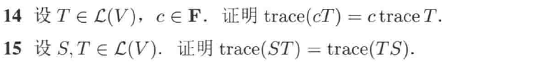
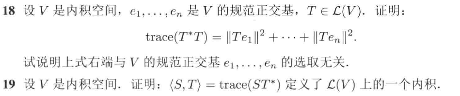
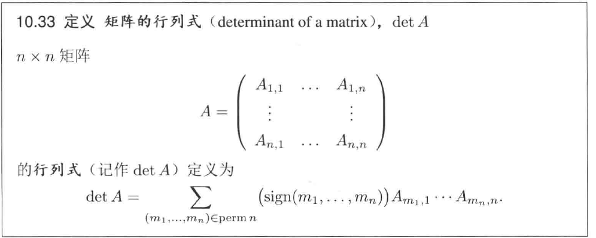
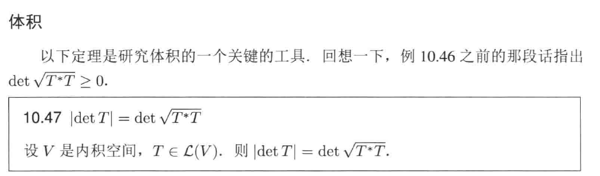
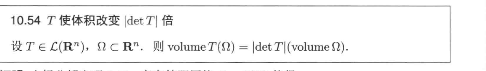
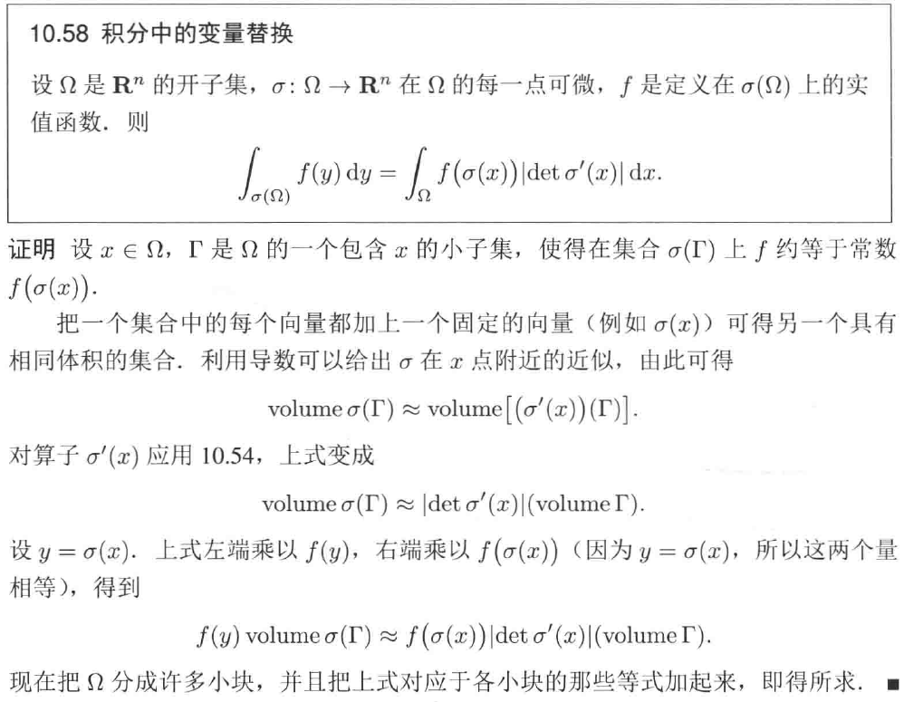
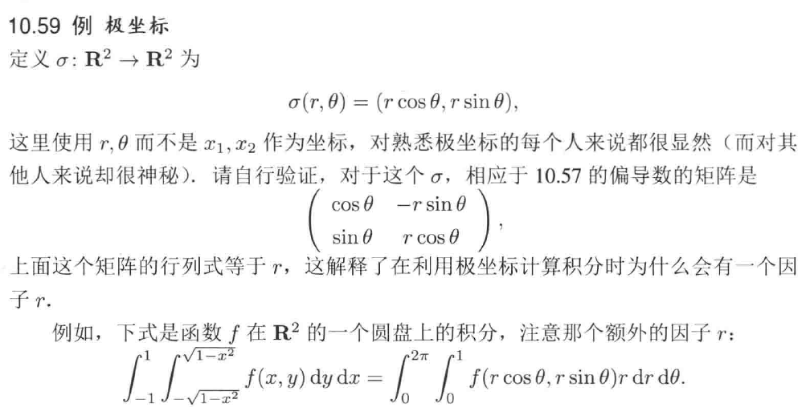
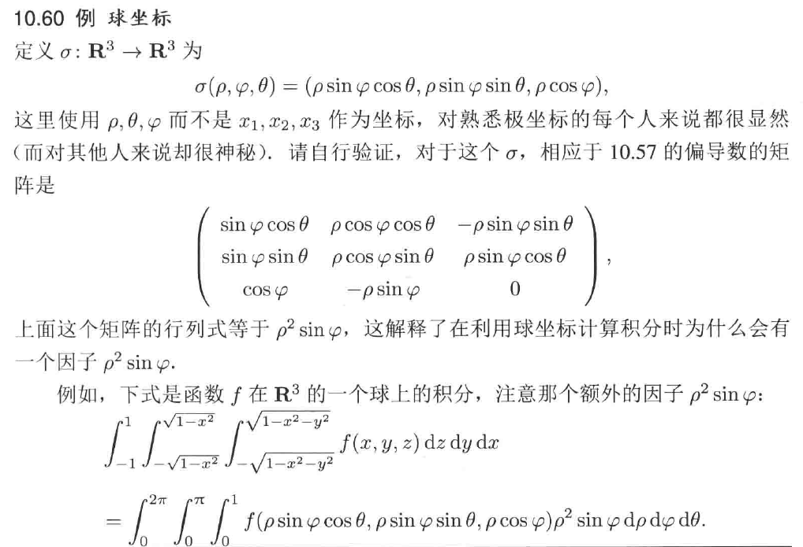

# Chap10 迹和行列式

## 迹：算子和矩阵之间的联系

::: tip definition
**算子的迹**
设T∈L(V)
- 若F=C，则T的迹等于T的按照重数重复的全体本征值之和
- 若F=R，则T的迹等于$T_C$的按照重数重复的全体本征值之和
T的迹记为$\mathrm{trace}T$
:::

显然，$\mathrm{trace}T$ 等于 T 的特征多项式 $z^{n-1}$ 的系数的相反数

下面可以证明，算子的迹等于其矩阵的迹，其中矩阵的迹等于矩阵主对角线元素之和

::: info lemma
**算子的迹等于其矩阵的迹**
若T∈L(V)，则$\mathrm{trace}T=\mathrm{trace}M\left( T \right)$
:::

迹具有下面的性质：迹是可加的，即 $\mathrm{trace}\left( S+T \right) =\mathrm{trace}S+\mathrm{trace}T$

## 行列式

行列式有下面的特性：

::: info lemma
**T的特征多项式等于$\det \left( zI-T \right)$**
设T∈L(V)，则T的特征多项式等于$\det \left( zI-T \right)$
:::

关于矩阵的行列式，有：

一个 det 的例子有：

一个计算实例为：

