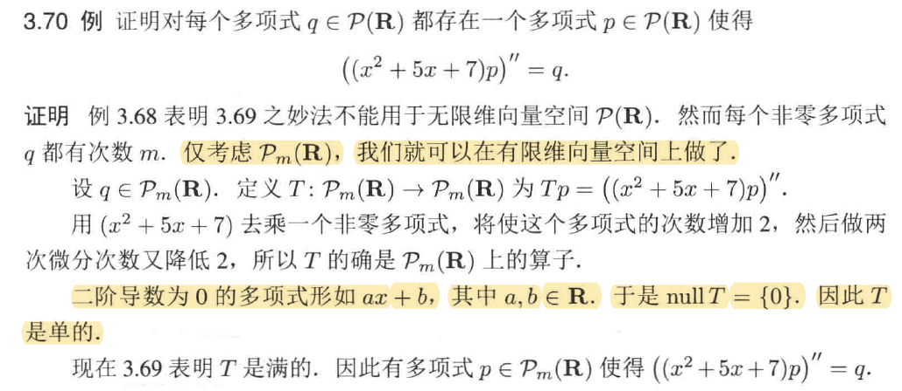
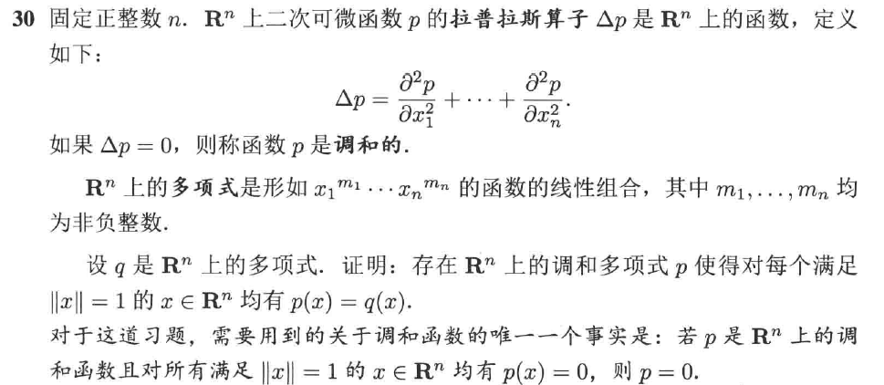
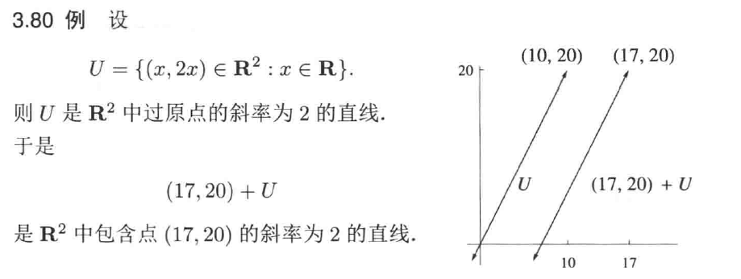
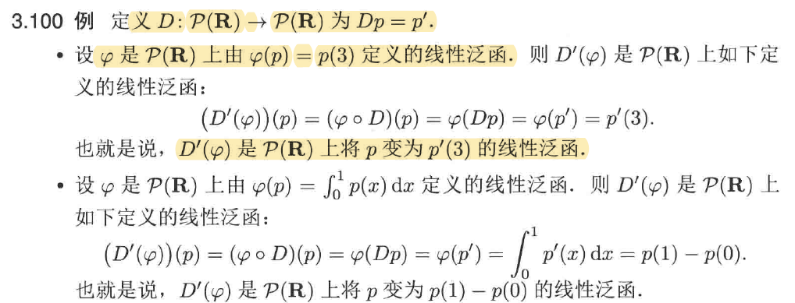

# Chap3 线性映射

前面的线性空间构成了分析的基础，是一个静止的空间。现在来到真正运动的领域——线性映射。Welcome to the true world!

## 向量空间的线性映射

首先不加引用的直接给出线性映射的定义：

::: tip definition
**线性映射**
定义从V到W的线性映射是具有下面性质的**函数**$T:V\rightarrow W$
- 加性：对所有u,v属于V有，T(u+v)=T(u)+T(v)
- 齐性：对所有$\lambda \in F$和$v\in V$有$T(\lambda v)=\lambda T(v)$

:::

从这里可以看出，如果 u=v，那么 Tu=Tv。这实际上是一般验证线性映射是否有意义的主要判定方法。

我们记：

::: tip definition
$\mathcal{L} \left( V,W \right)$表示从V到W的所有线性映射构成的集合
:::

由于这个概念相当重要，这里给出一些基本的线性映射。

- 零映射

零映射如下定义：$0\in \mathcal{L} \left( V,W \right) , s.t. 0v=0$

- 恒等映射

恒等映射是某个向量空间上的函数，记为 I。其将每个元素映射为自身，即 $I\in \mathcal{L} \left( V,W \right) , s.t. Iv=v$

- 微分

$D\in \mathcal{L} \left( P\left( R \right) , P\left( R \right) \right) , s.t. Dp=p'$

可以发现，我们定义的线性映射集合 L 是一个线性向量空间，其上的代数运算定义为：

$$
$\begin{array}{c}
	S,T\in \mathcal{L} \left( V,W \right) , \lambda \in F\\
	\left( S+T \right) \left( v \right) =Sv+Tv\\
	\left( \lambda T \right) \left( v \right) =\lambda \left( Tv \right)\\
\end{array}
$$

有别于基本的向量空间运算，对于线性映射我们也可以定义新的运算，即线性映射的乘积。

::: tip definition
**线性映射的复合/乘积**

$$
\begin{array}{c}
	T\in \mathcal{L} \left( U,V \right) , S\in \mathcal{L} \left( V,W \right)\\
	\mathrm{define} ST\in \mathcal{L} \left( U,W \right)\\
	ST\left( u \right) =S\left( T\left( u \right) \right)\\
\end{array}
$$

:::

对于这样的线性映射乘积运算，可以验证其满足这样的一些性质：
- 结合性：$\left( T_1T_2 \right) T_3=T_1\left( T_2T_3 \right)$
- 单位元：$TI=IT=T, T\in \mathcal{L} \left( V,W \right)$
- 分配性质：$\left( S_1+S_2 \right) T=S_1T+S_2T\quad S\left( T_1+T_2 \right) =ST_1+ST_2$

## 线性映射的性质

对于一个线性映射，自然地可以考虑这样的两个问题：
- 他能将那些向量映射为 0？
- 他能映射到那些向量？

这分别对应了两个子空间：零空间和值域

::: tip definition
**零空间**

$$
T\in \mathcal{L} \left( V,W \right) , \mathrm{null}T=\left\{ v\in V|Tv=0 \right\} 
$$

**值域**

$$
\mathrm{range}T=\left\{ Tv|v\in V \right\} 
$$

:::

容易证明零空间和值域是一个子空间。

注意，由于线性映射是一个映射，因此也可以定义单射和满射的思路。

::: tip definition
- 单射：Tu=Tv时必有u=v，称T是单射
- 满射：T:V->W的值域=W
:::

不难发现，**单射性等价于零空间为 {0}，而满射就是值域等于 W**

引入了值域和零空间，这将线性映射和其作用的向量空间联系起来，我们自然会考虑这两者之间存在什么联系，这引出了一个非常重要的定理：

::: info lemma
**线性映射基本定理**
假设V是有限维的，$T\in \mathcal{L} \left( V,W \right)$，那么有：

$$
\mathrm{dim}V=\mathrm{dim} \mathrm{null}T+\mathrm{dim} \mathrm{range}T
$$

:::

根据上面定理，一个直观的结果就是：
- 到更小维数向量空间的线性映射不是单的
- 到更大维数向量空间的线性映射不是满的

## 表示线性映射

注意到，我们现在描述线性映射还是使用一种规则进行描述，还不存在与之对应的数字实体。这里我们将引入前面介绍的 [从向量组构成线性空间](./Chap2-有限维向量空间.md#从向量组构成线性空间) 的基来对线性映射进行描述。

基本的思路是这样的：
注意到，由于 T:V->W 是线性的，因此 Tvi 就确定了 T 在 V 上的所有向量的值，因此使用 W 的基就可以有效的记录这些值，从而描述一个线性映射。

::: tip definition
**矩阵**
设m,n都是正整数，mxn矩阵A是由F的元素构成的m行n列的阵列：

$$
A=\left( \begin{matrix}
	A_{1,1}&		\cdots&		A_{1,n}\\
	\vdots&		&		\vdots\\
	A_{m,1}&		\cdots&		A_{m,n}\\
\end{matrix} \right) 
$$

其中Aj,k代表A的j行k列的元素
:::

根据上面的思想，我们可以定义线性映射的矩阵：

::: tip definition
**线性映射的矩阵M(T)**

$$
\begin{array}{c}
	T\in \mathcal{L} \left( V,W \right) \quad v_i\text{是}V\text{的基}\quad w_i\text{是}W\text{的基}\\
	M\left( T \right) =A\quad Tv_k=A_{1,k}w_1+\cdots +A_{m,k}w_m\\
\end{array}
$$

:::

由于之前定义了线性映射之间的运算关系，自然会考虑其产生的矩阵之间的定义关系。在相同的基下，显然可以得到和线性映射相同的运算结构，即 M(S+T)=M(S)+M(T)，矩阵加法为对应元素相加。

比较复杂的是矩阵乘法，对应于线性映射的乘法。定义如下：
::: tip definition
**矩阵乘法**
A:mxn矩阵，C:nxp矩阵，AC定义为mxp矩阵，有：

$$
\left( AC \right) _{j,k}=\sum_r{A_{j,r}C_{r,k}}
$$

:::

可以验证，线性映射对应的矩阵之间的乘法和线性映射的乘法具有相同的结构：
M(ST)=M(S)M(T)

可以说，线性映射和其对应的矩阵有一些深层次的联系，后面会提到，这一联系也是一个线性映射，而且具有很多很好地性质，其表明了在指定基的情况下，线性映射和矩阵是一个东西！

关于矩阵的一些理解可以参考 [liShenQiDeJuZhen2020](.//) 和 [liShenQiDeJuZhen22020](.//)

## 特殊的线性映射

### 可逆线性映射

首先定义线性映射的可逆和逆。

::: tip definition
- 线性映射$T\in \mathcal{L} \left( V,W \right)$被称为可逆的，如果存在线性映射$S\in \mathcal{L} \left( W,V \right)$使得ST满足V上的恒等映射且TS等于W上的恒等映射
- 满足ST=I和TS=I的线性映射$S\in \mathcal{L} \left( W,V \right)$称为T的逆
:::

不难证明，逆是唯一的，因此我们可以给其一个记号：$T^{-1}$

可逆性的定义比较好理解，就是字面意义的“可逆”。从其作用效果上来看，可以发现，一个线性映射若是可逆的，那么其 **可逆性实际上等价于单性和满性**

可逆的线性映射是一类特殊的线性映射，它表明线性映射的效果是可以被逆转的，因此作用前后的两个空间必然有某种联系（注意单性和满性保证了两空间至少是维数相等的），这个联系被称为 **同构**

::: tip definition
**同构**
- 同构就是可逆的线性映射
- 若两个向量空间存在一个同构，则称这两个向量空间是同构的
:::

上面提到，可逆性等价于单性和满性，自然蕴含了两个空间是相同维数的。这里我们给出，F 上两个 **有限维向量空间** 同构当且仅当其维数相同

上面的说法表明，每个有限维向量空间都同构于 $F^n$，这立马减少了我们研究问题外表上的复杂性——所有的空间都是按照维数排列的。前面介绍矩阵的时候就隐含了矩阵和其线性映射是有关系的，这里说明他们（矩阵空间和线性映射空间）之间其实是同构的。

既然线性映射和矩阵是同构的，我们可以将线性映射的所有操作搬移到矩阵运算上（注意存在矩阵就表明已经存在一组基了）。

一个直观的事实是：M(Tv)=M(T)M(v)，这就是我们前面说的同构的威力，将定义在规则层面的线性映射转换到数值运算层面，而不改变其含义。

### 算子

另一种比较特殊的线性映射关注的是这样：向量空间到自身的线性映射。定义如下：

::: tip definition
**算子**
- 向量空间到自身的线性映射称为算子
- $\mathcal{L} \left( V \right) =\mathcal{L} \left( V,V \right)$
:::

考虑前面介绍的线性映射的性质，我们来考察算子的性质。前面介绍，若一个线性映射既单又满那么其可逆；我们想考虑，对算子，什么时候才可逆？

::: info lemma
**在有限维的情形，单性等价于满性**
假设V是有限维的，$T\in \mathcal{L} \left( V \right)$，下面陈述等价
- T是可逆的
- T是单的
- T是满的
:::

可以注意到，使用线性映射基本定理可以直接得到结论。

由于这个定力很重要，这里附加一个例子：

一个更酷炫的习题如下：

## 线性映射生成新的向量空间

在分析完基本的线性映射的特征后，我们可以使用线性映射的方法得到一些新的向量空间

首先定义向量空间的乘法 (在向量空间构成的集合上|由于同构的性质这是可以办到的)

::: tip definition
设V1,V2,...,Vm是F上的向量空间，那么定义：
- $V_1\times \cdots \times V_m=\left\{ \left( v_1,\cdots ,v_m \right) |v_1\in V_1,\cdots ,v_m\in V_m \right\}$
- $V_1\times \cdots \times V_m$是一个向量空间
- $V_1\times \cdots \times V_m$上的加法为：$\left( u_1,\cdots ,u_m \right) +\left( v_1,\cdots ,v_m \right) =\left( u_1+v_1,\cdots ,u_m+v_m \right)$
- $V_1\times \cdots \times V_m$上的标量乘法为：$\lambda \left( u_1,\cdots ,u_m \right) =\left( \lambda u_1,\cdots ,\lambda u_m \right)$

:::

容易证明，向量空间积的维数等于维数的和。

我们注意到，空间的积和空间的和之间似乎有些联系，只需要将乘法转换为加法就可以，事实上也的确如此。前面线性映射的性质告诉我们，研究空间之间的关系，实际可以从线性映射入手，因此得到下面的结论：

::: tip definition
**积与直和**
设U1,...,Um均为V的子空间。线性映射$\varGamma :U_1\times \cdots \times U_m\rightarrow U_1+\cdots +U_m$，定义有$\varGamma \left( u_1,\cdots ,u_m \right) =u_1+\cdots +u_m$，从而$U_1+\cdots +U_m$是直和当且仅当$\Gamma$是单射(事实上由于$U_1+\cdots +U_m$的定义，$\Gamma$一定是满的，因此可以将单射转换为可逆)
从而表明：$\mathrm{dim}\left( U_1+\cdots +U_m \right) =\mathrm{dim}U_1+\cdots +\mathrm{dim}U_m$等价于直和

:::

定义了积空间，自然可以考虑商空间。

积空间定义的结果是子空间的积基本上同构于直和，其维度上满足加法。自然地可以猜测商空间的情况应该是减少相应的维数的运算。

首先定义向量和子空间的和：
::: tip definition
设v in V，U是V的子空间，则v+U是V的**子集**，定义为：

$$
v+U=\left\{ v+u|u\in U \right\} 
$$

:::

进一步可以定义 **仿射子集** 和 **平行** 的概念

::: tip definition
- V的仿射子集是V的形如v+U的子集，其中v in V，U是V的子空间
- 对于v in V和V的子空间U，称仿射子集v+U平行于U
:::

平行的仿射子集：例如上面介绍的，R2 中所有斜率为 2 的直线均平行于 U

有了这些定义，我们可以定义商空间的概念：

### 商空间

::: tip definition
假设U是V的子空间，定义**商空间V/U**是指V的所有平行于U的仿射子集的集合

$$
V/U=\left\{ v+U|v\in V \right\} 
$$

:::

现在考察这个商空间是否是一个向量空间：

为了验证这一点，下面给定这样几个命题：
::: info lemma
**平行于U的两个仿射子集或相等或不相交**
设U是V的子空间，v,w in V，那么下面的陈述等价：
- v-w in U
- v+U=w+U
- (v+U)∩(w+U)≠空集
:::

为了验证商空间是不是向量空间，我们定义商空间上的加法和标量乘法：
::: tip definition
假设U是V的子空间，则V/U的加法和标量乘法定义为：
- (v+U)+(w+U)=(v+w)+U
- λ(v+U)= λv+U
:::

在这里定义的加法和标量乘法下，商空间是一个向量空间。

类似上面积空间导出了一个映射，我们可以定义一个商映射来分析商空间的基本性质——比如维数。

::: tip definition
**商映射**
设U是V的子空间，商映射🥧是下面定义的线性映射：🥧:V→V/U，其规则为：
🥧(v) = v+U
:::

容易验证，🥧确实是一个线性映射，它满足线性映射的加性和齐性 [向量空间的线性映射](./#向量空间的线性映射)

从而，根据线性映射基本定理，可以量化商空间的维数：

只需要注意：null 🥧=U，range 🥧=V/U，从而：
dim V/U = dim V - dim U

上面商空间是一个依赖于 V 和其子空间 U 的向量空间，因此可以考虑其这样的一个实例：对 V 上的每个线性映射 T，其诱导了一个线性映射 $\hat{T}$，满足：

设 $T \in \mathcal{L}(V,W)$，定义 $\hat{T}: V /(nullT)\rightarrow W$：

$$
\hat{T}(v+nullT)=Tv
$$

这个也是一个线性映射，容易证明。但为啥要提出这样一个线性映射呢？是为了做一个演示的例子。由于线性映射基本定理，dim V = dim null(T) + dim range(T)，从而有：dim V/nullT = dimV - dim null(T) = dim range(T)，这意味着 V/nullT 和 range T 同构。这个线性映射就是一个同构的例子。

只需要验证这是一个单射就行了，而其显然是满射，从而构造了一个同构关系，也是验证了线性映射基本定理。

## 线性泛函和对偶

在前面 [特殊的线性映射](./#特殊的线性映射) 中介绍了一些具有特殊性质的线性映射，这里可以再增加一例：映到标量域 F 的线性映射，也称为 **线性泛函**，是 L(V,F) 中的元素。

对这样的线性映射，我们可以考虑其组成的向量空间（前面应该提过线性映射构成的这类空间也是向量空间），定义其为 **对偶空间**

::: tip definition
**对偶空间**
V上所有线性泛函构成的向量空间称为V的对偶空间，记为V'，即V'=L(V,F)
:::

注意到，dim V' = dim L(V,F) = dimV×dimF=dimV，从而表明对偶空间和原始空间是同构的！这就很有意思了。我们知道，同构的空间是很相似的，具体来说，只要找到了对应的量空间下的基并将其一一对应，我们可以将空间完全转换到新的空间下。这引导我们考虑对偶空间下的基：对偶基

::: tip definition
**对偶基**
假设v1,...,vn是V上的基，那么v1,...vn的对偶基是V'中的元素组$\psi_{1},\cdots,\psi_n$，其中每个$\psi_j$都是V上的线性泛函，使得：

$$
\psi _j(v_k)=\begin{cases}
	1\\
	0\\
\end{cases}\quad \begin{array}{c}
	\text{当}k=j\\
	\text{当}k\ne j\\
\end{array}
$$

:::

容易证明，对偶基的确是一组 V' 上的基。

我们发现对偶空间和原空间具有相同的维数，这表明他们之间可以相互转化。前面我们考虑了线性映射 L(V,W)，自然地可以考虑在对偶空间下的线性映射的关系，即研究 L(V',W') 和 L(W',V')，则引入了 **对偶映射** 的概念

::: tip definition
**对偶映射**
若T∈L(V,W)，则T的对偶映射定义为T'∈L(W',V')：满足对ψ∈W'，有：

$$
T'\left( \psi \right) =\psi \circ T
$$

:::

注意，这确实是一个线性映射，将 W 上的线性泛函ψ映射到了 V 上的线性泛函。相对来说比较绕，举例如下：

::: info lemma
**对偶映射的代数性质**
- 对所有S，T∈L(V,W)，有(S+T)'=S'+T'
- 对所有λ∈F和所有S∈L(V,W)，有(λT)'=λT'
- 对所有T∈L(U,V)和所有S∈L(V,W)，有(ST)'=T'S'
:::

上面的结果表明这确实是一个线性映射。说明了这是一个线性映射后，和上面研究思路一样，开始考虑线性映射构成的集合上的关系，也就是看他是不是可以构成一个向量空间。研究一个线性映射的性质无非就是看其零空间、值域的特性，从而我们引入下面的定义：

::: tip definition
**零化子**
对于V的子空间U，U的零化子($U^0$)定义为

$$
U^0=\left\{ \psi \in V'|\text{对所有}u\in U\text{都有}\psi \left( u \right) =0 \right\} 
$$

:::

对于 V 的子空间 U，零化子 $U^0$ 是对偶空间 V' 的子集，因此其依赖于包含 U 的向量空间 V，但由于 V 一般是上下文自明的，因此不做特殊说明。

容易证明，零化子是一个子空间，我们来研究其维数：
::: info lemma
假设V是有限维的，U是V的子空间，则：

$$
\mathrm{dim}U+\mathrm{dim}U^0=\mathrm{dim}V
$$

:::

定义这样一个映射 i∈L(U,V)，满足：对 u∈U 有 i(u)=u，这是一个自然地映射。考虑其对偶映射 i'∈L(V',U')。注意到 $\mathrm{null}i'=U^0$，而 $\mathrm{dim}V'=\mathrm{dim}V$。对 i' 使用线性映射基本定理有

$$
\begin{array}{c}
	\mathrm{dim} \mathrm{range}i'+\mathrm{dim} \mathrm{null} i'=\mathrm{dim} V'\\
	\Rightarrow \mathrm{dim} \mathrm{range}i'+\mathrm{dim}U^0=\mathrm{dim}V\,\,\\
\end{array}
$$

假定ψ∈U'，那么可以将其扩张为 V 上的线性泛函φ，从而根据 i' 定义有：

$$
i'\phi =\phi \circ i=\psi 
$$

从而表明ψ∈rangei'，进而有 rangei'=U'，故：

$$
\begin{array}{c}
	\mathrm{dimrange}i'+\mathrm{dim}U^0=\mathrm{dim}V\\
	\Rightarrow \mathrm{dim}U+\mathrm{dim}U^0=\mathrm{dim}V\,\,\\
\end{array}
$$

这里的结果暗示我们下面两个空间是同构的：
- $U^0$：U 的零化子，属于 V' 层面，成员是 V 上的线性泛函
- V/U：U 的商空间，属于 V 层面 (虽然不是 V 子集)，成员是一簇平行的仿射集

在零化子的前置知识下，可以考虑对偶映射的值域和零空间的性质：

::: info lemma
**T'的零空间**
假设V和W都是有限维，T∈L(V,W)，则：
- $\mathrm{null}T'=\left( \mathrm{range}T \right) ^0$
- $\mathrm{dimnull}T'=\mathrm{dimnull}T+\mathrm{dim}W-\mathrm{dim}V$
:::

容易证明第一条性质，第二条使用线性映射基本定理可以得到。这里结果表明，如果 T 是一个 V 上的算子，那么 T' 和 T 的零空间同构，事实上其是 T 值域的零化子

此外，还给了我们一个看线性映射的新角度，即证明 **T 是满的等价于 T' 是单的**

::: info lemma
**T'的值域**
假设V和W都是有限维，T∈L(V,W)，则：
- $\mathrm{range}T'=\left( \mathrm{null}T \right) ^0$
- $\mathrm{dimrange}T'=\mathrm{dimrange}T$
:::

可以发现其值域和零空间是 T 对应的零化子。类似上面结论有：**T 是单的等价于 T' 是满的**

这表明 T 和 T' 是很相似的，他们互“共享”零空间和值域，构成的向量空间具有相同的维数。下面根据 [表示线性映射](./#表示线性映射) 介绍的矩阵来数值上看下两个线性映射的关系

我们可以定义一个矩阵空间上的新运算，称奇为 **转置**
::: tip definition
**转置**
矩阵A的转置(记为$A^T$)是通过互换A的行和列所得到的矩阵，即：

$$
(A^T)_{k,j}=A_{j,k}
$$

:::

容易根据定义证明，矩阵具有这样的性质：$\left( AC \right) ^T=C^TA^T$

我们证明，假定 V 有基 v1,...,vn 及 V' 的对偶基ψ1,...,ψn，并假定有 W 的基 w1,...,wn 及 W' 的对偶基φ1,...φn，矩阵 M(T) 按照 V 和 W 的上述基计算，M(T') 是按照 W' 和 V' 的上述基计算。从而有：

::: info lemma
**T'的矩阵是T矩阵的转置**
设T∈L(V,W)，则
$$
M\left( T' \right) =\left( M\left( T \right) \right) ^T
$$

:::

我们成功表明了线性映射和其对偶映射存在紧密的联系，下面来看看这样的联系可以带来什么样的结果。

我们对矩阵进行分析，定义矩阵的秩为：

::: tip definition
**矩阵的秩**
假设A是元素属于F的mxn矩阵
- A的行秩是A的诸行在$F^{1,n}$中的张成空间的维数
- A的列秩是A的诸列在$F^{m,1}$中的张成空间的维数
:::

容易看出，**rangeT 的维数等于 M(T) 的列秩**，从而根据我们上面对偶映射的性质，对偶映射的值域和原映射的值域维数相同，从而有 **行秩等于列秩**，也就是说可以统一起来称矩阵的秩，一般使用列秩，因为其是直接的 T 的值域
