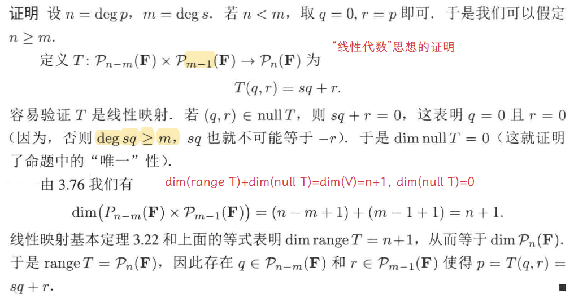
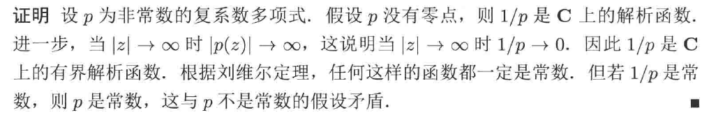

# Chap4 多项式

# Chap4 多项式

这一章是和前面没啥关系的补充章节，内容也比较简单，我就简单提下。

一些规定：
- 多项式 0 的次数为 $-\infty$
- s 是一个多项式，deg s 是 s 的最高项次数

处理多项式时有一个基本的定理，称为多项式的带余除法。
::: info lemma
**多项式的带余除法**
假设p,s∈P(F)，且s≠0，则存在惟一的多项式q,r∈P(F)使得：p=sq+r，且
deg r < deg s
:::

这一定理是相当初等的，但这里给一个相当“线性代数”的证明：

定义了多项式后，这里再来一个更重要的基本定理，被称为代数学基本定理：
::: info lemma
**代数学基本定理**
每个非常数的复系数多项式都有零点
:::

这个定理证明涉及到一些分析学的知识，简单的写来如下：

从而我们有：C 上多项式可以分解 (惟一的) 为：

$$
p\in P\left( \mathbb{C} \right) \Rightarrow p\left( z \right) =c\left( z-\lambda _1 \right) \cdots \left( z-\lambda _m \right) 
$$

对 R 上的多项式，这个定理只能弱化为：实系数多项式的非实零点是成对出现的，可以简单通过取复共轭证明。
