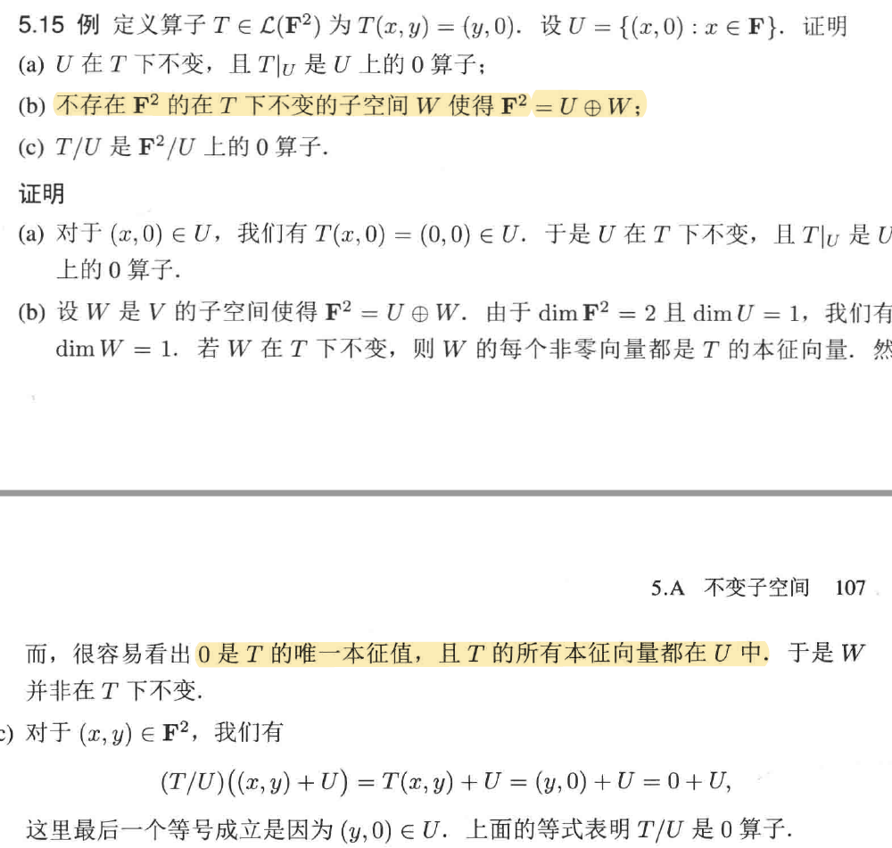
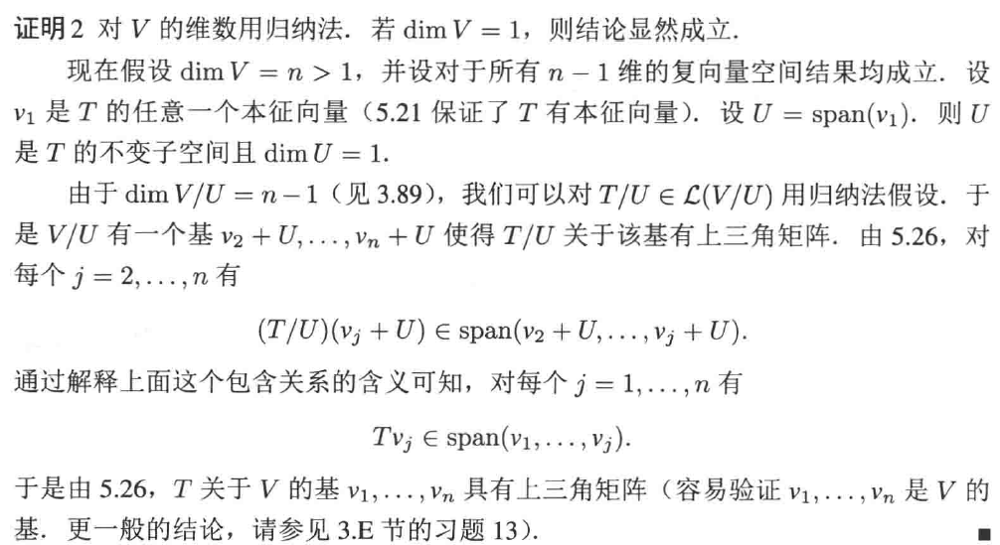
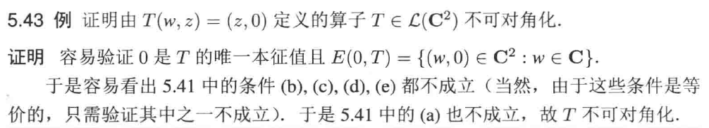

# Chap5 本征值和本征向量

[Chap3 线性映射](./Chap3-线性映射.md) 中比较粗糙的研究了一个向量空间到另一个向量空间的映射，从这里开始，开始研究一个算子的更细致的特性，即从一个有限维向量空间到其自身的线性映射。

为了方便理解算子的结构，一个自然地想法是将算子作用的空间缩小，划分成一块一块的小作用域，算子在小作用域上也是算子。为此，我们引入一些新的工具。

## 不变子空间

::: tip definition
**不变子空间**
设T∈L(V)，称V的子空间U在T下不变，如果对每个u∈U都有Tu∈U
:::

也就是说，我们上面描述的就是将原始空间 V 划分成一个个不变子空间的直和

我们首先从最简单的不变子空间开始——一维的不变子空间。
一维的不变子空间表明，Tv=λv，span(v) 构成了这个不变子空间。

这个一维不变子空间比较重要，因此满足不变子空间的方程有特殊的名字：
::: tip definition
**本征值**
设T∈L(V)，称λ∈F是T的本征值，若存在v∈V使得v≠0且Tv＝λv
:::

注意我们并没有说特征值不可以为 0，这表明最平凡的不变子空间是 null，只不过不一定一维。

下面来研究本征值的等价判定条件：
::: info lemma
**本征值的等价条件**
设V是有限维的，T属于L(V)且λ∈F，则以下条件等价：
- λ是T的本征值
- T-λI不是单的
- T-λI不是满的
- T-λI不是可逆的
:::

容易发现，不同本征值对应的本征向量是线性无关的，这从一维不变子空间的特性也能看出。这暗示我们，一个空间 V 是有限维的，那么 V 上的 **每个算子** 最多有 dimV 个不相同的本征值

给定了一个不变子空间 U 后，U 还可以自然地确定另外两个算子 $T|_U\in \mathcal{L} \left( U \right)$ 和 $T/U\in \mathcal{L} \left( V/U \right)$，定义如下：

::: tip definition
定义限制算子$T|_U$和商算子$T/U$。设T∈L(V)且U是V的在T下不变子空间，有：
- 限制算子$T|_U\in \mathcal{L} \left( U \right)$定义为$T|_U\left( u \right) =Tu\quad u\in U$
- 商算子$T/U\in \mathcal{L} \left( V/U \right)$定义为$T/U\left( v+U \right) =Tv+U\quad v\in V$
:::

为什么要单独提出这两个算子呢，因为某种意义上 U 和他的商空间 V/U 有点直和的感觉，可以直接将 V 划分成两个空间。研究这两个算子可以在某种意义上了解算子 T

但这两个算子并不能给出关于 T 的足够的信息，比如：

## 算子的幂

算子之所以理论比线性映射理论更加丰富，主要原因是 **算子可以自乘**，从而构造算子的幂和算子多项式。首先从算子的幂开始：

::: tip definition
**算子的幂**
设T∈L(V)，m是正整数
- 定义$T^m=\underset{m\text{个}}{\underbrace{T\cdots T}}$
- 定义$T^0$是V上的恒等算子I
- 若T是可逆的且其逆为$T^{-1}$，则定义$T^{-m}=\left( T^{-1} \right) ^m$
:::

定义了算子的幂自然的可以得到算子的多项式，对应着的是泛函空间 L(V) 上的多项式。

由于算子本身是可交换的，因此算子多项式也是可交换的。

下面根据多项式理论给出 **复向量空间** 上算子的中心结果之一：**有限维非零复向量空间上的算子都有本征值**

容易使用代数学基本定理得到上面结论。

根据上面这个定理，我们可以说在复向量空间上可以分解成多个本征值向量空间的直和。我们从矩阵的角度来看这个性质：

::: info lemma
**在C上，每个算子均有上三角矩阵**
假设V是有限维复向量空间，T∈L(V)，则T关于V的某个基有上三角矩阵
:::

这里就使用了商映射对应商空间的维数性质。

通过证明可以发现，上三角矩阵是可逆的等价于这个上三角矩阵对角线上的元素都不是 0.

## 本征空间和对角矩阵

上面通过代数学基本定理证明了复向量空间上的算子可以在某组基下表示成上三角矩阵，但这个并不是最好的结果，下面的结果表明对一些性质好的线性映射可以得到更加简单的矩阵表示

首先定义本征空间：
::: tip definition
**本征空间$E(\lambda,T)$**
设T∈L(V)，λ∈F，T相应于λ的本征空间定义为：

$$
E\left( \lambda ,T \right) =\mathrm{null}\left( T-\lambda I \right) 
$$

也就是说$E\left( \lambda ,T \right)$是T相应于λ的全体本征向量加上0向量构成的集合
:::

根据 [不变子空间](./#不变子空间) 的分析容易发现本征空间是直和的。

借助上面定义可以得到算子可对角化的等价条件
::: info lemma
**算子可对角化**
设算子V是有限维的，T∈L(V)，使用$\lambda _1,\cdots ,\lambda _m$表示T所有互异的特征值，则下面条件等价：
- T可对角化
- V有有T的本征向量构成的基
- V又在T下不变的一维子空间$U_1,\cdots ,U_n$使得$V=U_1\oplus \cdots \oplus U_n$
- $V=E\left( \lambda _1,T \right) \oplus \cdots \oplus E\left( \lambda _m,T \right)$
- $\mathrm{dim}V=\mathrm{dim}E\left( \lambda _1,T \right) +\cdots +\mathrm{dim}E\left( \lambda _m,T \right)$
:::

::: note note
对角化<=>一维不变子空间，也就是说
尽管复空间上映射一定可以分解为“特征向量组成的基”，这些基是“嵌套的”，是一个个正交补套起来的，并不是全空间上的“特征向量”，也就是只能是上三角而不是对角
:::

算子如果可以对角化，那么基本可以说这个算子的所有性质我们都可以掌握了。因为这个算子在给定空间下被划分成了 1 维不变子空间的直和，所有的 1 维空间都是很平凡的。但并不是每个算子都可以对角化，这种情况甚至可以出现在复向量空间上：

一个自然地结论是，如果一个算子特征值足够多，特别的有 dimV 个特征值，那么一定可以对角化。但逆名义并不成立哈，比如三维空间 F3 上的算子 T(a,b,c)=(4a,4b,5c)
