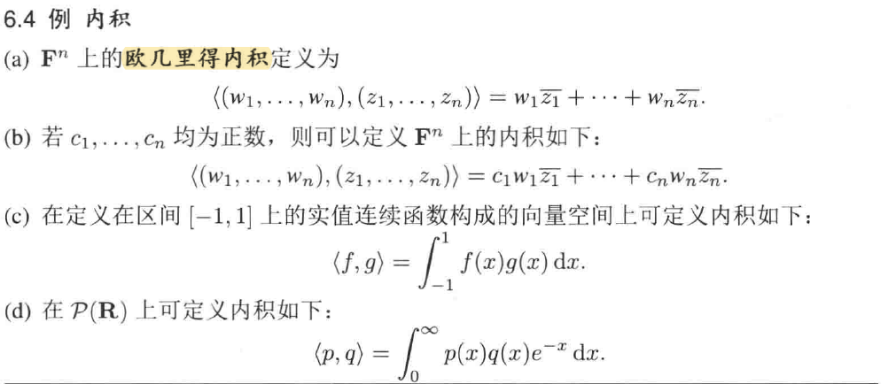
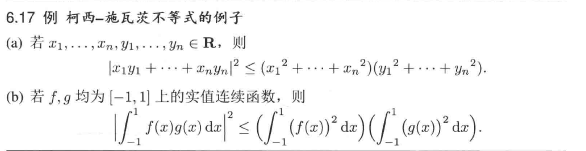
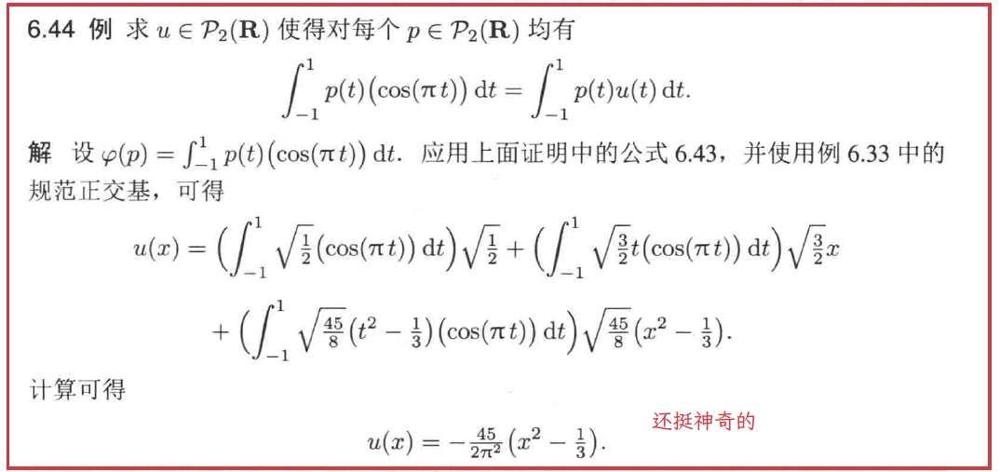
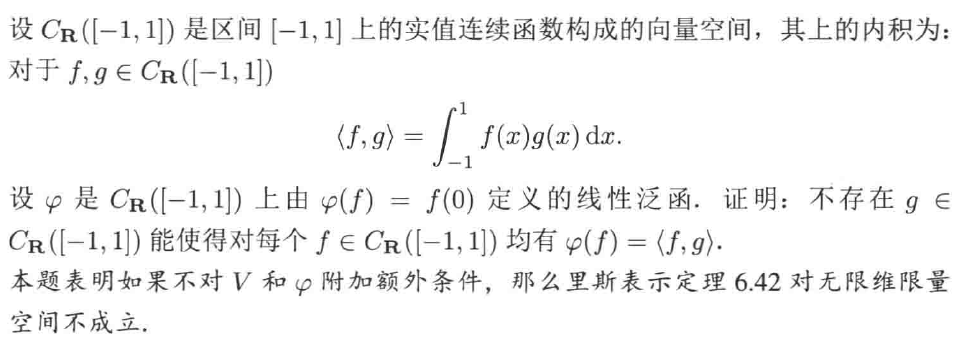
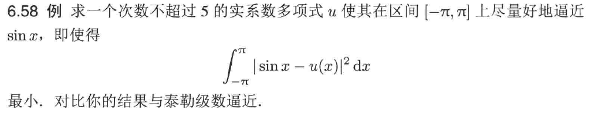
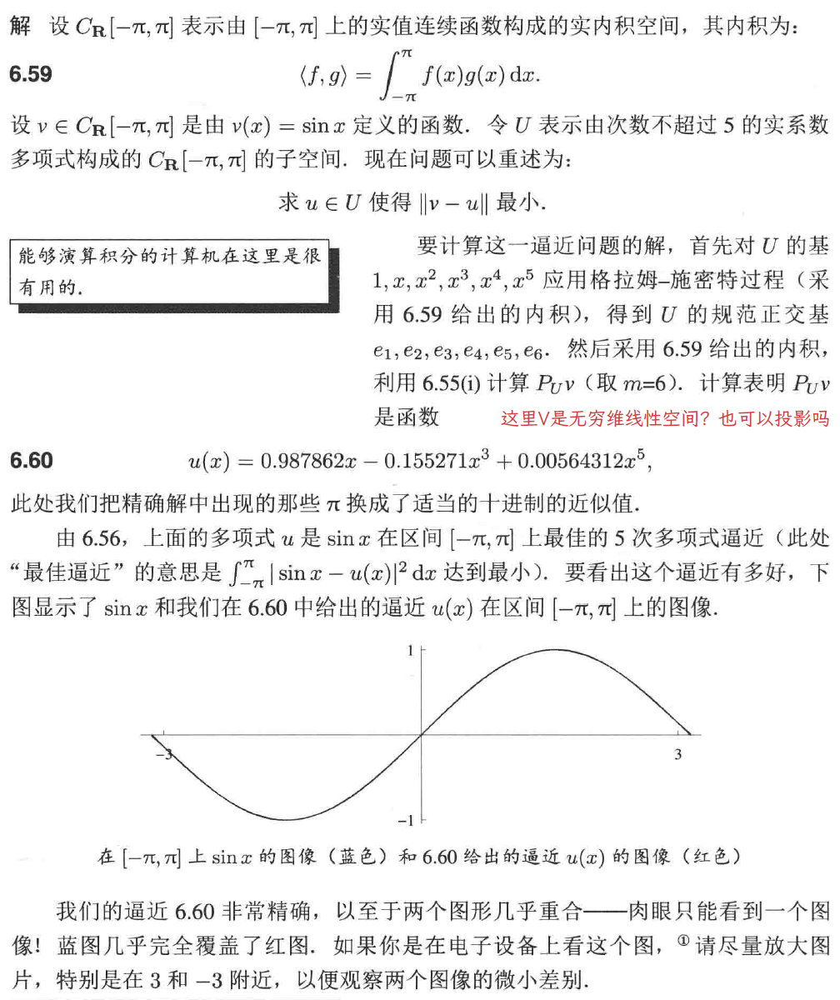
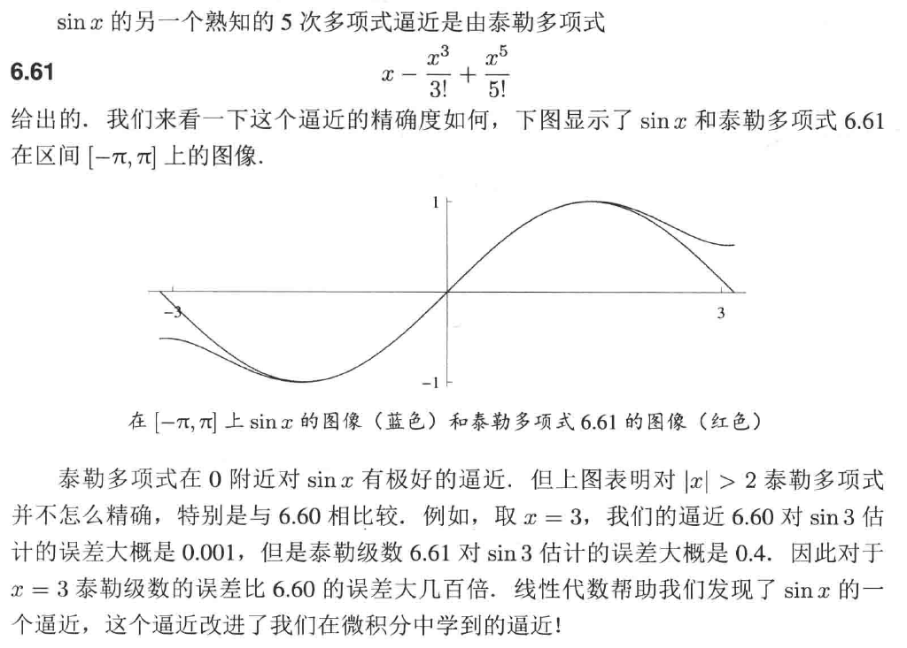
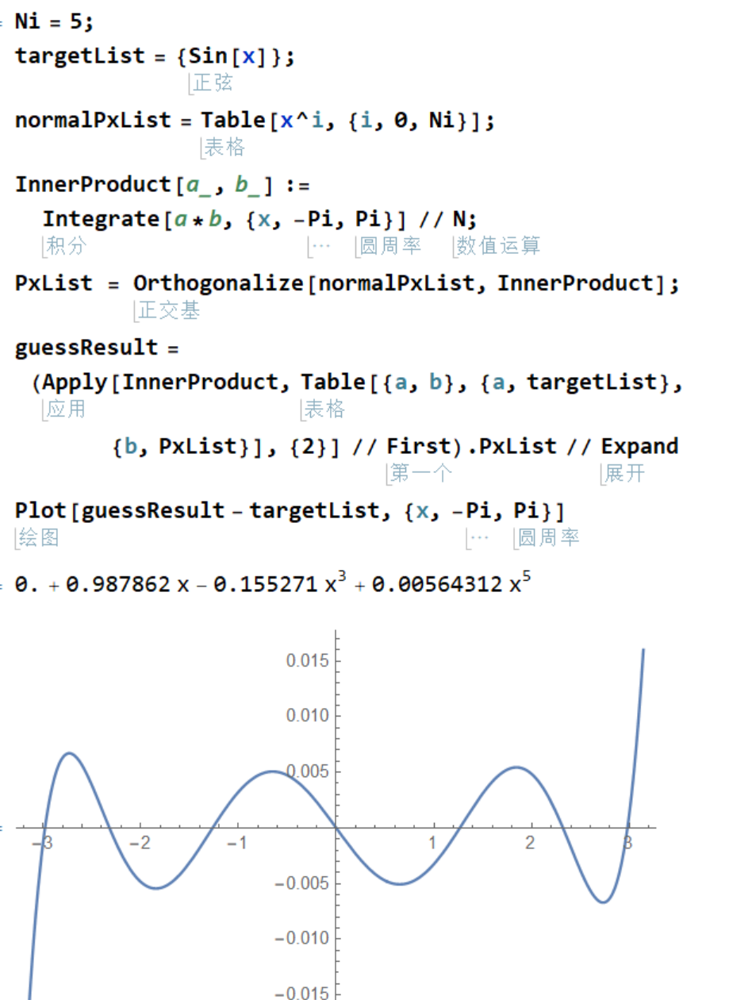

# Chap6 内积空间

# Chap6 内积空间


在前面我们定义向量空间的时候，推广了 R2 的线性结构 (加法和标量乘法)，但这些是不够的，比如我们故意忽略了长度和角度的概念。现在我们引入内积来定义更广空间下的长度和角度，之后将会注意到，定义的内积其实也是一个线性泛函。

## 内积和范数

范数在 Rn 上的推广是显然的：
定義 $x=\left( x_1,\cdots ,x_n \right) \in \mathbf{R}^n$ 的范数 (二范数) 为：

$$
\left\| x \right\| =\sqrt{{x_1}^2+\cdots +{x_n}^2}
$$

范数在 Rn 上不是线性的，为了将 **线性** 引入讨论，我们引入点积：
::: tip definition
**点积**
对于$x,y\in \mathbf{R}^n$，x和y的点积为：

$$
x\cdot y=x_1y_1+\cdots +x_ny_n
$$

其中$x=\left( x_1,\cdots ,x_n \right) ,y=\left( y_1,\cdots ,y_n \right)$
:::

内积是对点积的推广，定义内积就是把点积的性质抽象出来：

::: tip definition
**内积**
V上的内积就是一个函数，它把V中元素的每个有序对(u,v)都映射成一个数$\left< u,v \right> \in F$，并就有下面的性质：

- **正性**：对所有的v∈V均有<v,v>>=0
- **定性**：<v,v>=0等价于v=0
- **第一个位置的加性**：对所有u,v,w∈V，<u+v,w>=<u,w>+<v,w>
- **第一个位置的齐性**：对所有λ∈F和所有u,v∈V均有<λu,v>=λ<u,v>
- **共轭对称性**：对所有u,v∈V均有$\left< u,v \right> =\overline{\left< v,u \right> }$
:::


一些线性空间上的内积例子如下：


定义了内积的向量空间 V 被称为内积空间，因此后面除非特殊注明，V 都代表内积空间了。

使用内积的性质可以得到下面常用的结论
- $\left< u,v+w \right> =\left< u,v \right> +\left< u,w \right>$
- $\left< u,\lambda v \right> =\overline{\lambda }\left< u,v \right>$

定义了内积后可以自然地在线性空间上定义范数了：
::: tip definition
**范数**
对于v∈V，v的范数定义为

$$
\left\| v \right\| =\sqrt{\left< v,v \right>}
$$

:::


范数作为内积的延伸，内积有的性质范数也继承了一部分。由于范数定义时使用了平方根，因此一般处理时使用范数的平方会更加简单。

考虑到内积这个线性映射，我们可以考虑其零空间，即定义了 **正交**
::: tip definition
**正交**
两个向量u,v∈V称为是正交的，如果$\left< u,v \right> =0$
:::


如果两个向量是正交的，那么在基本几何上的勾股定理就被推广了：
::: info lemma
**勾股定理**
设u和v都是V中的正交向量，则$\left\| u+v \right\| ^2=\left\| u \right\| ^2+\left\| v \right\| ^2$
:::


已经开始有长度那味道了。

根据正交性质，我们可以得到 **正交分解**，这是一个蛮重要的思想

::: info lemma
**正交分解**
设$u,v\in V$且$v\neq 0$。令$c=\frac{\left< u,v \right>}{\left\| v \right\| ^2},w=u-\frac{\left< u,v \right>}{\left\| v \right\| ^2}v\Rightarrow \left< w,v \right> =0,u=cv+w$
:::


根据正交分解性质，可以证明数学中最为重要的不等式之一——柯西 - 施瓦兹不等式
::: info lemma
**柯西-施瓦兹不等式**
设u,v∈V，则
$$
\left| \left< u,v \right> \right|\le \left\| u \right\| \left\| v \right\| 
$$

等号成立当且仅当其中一个向量是另一个的标量倍
:::



## 规范正交基

前面介绍正交分解的时候的思想应用在向量空间的基底上，就可以得到一组“特殊的基”，这组基自身长度为 1 且和别的基正交，我们称这个基是 **规范正交的**

把这个思想程序化有：格拉姆 - 施密特正交化：
::: info lemma
**施密特正交化**
设v1,...,vm是V中的线性无关向量组。设e1=v1/||v1||，对于j=2,...,m，定义ej如下：

$$
e_j=\frac{v_j-\left< v_j,e_1 \right> e_1-\cdots -\left< v_j,e_{j-1} \right> e_{j-1}}{\left\| v_j-\left< v_j,e_1 \right> e_1-\cdots -\left< v_j,e_{j-1} \right> e_{j-1} \right\|}
$$

这样得到的ei变成了V中的规范正交组，且span和vi一样。分子保证了正交性，分母保证了长度为1
:::


这表明，所有内积空间中的基可以转换为规范正交基，即得到了 **舒尔定理**
::: info lemma
**舒尔定理**
设V是有限维的**复向量空间**，且T∈L(V)。则T关于V的某个规范正交基具有上三角矩阵
:::


这是因为前面已经证明了复向量空间可以嵌套分解为一维不变子空间，即可以上三角化。

## 内积空间上的线性泛函

线性泛函是我们在 [线性泛函和对偶](./Chap3-线性映射.md#线性泛函和对偶) 定义的。在内积空间下，可以发现，给定了 u∈V 后，内积也是一个线性泛函，即 T:v-><v,u>。下面就有一个很强的定理，说 **V 上的每个线性泛函都是这个形式的**

::: info lemma
**里斯表示定理**
设V是有限维的且$\psi$是V上的线性泛函，则存在惟一的向量u∈V使得对每个v∈V均有$\psi \left( v \right) =\left< v,u \right>$
:::


证明其实蛮简单，有一股 **结果论** 的味道。
证明分成两部，首先证明存在向量 u∈V 使得对每个 v∈V 均有 $\psi \left( v \right) =\left< v,u \right>$。
假设 $e_1,\cdots ,e_n$ 是 V 的规范正交基，那么对每个 v∈V 均有：

$$
\begin{aligned}
	\psi \left( v \right) &=\psi \left( \left< v,e_1 \right> e_1+\cdots +\left< v,e_n \right> e_n \right)\\
	&=\left< v,e_1 \right> \psi \left( e_1 \right) +\cdots +\left< v,e_n \right> \psi \left( e_n \right)\\
	&=\left< v,\overline{\psi \left( e_1 \right) }e_1+\cdots +\overline{\psi \left( e_n \right) }e_n \right>\\
\end{aligned}
$$

从而可以取 $u=\overline{\psi \left( e_1 \right) }e_1+\cdots +\overline{\psi \left( e_n \right) }e_n$，满足条件

另一方面，证明唯一性。证明对每个 v∈V 都有 $\psi \left( v \right) =\left< v,u \right>$
来证明只有一个向量 u∈V 满足条件。设存在两个 u1,u2 满足条件，从而

$$
\begin{array}{c}
	\psi \left( v \right) =\left< v,u_1 \right> =\left< v,u_2 \right>\\
	\Rightarrow \left< v,u_1-u_2 \right> =0\Rightarrow u_1=u_2\\
\end{array}
$$


里斯表示定理说明，在内积空间下，线性泛函实际上是内积的一个特殊表示。这也体现了我们研究内积的一个重要性。

一个蛮有意思的例子如下：


这里 cos 并不是 P2 中的元素，但这个确实是线性泛函，因此可以使用里斯表示定理，首先找一个标准正交基，然后找到对应的 u，可以在 u 属于的空间中完全表示这个线性泛函。

下面是一个说明里斯表现定理局限性的例子：



## 正交补和极小化问题

首先定义正交补

::: tip definition
**正交补**
设U是V的子集，则U的正交补$U^{\bot}$是由V中与U的每个向量都正交的那些向量组成的集合
$$
U^{\bot}=\left\{ v\in V|\forall u\in U,\left< v,u \right> =0 \right\} 
$$

:::


因此正交补一定是定义在内积空间上的。对比正交补定义，不拿发现：$V=U\oplus U^{\bot}$
因此可以和前面的零化子、商空间一起对比下：
- $U^0$：U 的零化子，属于 V' 层面，成员是 V 上的线性泛函
- V/U：U 的商空间，属于 V 层面 (虽然不是 V 子集)，成员是一簇平行的仿射集
- $U^{\bot}$：U 的正交补，真正属于 V 层面，是 V 的子集，成员是 V 中的向量
这三个空间是同构的

定义了正交补后和我们一贯的思路相符，其可以自然地诱导出一个线性映射（事实上和前面的商映射、化零映射是一样的），称为正交投影
::: tip definition
**正交投影**
设U是V的有限维子空间，定义V到U上的正交投影为下面算子$P_U\in \mathcal{L} \left( V \right)$：

$$
\forall v\in V,v=u+w,u\in U,w\in U^{\bot}\Rightarrow P_Uv=u
$$

:::

这里没有解释为什么使用正交投影，我们只是跟随传统定义了这个线性映射。但下面的问题就会解释我们传统的强大，他可以用来解决一大批问题。

### 极小化问题

经常会遇到这样的问题：给定 V 的子空间 U 和点 v∈V，求点 u 属于 U 使得 $\left\| v-u \right\|$ 最小。下面的命题表明，通过选取 $u=P_Uv$ 就可以解决这个问题

::: info lemma
**到子空间的最小距离**
设U是V的有限维子空间，$v\in V$且$u\in U$，则：

$$
\left\| v-P_Uv \right\| \le \left\| v-u \right\| 
$$

等号成立当且仅当$u=P_Uv$
:::


使用内积空间上向量的三角不等式可以直接得到这个结果。

下面演示一个例子：






分析代码参考下面 mma 代码：
```mathematica
Ni = 5;
targetList = {Sin[x]};
normalPxList = Table[x^i, {i, 0, Ni}];
InnerProduct[a_, b_] := Integrate[a*b, {x, -Pi, Pi}] // N;
PxList = Orthogonalize[normalPxList, InnerProduct];
guessResult = (Apply[InnerProduct, 
      Table[{a, b}, {a, targetList}, {b, PxList}], {2}] // 
     First).PxList // Expand
Plot[guessResult - targetList, {x, -Pi, Pi}]
```

计算结果和书中例子一样：


是挺有意思的吧
