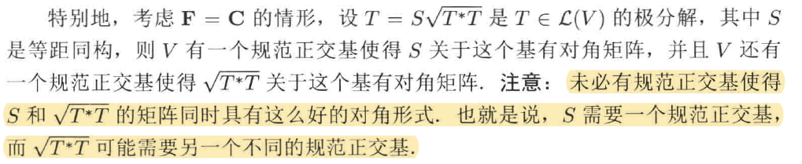

# Chap7 内积空间上的算子

# Chap7 内积空间上的算子

上一节定义了内积空间，自然地可以考虑一个映射在内积作用下的效果，也就是 **切换空间来看这个映射**，和我们前面思考的对偶映射、逆映射等有异曲同工之妙

## 自伴算子和正规算子

::: tip definition
**伴随**
设$T\in \mathcal{L} \left( V,W \right)$，T的伴随指的是满足下面条件的函数

$$
T^*:W\rightarrow V, \forall v\in V,w\in W,\left< Tv,w \right> =\left< v,T^*w \right> 
$$

:::

你可能会觉得这个定义很奇怪，怎么能一定保证这样的 T\* 存在呢？实际上考虑里斯表示定理，考虑这样一个泛函：$T\in \mathcal{L} \left( V,W \right)$，并取定 w∈W，考虑将 V 上 v∈V 映射为<Tv,w>的线性泛函。这个线性泛函依赖于 T 和 w。由于里斯表示定理，存在 V 中唯一一个向量使得这个线性泛函是通过和这个向量做内积得出的。我们记这个向量为 $T^*w$，从而其是 V 下唯一一个满足伴随定义的向量，这说明了定义的可靠性

我们可以证明，伴随是一个线性映射，且具有下面性质：
::: info lemma
**伴随的性质**
- 对所有S,T属于L(V,W)，均有(S+T)\*=S\*+T\*
- 对所有λ∈F和T∈L(V,W)均有$\left( \lambda T \right) ^*=\overline{\lambda }T^*$
- 对所有$T\in \mathcal{L} \left( V,W \right)$均有$\left( T^* \right) ^*=T$
- $I^*=I$
- 对所有$T\in \mathcal{L} \left( V,W \right)$和$S\in \mathcal{L} \left( W,U \right)$均有$\left( ST \right) ^*=T^*S^*$(这里U是F上的内积空间)
:::

研究映射自然还要看它的值域和零空间。

::: info lemma
$T^*$的零空间和值域
设$T\in \mathcal{L} \left( V,W \right)$，则：
- $\mathrm{null} T^*=\left( \mathrm{range}T \right) ^{\bot}$
- $\mathrm{range}T^*=\left( \mathrm{null}T \right) ^{\bot}$
- $\mathrm{null}T=\left( \mathrm{range}T^* \right) ^{\bot}$
- $\mathrm{range}T=\left( \mathrm{null}T^* \right) ^{\bot}$
:::

可以发现，这和这里和对偶映射更像了，基本上就是 null T'=(range T)^0，U^0 代表 U 的零化子，正交补和零化子在某种意义上确实差不多。

可以发现伴随和前面定义的对偶算子结构很像，只不过对偶算子并不依赖内积。事实上，这两者在实内积空间下是一回事，具体来说就差一个自然同构：

这里和前面的描述有所不同，我们表示对偶使用 '，对偶使用 *，不过都是符号问题。更详细的参考 [对偶空间(3): 双线性形式 - 知乎](https://zhuanlan.zhihu.com/p/331892252)

::: note note
算了在这里展开讲讲吧
:::

### 双线性形式及其应用

首先定义啥叫典范同构/自然同构，一言以蔽之：不依赖于基的同构。回想我们对同构的定义，也就是一个不依赖于基的可逆线性映射。

定义双线性映射形式如下：
::: tip definition
**双线性映射**

$$
\left< \cdot ,\cdot \right> :V\times V\rightarrow F
$$

:::

基本长这样，引入下面两个内积空间下的双线性映射：

$$
\begin{array}{c}
	f_{\left< \cdot ,\cdot \right>}^{\mathrm{left}}:V\rightarrow V',\left( f_{\left< \cdot ,\cdot \right>}^{\mathrm{left}}\left( v \right) \right) \left( w \right) =\left< v,w \right>\\
	f_{\left< \cdot ,\cdot \right>}^{\mathrm{right}}:V\rightarrow V',\left( f_{\left< \cdot ,\cdot \right>}^{\mathrm{right}}\left( v \right) \right) \left( w \right) =\left< w,v \right>\\
\end{array}
$$

这里和前面定义的对偶和伴随符号是一样的。
双线性形式通过这样的定义与对偶空间产生了联系，进一步可以将对偶空间和内积空间联系起来。前面讲过 V 和 V' 有相同的维数，从而是同构的。我们进一步问，他是典范同构的吗？在内积空间下，利用这里的双线性映射我们可以说他是典范同构的。

::: info lemma
设V是有限维**内积空间**，下面命题等价
- $\left< \cdot ,\cdot \right>$是非退化的双线性形式，即$\forall w\in V,\left< v,w \right> =0\rightarrow v=0$
- $f_{\left< \cdot ,\cdot \right>}^{\mathrm{left}}$是$V\rightarrow V'$的同构
- $f_{\left< \cdot ,\cdot \right>}^{\mathrm{right}}$是$V\rightarrow V'$的同构
:::

证明前两个等价：
- $\left< \cdot ,\cdot \right>$ 是非退化的双线性形式，等价于 $\forall w\in V,\left< v,w \right> =0\rightarrow v=0$，等价于 $\forall w\in V,\left( f_{\left< \cdot ,\cdot \right>}^{\mathrm{left}}\left( v \right) \right) w=0\rightarrow f_{\left< \cdot ,\cdot \right>}^{\mathrm{left}}\left( v \right) =0\rightarrow v=0$，这等价于 $f_{\left< \cdot ,\cdot \right>}^{\mathrm{left}}$ 是 **单射**，等价于 $f_{\left< \cdot ,\cdot \right>}^{\mathrm{left}}$ 同构/可逆。因为 V 和 V' 具有相同的维数
- 1 和 3 证明类似上面

这表明在双线性形式非退化的时候，这两个映射的构造不依赖于基的选取，因此他们是 V 到 V' 的典范同构。

::: note note
注意，这里为了加深同前面的联系，强调了这个双线性映射取内积，利用内积的定性可以得到这个典范同构。但事实上并不需要是内积空间哈，只要有这个双线性结构就行了
:::

下面可以来利用这两个典范同构理解伴随算子了。我们知道，矩阵的转置有两种解释，一种理解对偶映射，另外一种理解是伴随算子（在实内积空间中）。下面的定理表明，这两种理解实际上是一回事：对偶算子就是伴随算子。

首先考虑算子的情形，即 V->V 的情况。

::: info lemma
设V是有限维线性空间，T是$V\rightarrow V$的线性映射，$\left< \cdot ,\cdot \right>$是非退化的双线性形式（我们这里取内积），则下面命题等价：
- $T^*$是T右伴随算子，即：$\forall v,w\in V,\left< Tv,w \right> =\left< v,T^*w \right>$
- $T'\circ f_{\left< \cdot ,\cdot \right>}^{\mathrm{right}}=f_{\left< \cdot ,\cdot \right>}^{\mathrm{right}}\circ T^*$
- $\left( T^* \right) '\circ f_{\left< \cdot ,\cdot \right>}^{\mathrm{left}}=f_{\left< \cdot ,\cdot \right>}^{\mathrm{left}}\circ T$
:::

考虑到对称性，只需要证明 1,2 等价：

$$
\begin{array}{c}
	\left( \left( T'\circ f_{\left< \cdot ,\cdot \right>}^{\mathrm{right}} \right) \left( w \right) \right) \left( v \right) =T'\left( f_{\left< \cdot ,\cdot \right>}^{\mathrm{right}}\left( w \right) \right) \left( v \right)\\
	=\left( f_{\left< \cdot ,\cdot \right>}^{\mathrm{right}}\left( w \right) \circ T \right) \left( v \right) =f_{\left< \cdot ,\cdot \right>}^{\mathrm{right}}\left( w \right) \left( Tv \right) =\left< Tv,w \right>\\
	\left( \left( f_{\left< \cdot ,\cdot \right>}^{\mathrm{right}}\circ T^* \right) \left( w \right) \right) \left( v \right) =f_{\left< \cdot ,\cdot \right>}^{\mathrm{right}}\left( T^*\left( w \right) \right) \left( v \right)\\
	=\left< v,T^*w \right> =\left< Tv,w \right>\\
\end{array}
\\

$$

这表明如果双线性形式非退化时，如果用典范同构 $f_{\left< \cdot ,\cdot \right>}^{\mathrm{right}}$ 将 V 和 V' 等同起来的话，从上面结果来看 V 上线性算子 T 的对偶映射就是 T 的伴随算子：T'=T\*，只不过表示在不同空间下

延伸一下，考虑非算子的情形，

$$
\begin{array}{c}
	T:V\rightarrow W,T':W'\rightarrow V'\\
	\left< Tv,w \right> =\left< v,T^*w \right>\\
\end{array}
$$

规定符号 $f_{W}^{r}$ 表示 W 空间的 right 双线性算子，类似 $f_V^{r}$ 表示 V 上的。容易发现 $f_{W}^{r}$ 和 $f_{V}^{r}$ 都是同构。证明下面结论：

$$
T'\circ f_{W}^{r}=f_{V}^{r}\circ T^*
$$

证明过程是完全一样的，最终可以得到在不同的非退化双线性映射下对偶和伴随同构。对偶性在这里就很明显了。

此外需要注意 2 点：
- 这里如果是复线性空间，由于 **空间切换** 需要取共轭
	- #todo 给一个更确切的理由
- 这里的同构是在不同的空间下 (v->V' 和 W->W')，这里的同构结构实际上很像 **奇异值分解的思路了**

### 伴随映射的表示

我们仍然使用矩阵来表示线性映射，这引出了 **共轭转置**
::: tip definition
**共轭转置**
mxn矩阵的共轭转置值先取矩阵转置，然后再对每个元素取复共轭得到的nxm矩阵
:::

下面的结果表明了怎么通过 T 的矩阵来计算 T\* 的矩阵。

::: note note
下面的结果只能对规范正交基使用，而对于非规范正交基，T\*的矩阵未必等于T的矩阵的共轭转置
:::

::: info lemma
**$T^*$的矩阵**
设T∈L(V,W)。假设e1,...,en是V的规范正交基，f1,...,fm是W的规范正交基，则$M\left( T^*,\left( f_1,\cdots ,f_m \right) ,\left( e_1,\cdots ,e_n \right) \right)$是矩阵$M\left( T,\left( e_1,\cdots ,e_n \right) ,\left( f_1,\cdots ,f_m \right) \right)$的共轭转置。
:::

前面表明这两个映射实际上是一个东西，但是由于伴随映射需要空间上存在非退化的双线性结构，这里是内积，从而其矩阵选取和基底有关。

下面来研究内积空间下的算子。

### 自伴算子

::: tip definition
**自伴**
算子$T\in \mathcal{L} \left( V \right)$称为是自伴的如果T=T*，也就是说:

$$
\left< Tv,w \right> =\left< v,Tw \right> 
$$

:::

有一个很好的类比（特别是当 F=C 时）：
**伴随在 $\mathcal{L} \left( V \right)$ 上起的作用犹如复共轭在 C 上起的作用**。复数是实的等价于 $z=\overline{z}$，因此自伴算子可以和实数类比

这样的类比也可以体现在自伴算子的一些重要性质上，先来看算子的本征值。

::: info lemma
**自伴算子的本征值是实数**
自伴算子的每个本征值的都是实的
:::

自伴算子是一个比较强的结论，我们可以弱化下对应的条件，诱导我们定义 **正规算子**

::: tip definition
**正规**
- 内积空间上的算子是正规的，如果他和他的伴随是交换的
- 即意味着$TT^*=T^*T$
:::

为什么要研正规算子呢？是因为下面两个重要意义：

::: info lemma
算子T∈L(V)是正规的等价于对所有v有$\left\| Tv \right\| =\left\| T^*v \right\|$
:::

上面这个命题意味着正规算子和其伴随算子作用在向量上其长度相同，也意味着每个正规算子 T 均有 $\mathrm{null}T=\mathrm{null}T^*$

根据算子的伴随的定义，容易证明 **算子的伴随的所有本征值等于该算子所有本征值的复共轭**，但这并不意味着本征向量相同。不过，如果是正规算子就是另一回事了。

::: info lemma
**若T正规，则T和T\*具有相同的本征向量**
若T∈L(V)是正规的，且v是T的相应于本征值λ的本征向量，则v也是T\*的相应于本征值$\overline{\lambda }$的本征向量
:::

这个定理告诉我们研究 T 的本征空间，在 T 是正规的情况的时候，等价于研究其伴随算子。
此外，实际上 **正规算子的所有不同本征值的本征向量是正交的**，因此这意味着不同特征值对应的特征向量子空间是很特殊的直和，构成的至少是个垂直的空间

::: info lemma
**正规算子的所有不同本征值的本征向量是正交的**
设T∈L(V)是正规的，则T相应于不同本征值的本征向量是正交的
:::

这实际上暗示我们，相比前面舒尔定理介绍的可以将算子分解为上三角矩阵，实际上这里的正规算子可以进一步分解为正交的本征向量组，基本上就是一块一块的上三角。我们会期望，能不能更进一步，分成一块块 1 维的上三角？——对角矩阵！

## 谱定理

对角矩阵是对角线元素以外元素都是 0 的方阵；V 上的算子关于某个基友对角矩阵当且仅当这个基是由该算子的本征向量组成的。

关于 V 的某个规范正交基具有对角矩阵的算子是 V 上的最好的算子，满足这样的性质：V 有一个由 T 的本征向量组成的规范正交基。而我们下面的谱定理表明：具有上面性质的算子在 **F=C 时为正规算子，在 F=R 是是自伴算子**。这个定理可能是内积空间上研究算子的最有用的工具之一。

由于谱定理依赖于 F，下面分成 2 部分介绍，分别是复谱定理和实谱定理。

### 复谱定理

::: info lemma
**复谱定理**
若F=C，T∈L(V)是正规的，则T关于V的某个规范正交基具有对角矩阵
:::

思路还是很直观，就是在舒尔定理之上的证明。舒尔定理表示线性映射可以被一个个嵌套的特征空间表示，而正规则使得这些向量空间正交，从而被分割成对角矩阵。

### 实谱定理

为了证明实谱定理，我们需要引入几个引理，其对实内积空间和复内积空间都适用。

::: info lemma
设T∈L(V)是自伴的，并设b,c∈R使得$b^2<4c$，则

$$
T^2+bT+cI
$$

是可逆的
:::

证明思路是证明其是单的，即 null=0

进一步构造这个下面这个定理：

::: info lemma
**自伴算子都有特征值**
设$V\ne \left\{ 0 \right\} \text{，且}T\in \mathcal{L} \left( V \right)$是自伴算子，则T有本征值
:::

下面的阴历表明，若 U 是 V 的在自伴算子 T 下不变的子空间，则 $U^{\bot}$ 也在 T 下不变。后面我们会证明，T 是自办的可以简化为更弱的 T 是正规的。

::: info lemma
**自伴算子与不变子空间**
设T∈L(V)是自伴的，并设U是V的在T下不变的子空间。则：
- $U^{\bot}$在T下不变
- $T|_{U}\in \mathcal{L}(U)$是自伴的
- $T|_{U^{\bot}}\in \mathcal{L}(U^{\bot})$是自伴的
:::

结论证明是需要利用到自伴的性质。

下面我们给出食谱定理。

::: info lemma
**实谱定理**
设F=R且T∈L(V)，则下面条件等价：
- T是自伴的
- V有一个有T的本征向量组成的规范正交基
- T关于V的某个规范正交基有对角矩阵
:::

证明事实上和舒尔定理基本一样，只不过由于前面性质，空间被证明是不变的，剩下的也是不变子空间，因此一层层往下嵌套。

## 正算子和等距同构

### 正算子

::: tip definition
**正算子**
乘算子T∈L(V)是正的，如果T是自伴的，且对所有v∈V均有$\left< Tv,v \right> \ge 0$
:::

::: note note
事实上这里的定义和线性代数里面定义的半正定算子一样
:::

定义正算子是为了定义算子的平方根。记得前面介绍过一个类比，自伴的算子实际上和实数差不多。对非负实数进行平方根是我们熟悉的，因此类似引入了正算子，下面也给出形象的平方根定义：

::: tip definition
**平方根**
算子R称为算子T的平方根，如果$R^2=T$
:::

对正算子，显然他是很特殊的一类，对其有下面的一些刻画。具体来说，其性质和 C 中非负实数的性质是对应的。复数 z 非负等价于其有非负平方根，对应于 (c)。此外，z 非负当且仅当存在复数使得 $z=\bar{w}w$，这对应条件 (e)

::: info lemma
**正算子的刻画**
设T∈L(V)，则下面条件等价：
- T是正的
- T是自伴的且T的所有本征值非负
- T有正的平方根
- T有自伴的平方根
- 存在算子R∈L(V)使得$T=R^*R$
:::

其证明只需要用到基本性质，不做赘述。

上面的性质表示正算子一定有正的平方根，类似与非负数，下面表明其具有惟一的正平方根。

::: info lemma
**每个正算子具有惟一的正平方根**
V上每个正算子都有惟一的正平方根
:::

这里的证明主要用到谱定理和特征向量之间的正交性。

::: note note
正算子可能有无穷多个平方根，尽管其中只有一个是正的。比如dimV>1，V上的恒等算子有无穷多个平方根
:::

### 等距同构

前面研究过正规算子，其满足 
$$
\left\| Tv \right\| =\left\| T^*v \right\| 
$$

相当于正规算子和他的伴随算子具有相同的范数。类似的研究另一种保持范数的映射，称其为等距同构/正交算子 (实)/酉算子 (复)。

::: tip definition
**等距同构**
- 算子S∈L(V)是等距同构，如果对所有的v∈V均有$\left\| Sv \right\| =\left\| v \right\|$
- 也就是说算子是等距同构当且仅当其保持范数
:::

这中算子的名称暗示了两件事，一其保持距离——范数，二其可逆——同构。下面给出等距同构的一些性质：

::: info lemma
**等距同构的刻画**
设S∈L(V)，则下面条件等价：
- S是等距同构
- 对所有u,v∈V均有$\left< Su,Sv \right> =\left< u,v \right>$
- 对V中的任意规范正交向量组e1,...,en均有Se1,...,Sen是规范政教的
- V中有规范正交向量组e1,...,en使得Se1,...,Sen是规范政教的
- $S^*S=I$
- $SS^*=I$
- $S^*$是等距同构
- S是可逆的且$S^*=S^{-1}$
:::

使用 (a)->(b)->...->(h)->(a) 的螺旋论证技巧可的

上面的定理表明每个等距同构都是正规的。于是正规算子的刻画可以用来给出等距同构的描述。我们先研究复的情形，关于实的见 Chap9

::: info lemma
**F=C时等距同构的描述**
设V是福内积空间，S∈L(V)，则下面条件等价
- S是等距同构
- V有一个有S的本征向量组成的规范正交基，且响应本征值的绝对值为1
:::

## 极分解和奇异值分解

这一节我们将引用一点几何的思路来考虑问题。回想一下在 C 和 L(V) 之间的类比，按照这个类比，一个复数 z 相应于一个算子 T，而 $\bar{z}$ 相应于 $T^*$。实数 (z=$\bar{z}$) 相应于自伴算子 ($T=T^*$)，而非负数相应于正算子。

C 的另一个重要的子集是单位圆，其由所有 $\left| z \right|=1$ 的复数组成。因此按照我们的类比，等价于 $TT^*=I$，即等价于 T 是等距同构。因此我们说，C 中的每个单位圆相应于全体等距同构。

继续我们的类比，注意到每个非零复数 z 可以写成：
$$
z=\left( \frac{z}{\left| z \right|} \right) \left| z \right|=\left( \frac{z}{\left| z \right|} \right) \sqrt{\overline{z}z}
$$

其中第一个银子是单位元上的元素。从而让我们意识到，**任何算子 T∈L(V) 可以写成等距同构乘以 $\sqrt{T^*T}$ 的形式**。

### 极分解

首先引入一些记号。

::: tip definition
**记号$\sqrt{T}$**
若T是正算子，则用$\sqrt{T}$表示T唯一的正平方根
:::

下面来阐释一个漂亮的结果：

::: info lemma
**极分解**
设$T\in \mathcal{L} \left( V \right)$，则有一个**等距同构**$S\in \mathcal{L} \left( V \right)$使得$T=S\sqrt{T^*T}$
:::

因此这表明，V 上的每个算子可以写成两个我们已经理解的算子的乘积，一个是等距同构，另一个是正算子。

### 奇异值分解

算子的本征值可以反映一些算子的性质，然鹅另一些数也是很有用的。

::: tip definition
**奇异值**
设$T\in \mathcal{L} \left( V \right)$，则T的奇异值是$\sqrt{T^*T}$的本征值，且每个本征值λ都要重复$\mathrm{dim}E\left( \lambda ,\sqrt{T^*T} \right)$次，E代表向量空间
:::

结合奇异值的几何意义 [奇异值分解](./../矩阵直观理解/奇异值分解.md)，确实也是将 V 转换为单位元后分析的特征值

把谱定理用于正算子 $\sqrt{T^*T}$，表明 T 一定有 dimV 个奇异值。进一步可以表明，利用奇异值和 V 的两个规范正交基，V 上的每个算子都有一个简介的描述。

::: info lemma
**奇异值分解**
设T∈L(V)有奇异值s1,...,sn，则V有两个规范正交基e1,...,en和f1,...,fn使得对每个v∈V均有：
$$
Tv=s_1\left< v,e_1 \right> f_1+\cdots +s_n\left< v,e_n \right> f_n
$$

:::

::: note note
S是等距同构，表现出来就是旋转基底，从而出现2套基底
:::

矩阵描述意义为：

$$
M\left( T,\left( e_1,\cdots ,e_n \right) ,\left( f_1,\cdots ,f_n \right) \right) =\left( \begin{matrix}
	s_1&		&		\\
	&		\ddots&		\\
	&		&		s_n\\
\end{matrix} \right) 
$$

奇异值分解给了我们一个难得的机会，对算子的矩阵同时使用 2 个不同的基。因此，只要我么在处理算子的时候 **使用 2 个不同的基** 就可以有 **V 上的所有算子都关于 V 的某些规范正交基有对角矩阵。**

## 参考

- [对偶空间(3): 双线性形式 - 知乎](https://zhuanlan.zhihu.com/p/331892252)
