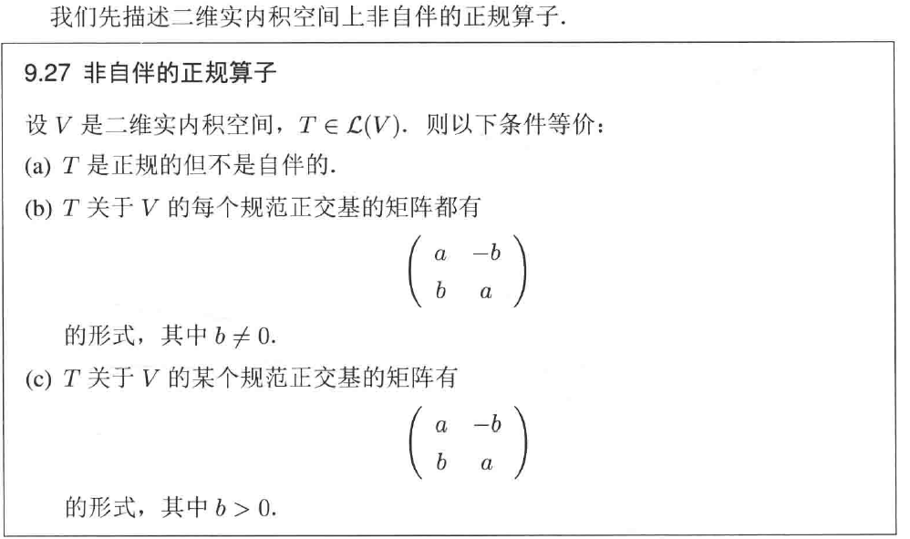

# Chap9 实向量空间上的算子

# Chap9 实向量空间上的算子

## 复化

实数和复数之间存在自然地联系，一个实向量空间 V 可以自然地嵌入到一个复向量空间中。复向量空间上的算子分解我们已经研究过了，自然地会考虑实向量空间如何研究算子的结构。这诱导我们将复向量空间上的算子结果转换到实向量空间上。

首先定义实向量空间的复化。

::: tip definition
**V的复化**
设V是实向量空间
- V的复化(记为$V_C$)等于VxV，其元素是有序对(u,v)，其中u,v∈V，我们记为u+iv
- 定义$V_C$上的加法为：$\left( u_1+iv_1 \right) +\left( u_2+iv_2 \right) =\left( u_1+u_2 \right) +i\left( v_1+v_2 \right)$
- 定义$V_C$上的复标量乘法为：$\left( a+ib \right) +\left( u+iv \right) =\left( au-bv \right) +i\left( av+bu \right)$
:::

这些定义是直观的，从 V 构造 Vc 可以看成是从 Rn 构造 Cn 的推广

容易证明，Vc 是复向量空间，V 的基就是 Vc 的基，Vc(作为复向量空间) 的维数等于 V(作为实向量空间) 的维数

下面可以来定义算子的复化

::: tip definition
**T的复化**
设V是实向量空间，T∈L(V)，T的复化定义为$T_C\left( u+iv \right) =Tu+iTv$的算子$T_C\in \mathcal{L} \left( V_C \right)$
:::

下面是一个理解算子复化的例子

由于前面向量空间的复化表明，实向量空间的基也是其复化的基，则下面命题的证明由定义可得：

::: info lemma
**$T_C$的矩阵等于T的矩阵**
设v1,...,vn是实向量空间V的基，T∈L(V)，则$M\left( T \right) =M\left( T_C \right)$，其中这两个矩阵都是关于基v1,...,vn的矩阵
:::

基于上面的算子复化，可以得到：每个算子都有 1 维/2 维不变子空间

::: info lemma
**每个算子都有1维/2维不变子空间**
非零的有限维向量空间上的每个算子都有1维/2维不变子空间
:::

对于复向量空间是显然的，现在对实向量空间进行分析。
假定 V 是实向量空间，T∈L(V)。复化 Tc 有本征值 a+bi，其中 a,b∈R。因此存在不全为零的 u,v∈V 使得：

$$
\begin{array}{c}
	T_C\left( u+iv \right) =\left( a+bi \right) \left( u+iv \right)\\
	\Rightarrow Tu+iTv=\left( au-bv \right) +\left( av+bu \right) i\\
\end{array}
$$

从而取 U 为 u,v 在 V 中张成，则 U 是 V 的一维/二维的不变子空间

下面来研究复化算子的一些特征。
### 复化的极小多项式

容易发现，对所有正整数 n 和所有 u,v∈V 有：
$$
\left( T_C \right) ^n\left( u+iv \right) =T^nu+iT^nv
$$

从而表明：TC 的极小多项式等于 T 的极小多项式

::: info lemma
**$T_C$的极小多项式等于T的极小多项式**
设V是实向量空间，T∈L(V)，则$T_C$的极小多项式等于T的极小多项式
:::

### 复化的本征值

::: info lemma
**$T_C$的实本征值**
设V是实向量空间，T∈L(V)，λ∈R，则λ是$T_C$的本征值当且仅当λ是T的本征值
:::

下面给出两种证明：

下面表明，Tc 对于本征值 $\lambda$ 和复共轭 $\overline{\lambda }$ 的表现是对称的

::: info lemma
$T_C-\lambda I\text{和}T_C-\overline{\lambda }I$
设V是实向量空间，T∈L(V)，λ∈C，j是非负整数，u,v∈V，则:

$$
\left( T_C-\lambda I \right) ^j\left( u+iv \right) =0\Leftrightarrow \left( T_C-\overline{\lambda }I \right) ^j\left( u-iv \right) =0
$$

:::

使用归纳法可以得到该结论

根据上面的定理，这表明 TC 的非实的本征值成对出现

类似求根公式，我们可以得到奇数维向量空间上的算子有本征值

下面是核心的分析复化算子的性质的内容
### 复化的特征多项式

::: info lemma
**$T_C$的特征多项式**
设V是实向量空间，T∈L(V)，则$T_C$的特征多项式的系数都是实数
:::

从而我们可以将 **有限维实向量空间上的算子的特征多项式定义为其复化的特征多项式**

::: tip definition
**特征多项式**
设V是实向量空间，T∈L(V)，则T的特征多项式定义为TC的特征多项式
:::

特征多项式有下面的性质：

::: info lemma
**特征多项式的次数和零点**
设V是实向量空间，T∈L(V)，则：
- T的特征多项式的系数都是实数
- T的特征多项式的次数为dimV
- T的所有本征值恰为T的特征多项式的所有实零点
:::

由于前面定义的特征度显示性质，我们得到了 **实向量空间下的凯莱 - 哈密顿定理**

::: info lemma
**实向量空间下的凯莱-哈密顿定理**
设T∈L(V)，q是T的特征多项式，则q(T)=0
:::

从而可以证明：

## 实内积空间上的算子

我们首先在实内积空间上重新描述正规算子，接着可以完整的描述实内积空间上的等距同构

### 正规算子

下面得到另一个重要的定理：正规算子限制在不变子空间后仍然是正规的，这将引入归纳法可以刻画正规算子

::: info lemma
**正规算子和不变子空间**
设V是内积空间，T∈L(V)是正规的，U是V的在T下不变的子空间，则
- $U^{\bot}$在T下不变
- U在$T^*$下不变
- $\left( T|_U \right) ^*=\left( T^* \right) |_U$
- $T|_U\in \mathcal{L} \left( U \right) \text{和}T|_{U^{\bot}}\in \mathcal{L} \left( U^{\bot} \right)$都是正规算子
:::

这个定理证明很烦，纯粹的计算

进一步我们可以刻画得到 F=R 时正规算子的刻画

::: info lemma
**F=R时正规算子的刻画**
设V是实内积空间，T∈L(V)，则下面条件等价
- T是正规的
- V有规范正交基使得T关于这个基友分块对角矩阵，对角线上的每个块是1x1矩阵，或者形如
$$
\left( \begin{matrix}
	a&		-b\\
	b&		a\\
\end{matrix} \right) 
$$
的2x2矩阵，且b>0
:::

### 等距同构

::: info lemma
**F=R时等距同构的刻画**
设V是实内积空间，S∈L(V)，则下面条件等价
- S是等距同构
- V有规范正交基使得S关于这个基有分块对角矩阵，其中每个块是由1或者-1构成的1x1矩阵，或者形如
$$
\left( \begin{matrix}
	\cos \theta&		-\sin \theta\\
	\sin \theta&		\cos \theta\\
\end{matrix} \right) 
$$
的2x2矩阵，其中$\theta \in \left( 0,\pi \right)$
:::

