# Chap2 群

## 集合理论

一个群是一个集合，其元素可以被“乘”，而且乘法遵从一定的法则。一个有趣的例子是这类集合中的元素是函数的情形，更具体的，是一种在比较不同系统结构时浮现的函数 (同态)

从上面对群的定义，首先需要定义集合，并研究一些集合的特性

### 集合扩充

::: tip 集合

一个集合X是一个元素的Collection，其中 $x\in X$ 意味着x属于X，即X中的元素列表中包含x
:::

进一步容易定义集合是相等的，等价于两个集合有相同的元素

为了扩充集合的含义，引申出子集的定义：

::: tip 子集

一个集合X的子集S等价于$\mathrm{if} s\in S\quad \Rightarrow s\in X$
:::

并不是所有集合都有元素，因此定义没有元素的集合为 $\emptyset$，代表没有元素的集合

### 集合运算

下面可以来定义集合上的运算了

- 交集
	- 
$$
X\cap Y=\left\{ z\in Z:z\in X\,\,\mathrm{and} z\in Y \right\} 
$$

- 并集
	- 
$$
X\cup Y=\left\{ z\in Z:z\in X\,\,\mathrm{or} z\in Y \right\} 
$$

- 差集
	- 
$$
X-Y=\left\{ x\in X:x\notin Y \right\} 
$$

### 函数

在定义了集合本身的特性后，下面可以来定义元素的操作了，即元素

我们最开始定义的函数是一种映射的思想，现在可以考虑换一个角度来考虑，将其写成一个“图形”的形式，即 (x,f(x))，下面给出这个想法的定义：

::: tip 笛卡尔积(cartesian product)

如果X和Y是集合，我们定义其笛卡尔积(cartesian product) $X \times Y$ 是所有有序对(x,y)的集合，其中 $x\in X\,\,\mathrm{and} y\in Y$
- 更进一步，可以参考[|线性映射章节](./../从线性映射理解线性代数/Chap3-线性映射.md)，可以发现 $\left| X\times Y \right|=\left| X \right|\left| Y \right|$
:::

现在可以在笛卡尔积上定义 **函数** 了

::: tip 函数

一个从X映射到Y的函数f，将其标识为 $f:X\rightarrow Y$，这个函数f是 $X\times Y$ 的一个**子集**，使得 
$$
\forall a\in X,\exists b=f\left( a \right) \in Y
$$

:::

对这样的 f，可以给出一些定义，对 $f:X\rightarrow Y$ 的形式，X 被称为 f 的 **定义域 (domain)**，Y 被称为 f 的 **目标域 (target)**，f 所有的元素构成的集合是 f 的 **值域 (image)**，其是 Y 的子集

给定了函数的定义后，类似集合的部分，可以定义函数上的运算了

::: tip 函数的相等

一个函数 $f:X\rightarrow Y$ 和 $g:X'\rightarrow Y'$ 是相等的，等价于X=X’，Y=Y’而且子集 $f\subseteq X\times Y$ 和子集 $g\subseteq X'\times Y'$ 是相等的
:::

从判定函数的相等的情况来看，一个函数有 3 个部分：
- domain X
- target Y
- 映射关系
我们称两个函数是相等的，等价于这三个子部分相等

由于函数 3 个部分都很重要，因此需要分析不同部分对函数本身的影响。对 domain 来说，可以定义下面的 **函数限制**：

::: tip 限制函数

如果 $f:X\rightarrow Y$ 是一个函数，S是X的子集，那么定义f限制在S上构造了一个新函数：

$$
f|S:S\rightarrow Y,\left( f|S \right) \left( s \right) =f\left( s \right) 
$$

:::

对限制函数而言，可以自然地发现有这样的典范映射：
- S 是 X 的子集，则 **包含关系** 是一个典范映射：$i:S\rightarrow X,i\left( s \right) =s$

类似讨论线性映射的思路，我们可以定义单射和满射：

::: tip 满射 (surjective)

一个函数 $f:X\rightarrow Y$ 是满射的，等价于：

$$
\mathrm{range}f=Y
$$

即任意y属于Y都有某个x属于X使得y=f(x)

:::

::: tip 单射 (injective)

一个函数 $f:X\rightarrow Y$ 是单射的，等价于：

$$
\mathrm{null}f=\left\{ 0 \right\} 
$$

即f(a)=f(b)等价于a=b
:::

下面定义映射的复合

::: tip 复合

如果 $f:X\rightarrow Y$ 而 $g:Y\rightarrow Z$，那么定义复合映射 $g\circ f$ 为：

$$
g\circ f:x\rightarrow g\left( f\left( x \right) \right) 
$$

:::

容易证明，复合运算是可结合的，即 
$$
\begin{array}{c}
	f:X\rightarrow Y,g:Y\rightarrow Z,h:Z\rightarrow W\\
	h\circ \left( g\circ f \right) =\left( h\circ g \right) \circ f\\
\end{array}
$$

线性映射作为一个集合，还可以定义其逆映射，即：

$$
\begin{array}{c}
	f:X\rightarrow Y,g:Y\rightarrow X\\
	\mathrm{s}.\mathrm{t}.f\circ g=g\circ f=1\\
\end{array}
$$

这些都是在线性代数中厘清过的知识，这里不再多提

### 关系

::: tip 关系

给定集合X和Y，X到Y的一个关系是指 $X\times Y$ 的一个子集R(根据前面对映射的定义这也就是一个映射)。如果X=Y，我们说R是X上的一个关系，通常写成 $XRY$

:::

关系实际就是我们研究的线性映射，但我们这里主要关心关系的结构上的性质，而不关心其空间中的意义。因此这里将同构对应的 **等价关系** 定义为具有 3 条性质的关系
- 自反性：$x\equiv x\,\,\forall x\in X$
- 对称性：$x\equiv y\Leftrightarrow y\equiv x\,\,\forall x,y\in X$
- 传递性：$x\equiv y,y\equiv z\Rightarrow x\equiv z\,\,\forall x,y,z\in X$

有了等价关系，我们给定一个 $a\in X$，则可以得到 a 的等价类
::: tip 等价类

$$
\left[ a \right] =\left\{ x\in X:x\equiv a \right\} \subseteq X
$$

:::

等价类一个经典的例子就是整数域上的模运算生成的 mod n 等价类

我们可以把等价类看成一个元素的特征的描述，在这个特征意义下，这个等价类就可以代替元素本身，因此引发我们考虑下面的定理：

::: info lemma
$$
x\equiv y\Longleftrightarrow \left[ x \right] =\left[ y \right] 
$$

:::

使用等价关系的传递性和对称性容易证明上面结论

从集合论的角度来看，等价关系将一个集合划分成了很多块，这是一种 **分割**，我们可以说，等价关系和集合的分割是等价的

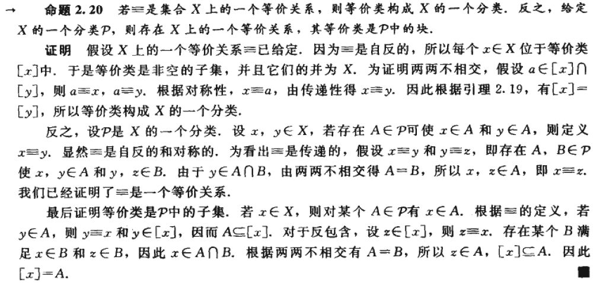

## 置换

::: tip 置换和排列(permutation & arrangement)

- 一个集合X的置换 (permutation)是一个双射 $\alpha :X\rightarrow X$，其中X是一个长度为n的有限集合。
- 一个集合X的排列(arrangement)是一个列表 $x_1,x_2,\cdots ,x_n$ 且不含有X的重复元素
:::

::: note note
置换是一个映射，而排列是置换的值域上的元素
:::

给定一个排列 $x_1,x_2,\cdots ,x_n$，定义函数 $f:\left\{ 1,2,\cdots ,n \right\} \rightarrow X,f\left( i \right) =x_i$，则上面排列是 f 的值域。由于排列上没有重复元素，表明 f 是单射；又因为每个 X 上的元素都出现在排列中，说明 f 是一个满射，从而表明，一个排列定义了一个双射 $f:\left\{ 1,2,\cdots ,n \right\} \rightarrow X,f\left( i \right) =x_i$

举例来说：
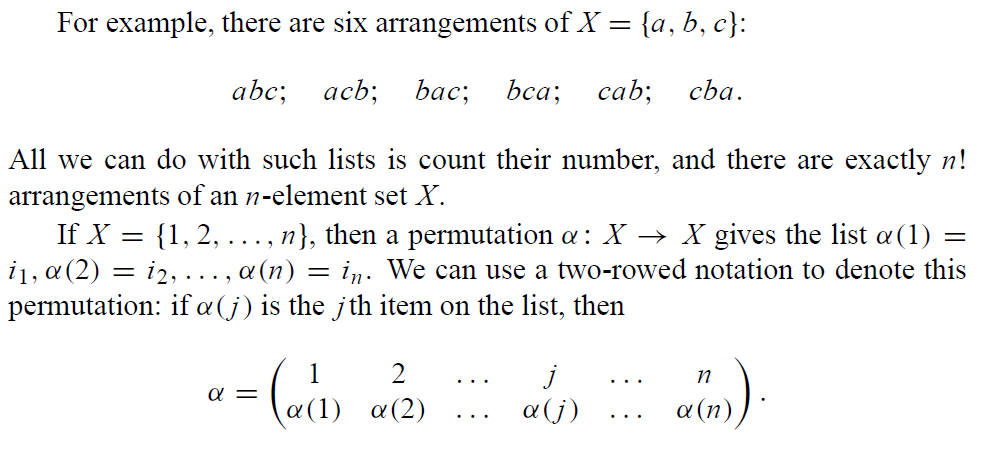
^eqn-two-row-notation-permutation

::: note note
上面描述稍微有点不严谨，置换作用在X上而不是Rn上，不过是同构的，因此加一个复合就行
:::

我们可以说，排列 (lists) 和置换 (双射) 是两个描述集合位置更改的方式，从置换角度看，双射作为映射的好处是可以和别的映射复合，在我们的运算上更加便利

::: tip definition
根据置换的定义，这是一个双射。将所有置换构成的集合记为 $X$，记为 $S_X$，被称为**X上的对称群**。

:::

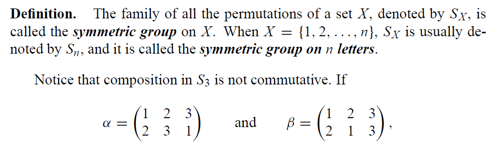

注意这个群上的复合运算是不可交换的（尽管有些可以交换来着）

但对定义的对称群，其满足特别的性质 **消去律**

$$
\mathrm{if} \gamma \circ \alpha =\gamma \circ \beta ,\quad \mathrm{then}\alpha =\beta 
$$

$$

\begin{aligned}
\alpha &=1_{X} \circ \alpha \\
&=\left(\gamma^{-1} \circ \gamma\right) \circ \alpha \\
&=\gamma^{-1} \circ(\gamma \circ \alpha) \\
&=\gamma^{-1} \circ(\gamma \circ \beta) \\
&=\left(\gamma^{-1} \circ \gamma\right) \circ \beta \\
&=1_{X} \circ \beta=\beta
\end{aligned}

$$

类似可以证明：

$$
\mathrm{if}\alpha \circ \,\,\gamma =\beta \circ \gamma ,\quad \mathrm{then}\alpha =\beta 
$$

使用前面定义的 [|二行记号](./)，尽管可以直观的展示映射关系，但对我们理解映射性质带来了干扰：
- 一个置换的平方是什么样子？不能直接看出
- 可以经过多少次置换使得其变为恒等的？

下面针对上面提出的问题，给出一个特殊的置换定义来解决这些问题：

::: tip definition
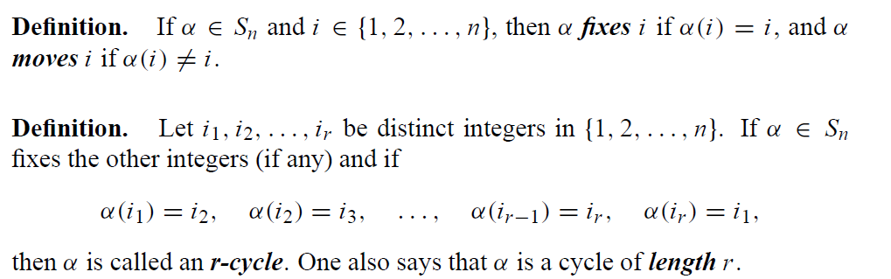
**循环置换**
:::

^eqn-cycle-permutation

::: note comment
已经开始引入对称性了
:::

对上面的定义，一个 2- 循环置换交换 2 个元素，并固定其余所有元素。1- 循环置换则是群上的单位元素。

对比 2 行记号形式，其不能帮我们认识到下面的情形：

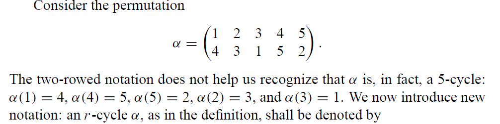

现在，为了更形式化的表述 r- 循环置换，引入新记号：

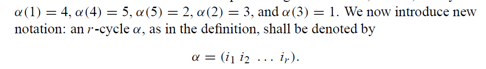

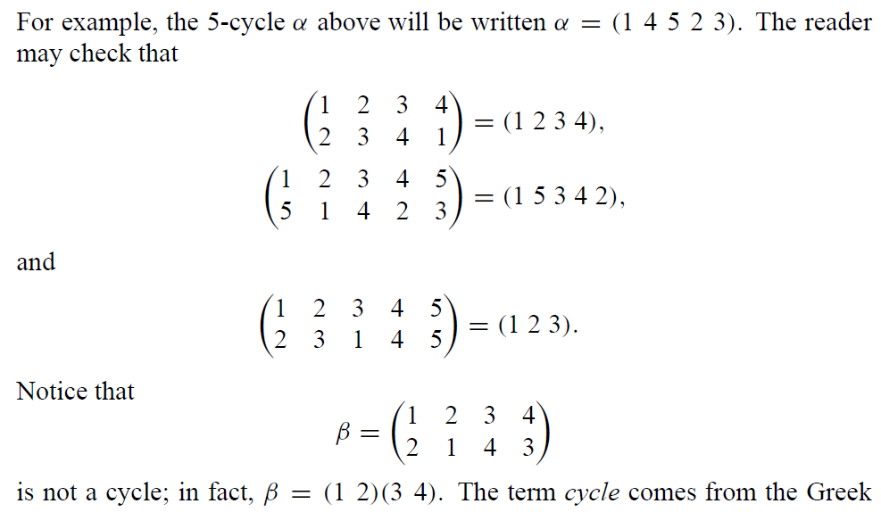

::: note note
可以注意到，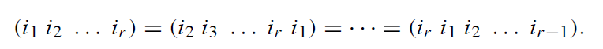

因此一个r-置换有r个不同的记法
:::

### 置换的应用

我们给出一个算法，可将 *置换分解为循环置换的乘积*

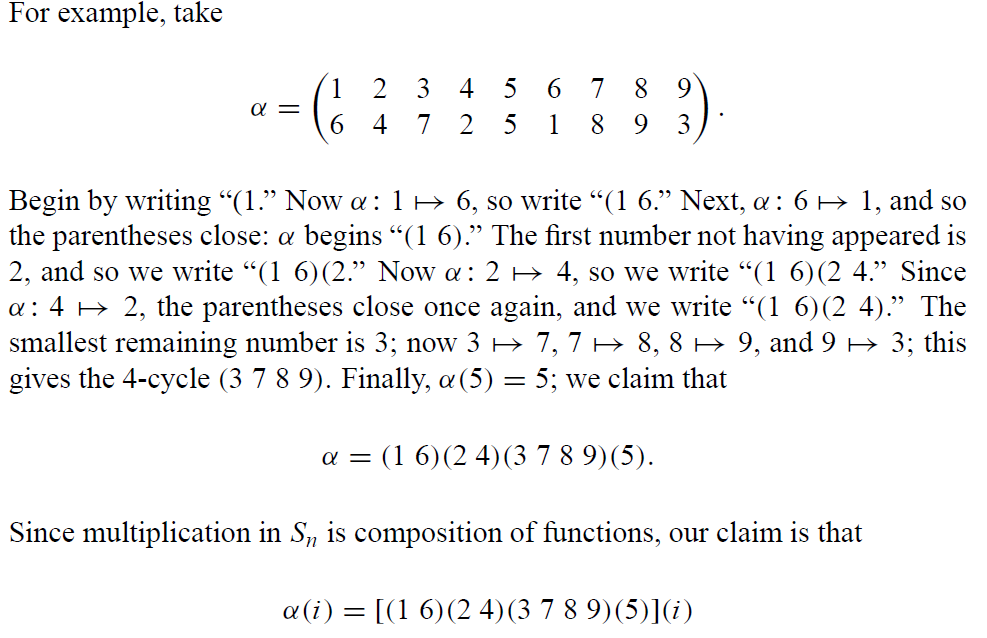

根据上面的复合法则，可以方便的得到置换的表示

但可以注意到，这样的表示方法可能并不是最简单的！比如下面的例子：

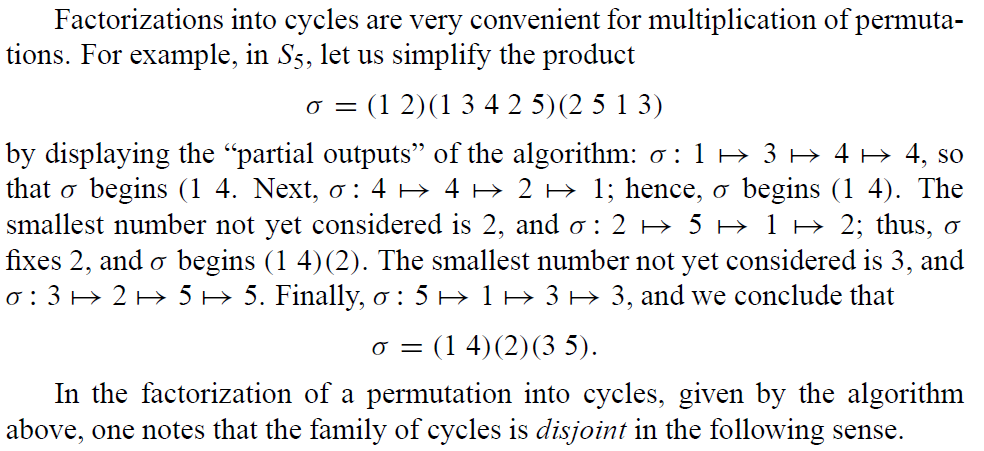

对 $\sigma$ 而言，根据我们的运算规则，实际上可以被化简为

$$
\sigma =\left( 1\quad 4 \right) \left( 2 \right) \left( 3\quad 5 \right) 
$$

### 不相交置换

::: tip definition
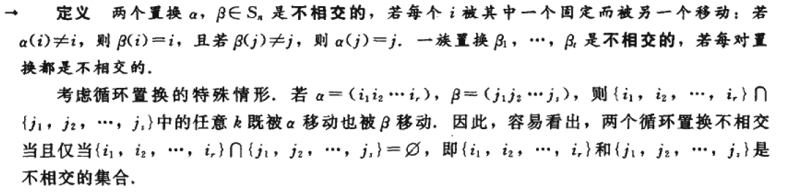
:::

