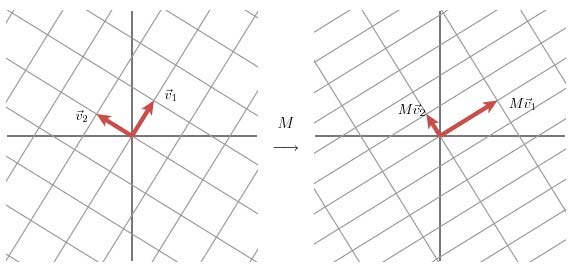
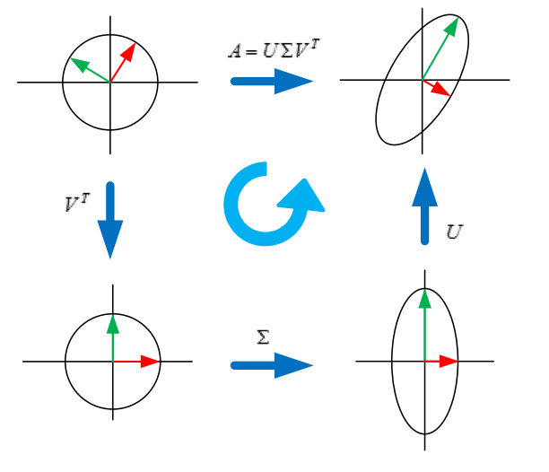
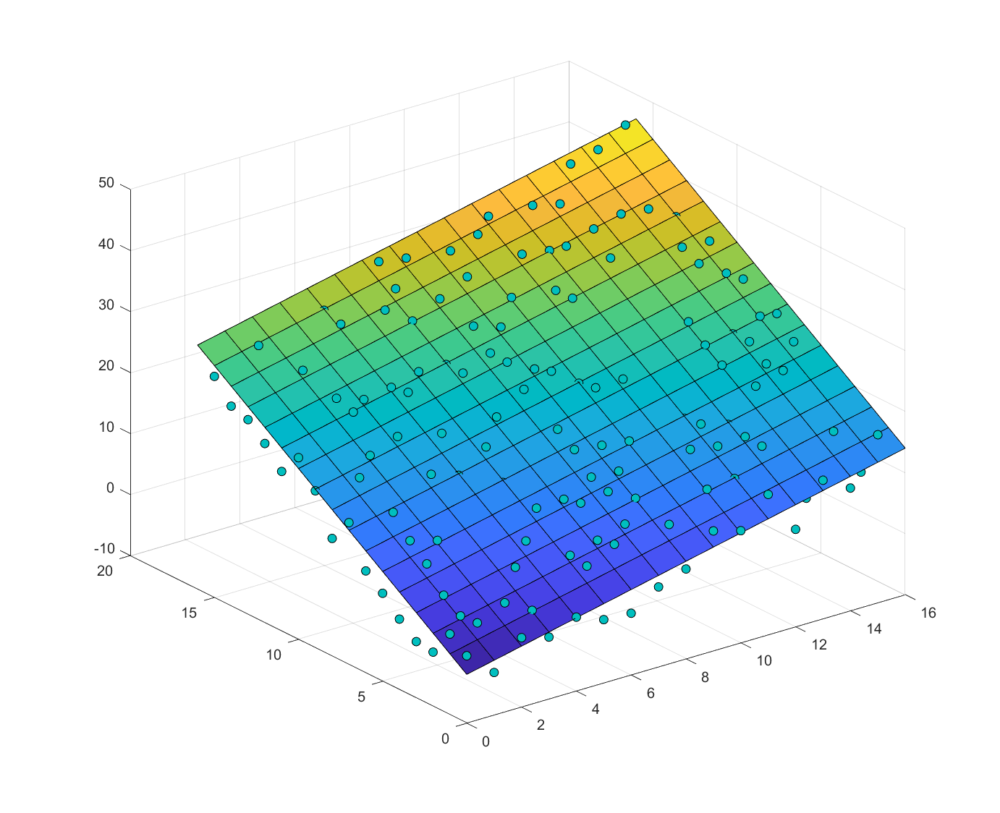

# 奇异值分解


# 奇异值分解

**Purpose**

给出了对于矩阵的两种理解，有阅读必要。

**Thoughts**

剑宗气宗我果然更喜欢气宗。

**Insights**

矩阵表示：代表坐标系或者变换。

## 空间重理解

我们之前提到，一般可实对角化的矩阵对空间中的元素都只做了拉伸变换。但还有一些矩阵对应了旋转、剪切变换，这些矩阵是不存在实特征值的，也就是不能够实对角化。

旋转变换实际上可以通过连续 2 次的反射变换来实现，对应的出现了复特征值。

剪切变换引入了 Jordan 块，从而实现了近似的对角化。

## 奇异值分解

我们之前知道，方针可以通过谱分解或者 Jordan 标准型进行分解化简，那么对一般的矩阵有类似的分解吗？这引入了奇异值分解的思路。

奇异值分解是一个有着很明显的物理意义的一种方法， 它可以将一个比较复杂的
矩阵用更小更简单的几个子矩阵的相乘来表示， 这些小矩阵描述的是矩阵的重要
的特性。

首先从几何角度去理解二维的 SVD：对于任意的 2x2 矩阵，通过 SVD 可以将一个相互垂直的网格变换到另外一个相互垂直的网格。我们可以通过向量的方式来描述这个事实: 首先， 选择两个相互正交的单位向量 $v1$ 和 $v2$, 向量 $Mv1$ 和 $Mv2$ 正交。



$u_1$ 和 $u_2$ 分别表示 $Mv1$ 和 $Mv2$ 的单位向量，有：$\sigma_1 u1 = Mv1$，$\sigma_2 u2 = Mv2$。我们现在可以通过这样的变换关系检验对于任意一个在这样空间中的向量 $x$：


$$
x= (v1x) v1+(v2x)v2
$$


因此意味着：


$$

\begin{aligned}
Mx &= (v1x) Mv1+(v2x) Mv2 \Rightarrow\\
Mx &= (v1x) \sigma_1 u1+(v2x) \sigma_2 u2\\
\end{aligned}

$$


因此最终有：


$$
M=u1\sigma_1 v1^T+u2\sigma_2 v2^T
$$


上面的式子可以表示成：


$$
M=U\Sigma V^T
$$


其中 U 的列向量分别是 $u1, u2$,$\Sigma$ 是一个对角矩阵，对角元素分别是对应的 $\sigma_1 , \sigma_2$，V 矩阵的列向量分别是 $v1, v2$。

这表明了任意的矩阵可以分解成 3 个矩阵。$V$ 代表了原始作用域的标准正交基，$U$ 代表 M 变换后的 co-domain 的标准正交基，$\Sigma$ 代表了 $V$ 中的向量与 $U$ 中向量之间的关系。



事实上我们可以认为，定义在单位⚪上的函数 $|Mx|$ 分别在 $v_1,v_2$ 上取得最大和最小值。通过分析可以证明，该函数取得最优值向量为 $M^TM$ 的特征向量。

::: note note
collapse: open
title: Comment

$$

\frac{\partial <Mx, Mx>}{\partial x}= \frac{(Mx)^T(Mx)}{\partial x}=\frac{x^T(X^TX)x}{\partial x}=2M^TMx

$$

:::


因为 $M^TM$ 是对称矩阵，那么不同特征值对应的特征向量都是相互正交的，我们使用 $v_i$ 表示 $M^TM$ 的所有特征向量。

接下来从分解的角度重新理解前面的表达式 $M=U\Sigma V^T$，我们将 U 使用列向量进行表示，$U=(u_1,u_2,\cdots,u_n)$，其中每一个 $u_i$ 被称为 M 的左奇异向量。

类似的，对于 V 有对应的右奇异向量。矩阵 $\Sigma$ 的对角线元素按照降序排列，被称为 M 的奇异值。将矩阵 M 拆分为和的形式：


$$

M=\sigma_{1} u_{1} v_{1}^{T}+\sigma_{2} u_{2} v_{2}^{T}+\cdots+\sigma_{n} u_{n} v_{n}^{T}=\sum_{i=1}^{n} \sigma_{i} u_{i} v_{i}^{T}=\sum_{i=1}^{n} A_{i}

$$


因此，我们可以把矩阵 M 拆分为多个矩阵的和，其中矩阵的系数 $\sigma_i$ 代表了对应的分解的比重。

### 奇异值分解性质

假定 $M=U^T\Sigma V$，其中 $U,V$ 是正交矩阵 (因为代表了坐标系嘛)，$\Sigma$ 是对角矩阵

1. $\Sigma$ 和 $M$ 具有相同的奇异值，定义矩阵 $M$ 的奇异值是：$\sqrt{\lambda _i\left( M^TM \right)}$ 为第 i 个奇异值

   注意到：
   
$$

   M=U^T\Sigma V\Rightarrow M^TM=V^T\Sigma ^TUU^T\Sigma V
   \\
   =V^T\Sigma ^T\Sigma V
   
$$

   而 $eigen\left( V^T\Sigma ^T\Sigma V \right) =eigen\left( \Sigma ^T\Sigma \right)$，因此其具有相同奇异值。

### 奇异值分解例子

我们可以使用奇异值分解拟合数据。当然，拟合的结果应该是线性的（虽然可以通过一些 trick，e.g. kernel，实现非线性）。

直觉上来看，奇异值分解拟合三维点到一个平面，应该有其三维矩阵（左奇异值）最小处对应的向量为平面的法向分量。实际上确实如此。

计算例子：

```matlab
% svd fitting plane data
x = 0:16;
y = x;

% grid: Mesh(i,j), i->y_index, j_x_index
[X, Y] = meshgrid(x,y);

% standard data
Z_stan = X + 2*Y-2;
% raw data , to be fitting
Z_raw = Z_stan + (rand(size(Z_stan))-0.5)*10;

% get error point list
p_list = zeros(3,16*16);

for i=1:16
    for j=1:16
        p_list(:,i*16+j-16)=[x(i),y(j),Z_raw(j,i)]';
    end
end

% svd data
[U,S,V]=svd(p_list);

% consider the least singular value
a = U(1,3);
b = U(2,3);
c = U(3,3);

% calculate d value: ax+by+cz+d=0
d = -mean(a*X+b*Y+c*Z_raw, 'all');

% error between guess formula data and standard data
Z_guess = -(a/c)*X-(b/c)*Y-d/c;

Z_error = Z_stan - Z_guess;

mean(Z_error, 'all')

figure(1);
surf(X,Y,Z_stan);

hold on;
scatter3(p_list(1,:),p_list(2,:),p_list(3,:),'MarkerEdgeColor','k','MarkerFaceColor',[0 .75 .75])
```

用于拟合的图如下：



参考代码：

[svd_example](./../../../paper/assets/svd_example.m)

## 参考

- [奇异值分解](./)
