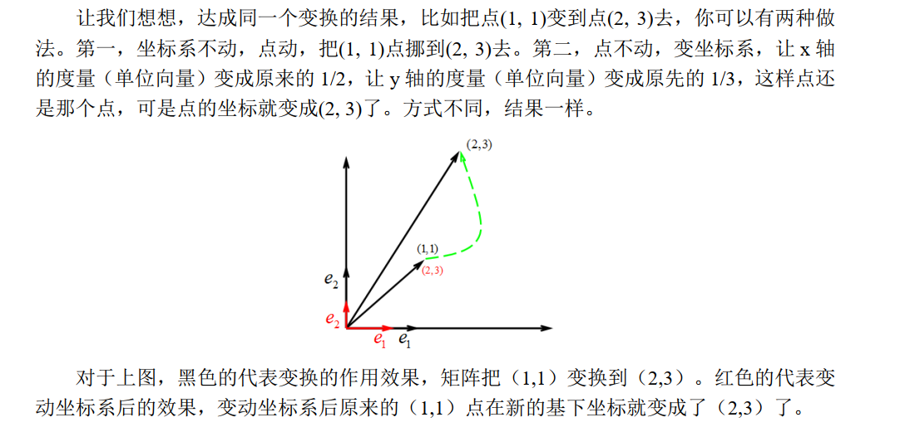

# 矩阵坐标意义和变换意义

# 神奇的矩阵 1

**Purpose**

给出了对于矩阵的两种理解，有阅读必要。

**Thoughts**

剑宗气宗我果然更喜欢气宗。

**Insights**

一个矩阵 R 可以看成是一个坐标系，代表的是从基本空间 I 经过变换 R 得到的空间，也可以看成是一个纯粹的变换 R，这个变换独立于坐标系存在。

旋转矩阵意义：可以看成一种坐标系的变换，也可以看成对向量的变换。对坐标系的变换意义下，坐标系整体发生了改变；对向量变换意义下，坐标系并未切换，向量发生了运动。

## N 维空间

如何定义一个空间？容纳运动是空间的本质特征，因此可以认为：空间是容纳运动的一个对象集合，而变换则规定了对应空间的运动。

回到线性空间，其特点在于：其中任意一个对象，都可以通过选取基和坐标的方法，实现线性化的表征，即向量。

## 坐标系与坐标

在建立了一个线性空间后，首要的一个任务就是寻找到一组基来描述这个空间。这些基底应该满足什么样的性质才能恰当的描述空间呢？就是线性无关 + 维数相同。

我们将一组线性无关的向量放在一起构成的矩阵就描述了这样一个坐标系。

事实上，在写出矩阵的时候，其中每一列代表这组基底中线性无关的一个向量，而我们知道，要将空间中实际的向量映射到我们的数字上，一定需要一组基底。这一组基底是天然的，我们可以认为他是 _ 观察者基底 _。具体来说，这个空间中单位矩阵对应的坐标系就是这个观察者基底，这是自然同构的。

## 矩阵的本质

### 运动

前面提到，线性空间中存放的对象可以通过向量来描述，那么对象所对应的变换应该如何描述？就是矩阵。

为了方便起见，下面讨论的是同一空间中对象的映射，即变换 T 的值域在其定义域中。

## 坐标系的运动

上面介绍到，矩阵可以代表一个运动，这个运动规则可以作用于向量，那么自然的联想到，是否矩阵可以作用于一群向量？矩阵作用于矩阵？

朴素的理解上，我们可以认为矩阵作用于矩阵代表变换作用于变换，也就是变换的叠加 (复合)，但如果参考上面分析，把矩阵看作空间的表示，作为一组向量基，那么会有不同的见解。

举例而言，假设 $\vec{\alpha}_{1}, \vec{\alpha}_{2}, \vec{\alpha}_{3}\cdots \vec{\alpha}_{n}$ 和 $\vec{\beta}_{1},\vec{\beta}_{2},\vec{\beta}_{3}\cdots \vec{\beta}_{n}$ 是线性空间 V 中的两组基，那么 $\vec{\beta}_{1},\vec{\beta}_{2},\vec{\beta}_{3}\cdots \vec{\beta}_{n}$ 可以通过 $\vec{\alpha}_{1}, \vec{\alpha}_{2}, \vec{\alpha}_{3}\cdots \vec{\alpha}_{n}$ 线性表示出来。

$$

\begin{aligned}
&\vec{\beta}_{1}=m_{11} \vec{\alpha}_{1}+m_{21} \vec{\alpha}_{2}+\cdots m_{n 1} \vec{\alpha}_{n} \\
&\vec{\beta}_{2}=m_{12} \vec{\alpha}_{1}+m_{22} \vec{\alpha}_{2}+\cdots m_{n 2} \vec{\alpha}_{n} \\
&\cdots \\
&\vec{\beta}_{n}=m_{1 n} \vec{\alpha}_{1}+m_{2 n} \vec{\alpha}_{2}+\cdots m_{n n} \vec{\alpha}_{n}
\end{aligned}

$$

  写成矩阵的形式有：

$$

\left(\vec{\beta}_{1}, \vec{\beta}_{2}, \vec{\beta}_{3} \cdots \vec{\beta}_{n}\right)=\left(\vec{\alpha}_{1}, \vec{\alpha}_{2}, \vec{\alpha}_{3} \cdots \vec{\alpha}_{n}\right)\left[\begin{array}{l}
m_{11} \quad m_{12}\quad \cdots \quad m_{1 n} \\
m_{21}\quad m_{22}\quad \cdots \quad m_{2 n} \\
\cdots \\
m_{n 1}\quad m_{n 2}\quad \cdots \quad m_{n n}
\end{array}\right]

$$

这样我们得到了旧的基 {$\vec{\alpha}$} 到新的基 {$\vec{\beta}$} 的过渡，称 [M] 为过渡矩阵。

另一方面，如果有一个向量，在基 {$\vec{\alpha}$} 下表示为 {$x$}，在基 {$\vec{\beta}$} 下表示为 {$y$}，那么有：$Ax=By \rightarrow x=My \rightarrow y=M^{-1}x$。由于向量 {$x$},{$y$} 是数字，抽象于具体的坐标系，我们可以认为，将其看成在同一个坐标系下的变换造成了 $x\rightarrow y$，比如让这两个向量在上面提到的自然的观察坐标系下。

从而我们发现，[M] 阵既将坐标系由 {$\vec{\alpha}$} 变到了 {$\vec{\beta}$}，也可以将一个坐标系中的对象进行变换。或者说，固定坐标系下一个对象的变换等价于固定对象所处的坐标系变换。

举例如下：

有一个比较形象的解释，我们可以认为矩阵是一种==环境声明，是在引入的观察者坐标系下进行的声明==。

需要注意到，矩阵乘法不满足交换律，这一点从之前对矩阵的理解也可以看出。矩阵左乘可以看成变换坐标，矩阵右乘则是变换坐标系（基）。

更进一步，矩阵作为一种坐标系（基）来理解的情况，实际上也可以看作是一种变换，即 $A=IA$，是矩阵将观察者坐标系变换到 A 对应坐标系的变换。至此，所有的矩阵都可以统一为一种坐标系之间的变换。

---

此外，还有一种思考方式。

即假设存在 A，B 两坐标系，对 A 系中的任何向量 ($\vec{r}$)，坐标变换 T 将其映射到 B 中，即 $r_B=T r_A$，那么应该有，T 就是 A->B 的坐标变换矩阵，这是存粹的从变换角度思考矩阵意义的情形。

可以写成：

$$

B=[r_{b1}, r_{b2}] = [Tr_{a1}, Tr_{a2}]= TA

$$

这样实现的坐标变换，可以参考 [RPY角和Euler角](./../../../robot/RPY角和Euler角.md)

上面这样的坐标变换 T 也可以结合上面所有矩阵作为变换的角度理解，核心是==影子==。

假定对 A 中的所有矢量 $\vec{r}$, R 将其映射到 B 中的一个矢量，即：

$$

\vec{r_b}=R\vec{r}

$$

那么根据上面的分析，R 是 A->B 的坐标变换矩阵。但需要注意，这里并不适用于之前的坐标变换意义和矢量变换意义的转职关系，正是因为这样的影子关系！这里的 $\vec{r}$ 实际上并不是在 A 中的矢量，而是在 B 中的矢量！

因为坐标系意义和矢量变换意义最大的特点是只存在一个矢量，变换坐标系来看。而这里事实上存在两个矢量，使用坐标系意义来看，==一个矩阵代表向量存在空间的标记==，因此 $\vec{r}$ 是在 B 坐标系下，也可以从下面分析看出：

$$

A\vec{r_b}=AR\vec{r}=B\vec{r}=I(B\vec{r})=I(A\vec{r_b})

$$

可以想象，本来 $\vec{r}$ 存在于 A 中，但随着坐标系变化，其保持在动坐标系下的相对关系，其度量矩阵转移到了 B 坐标系，这正是问题的解。

上面式子 (3) 推到的 $B=TA$ 这里的 $A$ 实际上为 I，因为在计算中只涉及了两个坐标系，$A$ 和 $B$，其中矢量的度量不涉及纯粹的观察坐标系，因此左右无关。而对于前面推导的坐标系变换右乘关系，是在第三个独立于 A,B 坐标系的观察坐标系 $I$ 下推导的，因此更加通用和广泛。

> really?

---

需要注意，纯粹的变换 T 定义是在 A 坐标系下映射到 B 坐标系下，如果想要看其在观察坐标系下的结果，大概是这样：

$$

T_1=BTA^T

$$

可以参考下面的等价与相似。

## 等价与相似

矩阵等价意味着存在可逆矩阵 P, Q 满足 $PAQ=B$，那么 A，B 等价。

其意味着 A，B 拥有相同的维数，矩阵维度不会改变。比如在控制中，维数反映了系统的可观测和可控性的量度，这一点表明两个矩阵拥有相似的控制特征。

矩阵相似本质上是一个变换在不同坐标系下的体现。注意到，我们既然可以将一个空间中的向量抽象化为一个线性空间，自然地，对于同样满足线性关系的线性变换，可以将其抽象成一个线性空间，找到一定的基就能描述这个线性空间。

对于这样一个线性空间中的元素，比如 T，代表了一个映射关系。因为这样的映射关系实际上是独立于每个坐标系的，因此在各个坐标系中的表示就成了一个问题，其中不随着坐标系改变的描述方式就是 [张量](./../张量.md), 而随之改变的就是矩阵描述了。

比如说 T 作用于两组基 $[\alpha]$ 和 $[\beta]$，其中满足 $[\beta]=[\alpha]P$，那么其中对应坐标满足 $x_{\beta}=P^{-1}x_{\alpha}$。假设 T 作用于两组基 $[\alpha]$ 和 $[\beta]$ 上的矩阵描述分别为 $T_{\alpha}$ 和 $T_{\beta}$，那么理论上来讲，在观察者坐标系下，应该有：

$$

B T_{\beta} x_{\beta} = A T_{\alpha} x_{\alpha}\Rightarrow AP T_{\beta} P^{-1} x_{\alpha} = A T_{\alpha} x_{\alpha}

$$

即：$P T_{\beta} P^{-1}=T_{\alpha} \rightarrow T_{\beta} =P^{-1}T_{\alpha} P$。这意味着，相似矩阵实际上是同一个相似变换在不同基下的描述矩阵。

## 矩阵的相似对角化

一个方阵在复数域内一定可以化成 Jordan 标准型。

## 参考

- [【官方双语/合集】线性代数的本质 - 系列合集_哔哩哔哩_bilibili](https://www.bilibili.com/video/BV1ys411472E)
