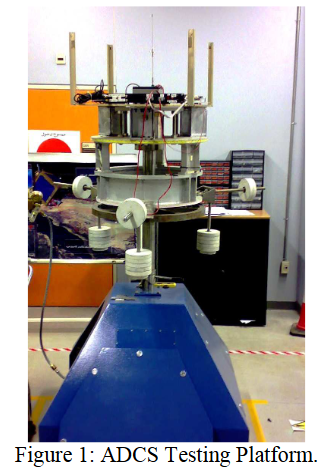
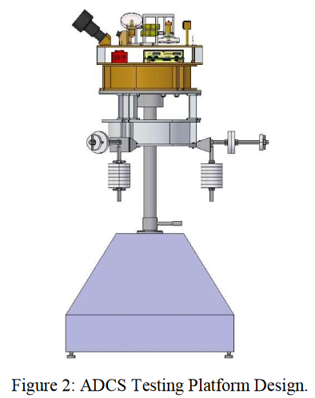

# @al-majedNewTestingPlatform2009

# al-majedNewTestingPlatform2009

## MetaInfo

::: note 文献标题

 A new testing platform for attitude determination and control subsystems: Design and applications
:::

::: note Abstract

This paper presents a new experimental research and development platform for satellite attitude determination and control systems (ADCS). It is designed to easily accommodate any major component of a satellite ADCS. The platform provides a near-zero gravity condition using a Ball-and-Socket air bearing table that provides unconstrained satellite rotational motion. The pressurized air flow is passed through five micro-scale air holes carefully placed inside the socket to provide the required air gap between the socket and the ball. The platform provides full freedom of spin in the yaw axis but roll and pitch motions are constrained to angles of less than ±30 degrees. A special counter balance mechanism has been designed for a wide range of payloads that can be mounted on it. The satellite with its counter balance structure is attached to the ball and is carefully placed on the air cushion using a special mechanism. A dedicated UHF/VHF RF link is designed to allow for remote command and control of payloads under testing. All payloads will be connected to the RF system via a CAN bus. The paper discusses the detailed description of the testing platform and the challenges related to its commissioning and operation. In addition, it presents research projects that could be carried out using the platform including applying advanced robust control theory, system identification, validity tests and sensors integration and calibration in future satellite ADCSs. In particular, a multi-filters multi-sensors estimator is presented for the multiple MEMS gyros array system.
:::

## Contents

装置被设计用来测试卫星姿态调节和控制系统 (ADCS)，提供了一个3自由度旋转零重力测试平台
- 在yaw axis 具有完整自由度
- 在roll and pitch axis被约束在±30°

使用**配重实现重力平衡**

### 机构设计

机构实现零重力完整旋转自由度的方式主要依赖于：
- 它基于一个精确加工的Ball-and-Socket接头，在插座内部小心地放置五个微米级的空气孔
	- 气隙减小了作用在有效载荷上的外部转动力矩，使其内部作动器能够绕组合结构质心自由定向
- 配重块由27个大的+6个小的质量块组成，从而可以调节配重的组成

## 参考

##### 引文

##### 脚注
