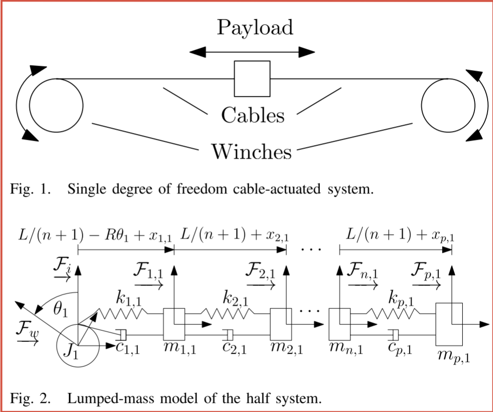

# @caverlyDynamicModelingPassivityBased2015

# caverlyDynamicModelingPassivityBased2015

## MetaInfo

::: note 文献标题

 Dynamic Modeling and Passivity-Based Control of a Single Degree of Freedom Cable-Actuated System
:::

::: note Abstract

In this paper, a lumped-mass dynamic model of a single degree of freedom cable-actuated system is derived, and passivity-based control is considered. The dynamic model developed takes into consideration the changing cable stiffness and mass as the cable is wrapped around a winch. In addition, the change in the winch inertia as the cable is wrapped around the winch is modeled. It is assumed that the mass of the payload is much greater than the mass of the cables and the equivalent mass of the winches, which allows for an approximation where the rigid dynamics can be decoupled from the elastic dynamics of the system. This approximation enables the definition of a modified input torque and modified output rate, allowing the establishment of passive input-output mappings. Passivity-based controllers are investigated, shown to render the closed-loop system input-output stable, and tested in simulation.
:::

> 和 [@caverlyDynamicModelingNoncollocated2014](./@caverlyDynamicModelingNoncollocated2014.md) 基本是一样的构造…

## Contents

### 问题描述

#### 问题背景

#### 前人工作

- group A ^pre-group-A

#### 本文工作

### 实验方法

#### 动力学模型

##### 前提假设

^img-system-model

### 优点缺点

#### 优点

#### 缺点

### 个人评价

## 参考

##### 引文

##### 脚注
