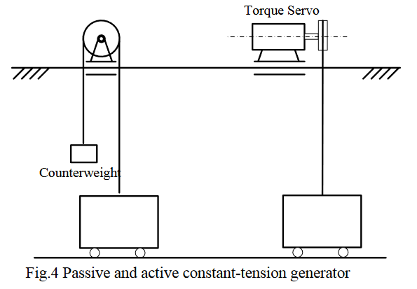
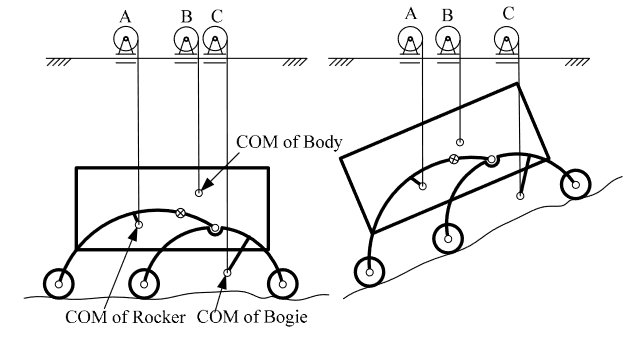
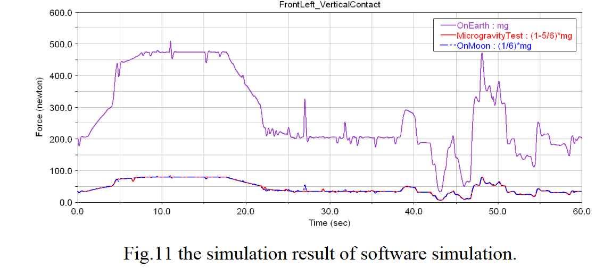

# @dengApproachGravityCompensation2010

# dengApproachGravityCompensation2010

## MetaInfo

::: note 文献标题

 An approach for gravity compensation of planetary rovers
:::

::: note Abstract

Experimental investigation of planetary rovers' behavior requires low gravity (LG) simulation. It is true because rovers may have insufficient power to move and sink much deeper into soft soil in 1-g gravity environment. Constant-tension suspension is considered the best possible way for gravity compensation (GC) of rovers. Constant-tension cable has to be kept vertical, so tension generator mounts an active planar position-servo system to follow the suspended subject. Traditional suspension system, such as that for space arms or satellite reflectors, applies counterbalance forces to the center of mass (CoM) of each moving object of the tested subject. However, this approach is inappropriate for rovers that usually contain multiple moving objects. Such GC system for rocker-bogie rovers contains five constant-tension generators, five active planar position servos, and multiple on-rover attitude sensors. It's far too complicated and unnecessary. By analysis on gravitational effects on rovers, this paper brings forward the conclusion that keeping pressure of each wheel is sufficient and necessary to ensure all concerned low gravity behaviors of rovers. Applying counterbalance forces to CoM of all the moving objects is proven unnecessary. Compensation forces required to ensure wheel pressures are derived. Single constant-tension suspension system for rover is invented accordingly, the schematic diagram of which is shown. The system includes a novel passive force-distribution mechanism to distribute compensation force to wheels. Software simulation results are presented to validate the work of this paper.
:::

## Contents

作者使用了constant-tension suspension 装置来完成对rovers的重力补偿

### 机构描述

使用counterweight的被动恒拉力装置具有下面的缺点：
- 限制了系统的带宽 (limits system bandwidth)
- 在加速/减速的过程中存在摆动
因此作者使用了torque servo的主动恒拉力装置

对rovers这种多部件结构，使用了多个（5个）torque servo来完成力矩输出，并且每个力矩电机被安置在一个2自由度位置伺服电机上来保证绳索竖直

最后的仿真结果如上图，蓝线是月球上的模拟结果，红线是使用了重力卸载装置的在地面上的模拟结果

我个人觉得论文这个结论有点草率
- 首先是没有实际实验验证，因为完全可以通过增加力传感器来测量施加的外力，从而得到输出的外力响应结果。对这种复杂过程的仿真很难具有比较大的说服力；
- 其次是使用了理论的伺服电机力矩模式输出，如何得到伺服电机的仿真的传递函数？

总之我觉得不太行这篇文章

## 参考

##### 引文

##### 脚注
