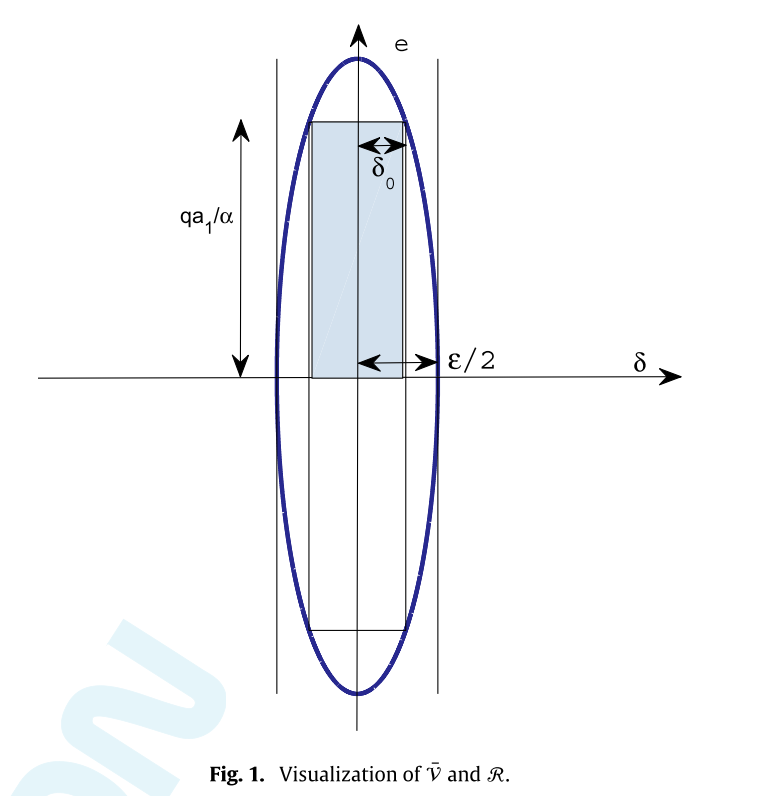
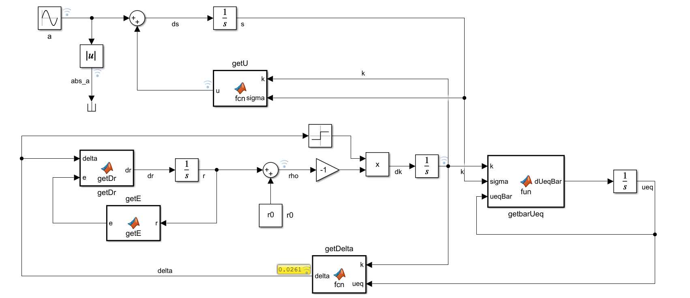
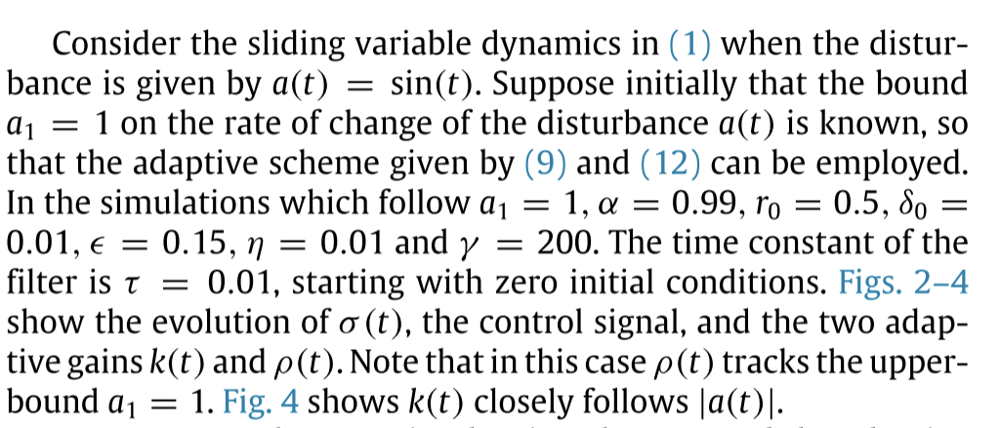
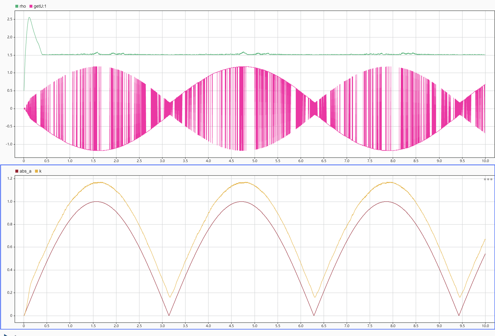
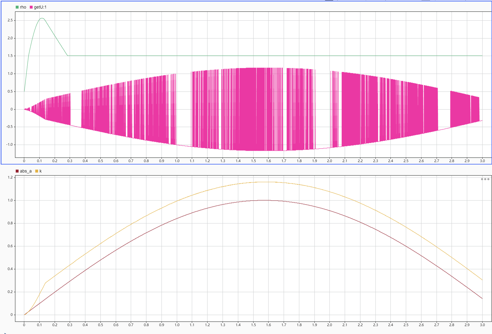
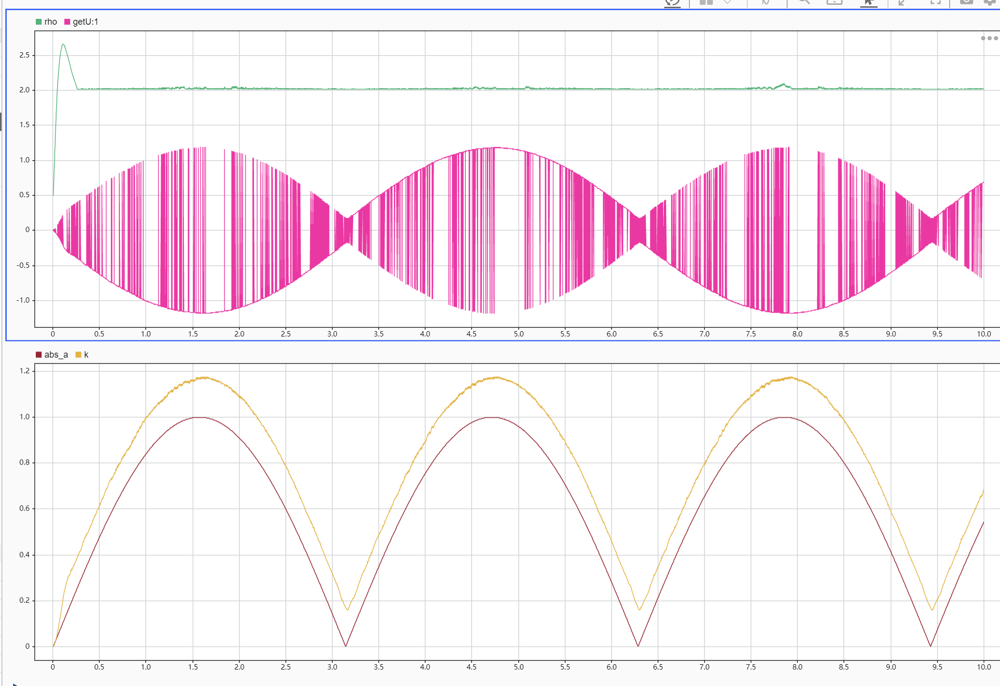
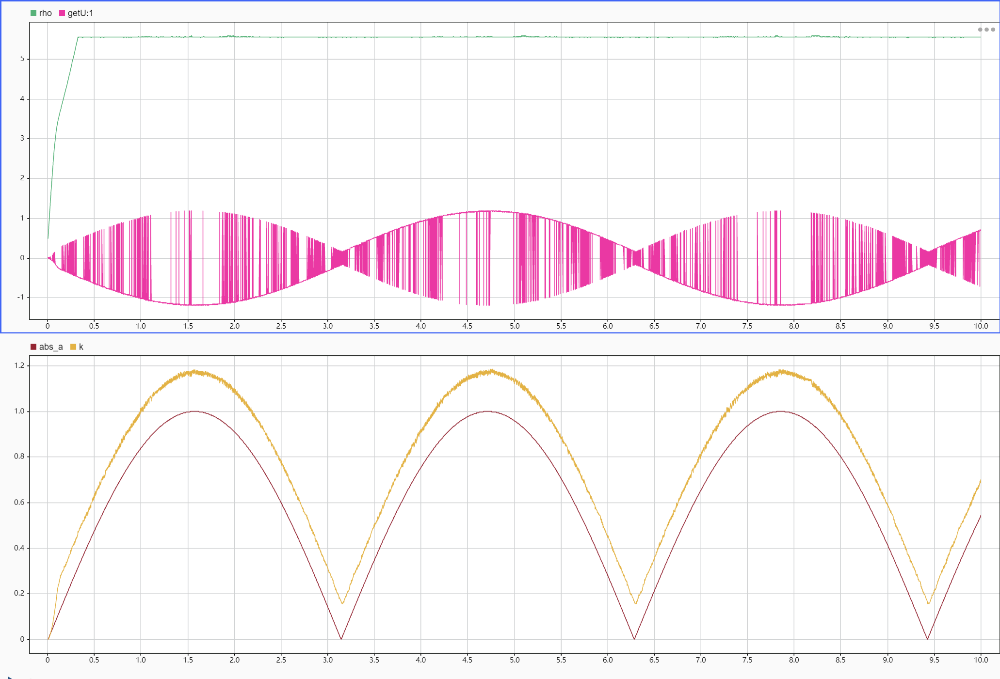

# edwardsAdaptiveContinuousHigher2016

## MetaInfo

::: note 文献标题

 Adaptive continuous higher order sliding mode control
:::

::: note Abstract

This paper is concerned with the development of an adaptation structure which can be applied to conventional, super-twisting and higher-order sliding mode schemes. The objective is to alter the modulation gains associated with these schemes in such a way that they are as small as possible to mitigate chattering effects, but large enough to ensure that sliding can be maintained in the presence of bounded and derivative bounded uncertainties. In all the proposed schemes, the equivalent control is used to drive the adaptive mechanism. The approach is based on a novel dual layer nested adaptive methodology which is quite different to the existing schemes proposed in the sliding mode literature. The new adaptive schemes do not require knowledge of the minimum and maximum allowed values of the adaptive gain, and in their most general form, do not require information about the bound on the disturbances and their derivatives.
:::

## Contents

### 问题描述

#### 问题背景

1. The insensitivity and finite time convergence properties en-joyed by sliding mode controllers make them a useful approachfor systems with significant uncertainties
	1. these robust-ness properties come at a cost, usually termed ‘chattering’, result-ing from high frequency switching of the control signal
2. Higher-order-sliding-modes offers significant chattering mitigation through **increasing the input-output relative degree**, providing continous signal
	1. contains structure pre-calculated by some bounds on the uncertainties (or derivatives of uncertainties )
	2. conservative upper bound are used to gurantee that sliding will take place
		1. conservation exacerbates chattering associated with the implementation
3. Motivate #ASMC whereby the gains in controller adapt to a level where they are as small as possible and yet gurantee sliding is maintained

#### 前人工作

#### 前人缺陷

#### 本文工作

1. propose new equivalent control-based adaptive schemes for conventional , super-twisting and continous higher order sliding mode control algorithms
2. the scheme allows magnitude and rate of change of the controller parameters to adapt whilst guranteeing a sliding motion

#### 本文意义

### 实验方法

#### SISO Formulation

##### Problem Reform

consider a fitst-order sliding mode equation representing the dynamics of the switching variable:

$$
\dot{\sigma}\left( t \right) =a\left( t \right) +u\left( t \right) 
$$

^eqn-siso-formualtion

assume that $|a(t)|<a_0$ and $|\dot{a}(t)|<a_1$, consider the control law:

$$
u\left( t \right) =-\left( k\left( t \right) +\eta \right) \mathrm{sign}\left( \sigma \left( t \right) \right) 
$$

^eqn-siso-control-law

where $\eta$ is a small positive design constant and $k(t)$ is a varing scalar term

Note that when $k(t)>|a(t)|$, the $\eta$ -reachability condition $\sigma \dot{\sigma}<-\eta \left| \sigma \right|$ is satisfied

::: note note
should be $k(t)+\eta > |a(t)|$??
:::

Based on previous paper, during sliding motion ($\sigma = 0$), the so called equivalent contol $u_{eq}(t)$ should maintain $\dot{\sigma} = 0$, so that $u_{eq}(t) = -a(t)$. Because a is unknown, we can obtain a **close approximation** by taking low-pass filter of the switch signal u(t):

$$
\dot{\bar{u}}_{eq}=\frac{1}{\tau}\left( -\left( k\left( t \right) +\eta \right) \mathrm{sign}\left( \sigma \left( t \right) \right) -\bar{u}_{eq}\left( t \right) \right) 
$$

Based on previous paper, when $\tau>0$ is small enough, $\left| \bar{u}_{eq}\left( t \right) -u_{eq}\left( t \right) \right|$ can be small enough.

::: note Assumption
exists a scalar $1>\epsilon_{1}>0$ and $\epsilon_0>0$ such that:

$$
\left| \left| \bar{u}_{eq}\left( t \right) \right|-\left| u_{eq}\left( t \right) \right| \right|<\epsilon _1\left| u_{eq}\left( t \right) \right|+\epsilon _0
$$

holds for all time after a finite time $t_eq$, to allow for the (fast) dissipation of the effects of the initial condition of the filter
:::

^assum-1

Introduce a *safety margin*, rewrite the **objective**:

$$
k\left( t \right) >\frac{1}{\alpha}\left| \bar{u}_{eq}\left( t \right) \right|+\epsilon 
$$

where $0<\alpha<1$ and $\epsilon>0$ are **designed scalar**(depending on $\epsilon_0$ and $\epsilon_{1}$) chosen to ensure the estimate $\bar{u}_{eq}(t)$ satisfies:

$$
\frac{1}{\alpha}\left| \bar{u}_{eq}\left( t \right) \right|+\frac{\epsilon}{2}>\left| u_{eq}\left( t \right) \right|
$$

Now define an error variable:

$$
\delta \left( t \right) =k\left( t \right) -\left( \frac{1}{\alpha}\left| \bar{u}_{eq}\left( t \right) \right|+\epsilon \right) 
$$

^eqn-siso-error

Notice that when $\delta =0$ the $k(t)>|u_{eq}(t)|>|a(t)|$, so the target is to forcing $\delta \left( t \right) \rightarrow 0$, so that the $k(t)+\eta > |a(t)|$ can be guranted.

::: note note
1. this methodology is basically to broaded the sliding manifold
2. the trick here is to introduce a small constant to seperate target and approximation 
:::

::: danger corollary
Till now, the problem is reformed as a **tracking problem**, target is to gurantee error variable $\delta \rightarrow 0$
:::

##### New Methodology

The k(t) in [^eqn-siso-control-law](./#^eqn-siso-control-law) can will be formed below:

$$
\dot{k}\left( t \right) =-\rho \left( t \right) \mathrm{sign}\left( \delta \left( t \right) \right) 
$$

^eqn-siso-k-adapt

**In this paper**, author give a form of $\rho$ as :

$$
\rho(t)=r_0+r(t)
$$

Based on different prior knowledge of uncertainties , different adaption law is proposed

###### When Bound a1 is Known

::: note Assumption
In this subsection, $a_0$ is assumed to be unknown but bounded, but $a_1$ is available, i.e. the worst case rate of change of the disturbances 
:::

define :

$$
e\left( t \right) =\frac{qa_1}{\alpha}-r\left( t \right) 
$$

where *user-define* scalar $q>1$ is a safety margin chosed to ensure:

$$
\left| \frac{\mathrm{d}}{\mathrm{d}t}\left( \bar{u}_{eq}\left( t \right) \right) \right|<qa_1
$$

^eqn-q-design

Give the adaption scheme :

::: tip definition
$$
\dot{r}\left( t \right) =\gamma \left| \delta \left( t \right) \right|+r_0\sqrt{\gamma}\mathrm{sign}\left( e\left( t \right) \right) 
$$

where $\gamma>0$ is a design scalar
:::

^eqn-siso-a1-adapt

By analysing the Lyaponov function:

$$
V=\frac{1}{2}\delta ^2+\frac{1}{2\gamma}e^2
$$

and can ensure:

$$
\dot{V}\leqslant -r_0\sqrt{2V}
$$

so $\delta(t)$ and $e(t)$ converge to 0 in finite time, and makes k satisfy condition

###### When Bound a1 and a0 Are Both Unknown

since $a_1$ is unknown, update the adaptive scheme as below:

$$
\dot{r}\left( t \right) =\begin{cases}
	\gamma \left| \delta \left( t \right) \right|\\
	0\\
\end{cases}\quad \begin{array}{c}
	\mathrm{if} \left| \delta \left( t \right) \right|>\delta _0\\
	\mathrm{otherwise}\\
\end{array}\quad \quad 
$$

where $\delta_{0}>0$ is a designed scalar

::: info theorem
Consider above dual-adaptive sliding mode control law, and the uncertainties $a(t)$ satisfy: $|a(t)|<a_0$ and $|\dot{a}(t)|<a_1$, where $a_0$ and $a_1$ are finite but unknown.

If choose $\epsilon$ to satisfy :

$$
\frac{1}{4}\epsilon ^2>\delta _0+\frac{1}{\gamma}\left( \frac{qa_1}{\alpha} \right) ^2
$$

for **any given** $\delta_{0}$ and $a_1$, then the control law forces $|\delta(t)|<\epsilon/2$ in finite time and consequently ensures a sliding motion can be sustained.
:::

^themrem-siso-a0-a1

::: note remark
1. The scalar $\delta_0$ needs to be larger than noise or computational errors
2. The user defined parameters $\epsilon$, $\alpha$ are the safety factors whilst $q$ reflects the accuracy associated with the estimation of the equivalent control
3. **though $a_1$ is unknown, by selecting the adaptive gain $\gamma$ sufficiently large (to dominate $a_1$), for any value of $\delta_0$
, $q$ and $a_1$ there always exists an $\epsilon$ to ensure [^themrem-siso-a0-a1](./#^themrem-siso-a0-a1) is satisfied**
	1. the order of magnitude of $a_1$ should be known
	2. or can be choosed by simulation
:::

::: note note
看看人家怎么写解释的
:::

##### Example

### 优点缺点

#### 优点

- based on a dual-layer adaptive approach, **do not rely** on uncertainties
- adaptive idea can be deploy to conventional , super-twisting , higher-order control structure

#### 缺点

1. not actually model-free
2. the accuracy of second-order method is low, and the direct method has chattering

### 个人评价

1. Normal
2. the idea of deploy adaptive law to other control scheme is great
3. some tricks applied in demonstration is great

#### 复现实验

我用 simulink 尝试复现其中的 Example 1，即最简单的 SISO 的模型，模型如下：

环境为: Matlab 2022a

[asmc_edward_init](./assets/asmc_edward_init.mlx)

[asmc_edward](./assets/asmc_edward.slx)

作者给出了相关的参数，除了 $q$ 这个自定义的参数。

> 不得不吐槽，这个方法参数怎么这么多

由于没有给定 q，论文中给了一个 q 的设计准则：

[^eqn-q-design](./#^eqn-q-design)

这里的 $a_1$ 取 1，那么需要 q 大于 $\bar{u}_{eq}$ 的微分，即大概是 a 的微分，那么 q>1 就可以了

::: note note
不得不吐槽，这作者设计的算法仿真真的感觉有问题，太容易受扰动了，至少我用adaptive的结果太慢了，只能用定点的0.001步长仿真
:::

::: note note
还有一点可以吐槽，这个作者画的图，比如fig4，纵坐标轴都到3去了，误差就算在0.2也看不出来
:::

###### 仿真 1：q=1

::: note note
取0.0001的步长仿真3s结果为：

所以不是我仿真不行，是这个算法真的不对
:::

###### 仿真 2：q=1.5

可以看到形式上和作者结果一样，但是精度实在太差

###### 仿真 3：q=5

真的不对
