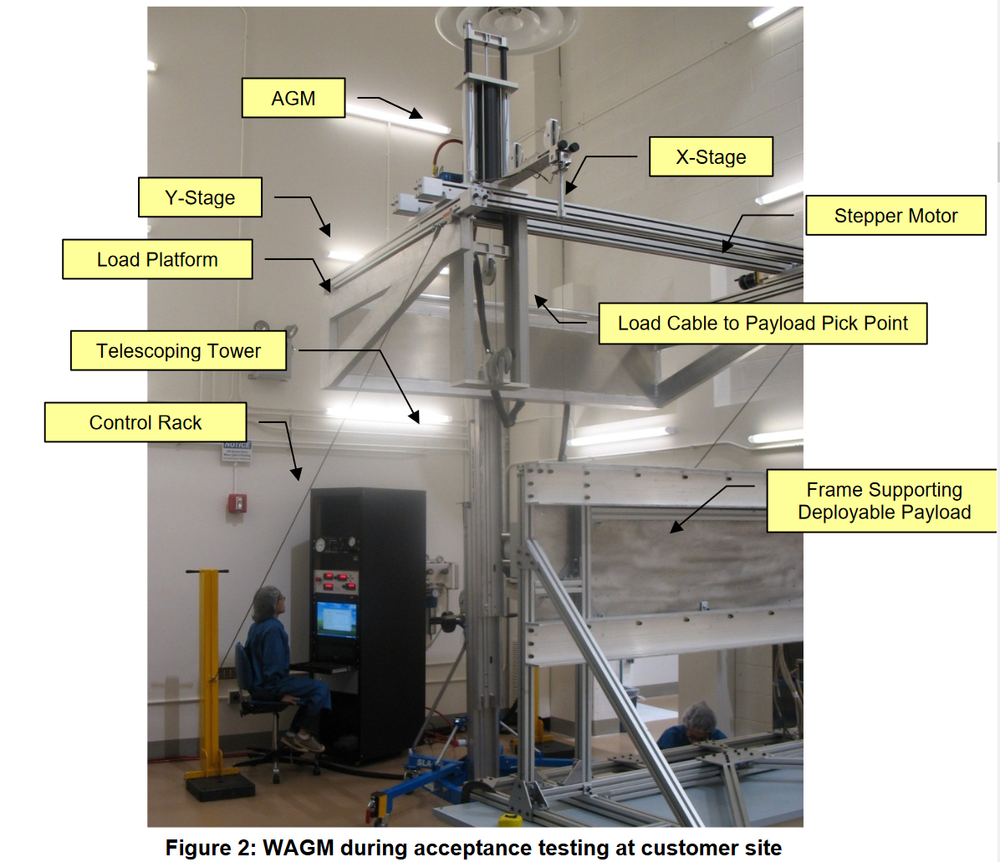
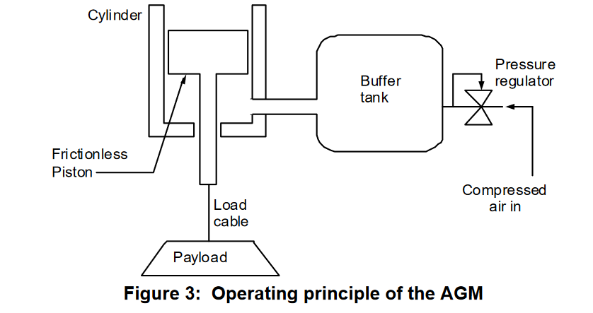
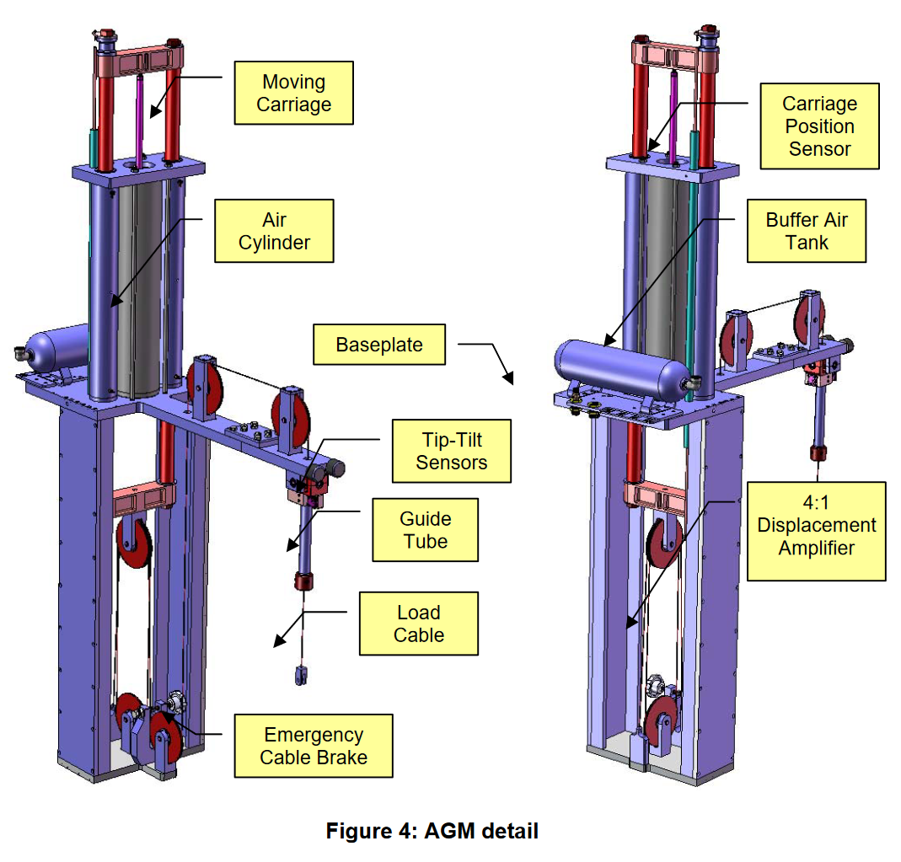

# @hanGravityOffloadingSystemLargeDisplacement2010

# hanGravityOffloadingSystemLargeDisplacement2010

## MetaInfo

::: note 文献标题

 Gravity-Off-loading System for Large-Displacement Ground Testing of Spacecraft Mechanisms
:::

::: note Abstract

Gravity-off-loading of deployable spacecraft mechanisms during ground testing is a long-standing problem. Deployable structures which are usually too weak to support their own weight under gravity require a means of gravity-off-loading as they unfurl. Conventional solutions to this problem have been helium-filled balloons or mechanical pulley/counterweight systems. These approaches, however, suffer from the deleterious effects of added inertia or friction forces. The changing form factor of the deployable structure itself and the need to track the trajectory of the center of gravity also pose a challenge to these conventional technologies. This paper presents a novel testing apparatus for high-fidelity zero-gravity simulation for special application to deployable space structures such as solar arrays, magnetometer booms, and robotic arms in class 100,000 clean room environments
:::

## 🏵️我应该关心的结果

## Contents

### 以往方案

- helium-filled balloons
- mechanical pulleys/counterweight system

存在问题：

- 附加惯性力
- 摩擦力

- 一种常见的重力卸载可展开结构的方法忽略了最困难的自由度 (垂直)，并且仅限于只涉及一个或两个水平自由度的平移的应用。在这种方法中，**顶置空气轴承或沿水平方向移动的滚珠轴承**在展开时承载有效载荷重量
	- 这种方法的局限性在于，它不仅人为地限制了垂向自由度，而且对有效载荷施加了人为的横向拖曳力。
- 利用浮子在水箱中的浮力系统可以提供大范围的水平运动
	- 存在高粘滞阻尼和过大的竖向刚度
	- 顶置氦气球解决了其中一些问题，但增加了至少16 %的有效载荷质量，这是动态测试中的一个重要限制
- 其他重力卸载方法使用绳索系统提供拉力，将一个简单的线性弹簧与每个绳索串联
	- 绳索存在虚签可能，因此只用于竖直方向施加力

### 本文方案

提出了一种3自由度的重力卸载装置（WAGM），其核心是AGM技术 (Anti-Gravity-Machine)：一种单自由度重力卸载装置，可以提供大范围的配重，支持从几厘米到更大范围的垂直行程，具有任意低的刚度，零静态挠度，很小的附加质量，**零摩擦**

AGM实际上是一个可调节气压的空气弹簧，负载由在紧密贴合的气缸内垂直运动的空气活塞产生的力来支撑

## 参考

##### 引文

##### 脚注
