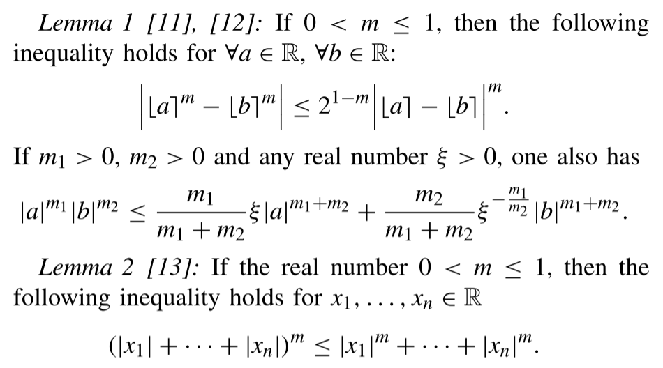

# @liuSecondOrderSlidingMode2021

# liuSecondOrderSlidingMode2021

## MetaInfo

::: note 文献标题

 Second-Order Sliding Mode Control Design Subject to an Asymmetric Output Constraint
:::

::: note Abstract

In this brief, a novel second-order sliding mode (SOSM) control method is developed to solve the asymmetric output constraint problem by using a power integrator and barrier Lyapunov function (BLF). The new BLF is first constructed based on the asymmetric constraint condition. A novel SOSM algorithm is then constructed for the nonlinear systems with an asymmetric output constraint. Under the proposed SOSM algorithm, the output of the resulting closed-loop system will never escape from the asymmetric constraint. Finally, a pendulum system is adopted to verify the validity of the theoretical results.
:::

## Contents

### 问题描述

#### 问题背景

1. First order sliding mode (FOSM) has 2 obstacles
	1. [Liu et al_2021_Second-Order Sliding Mode Control Design Subject to an Asymmetric Output](.//)
	2. [Liu et al_2021_Second-Order Sliding Mode Control Design Subject to an Asymmetric Output](.//)
		1. especially for high-order nonlinear systems
2. pratical system has confined outputs
	1. eg. the sideslip angle of an electric vehicle should be constrained within a small range

#### 问题难点

**[Liu et al_2021_Second-Order Sliding Mode Control Design Subject to an Asymmetric Output](.//)**

#### 前人工作

results can be divided into 2 types:
1. [Liu et al_2021_Second-Order Sliding Mode Control Design Subject to an Asymmetric Output](.//)
	1. complicated since implementation depend on computationally intensive algorithms
2. [Liu et al_2021_Second-Order Sliding Mode Control Design Subject to an Asymmetric Output](.//)
	1. [Liu et al_2021_Second-Order Sliding Mode Control Design Subject to an Asymmetric Output](.//)^blf-fault

Inspired by [^blf-fault](./#^blf-fault)
- [Liu et al_2021_Second-Order Sliding Mode Control Design Subject to an Asymmetric Output](.//)
	- [Liu et al_2021_Second-Order Sliding Mode Control Design Subject to an Asymmetric Output](.//)
#### 本文工作

- [Liu et al_2021_Second-Order Sliding Mode Control Design Subject to an Asymmetric Output](.//)
	- [Liu et al_2021_Second-Order Sliding Mode Control Design Subject to an Asymmetric Output](.//)
	- [Liu et al_2021_Second-Order Sliding Mode Control Design Subject to an Asymmetric Output](.//)
	- [Liu et al_2021_Second-Order Sliding Mode Control Design Subject to an Asymmetric Output](.//)

#### 本文意义

- [Liu et al_2021_Second-Order Sliding Mode Control Design Subject to an Asymmetric Output](.//)
- [Liu et al_2021_Second-Order Sliding Mode Control Design Subject to an Asymmetric Output](.//)
- [Liu et al_2021_Second-Order Sliding Mode Control Design Subject to an Asymmetric Output](.//)

### 实验方法

#### Preliminaries and Problem Statement

> Notion:
> - $\delta_1$ and $\delta_2$ are positive constants
> - $\mathbb{D} _1=\left\{ s_1:-\delta _1<s_1<\delta _2 \right\}$
> - $\mathbb{D} _2=\mathbb{D} _1\times \mathbb{R}$
> - $\lfloor x\rceil^{\alpha}$ denotes $\left| x \right|^{\alpha}\mathrm{sign}\left( x \right)$
> 	- $\alpha >0$

##### Preliminaries

- 

##### Problem Statement

nonlinear system:

$$
\dot{x}=G\left( t,x \right) +H\left( t,x \right) u,\qquad s=s\left( t,x \right) 
$$

^eqn-nonlinear-system

where $x\in \mathbb{R}^n, u\in \mathbb{R}$ is state and input, $s(t,x)$ is output function(i.e., the sliding variable)

#todo

#### Construct BLF and SOSM Controller

#### Application to Pendulum System

### 优点缺点

#### 优点

#### 缺点

### 个人评价
