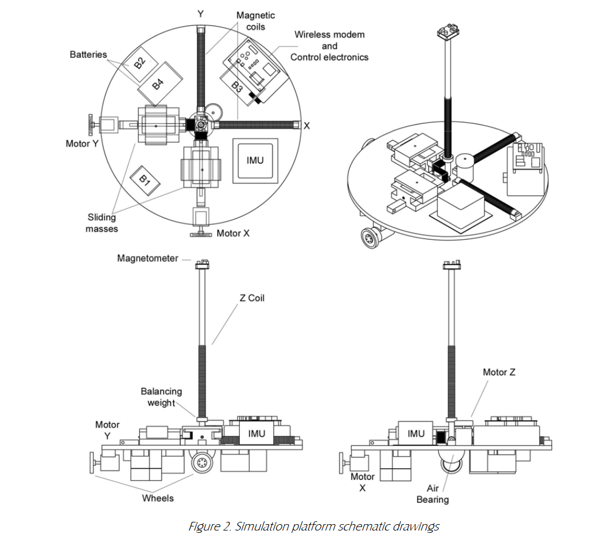
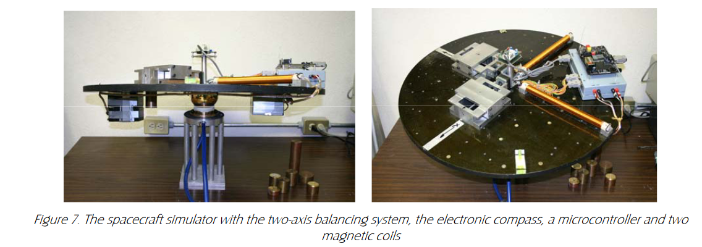
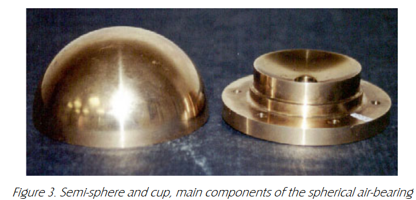

# @molinaThreeaxisAirbearingBased2005

# molinaThreeaxisAirbearingBased2005

## MetaInfo

::: note 文献标题

 Three-axis air-bearing based platform for small satellite attitude determination and control simulation
:::

::: note Abstract

A frictionless environment simulation platform, utilized for accomplishing three-axis attitude control tests in small satellites,is introduced. It is employed to develop, improve, and carry out objective tests of sensors, actuators, and algorithms in theexperimental framework. Different sensors (i.e. sun, earth, magnetometer, and an inertial measurement unit) are utilizedto assess three-axis deviations. A set of three inertial wheels is used as primary actuators for attitude control, together withthree mutually perpendicular magnetic coils intended for desaturation purposes, and as a backup control system. Accuratebalancing, through the platform’s center of mass relocation into the geometrical center of the spherical air-bearing,significatively reduces gravitational torques, generating a virtually torque-free environment. A very practical balancingprocedure was developed for equilibrating the table in the local horizontal plane, with a reduced final residual torque. Awireless monitoring system was developed for on-line and post-processing analysis; attitude data are displayed and stored,allowing properly evaluate the sensors, actuators, and algorithms. A specifically designed onboard computer and a set ofmicrocontrollers are used to carry out attitude determination and control tasks in a distributed control scheme.The main components and subsystems of the simulation platform are described in detail.
:::

## Contents

基本上来说其结构和 [@saulnierSixdegreeoffreedomHardwareintheloopSimulator2014](./@saulnierSixdegreeoffreedomHardwareintheloopSimulator2014.md) 很像：

::: note note
特别是这个半球形空气轴承：

:::

但是他们最大的区别是动力来源，本文是动量轮（位置）+磁性线圈（姿态），而跟后面的那篇6自由度文章使用的是真实的推进器

不过这个结构确实看起来挺好

## 参考

##### 引文

##### 脚注
