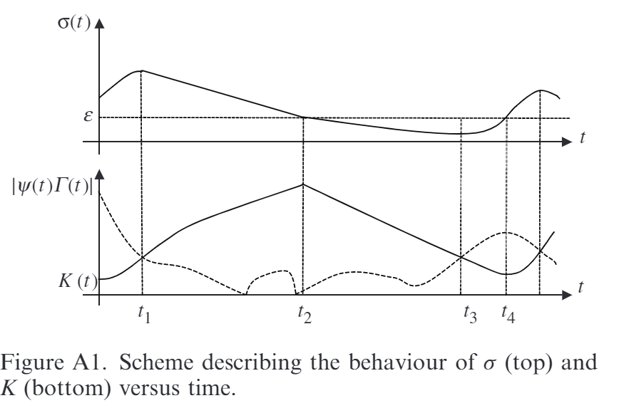

# plestanNewMethodologiesAdaptive2010

## MetaInfo

::: note 文献标题

 New methodologies for adaptive sliding mode control
:::

::: note Abstract

:::

## Contents

### 问题描述

#### 问题背景

#### 问题难点

在基本无信息的条件下实现自适应估计系统参数的滑模控制

#### 前人工作

#### 本文工作

#### 本文意义

### 实验方法

#### 问题分析

假定需要控制的非线性系统为：

$$
\dot{x}=f\left( x \right) +g\left( x \right) u
$$

其中 $x\in R^n$ 是系统的状态变量，f(x) 和 g(x) 是在 x 定义域内 **有界的**。假定控制的滑模变量为 $\sigma(x,t)$，目的是使得 $\sigma=0$。有

$$
\begin{array}{c}
	\dot{\sigma}=\frac{\partial \sigma}{\partial x}\dot{x}+\frac{\partial \sigma}{\partial t}\\
	=\underset{\varPsi \left( x,t \right)}{\underbrace{\frac{\partial \sigma}{\partial x}f\left( x \right) +\frac{\partial \sigma}{\partial t}}}+\underset{\varGamma \left( x,t \right)}{\underbrace{\frac{\partial \sigma}{\partial x}g\left( x \right) u}}\\
\end{array}
$$

满足：

$$
\left| \varPsi \right|\le \varPsi _M, 0<\varGamma _m\le \varGamma \le \varGamma _M
$$

这些是我们仅有的条件，下面提出一些本文中的定义：

::: tip definition
- 理想滑模面：$S=\left\{ \begin{array}{c}
	x\in \mathcal{X} \,\,|\\
\end{array}\,\,\sigma \left( x,t \right) =0 \right\}$
- 实际滑模面：$S^*=\left\{ \begin{array}{c}
	x\in \mathcal{X} \,\,|\\
\end{array}\,\,\left| \sigma \right|<\delta \right\}$
:::

其中理想滑模面物理上不可实现，因此改用实际滑模面替代。

#### 具体算法

::: warning problem
提出给定这样一个控制器：

$$
\begin{array}{c}
	u=-K\cdot \mathrm{sign}\left( \sigma \left( x,t \right) \right)\\
	\dot{K}=\begin{cases}
	\bar{K}\cdot \left| \sigma \left( x,t \right) \right|\cdot \mathrm{sign}\left( \left| \sigma \left( x,t \right) \right|-\varepsilon \right)\\
	\mu \,\,\\
\end{cases}\,\,\begin{array}{c}
	\mathrm{if} K>\mu\\
	\mathrm{if} K>\mu\\
\end{array}\\
\end{array}
$$

其中$K\left( 0 \right) >0,\bar{K}>0,\varepsilon >0,\mu >0$且$\mu$很小。那么，可以证明，这样的控制器满足上面的要求
:::

^eqn-control-law

首先，不失一般性，可以假设对任意时刻，$K(t)>\mu$。这很明显可以从我们 K 的取值看出。

::: info lemma
在上面提出的非线性系统下，提出的增益K存在上界，即：

$$
K\left( t \right) \le K^*\,\, \forall t>0
$$

:::

证明参考 [APL1](./#apl1)

进一步，给出这样的结论：

::: info lemma
对上面的非线性系统和控制方法，存在有限的时间$t_F>0$使得实际滑模面在所有$t>t_F$的时候成立，即：

$$
\begin{array}{c}
	\left| \sigma \left( x,t \right) \right|<\delta \,\, \forall t\geqslant t_F\\
	\delta =\sqrt{\varepsilon ^2+\frac{\varPsi _{M}^{2}}{\bar{K}\varGamma _m}}\\
\end{array}
$$

:::

考虑李雅普诺夫函数，有：

$$
V=\frac{1}{2}\sigma ^2+\frac{1}{2\gamma}\left( K-K^* \right) ^2
$$

从而微分有：

$$
\begin{array}{c}
	\dot{V}=\sigma \left( \varPsi -\varGamma K\mathrm{sign}\left( \sigma \right) \right) +\frac{1}{\gamma}\left( K-K^* \right) \bar{K}\left| \sigma \right|\mathrm{sign}\left( \left| \sigma \right|-\varepsilon \right)\\
	\le \varPsi _M\left| \sigma \right|-\varGamma _mK\left| \sigma \right|+\frac{1}{\gamma}\left( K-K^* \right) \bar{K}\left| \sigma \right|\mathrm{sign}\left( \left| \sigma \right|-\varepsilon \right)\\
	=\varPsi _M\left| \sigma \right|-\varGamma _mK\left| \sigma \right|+\underset{\text{构造项}}{\underbrace{\varGamma _mK^*\left| \sigma \right|-\varGamma _mK^*\left| \sigma \right|}}+\frac{1}{\gamma}\left( K-K^* \right) \bar{K}\left| \sigma \right|\mathrm{sign}\left( \left| \sigma \right|-\varepsilon \right)\\
	=\left( \varPsi _M-\varGamma _mK^* \right) \left| \sigma \right|+\left( K-K^* \right) \left( -\varGamma _m\left| \sigma \right|+\frac{1}{\gamma}\bar{K}\left| \sigma \right|\mathrm{sign}\left( \left| \sigma \right|-\varepsilon \right) \right)\\
\end{array}
$$

进一步添加构造项 $\beta_{K}>0$ 有：

$$
\begin{array}{c}
	\dot{V}=\left( \varPsi _M-\varGamma _mK^* \right) \left| \sigma \right|+\left( K-K^* \right) \left( -\varGamma _m\left| \sigma \right|+\frac{1}{\gamma}\bar{K}\left| \sigma \right|\mathrm{sign}\left( \left| \sigma \right|-\varepsilon \right) \right)\\
	+\beta _K\left| K-K^* \right|-\beta _K\left| K-K^* \right|\\
\end{array}
$$

注意到根据上面的 Lemma1 有 $K\left( t \right) -K^*<0 \forall t>0$，从而

$$
\begin{array}{c}
	\dot{V}=-\underset{\beta _{\sigma}>0}{\underbrace{\left( -\varPsi _M+\varGamma _mK^* \right) }}\left| \sigma \right|-\beta _K\left| K-K^* \right|\\
	-\underset{\xi}{\underbrace{\left| \underset{<0}{\underbrace{K-K^*}} \right|\left( -\varGamma _m\left| \sigma \right|+\frac{1}{\gamma}\bar{K}\left| \sigma \right|\mathrm{sign}\left( \left| \sigma \right|-\varepsilon \right) -\beta _K \right) }}\\
\end{array}
$$

这意味着：

$$
\begin{array}{c}
	\dot{V}=-\beta _{\sigma}\left| \sigma \right|-\beta _K\left| K-K^* \right|-\xi\\
	=-\beta _{\sigma}\sqrt{2}\frac{\left| \sigma \right|}{\sqrt{2}}-\beta _K\sqrt{2\gamma}\frac{\left| K-K^* \right|}{\sqrt{2\gamma}}-\xi\\
	\le -\min \left\{ \beta _{\sigma}\sqrt{2}, \beta _K\sqrt{2\gamma} \right\} \left( \frac{\left| \sigma \right|}{\sqrt{2}}+\frac{\left| K-K^* \right|}{\sqrt{2\gamma}} \right) -\xi\\
	\le -\beta V^{1/2}-\xi \quad \beta =\min \left\{ \beta _{\sigma}\sqrt{2}, \beta _K\sqrt{2\gamma} \right\}\\
\end{array}
$$

现在分析 $\xi$ 的情况。

- Case1: $\left| \sigma \right|>\varepsilon$
$\left| \sigma \right|>\varepsilon$，此时有

$$
\begin{array}{c}
	\xi =-\varGamma _m\left| \sigma \right|+\frac{1}{\gamma}\bar{K}\left| \sigma \right|\underset{=1}{\underbrace{\mathrm{sign}\left( \left| \sigma \right|-\varepsilon \right) }}-\beta _K>0\\
	\Longleftrightarrow \gamma <\frac{\bar{K}\left| \sigma \right|}{\varGamma _m\left| \sigma \right|+\beta _K}\\
\end{array}
$$

注意到右边函数是增函数，因此取：

$$
\gamma <\frac{\bar{K}\varepsilon}{\varGamma _m\varepsilon +\beta _K}
$$

此时有：

$$
\dot{V}\le -\beta V^{1/2}-\xi \le -\beta V^{1/2}
$$

根据李雅普诺夫收敛的性质，这表明在任何 $\left| \sigma \right|>\varepsilon$ 的条件下，控制对象在有限时间内收敛

- Case2: $\left| \sigma \right|<\varepsilon$
此时 $\xi$ 可能为负这意味着李雅普诺夫的思路不能完全成功，但可以注意到，一旦 $\left| \sigma \right|>\varepsilon$，立马问题就解决了。因此我们需要考虑的就是分析状态切换需要的时间代价和精度问题。

记 $\sigma _0=\sigma \left( 0 \right) =\varepsilon ^+$，$K_0=\mathcal{K} \left( 0 \right) =K\left( 0 \right)$。不失一般性，可以假设 $\sigma_0>0$，否则其会一直增长。考虑 **最坏情形**，即：

$$
\begin{array}{c}
	\dot{\sigma}=\varPsi _M-K\varGamma _m\\
	\dot{K}=\bar{K}\left| \sigma \right|\\
\end{array}
$$

这里的最坏情形意思是放任 $\sigma$ 增大，此时偏离滑模面的误差最大的情况。

根据上面的方程可以解得：

$$
\begin{aligned}
	\sigma (t)=&\sigma _0\cos \left( \sqrt{\bar{K}\Gamma _m}t \right) +\frac{\Psi _M-K_0\cdot \Gamma _m}{\sqrt{\bar{K}\Gamma _m}}\cdot \sin \left( \sqrt{\bar{K}\Gamma _mt} \right)\\
	K(t)=&\sigma _0\sqrt{\frac{\bar{K}}{\Gamma _m}}\sin \left( \sqrt{\bar{K}\Gamma _mt} \right) +\left( K_0-\frac{\Psi _M}{\Gamma _m} \right)\\
	&\times \cos \left( \sqrt{\bar{K}\Gamma _mt} \right) +\frac{\Psi _M}{\Gamma _m}\\
\end{aligned}
$$

从而得到：

$$
\begin{array}{l}
	\sigma (t)=\sqrt{\sigma _{0}^{2}+\frac{\left( \Psi _M-K_0\cdot \Gamma _m \right) ^2}{\bar{K}\Gamma _m}}\sin \left( \sqrt{\bar{K}\Gamma _m}t+\Theta _{\sigma} \right)\\
	K(t)=\sqrt{\sigma _{0}^{2}\frac{\bar{K}}{\Gamma _m}+\left( K_0-\frac{\Psi _M}{\Gamma _m} \right) ^2}\sin \left( \sqrt{\bar{K}\Gamma _m}t+\Theta _K \right) +\frac{\Psi _M}{\Gamma _m}\\
\end{array}
$$

因此可以发现，在 $\sigma _0=\varepsilon ^+\rightarrow \varepsilon$ 时，最大的误差满足 
$$
\begin{array}{c}
	\sigma _M=\sqrt{\sigma _{0}^{2}+\frac{\left( \Psi _M-K_0\cdot \Gamma _m \right) ^2}{\bar{K}\Gamma _m}}\\
	\le \sqrt{\varepsilon ^2+\frac{\Psi _{M}^{2}}{\bar{K}\Gamma _m}}\\
\end{array}
$$

这意味着 $\sigma$ 可以在有限时间内收敛到 case1 中的情况内，满足之前定义的真实滑模面

总的来说，论文基本到这里论证就结束了，后面还有一些关于参数优化的结论，这里就不展开了。

#### 辅助证明

##### APL1

参考上面这张例图。图上半部分是滑模变量随着时间变化的图，下半部分是 K 随着时间变化的图。

假定一开始 $\left| \sigma \left( x,t \right) \right|>\varepsilon$，则根据提出的控制器规则，[^eqn-control-law](./#^eqn-control-law)，
K 会一直增加，直到一个 t1 时刻使得 u 足够大，此时滑模变量 $\sigma$ 开始减小。在此之后，K 会继续增大，直到 $\sigma$ 再次碰到 $\varepsilon$，此时 K 在 t2 时刻达到最大。继续这个进程，K 开始减小，直到 t3 时刻，K 太小以至于无法抵消外界扰动 (也就是使得 $\sigma$ 斜率再次为 0)。再进一步此时 K 增大 (这里意思是 K 不会太小，基本上会周期扰动)，达到时刻 t4,回到一开始的起点。

::: note note
论文中感觉不太对，不是所有点都满足$\left| \dot{\sigma} \right|=0$
:::

在这几段时间中，根据我们的分析，所有的 K 值是在 t1,t2,t3,t4 这四个点之中的，有：

$$
K\le \frac{\left| \dot{\sigma} \right|+\varPsi _M}{\varGamma _m}
$$

其中在 t1,t3 点 $\left| \dot{\sigma} \right|$ 为 0。由于这是光滑的现实系统，因此 $\left| \dot{\sigma} \right|$ 是有界的，从而 K 存在上界
$K^{**}$，进而存在一个有限的 $K^{*}$ 使得其为上界。

### 优点缺点

#### 优点

#### 缺点

### 个人评价

我个人觉得论文论证有点不太严谨，比如 [APL1](./#apl1) 部分或许就存在一些问题。

此外，论文里面的 switch function 全部使用的 sign 这种不连续函数，这会导致剧烈的 K 值抖动，进而影响控制量 u 的相位。这一现象在达到了真实滑模面后更加明显，小范围的相位变化很常见，这一问题可以通过采用光滑的切换函数 (eg. tanh) 实现。
