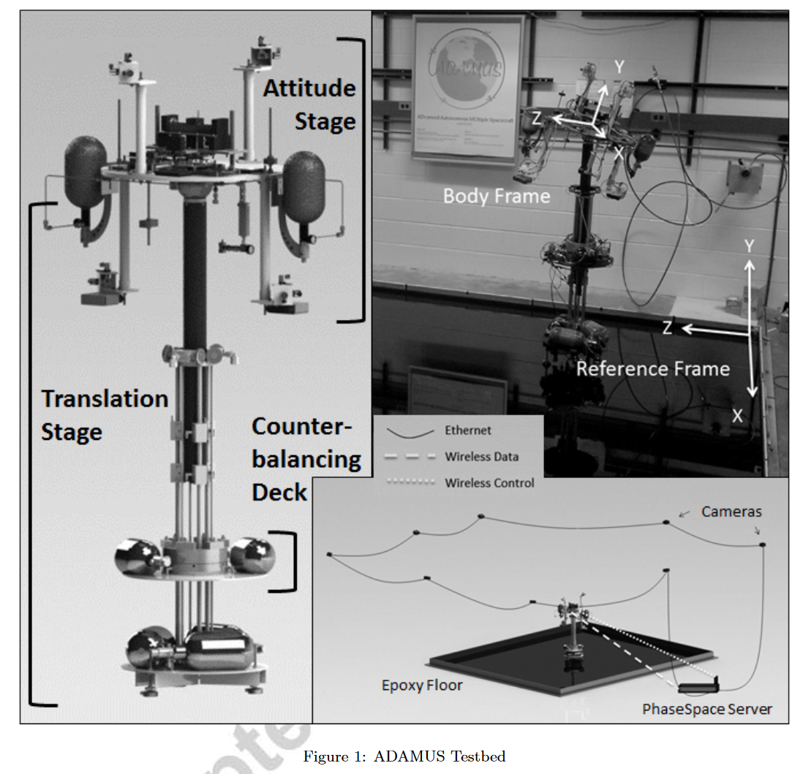
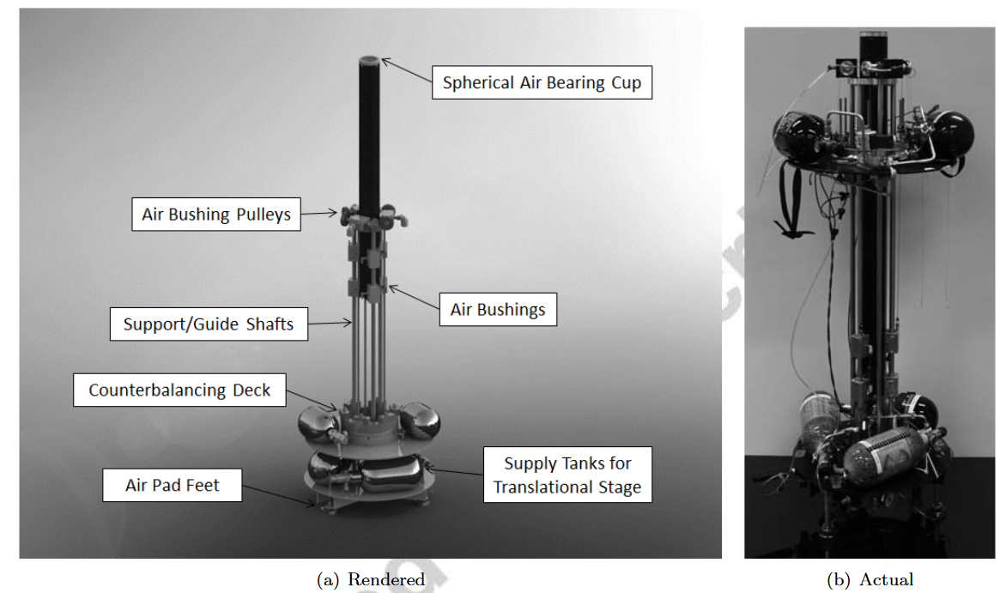
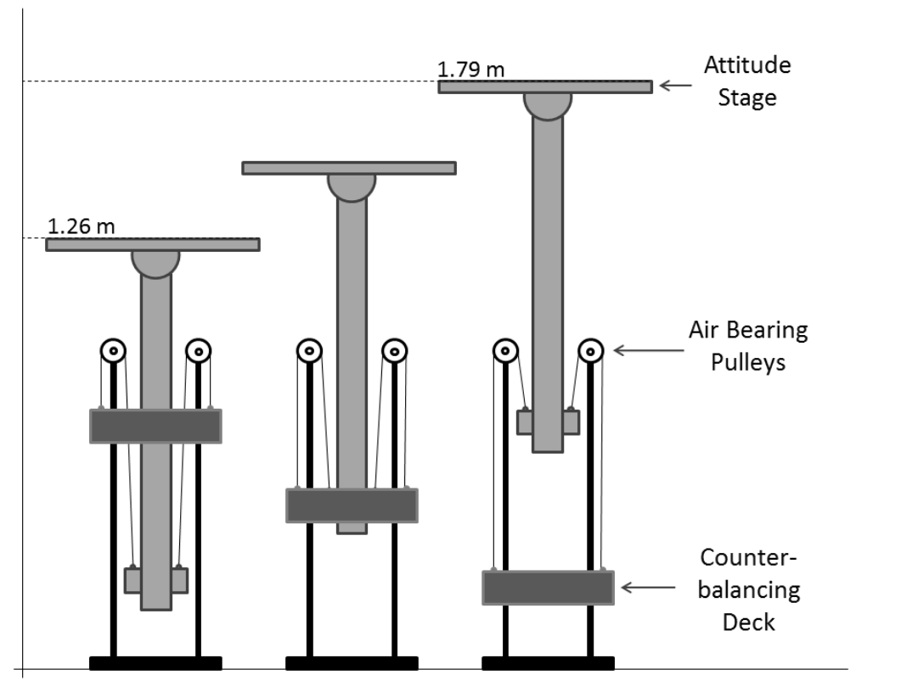
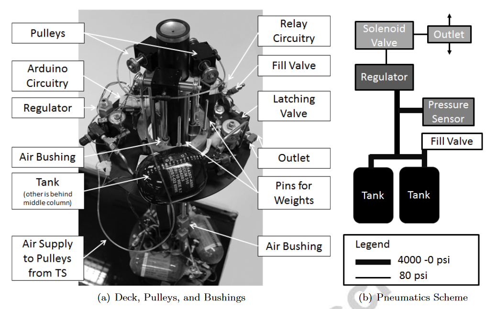
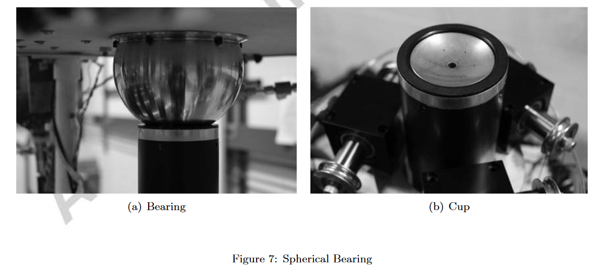
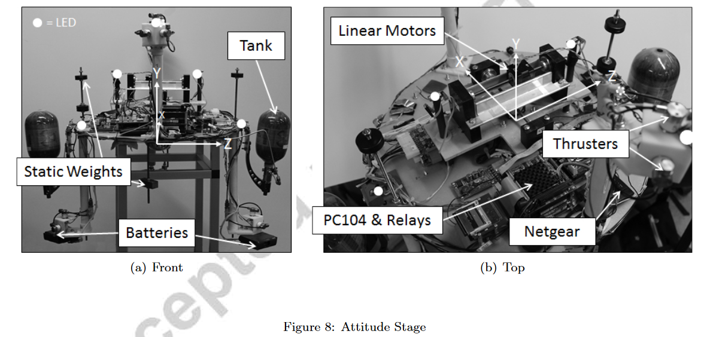
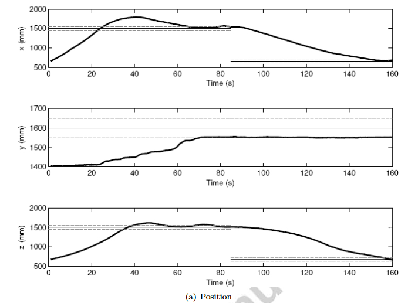
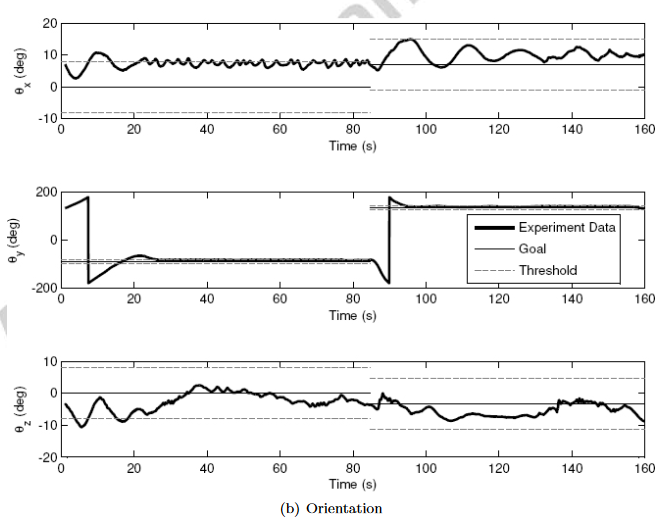
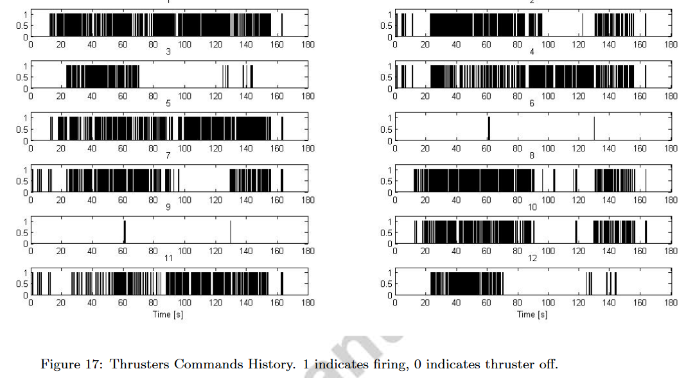

# @saulnierSixdegreeoffreedomHardwareintheloopSimulator2014

# saulnierSixdegreeoffreedomHardwareintheloopSimulator2014

## MetaInfo

::: note 文献标题

 A six-degree-of-freedom hardware-in-the-loop simulator for small spacecraft
:::

::: note Abstract

This paper presents a novel six degree of freedom, ground-based experimental testbed, designed for testing new guidance, navigation, and control algorithms for the relative motion of nano-satellites. The development of innovative guidance, navigation and control methodologies is a necessary step in the advance of autonomous spacecraft. The testbed allows for testing these algorithms in a one-g laboratory environment. The system stands out among the existing experimental platforms because all degrees of freedom of motion are controlled via real thrusters, as it would occur on orbit, with no use of simulated dynamics and servo actuators. The hardware and software components of the testbed are detailed in the paper, as is the motion tracking system used to perform its navigation. A Lyapunov-based strategy for closed loop control is used in hardware-in-the loop experiments to successfully demonstrate the full six-degree-of-freedom system׳s capabilities. In particular, the test case shows a two-phase regulation experiment, commanding both position and attitude to reach specified final state vectors.
:::

## Contents

### 问题描述

#### 问题背景

- The development of innovative guidance, navigation and control (GNC) strategies for relative spacecraft maneuvering will increase the efficiency and autonomy of future space missions

#### 前人工作

- 设备构造
	- **Air bearingbased spacecraft** simulators enable validation of GNC strategies prior to launch with hardware in the loop.
		- Air bearings can provide near frictionless rotational and translational motion which can be utilized to create one-g laboratory conditions that are much closer to those encountered in a micro-gravity environment.
	- A different ground testing approach consists in employing robotic arms in conjunction with numerically simulated dynamics. Software integrates the equations of motion and those command the motion of servo actuators
- 设备自由度
	- Systems classified as only planar or only rotational are still widely used in on-the-ground testing
	- More complex systems combine a planar translation stage and a rotational attitude stage to achieve five or six degrees of freedom.
		- In both cases the *vertical motion giving the 6th degree of freedom is provided by a powered vertical system*, which is actively controlled to provide a simulated zero-g environment for the attitude stage

#### 本文工作

- presents the 6DOF spacecraft simulator
- the first *reproducing all degrees of motion using **real thrusters***, without simulated dynamics and servo actuators used, for example, in the testbeds in references [11] and [12].
	- It differs from the existing 6DOF systems because it guarantees a realistically actuated motion along/about the full 6DOF

### 设备构造

#### 硬件构造

^pic-hardware

硬件设备由下面部分组成：
- 平移台 (translational stage/ TS)
- 姿态台 (attitude stage / AS)
	- 代表卫星+待测试GNC子系统
	- AS与TS通过球形空气轴承连接

传感器：
- 系统的位置和姿态由 PhaseSpace Impulse System 提供

##### TS (平移台) 介绍

::: note note
TS为系统提供3个平动自由度
:::

- z方向的零重力运动：使用空气滑轮组+配重 (Counterbalancing deck / CD) 连接到AS的质心
- 其余2方向的平动：三个线性空气轴承在TS和13 ft × 15 ft环氧地板之间创造了一个气垫，允许TS以极小的摩擦进行平移。

##### CD (配重) 介绍

需要注意，在实验过程中，通过改变CD的质量来补偿由于推力器释放空气而损失的AS质量，使用arduino来控制CD上的tank开闭，调节质量变化
- 随着实验的进行和储气罐中空气的耗尽，AS可以改变多达300 g的质量。

##### AS（姿态台）介绍

姿态台提供了测试平台的3个旋转自由度，使用空气球轴承实现

- 结构介绍
	- AS上附有四个臂，分别由ABS和PVC制成。两臂向上延伸，另两臂向下延伸。手臂对称地附着在圆盘上，以利于质量平衡和提供对称的推进器布局。每个臂的末端有三个正交安装的推进器。使用主动推进器的独特组合可以获得独立的平移和/或旋转运动。AS在偏航方向上提供360 °的全自由度，但在俯仰和横滚轴方向上将其限制在± 30 °
- 质心平衡
	- 使用3个直线电机来控制质心的微小变化

#### 推进器控制方法——李雅普诺夫

建立动力学模型 → 渐进稳定 → 类似最优控制的思路（**ricatti equation**）

#### 实验结果

### 优点缺点

#### 优点

- 实验装置目前能够实时操作重量小于10 kg的航天器及其算法。

#### 缺点

- 竖直方向的运动目前看来比其他两个平动方向的运动受到的摩擦力更大。这种摩擦主要是由于空气衬套对中、管道连接和滑轮电缆的缺陷造成的；然而，并不是所有的垂直扰动都能用目前的设计方法消除
- 最大的扰动是由垂向自由度和另外两个平动自由度的质量差引起的
- 第二大扰动源发现在AS的平衡和平衡系统的平衡
	- 目前是人工完成配平，日后使用BP自动配平
- CD的质量平衡是通过测量气罐的压力来实现控制的，在实验中存在6g左右的偏差，目前对装置影响不大，可以日后添加更精确的测量算法
- 最后，从TS平台底部甲板到平衡甲板为空气衬套提供空气的油管在甲板相对移动时会引起一定的扰动。量化效果的实验可以运行，但由于油管可以自由移动，效果预计是最小的

### 个人评价

工作很完善，这种文章结构可以进行参考，特别是完成装置报告的时候

## 参考

##### 引文

##### 脚注
