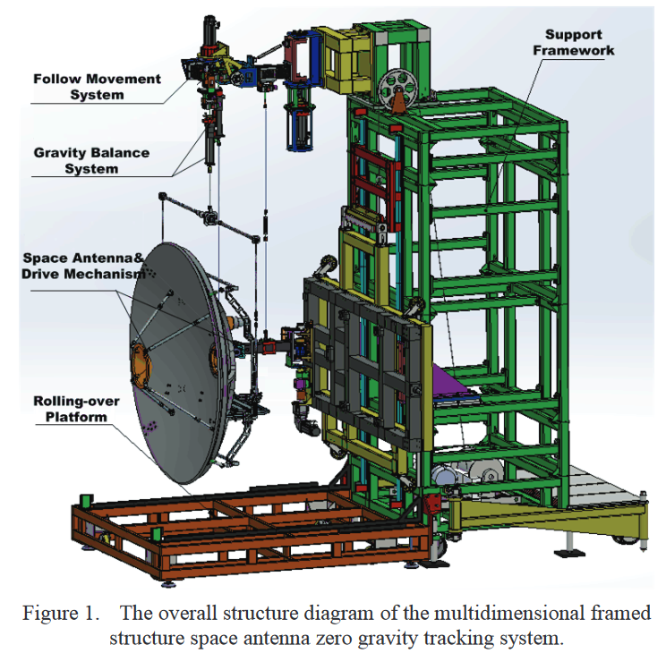
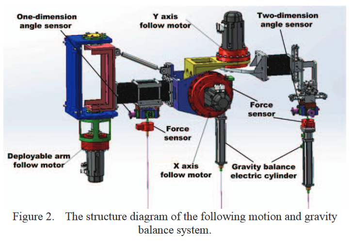

# @yangZeroGravityTracking2016

# yangZeroGravityTracking2016

## MetaInfo

::: note 文献标题

 Zero gravity tracking system using constant tension suspension for a multidimensional framed structure space antenna
:::

::: note Abstract

In order to solve the problems of microgravity conditions on ground for the complicated driving mechanism of multidimensional framed structure space antenna components, a multidimensional framed structure zero gravity tracking system using constant tension suspension was designed. The system is able to perceive and tracking the intended motion of space two-dimensional pointing mechanism and deployable locking mechanism of antenna in real time, through a novel constant tension suspension controller based on position optimal sliding mode inner loop control strategy to enhance robustness and control accuracy, and solve the impact of parametric perturbation and the external disturbance of constant tension suspension system on the control accuracy. The zero gravity tracking system can provide microgravity conditions on ground for the driving mechanism of space antenna without additional force component in horizontal direction. Experimental results indicate that the control precision of the system meets the task requirements, and validate the correctness and feasibility of the scheme.
:::

## Contents

### 问题描述

#### 问题背景

针对空间卫星天线实现平面的微重力环境

#### 前人工作

- air-bearing method ^air-bearing
	- 可以提供微重力环境，但是为平面2自由度情况
	- 参考 #air-bearing ，比如论文
		- [@saulnierSixdegreeoffreedomHardwareintheloopSimulator2014](./@saulnierSixdegreeoffreedomHardwareintheloopSimulator2014.md)
		- [@molinaThreeaxisAirbearingBased2005](./@molinaThreeaxisAirbearingBased2005.md)
	- 可以实现6自由度微重力环境
- free-fall ^free-fall
	- 实现微重力环境，但是测试时间太短
- water-float
	- 可以补偿地球重力
	- 可以实现长时间测试
	- 引入了流体动力学，水下环境复杂
- greory c white 提出的竖直方向主动控制策略
	- 方法简单
	- 增加了机器人质量
	- 精度不够
- Yuichi sato恒拉力机构
	- 可以实现零重力情形
	- 系统不稳定
	- 不能实现张力的最优补偿

#### 本文工作

- 提出一种多维框架结构的空间天线零重力跟踪系统
- 基于位置最优滑模内环控制的恒张力悬浮控制策略

### 实验方法

#### 多自由度零重力跟随系统

机构的驱动部分分为2块：
- 空间2自由度指向机构
- 可展开锁紧机构

空间天线首先通过可展开锁紧机构完成展开运动，然后利用二维指向机构实现信号在空间的捕获和定位

零重力跟随机构分为下面几个部分：
- 支撑框架
- 跟随运动系统
- 重力平衡系统
- 旋转系统

影响零重力跟随系统性能的主要因素是跟随运动系统的控制精度和恒拉力控制精度

> 系统的重力平衡控制误差要求为1 %，相当于重力补偿误差小于0.01 g。跟踪误差要求小于0.02 degree

下图展示了跟随系统和重力卸载系统的主要结构

可折叠锁紧机构使用了*被动重力补偿方法*

对电机控制，使用滑膜控制的思路实现恒力矩输出

### 个人评价

说实话没看懂**这个东西怎么动的**，也不懂这个作者为什么要自己发明一套**位置环控制器**，怎么从**力控→位置控制**的

里面提了一句*被动重力补偿，又引入了X, Y方向的跟随电机，那恒拉力控制到底是由谁完成的？这里提出的控制算法起到了什么作用？*

## 参考

##### 引文

##### 脚注
