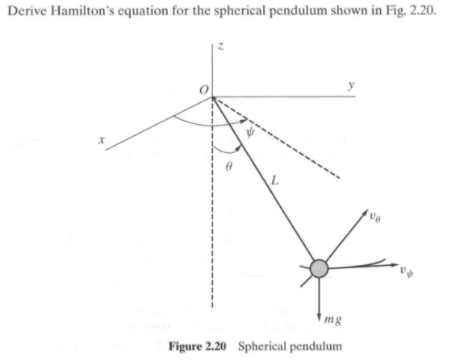
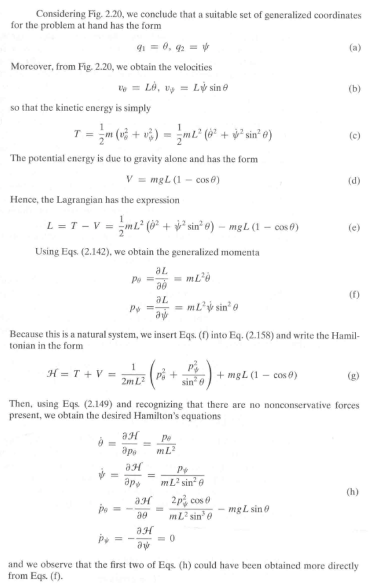
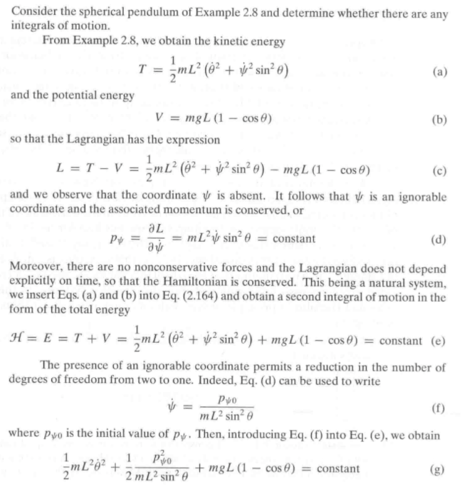
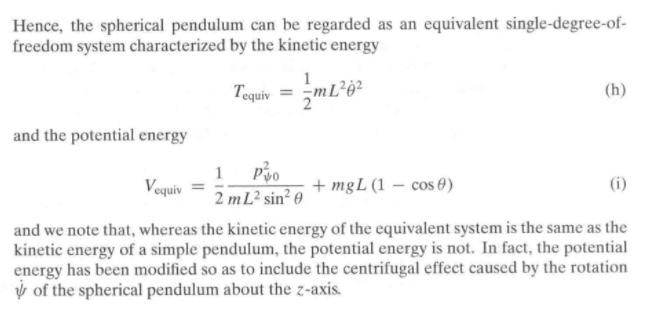
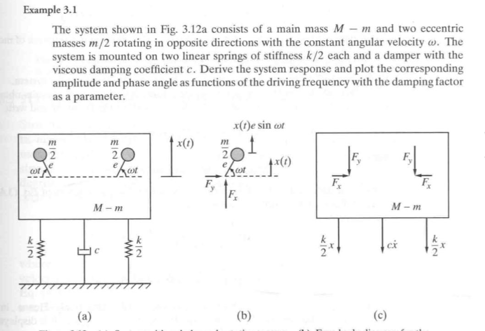

# 分析力学

## 虚功原理

我们从一个 N 体质点系统开始，约定：$m_i$ 代表每个支点质量，$r_i(i=1,2,\cdots,N)$ 代表支点位移。根据 [变分](./变分.md) 的原理，举例有：在如下的约束下：

$$

f(x_1,y_1,z_1,\cdots,z_N,t)=C

$$


有虚位移满足：


$$

f(x_1+\delta x_1,y_1+\delta y_1,z_1+\delta z_1,\cdots,z_N+\delta z_N,t)=C

$$


使用 Taylor 展开有：


$$

f\left(x_{1}, y_{1}, z_{1}, \ldots, z_{N}, t\right)+\sum_{i=1}^{N}\left(\frac{\partial f}{\partial x_{i}} \delta x_{i}+\frac{\partial f}{\partial y_{i}} \delta y_{i}+\frac{\partial f}{\partial z_{i}} \delta z_{i}\right)+O\left(\delta^{2}\right)=C

$$


进而得到了：


$$

\sum_{i=1}^{N}\left(\frac{\partial f}{\partial x_{i}} \delta x_{i}+\frac{\partial f}{\partial y_{i}} \delta y_{i}+\frac{\partial f}{\partial z_{i}} \delta z_{i}\right)=0

$$


^54a7d8

这意味着 3N 个虚位移中只有 3N-1 是任意的 (无关的)，因此有效的虚位移和系统的约束有关，和系统的自由度相同。

回到原问题，取和系统自由度一样多的虚位移 $\delta r_i$。对于静平衡的系统而言，假设该 N 体系统受到一系列合成后的力 $R_i(i=1,2,...N)$ 影响。为了系统静平衡，有对应的 $R_i=0$，进而对应的系统虚功有：

$$
\overline{\delta W_i} = R_i \dot \delta r_i=0
$$


其中 $\overline{\delta W_i}$ 被定义为系统在虚位移 $\delta r_i$ 和合成力 $R_i$ 作用下的虚功。

::: note note
collapse: open
title: Note
需要注意的是，这里的符号$\overline{\delta W_i}$这样写有两方面考虑：
- 符号$\delta$代表力作用在虚位移上，并不实际存在
- \overline 代表这并不是$W_i$的[变分](./变分.md)
:::


考虑到系统在约束下，可以将合成力 $R_i$ 写为：$R_i=F_i+f_i$，其中 $F_i$ 为系统内力，$f_i$ 为约束力。

考虑到系统可能的虚位移向量存在于系统约束曲面的切空间中 (也就是虚位移向量一定和约束力垂直，不难通过上面关于 [|约束的微分](./) 发现)，因此


$$

\sum_{i=1}^{N}f_i \delta r_i=0

$$


进一步有：

$$

\sum_{i=1}^{N}F_i \delta r_i=0

$$


::: note note
collapse: open
title: Note

需要注意这里的合成力乘虚位移为0，只有在力是保守力情况下才成立。当存在摩擦力的时候，狮子并不成立。因为虚位移存在的特性是可逆性，即取当前方向的反方向理论上也是可以的，但在这一情况下摩擦力会也反向，带来做功，因此力必须要为保守力。
:::


可以表述为：==在无穷小的可逆的满足系统约束的虚位移下，作用在该系统上的力做的功为 0==

此外，考虑到一般性，将虚位移 $r_i$ 在选取的广义坐标 $q_k$ 上分解 (或者看成对 $r(q_1,q2,\cdots, q_n)$ 上做 [变分](./变分.md))，有：

$$

\delta r_i = \sum_{k=1}^{n} \frac{\partial r_i}{\partial q_k} \delta q_k

$$


因此可以得到在广义坐标上，有：


$$

\sum_{i=1}^{N} \mathbf{F}_{i} \cdot \delta \mathbf{r}_{i}=\sum_{i=1}^{N} \mathbf{F}_{i} \cdot \sum_{k=1}^{n} \frac{\partial \mathbf{r}_{i}}{\partial q_{k}} \delta q_{k}=\sum_{k=1}^{n}\left(\sum_{i=1}^{N} \mathbf{F}_{i} \cdot \frac{\partial \mathbf{r}_{i}}{\partial q_{k}}\right) \delta q_{k}=\sum_{k=1}^{n} Q_{k} \delta q_{k}=0

$$


因此有：


$$

Q_{k}=\sum_{i=1}^{N} \mathbf{F}_{i} \cdot \frac{\partial \mathbf{r}_{i}}{\partial q_{k}}=0, (k=1,2,\cdots,n)

$$


## D'Alembert Principle

对 [虚功原理](./#虚功原理) 的 N 体质点系，通过虚功原理分析了系统静平衡的受力情况。自然的，在考虑系统运动后，结合牛顿第二定律，对每个质点有：


$$
F_i+f_i-m_i \ddot{r_i}=0
$$


其中 $F_i$ 是施加在质点上的力，$f_i$ 是约束力。上式也被称为 d'Alembert principle，其中 $-m_i \ddot{r_i}$ 也叫做惯性力。

将上面的虚功定理由静平衡形式延伸到动态形式：


$$
\sum_{i=1}^{N} (F_i+f_i-m_i \ddot{r_i})\delta r_i =0
$$


同样的，其中不能存在摩擦力等等保守力，下面所有的讨论都基于理想的无摩擦的情形。

## Hamilton Principle

我们知道：虚功定义为：
$$
\sum_{i=1}^{N}F_i \delta r_i= \overline{\delta W}
$$
，假定每个质点质量不变，有：


$$

\begin{aligned}
\frac{d}{d t}\left(m_{i} \dot{\mathbf{r}}_{i} \cdot \delta \mathbf{r}_{i}\right) &=m_{i} \ddot{\mathbf{r}}_{i} \cdot \delta \mathbf{r}_{i}+m_{i} \dot{\mathbf{r}}_{i} \cdot \delta \dot{\mathbf{r}}_{i}=m_{i} \ddot{\mathbf{r}}_{i} \cdot \delta \mathbf{r}_{i}+\delta\left(\frac{1}{2} m_{i} \dot{\mathbf{r}}_{i} \cdot \dot{\mathbf{r}}_{i}\right) \\
&=m_{i} \ddot{\mathbf{r}}_{i} \cdot \delta \mathbf{r}_{i}+\delta T_{i}
\end{aligned}

$$


其中 $\delta T_{i}$ 代表质点的动能，因此有：


$$

\sum_{i=1}^{N} \frac{d}{d t}\left(m_{i} \dot{\mathbf{r}}_{i} \cdot \delta \mathbf{r}_{i}\right)=\sum_{i=1}^{N} m_{i} \ddot{\mathbf{r}}_{i} \cdot \delta \mathbf{r}_{i}+\delta T

$$


注意到约束力和虚位移垂直，因此结合 [D'Alembert Principle](./#d'alembert-principle) 有：


$$

\delta T + \overline{\delta W} = \sum_{i=1}^{N} \frac{d}{d t}\left(m_{i} \dot{\mathbf{r}}_{i} \cdot \delta \mathbf{r}_{i}\right)

$$


进一步对时间积分有：


$$

\int_{t_{1}}^{t_{2}}(\delta T+\overline{\delta W}) d t=\int_{t_{1}}^{t_{2}} \sum_{i=1}^{N} \frac{d}{d t}\left(m_{i} \dot{\mathbf{r}}_{i} \cdot \delta \mathbf{r}_{i}\right) d t=\left.\sum_{i=1}^{N} m_{i} \dot{\mathbf{r}}_{i} \cdot \delta \mathbf{r}_{i}\right|_{t_{1}} ^{t_{2}}

$$


在所有的虚位移中，我们只考虑那些正好能够在时刻 t1,t2 和原始正确轨迹重合的情形，因此有：


$$

\int_{t_{1}}^{t_{2}}(\delta T+\overline{\delta W}) d t= 0, \delta r_i(t_1) = \delta r_i(t_2)=0

$$


 d t= 0, \delta q_i(t_1) = \delta q_i(t_2)=0

$$


::: note note
collapse: open
title: Note
注意这里没有如前面虚功原理和D'Alembert一样对==所有==质点的==任意==虚位移上之和为0，而这正是非保守力会在虚位移上产生问题？因此这里导出的方程是可以应用在任何情况下的？
#todo 
#notsure
:::


一般来说，可以将虚功 $\overline{\delta W}$ 分解成保守力的功和非保守力的功，即：

$$

\overline{\delta W} = \overline{\delta W_c}+\overline{\delta W_{nc}}

$$


而对于保守力的虚功，我们可以知道其能够转换成使能的形式 (不如说本身就是势能的一种体现)，因此：

$$

 \overline{\delta W_c} = {\delta W_c} = -\delta V

$$


进一步选取拉格朗日量 $L=T-V$，因此的得到：


$$

\int_{t_{1}}^{t_{2}}(\delta L+\overline{\delta W_{nc}}) d t= 0, \delta q_i(t_1) = \delta q_i(t_2)=0

$$


在不存在非保守力的情形，有：

$$

\int_{t_{1}}^{t_{2}}\delta L d t= 0, \delta q_i(t_1) = \delta q_i(t_2)=0

$$


注意到，对约束方程涉及到的坐标，如果约束方程的形式中对每个坐标都是单独出现的，即不存在类似 $q_1\cdot q_2$ 的形式，认为这个系统是 _ 可积的 _。对于这样的可积系统，真实路径是包含在虚位移空间中的。

如果约束条件中引入了速度，那么系统一定是不可积的。对于这样的不可积系统，真实路径一般来说不属于虚位移空间。

对可积的系统，[变分](./变分.md) 和积分是可以交换的，因此有：


$$

\delta I=\delta \int_{t_{1}}^{t_{2}} L d t= 0, \delta q_i(t_1) = \delta q_i(t_2)=0

$$


这个式子体现的是大家常见到的哈密顿原理形式。可以将其表述为：

对真实路径属于虚位移构成的位形空间的系统，假定在 t1,t2 时刻处虚位移为 0，在时间 t1,t2 之间，积分 $I=\int_{t_1}^{t_2} L dt$ 对所有虚位移保持恒定。

## 拉格朗日方程

在 [Hamilton Principle](./#hamilton-principle) 的基础上，为了进一步导出关于速度的微分方程，我们有名义上的 2 步需要考虑：

- 消除广义的虚位移速度，在积分号下仅仅保留虚位移项
- 利用虚位移任意的特性，使其对应系数为 0 来导出运动方程

**Step 1**

对系统的动能 T，可以将其表示为下面的一般形式：


$$
T=T(q_1,q_2,\cdots,q_N,\dot{q_1},\dot{q_2},\cdots,\dot{q_N})
$$


因此取 [变分](./变分.md) 有：


$$
\delta T = \sum_{k=1}^{n}(\frac{\partial T}{\partial q_k}\delta q_k + \frac{\partial T}{\partial \dot{q_k}}\delta \dot{q_k})
$$


而由于虚功 W，其在广义坐标下可以表示为：


$$
\overline{\delta W} = \sum_{k=1}^{n}Q_k \delta q_k
$$


其中 $Q_k$ 是作用在支点上外力在广义坐标上的投影。

因此根据 Hamilton Principle 有：


$$

\begin{array}{c}
\int_{t_{1}}^{t_{2}}(\delta T+\overline{\delta W}) d t=\int_{t_{1}}^{t_{2}} \sum_{k=1}^{n}\left[\frac{\partial T}{\partial \dot{q}_{k}} \delta \dot{q}_{k}+\left(\frac{\partial T}{\partial q_{k}}+Q_{k}\right) \delta q_{k}\right] d t=0, \\
\delta q_{k}\left(t_{1}\right)=\delta q_{k}\left(t_{2}\right)=0, k=1,2, \ldots, n
\end{array}

$$


对速度的 [变分](./变分.md) 项，考虑到性质：

$$
\begin{aligned} \int_{t_{1}}^{t_{2}} \frac{\partial T}{\partial \dot{q}_{k}} \delta \dot{q}_{k} d t &=\int_{t_{1}}^{t_{2}} \frac{\partial T}{\partial \dot{q}_{k}} \frac{d}{d t} \delta q_{k} d t=\left.\frac{\partial T}{\partial \dot{q}_{k}} \delta q_{k}\right|_{t_{1}} ^{t_{2}}-\int_{t_{1}}^{t_{2}} \frac{d}{d t}\left(\frac{\partial T}{\partial \dot{q}_{k}}\right) \delta q_{k} d t \\ &=-\int_{t_{1}}^{t_{2}} \frac{d}{d t}\left(\frac{\partial T}{\partial \dot{q}_{k}}\right) \delta q_{k} d t, k=1,2, \ldots, n \end{aligned}
$$


因此有：


$$

\int_{t_{1}}^{t_{2}} \sum_{k=1}^{n}\left[-\frac{d}{d t}\left(\frac{\partial T}{\partial \dot{q}_{k}}\right)+\frac{\partial T}{\partial q_{k}}+Q_{k}\right] \delta q_{k} d t=0

$$


**Step 2**

为了消除虚位移带来的不确定性保证上式成立，有系数为 0：


$$

\frac{d}{d t}\left(\frac{\partial T}{\partial \dot{q}_{k}}\right)-\frac{\partial T}{\partial q_{k}}=Q_{k}

$$


上式被称为 _Lagrange's equations of motion_ (in their most general form)，其中 $Q_k$ 包含了保守力和非保守力。

进一步，为了取消保守力的作用，有：


$$
Q_k = Q_{kc}+ Q_{knc}
$$


其中：


$$
\delta W_c = -\delta V = -\sum_{k=1}^{n} \frac{\partial V}{\partial q_k} \delta q_k = \sum_{k=1}^{n} Q_{kc} \delta q_k 
$$


因此：
$$
Q_{kc} = -\frac{\partial V}{\partial q_k}
$$


即有：

$$

\frac{d}{d t}\left(\frac{\partial T}{\partial \dot{q}_{k}}\right)-\frac{\partial T}{\partial q_{k}}+\frac{\partial V}{\partial q_k}=Q_{knc}

$$


由于势能 V 中不包含速度项，因此取拉格朗日量有：


$$

\frac{d}{d t}\left(\frac{\partial L}{\partial \dot{q}_{k}}\right)-\frac{\partial L}{\partial q_{k}}=Q_{knc}, \quad L = T-V

$$


可以发现，拉格朗日可以导出系统自由度同样多的微分方程，能够解出系统的状态。

## 哈密顿方程

[拉格朗日方程](./#拉格朗日方程) 中包含了 n 个 2 阶微分方程，但对于数值求解来说，希望将其转换为 2n 个 1 阶微分方程更加习惯，这导出了我们的进一步思考。

注意到，我们可以使用类似状态方程的手段得到这 2n 个方程，具体来说就是把速度和位移分开成为 2 个变量。

因此，我们定义在广义坐标 $q_k$ 下的广义动量 $p_k=\frac{\partial L}{\partial \dot{q_k}}$，这一项用来对拉格朗日方程中速度项进行小区代替。

对于系统拉格朗日量，可以将其表示为： ^1cddfa


$$
L=L(q_1,q_2,\cdots,q_n, \dot{q_1}, \dot{q_2}, \cdots, \dot{q_n},t)
$$


进一步我们定义哈密顿函数 (Hamiltonian function) 为：


$$

\mathcal{H}=\sum_{k=1}^{n} \frac{\partial L}{\partial \dot{q}_{k}} \dot{q}_{k}-L=\sum_{k=1}^{n} p_{k} \dot{q}_{k}-L

$$


将 $\mathcal{H}$ 写为广义函数形式：


$$
\mathcal{H}=\mathcal{H}(q_1,q_2,\cdots,q_n, p_1, p_2, \cdots, p_n,t)
$$


对式子 [| 哈密顿函数定义](./) 进行 [变分](./变分.md) 有：


$$

\begin{aligned}
\delta \mathcal{H} &=\sum_{k=1}^{n}\left(p_{k} \delta \dot{q}_{k}+\dot{q}_{k} \delta p_{k}-\frac{\partial L}{\partial q_{k}} \delta q_{k}-\frac{\partial L}{\partial \dot{q}_{k}} \delta \dot{q}_{k}\right) \\
&=\sum_{k=1}^{n}\left(\dot{q}_{k} \delta p_{k}-\frac{\partial L}{\partial q_{k}} \delta q_{k}\right)\\
\delta \mathcal{H} & =\sum_{k=1}^{n}\left(\frac{\partial \mathcal{H}}{\partial q_{k}} \delta q_{k}+\frac{\partial \mathcal{H}}{\partial p_{k}} \delta p_{k}\right)
\end{aligned}

$$


因此可以得到：


$$

\dot{q_k}=\frac{\partial \mathcal{H}}{\partial p_{k}}, \qquad -\frac{\partial L}{\partial q_{k}}=\frac{\partial \mathcal{H}}{\partial q_{k}}

$$


考虑到之前得到的拉格朗日方程，有：


$$

\dot{q_k} = \frac{d}{d t}\left(\frac{\partial L}{\partial \dot{q}_{k}}\right)=\frac{\partial L}{\partial q_{k}}+Q_{knc}

$$


有：


$$

\frac{\partial L}{\partial q_{k}} = \dot{q_k}-Q_{knc}

$$


因此得到了一组微分方程：


$$

\begin{array}{l}
\dot{q}_{k}=\frac{\partial \mathcal{H}}{\partial p_{k}}, k=1,2, \ldots, n \\
\dot{p}_{k}=-\frac{\partial \mathcal{H}}{\partial q_{k}}+Q_{k n c}, k=1,2, \ldots, n
\end{array}

$$


上式得到的 2n 个方程也被称为哈密顿方程 (Hamilton's equations)

对于式子 [| 哈密顿函数定义](./)，将其对时间微分，结合上面的微分方程可以发现：


$$
\frac{\partial \mathcal{H}}{\partial t} = -\frac{\partial L}{\partial t}
$$


显然的，如果拉格朗日量不显示的依赖于时间，那么哈密顿量也一样。

为了更加清晰的考虑问题，我们将哈密顿量和系统的动能、势能联系起来。

对于 n 自由度的系统而言，可以把其动能 $T$ 表示为：

$$

T=T_2+T_1+T_0

$$


其中：
$$
T_2=\frac{1}{2} \sum_{i=1}^{n} \sum_{j=1}^{n}m_{ij}\dot{q_i}\dot{q_j}
$$


这是一个二次型结构，反映的是系统的动能。


$$

T_1=\sum_{j=1}^{n} f_j \dot{q_j}

$$


是关于速度呈线性关系的，其中 $f_j=f_j(q_1,q_2, \cdots, q_n)$ 为其系数。

$$

T_0 = T_0(q_1,q_2,\cdots, q_n)

$$


代表仅与广义坐标有关的一项。

如果一个系统的动能的结构如上面式子所示，那么称这个系统是 unnatural。

::: note note
collapse: open
title: Note
值得注意的是，很多的unnatural系统与转动的frame相关，此时科里奥利力会充当$T_1$，离心力会充当$T_0$
:::


此时，对于拉格朗日量就有：
$$
L=t-V=T_2+T_1-U, \quad U=V-T_0=U(q_1,q_2,\cdots, q_n)
$$


其中 U 代表了修正的动态势能。

进一步，带入哈密顿量的定义，有：


$$

\mathcal{H}=\sum_{k=1}^{n} \frac{\partial L}{\partial \dot{q}_{k}} \dot{q}_{k}-L = 2T_2+T_1-(T_2+T_1-U)=T_2+U

$$


当 $T_2=T, T_1=T_0=0$ 时，即系统是 natural 时，哈密顿量为：

$$
\mathcal{H} = T+V = E
$$


也就是导出了能量守恒。

## Conservation Laws

在 [哈密顿方程](./#哈密顿方程) 推导过后，我们得到了 2n 个一阶的微分方程，能够更加简明地描述涉及的系统。让我们对哈密顿量进行更细致的一些探讨。

首先考虑这样的情形，即，一个给定的广义坐标 $q_s$，在拉格朗日量中并未出现，那么在哈密顿量中也不可能出现。

::: note comment
collapse: open
title: Comment
回顾哈密顿量的定义：$\mathcal{H}=\sum_{k=1}^{n} \frac{\partial L}{\partial \dot{q}_{k}} \dot{q}_{k}-L$，在$L$中不出现该坐标，那么$\mathcal{H}$中也不出现
:::


我们称这样的，一个广义坐标在拉格朗日量中不显示的出现，称其为可忽略的 (ignorable)。此外，我们假设非保守力在 $q_s$ 上投影为 0，因此 $Q_{snc}=0$，则根据:


$$

\begin{array}{l}
\dot{q}_{k}=\frac{\partial \mathcal{H}}{\partial p_{k}}, k=1,2, \ldots, n \\
\dot{p}_{k}=-\frac{\partial \mathcal{H}}{\partial q_{k}}+Q_{k n c}, k=1,2, \ldots, n
\end{array}

$$


有：
$$
p_s=constant
$$


所以可以说，与该广义坐标对应的广义动量是保守的 (conserved)。

::: note comment
collapse: open
title: Comment
可以注意到保守力对应的守恒量：势能V，和这里保守的位移对应的守恒量：动量p之间也存在相似性。
:::


可以认为，上面的广义动量的守恒律是 (角) 动量守恒的推广。

此外，我们考虑在拉格朗日量不显示地依赖于时间 t 的情形，因此使用哈密顿量的定义，对时间进行微分有：


$$

\begin{aligned}
\frac{d \mathcal{H}}{d t} &=\sum_{k=1}^{n}\left[\frac{d}{d t}\left(\frac{\partial L}{\partial \dot{q}_{k}}\right) \dot{q}_{k}+\frac{\partial L}{\partial \dot{q}_{k}} \ddot{q}_{k}\right]-\sum_{k=1}^{n}\left(\frac{\partial L}{\partial q_{k}} \dot{q}_{k}+\frac{\partial L}{\partial \dot{q}_{k}} \ddot{q}_{k}\right) \\
&=\sum_{k=1}^{n}\left[\frac{d}{d t}\left(\frac{\partial L}{\partial \dot{q}_{k}}\right)-\frac{\partial L}{\partial q_{k}}\right] \dot{q}_{k}=\sum_{k=1}^{n} Q_{k nc} \dot{q}_{k}
\end{aligned}

$$


我们可以认为，右边是非保守力对时间的功率。

这表明了，如果拉格朗日量不显示地依赖于时间，那么哈密顿量和非保守力所做的功有关。

日过非保守力为 0，那么自然的有：$\mathcal{H}=constant$，这体现了另一种守恒律：在拉格朗日量不显示地依赖于时间时，如果所有的非保守力是 0，那么哈密顿量守恒。

进一步的，可以根据之前对系统动能的分析得到：


$$

\mathcal{H} = T_2+U=constant

$$


因此可以得到关于自然系统的哈密顿量守恒率：


$$

\mathcal{H}= T + V =constant

$$


这也被称为能量守恒。

### 一个例子

#### 问题描述



#### 计算求解

对于这样的三维摆问题，求解如下：



可以参考 Mathematica 代码：

```mathematica
ClearAll["Global`*"]
(*Principle and Techniques of Vibrations, P95 Prob*)
v\[Theta] = L D[\[Theta][t], t];
v\[Psi] = L D[\[Psi][t], t] Sin[\[Theta][t]];
T = 1/2 m (v\[Theta]^2 + v\[Psi]^2);
V = m g L (1 - Cos[\[Theta][t]]);
Lag = T - V;
rul1 = Solve[p\[Theta][t] == D[Lag, \[Theta]'[t]], \[Theta]'[t]];
rul2 = Solve[p\[Psi][t] == D[Lag, \[Psi]'[t]], \[Psi]'[t]];
Hil = T + V /. (Flatten[{rul1, rul2}]) // FullSimplify
params = {g -> 9.8, L -> 1, m -> 1};

eqns = {\[Theta]'[t] == D[Hil, p\[Theta][t]] // FullSimplify,
   \[Psi]'[t] == D[Hil, p\[Psi][t]] // FullSimplify,
   p\[Theta]'[t] == -D[Hil, \[Theta][t]] // FullSimplify,
   p\[Psi]'[t] == -D[Hil, \[Psi][t]] // FullSimplify} /. params

(*Solve Problem*)

ic = {\[Theta]'[0] == 0, \[Psi]'[0] == 1, \[Theta][0] == 
   Pi/3, \[Psi][0] == Pi/6}
sol = NDSolve[{eqns, ic} // 
    Flatten, {\[Theta], \[Psi], \[Theta]', \[Psi]'}, {t, 10}];

(*notice that \[Psi] is absent in Lag, which means p\[Psi] is \
constant,system degree of freedom reduce to 1 *)

Plot[Evaluate[\[Theta][t] /. sol], {t, 0, 10}, PlotRange -> All]
Plot[Evaluate[\[Theta]'[t] /. sol], {t, 0, 10}, PlotRange -> All]
ParametricPlot3D[{L Sin[\[Theta][t]] Cos[\[Psi][t]], 
    L Sin[\[Theta][t]] Sin[\[Psi][t]], -L Cos[\[Theta][t]]} /. 
   params /. sol, {t, 0, 10}, AxesLabel -> {x, y, z}]
```


#### 理论分析





### 问题

尝试求解下面问题：



可以发现一来阻尼力作为非保守力，二来内部的旋转激振单元带来常量的动能和显含时间 t 的拉格朗日量，似乎不太好求解??? #todo

## 参考

- [分析力学笔记（2）虚功原理（其一）基本形式的虚功原理 - 知乎 (zhihu.com)](https://zhuanlan.zhihu.com/p/136939985)
- [@meirovitchPrinciplesTechniquesVibrations](.//)
