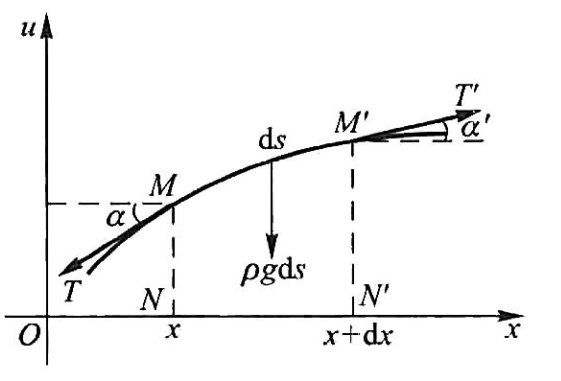
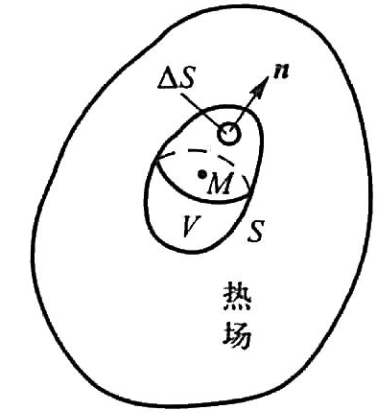

# Ch1 偏微分方程问题

## Ch1 偏微分方程问题

### 波动方程

##### 弦振动

问题建模如下：假定沿着 u 方向位移的函数为 $u(x,t)$，

考虑水平方向力平衡：

$$

T\cos \alpha =T'\cos \alpha '\Rightarrow T=T'

$$

考虑竖直方向力平衡，结合达朗贝尔原理：

$$

\begin{array}{c}
	\frac{\partial ^2u}{\partial t^2}\mathrm{d}m+T\sin \alpha +g\mathrm{d}m=T'\sin \alpha '\\
	\Rightarrow \frac{\partial ^2u}{\partial t^2}\rho \mathrm{d}s=T\left( \tan \alpha '-\tan \alpha \right) -\rho g\mathrm{d}s\\
	\Rightarrow \frac{\partial ^2u}{\partial t^2}\rho \mathrm{d}s=T\left( \frac{\partial u\left( x+\mathrm{d}x,t \right)}{\partial x}-\frac{\partial u\left( x,t \right)}{\partial x} \right) -\rho g\mathrm{d}s\\
	\Rightarrow \frac{\partial ^2u}{\partial t^2}\rho =T\frac{\partial ^2u}{\partial x^2}-\rho g\\
\end{array}

$$

忽略重力得到：

$$

\frac{\partial ^2u}{\partial t^2}=a^2\frac{\partial ^2u}{\partial x^2}, a=\sqrt{\frac{T}{\rho}}

$$

这就是著名的 **波动方程**，这里是一维情形。补充受到外力作用情形时有：

$$

\frac{\partial ^2u}{\partial t^2}=a^2\frac{\partial ^2u}{\partial x^2}+f\left( x,t \right) , f\left( x,t \right) =\frac{1}{\rho}F\left( x,t \right)

$$

这里 $f$ 代表 t 时刻单位质量的弦在 x 点处收到分布外力 F 作用下的外力密度。

::: note note
注意，这里$F(x,t)$是分布外力，如果存在集中一点的力，可以使用狄拉克函数$\delta(x-x_0)$来代表，也就是说：

$$

\begin{array}{c}
	\delta \left( x-x_0 \right) =0,x\ne x_0\\
	\delta \left( x-x_0 \right) =\infty ,x=x_0\\
	\int_{-\infty}^{\infty}{\delta \left( x-x_0 \right) \mathrm{d}x}=1\\
\end{array}

$$

:::

这里方程 (3) 和 (4) 之间的差别在于 (4) 右端多了一项与未知函数 u 无关的 f，这一项被称为 **自由项**，包含这种非零自由项的方程被称为 **非齐次方程**，自由项为 0 的被称为 **齐次方程**。

更进一步的，研究薄膜振动、声波空气中传播，可以得到二维 or 三维波动方程，如下式：

$$

\frac{\partial ^2u}{\partial t^2}=a^2\varDelta u+f
\\
\varDelta u=\sum_{i=1}^n{\frac{\partial ^2u}{{\partial x_i}^2}}

$$

其中 n 为维数，$\Delta$ 被称为 **拉普拉斯算子**。

##### 电磁场方程

电磁场特性满足 **麦克斯韦** 方程组：

$$

\mathbf{rot}\,\,\boldsymbol{H}=\boldsymbol{J}+\frac{\partial \boldsymbol{D}}{\partial \boldsymbol{t}}
\\
\mathbf{rot}\,\,\boldsymbol{E}=-\frac{\partial \boldsymbol{B}}{\partial \boldsymbol{t}}
\\
\mathbf{div}\,\,\boldsymbol{B}=0
\\
\mathbf{div}\,\,\boldsymbol{D}=\boldsymbol{\rho }

$$

其中 $J$ 代表传输电流的面密度，$\rho$ 代表电荷的体密度。

上面的方程结合下面场的物质方程：

$$

\boldsymbol{D}=\boldsymbol{\varepsilon E}
\\
\boldsymbol{B}=\boldsymbol{\mu H}
\\
\boldsymbol{J}=\boldsymbol{\sigma E}

$$

其中 $\varepsilon$ 是介质的介电常数，$\mu$ 是磁导率，$\sigma$ 是电导率，假定介质时均匀且各向同的，那么此时 $\varepsilon，\mu，\sigma$ 都是常数。

从上面两个式子中联立可以消除 H,E：

$$

\boldsymbol{\varDelta H}=\boldsymbol{\varepsilon \mu }\frac{\partial ^2\boldsymbol{H}}{\partial \boldsymbol{t}^2}+\boldsymbol{\sigma \mu }\frac{\partial \boldsymbol{H}}{\partial \boldsymbol{t}}
\\
\boldsymbol{\varDelta E}=\boldsymbol{\varepsilon \mu }\frac{\partial ^2\boldsymbol{E}}{\partial \boldsymbol{t}^2}+\boldsymbol{\sigma \mu }\frac{\partial \boldsymbol{E}}{\partial \boldsymbol{t}}

$$

如果介质不导电，那么 $\sigma=0$，有：

$$

\frac{1}{\boldsymbol{\varepsilon \mu }}\boldsymbol{\varDelta H}=\frac{\partial ^2\boldsymbol{H}}{\partial \boldsymbol{t}^2}
\\
\frac{1}{\boldsymbol{\varepsilon \mu }}\boldsymbol{\varDelta E}=\frac{\partial ^2\boldsymbol{E}}{\partial \boldsymbol{t}^2}

$$

这便是三维的波动方程。

### 泊松方程

式子 (7) 的后面两式可以导出静电场的点位满足的微分方程：

$$

\begin{array}{c}
	\mathrm{div}D=\mathrm{div}\varepsilon E=\varepsilon \mathrm{div}E=\rho\\
	E=-\mathrm{grad}u\\
	\Rightarrow \mathrm{divgrad}u=-\frac{\rho}{\varepsilon}\Rightarrow \varDelta u=-\frac{\rho}{\varepsilon}\\
\end{array}

$$

上面式子就是 **泊松方程**(Possion)，如果 $\rho=0$，即静电场无源，那么方程变为：

$$

\Delta u =0

$$

被称为 **拉普拉斯方程**

### 热传导方程

问题如上图所示，由传热学中 **傅里叶实验定律** 有，在时间段 $dt$ 内，通过面积微元 dS 的热量 dQ 与 s 时间 dt，曲面面积 dS，物体温度 u 沿着 dS 的法线方向导数成正比，有：

$$

\begin{array}{c}
	dQ=-k\frac{\partial u}{\partial \boldsymbol{n}}dSdt\\
	=-k\left( \mathbf{grad}\,\,u \right) _{\boldsymbol{n}}dS\,\,dt\\
	=-k\mathbf{grad}\,\,u\cdot d\boldsymbol{S}dt,d\boldsymbol{S}=dS\,\,\boldsymbol{n}\\
\end{array}

$$

因此在一段时间内建立能量平衡有：

$$

\iiint_V{c\rho \left[ u\left( x,y,z,t_2 \right) -u\left( x,y,z,t_1 \right) \right]}dV=\int_{t_1}^{t_2}{\left( \iint_S{k\,\,\mathbf{grad}}u\cdot d\boldsymbol{S} \right)}dt

$$

左边的体积分可以写成：

$$

\begin{array}{c}
	\iiint_V{c\rho \left[ u\left( x,y,z,t_2 \right) -u\left( x,y,z,t_1 \right) \right]}dV\\
	=\iiint_V{c\rho \left[ \int_{t_1}^{t_2}{\frac{\partial u}{\partial t}}dt \right]}dV=\int_{t_1}^{t_2}{\left( \iiint_V{c\rho \frac{\partial u}{\partial t}dV} \right)}dt\\
\end{array}

$$

右边的面积分使用 **高斯公式**(Gauss) 将其化为三重积分：

$$

\iint_S{k\,\,\mathbf{grad}u\cdot d\boldsymbol{S}}=\iiint_V{k\,\,\mathrm{div} \mathbf{grad}u\,\,dV}\,\,
\\
=\iiint_V{k\,\,\varDelta u\,\,dV}\,\,

$$

因此有：

$$

\begin{array}{c}
	\int_{t_1}^{t_2}{\left( \iiint_V{c\rho \frac{\partial u}{\partial t}dV} \right)}dt=\int_{t_1}^{t_2}{\iiint_V{k\,\,\varDelta u\,\,dV}\,\,dt}\\
	\Rightarrow \frac{\partial u}{\partial t}=a^2\varDelta u=a^2\left( \frac{\partial ^2u}{\partial x^2}+\frac{\partial ^2u}{\partial y^2}+\frac{\partial ^2u}{\partial z^2} \right) ,a^2=\frac{k}{c\rho}\\
\end{array}

$$

上式被称为 **三维热传导方程**

如果物体内部存在热源，那么需要添加自由项：

$$

\frac{\partial u}{\partial t}=a^2\varDelta u+f\left( x,y,z,t \right) , f=\frac{F}{c\rho}

$$

可以发现，如果时稳恒温度场，那么温度场与时间 t 无关，那么热传导方程转化为了拉普拉斯方程。

### 初值条件和边界条件

描述问题的条件存在两种形式，**初值条件** 和 **边界条件**

#### 初值条件

- 弦振动类似的波动方程

  一般来说，这类方程的初值条件就是开始时刻的位移和速度，即：
  
$$

  \begin{cases}
  	u|_{t=0}=\phi \left( x \right)\\
  	\frac{\partial u}{\partial t}|_{t=0}=\psi \left( x \right)\\
  \end{cases}
  
$$

- 热传导方程

  初值条件指的是在开始时刻的物体温度分布情况，假设 $\phi(M)$ 代表在 t=0 时刻物体内任意一点 M 的温度，那么热传导方程的初值条件为：
  
$$

  u\left( M,t \right) |_{t=0}=\phi \left( M \right)
  
$$

- 泊松方程和拉普拉斯方程

  这两个方程描述的是稳恒状态的情况，因此不存在初值条件

#### 边界条件

- 弦振动的波动方程

  一般存在三种端点约束类型：

  - 固定边界

	在弦振动过程中这个端点保持不动，这代表着边界条件：
	
$$

	u|_{x=a}=0
	
$$

  - 自由端

	这表示弦在这个端点不受位移方向的外力，从而在这个端点弦在位移返方向的张力为 0：
	
$$

	T\frac{\partial u}{\partial x}|_{x=a}=0\Rightarrow \frac{\partial u}{\partial x}|_{x=a}=0
	
$$

  - 弹性支撑端

	这表示弦在这个端点被某个弹性体所支撑，对端点使用胡克定律，有张力和外力平衡：
	
$$

	T\frac{\partial u}{\partial x}|_{x=a}=-ku|_{x=a}
	
$$

- 热方程类似存在三种端点约束

- 总结

   - 第一类边界条件：$u|_{x=a}=f_1$
   - 第二类边界条件：$\frac{\partial u}{\partial x}|_{x=a}=f_2$
   - 第三类边界条件：$\left( \frac{\partial u}{\partial x}+\sigma u \right) |_{x=a}=f_3$

  - 其中所有 $f_i$ 定义在边界 S 上，这些函数如果不依赖 u，那么称边界亦为齐次的，否则非齐次

### 定解问题

- 只有初值条件 (IC)，没有边界条件 (BC) 的问题称为 **初值问题/柯西问题**

- 只有 BC，没有 IC 的问题称为 **边值问题**
- BC+IC->**混合问题**

讨论偏微分方程的解从数学角度满足三个性质

- 解的存在性
- 解的唯一性
- 解的 **稳定性**

存在唯一稳定的解，那么问题为 **适定的**，By the way，一般的工程上偏微分问题都是适定的，已经证明

线性偏微分方程有一个重要性质：**叠加原理**

若 $u_i$ 是方程 $Lu_i=f_i$ 的解，且级数 $u=\sum_{i=1}^{\infty}C_i u_i$ 收敛，且可以逐项微分两次，$C_i$ 是任意常数，那么 $u$ 也是方程 $Lu=\sum_{i=1}^{\infty}C_i f_i$ 的解

这一性质是 Ch2 分离变量法的基础 (事实上是线性空间那一套)
