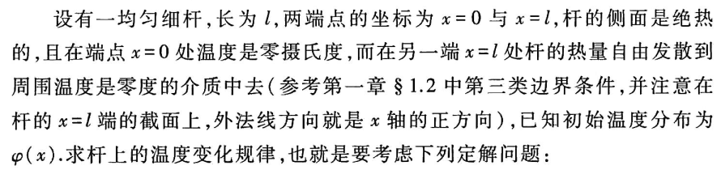
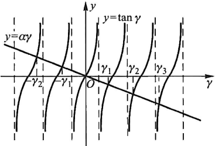
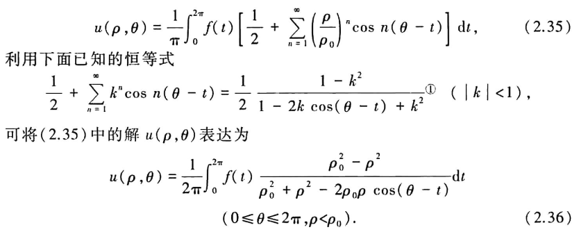

## Ch2 分离变量法

### 有界弦的自由振动

为了讨论分离变量法，首先讨论两端固定的弦的自由振动，问题归结为求解下面式子：

$$

\left\{ \begin{array}{l}
	\frac{\partial ^2u}{\partial t^2}=a^2\frac{\partial ^2u}{\partial x^2},0<x<l,t>0\\
	\left. u \right|_{x=0}=0,\left. u \right|_{x=1}=0,t>0\\
	\left. u \right|_{t=0}=\varphi (x),\left. \frac{\partial u}{\partial t} \right|_{t=0}=\psi (x),0\leqslant x\leqslant l\\
\end{array} \right.

$$

这一定解问题特点在于：微分方程线性齐次，边界条件齐次

我们利用叠加原理，首先求出能够满足齐次边界条件的足够多的满足 **简单形式** 的特解，在组合形成满足初值条件的解

假定 $u(x,t)=X(x)T(t)$,那么：

$$

\frac{\partial ^2u}{\partial x^2}=X''\left( x \right) T\left( t \right) , \frac{\partial ^2u}{\partial t^2}=X\left( x \right) T''\left( t \right)

$$

带入方程：

$$

X\left( x \right) T''\left( t \right) =a^2X''\left( x \right) T\left( t \right)
\\
\Rightarrow \frac{X''\left( x \right)}{X\left( x \right)}=\frac{T''\left( t \right)}{a^2T\left( t \right)}

$$

注意到左边仅是 $x$ 的函数，右边是 $t$ 的函数，这意味着两边基本都是一个常数，记为 $-\lambda$：

$$

\frac{X''\left( x \right)}{X\left( x \right)}=\frac{T''\left( t \right)}{a^2T\left( t \right)}=-\lambda
\\
\Rightarrow X''\left( x \right) +\lambda X\left( x \right) =0
\\
\Rightarrow T''\left( t \right) +\lambda a^2T\left( t \right) =0

$$

因为边界条件叠加更符合我们的直观理解，带入边界条件注意到：

$$

X\left( 0 \right) T\left( t \right) =0, X\left( l \right) T\left( t \right) =0

$$

我们不期望出现 **平凡解**，即 $u(x,t)=0$，因此有：

$$

X\left( 0 \right) =0, X\left( l \right) =0

$$

问题转化为了求解常微分方程的边界问题：

$$

\begin{cases}
	X''\left( x \right) +\lambda X\left( x \right) =0\\
	X\left( 0 \right) =0, X\left( l \right) =0\\
\end{cases}

$$

我们分析 $\lambda$ 的范围：

- $\lambda < 0$

  此时方程通解为：$X\left( x \right) =Ae^{\sqrt{-\lambda}x}+Be^{-\sqrt{-\lambda}x}$

  带入边界条件=>A=B=0，平凡，舍去

- $\lambda = 0$

  此时方程解为 X=Ax+B，显然舍去

- $\lambda > 0$

  此时假定 $\lambda=b^2$，此时方程 (30) 解为：
  
$$

  X\left( x \right) =A\cos \left( \beta x \right) +B\sin \left( \beta x \right)
  \\
  \Rightarrow A=0, \sin \beta l=0\Rightarrow \beta =\frac{n\pi}{l}\left( n=1,2,\cdots \right)
  
$$

​	注意这里不需要考虑 n<0 的情形，因为 sin 是奇函数，实际上 -n 对应的也是相同的形式

因此特征值问题 (30) 的解为：

$$

\begin{array}{c}
	\lambda _n=\frac{n^2\pi ^2}{l^2}\,\,\left( n=1,2,\cdots \right)\\
	X_n\left( x \right) =B_n\sin \left( \frac{n\pi}{l}x \right) \,\,\left( n=1,2,\cdots \right)\\
\end{array}

$$

考虑 $T_n$ 形式，注意这里的 $\lambda>0$，因此带入 (27) 有：

$$

T''_n\left( t \right) +\frac{a^2n^2\pi ^2}{l^2}T_n\left( t \right) =0
\\
\Rightarrow T_n\left( t \right) =C'_n\cos \frac{n\pi a}{l}t+D'_n\sin \frac{n\pi a}{l}t

$$

因此最终解的形式为：

$$

\begin{array}{c}
	u_n\left( x,t \right) =\left( {\color[RGB]{240, 0, 0} C'_n}\cos \frac{n\pi a}{l}t+{\color[RGB]{240, 0, 0} D'_n}\sin \frac{n\pi a}{l}t \right) B_n\sin \frac{n\pi}{l}x\\
	=\left( {\color[RGB]{240, 0, 0} C_n}\cos \frac{n\pi a}{l}t+{\color[RGB]{240, 0, 0} D_n}\sin \frac{n\pi a}{l}t \right) \sin \frac{n\pi}{l}x\\
	u\left( x,t \right) =\sum_{n=1}^{\infty}{u_n\left( x,t \right)}\\
\end{array}

$$

带入边界条件：

$$

\begin{array}{c}
	\left. u\left( x,t \right) \right|_{t=0}=u\left( x,0 \right) =\sum_{n=1}^{\infty}{C_n\sin \frac{n\pi}{l}x}=\phi \left( x \right)\\
	\left. \frac{\partial u}{\partial t} \right|_{t=0}=\sum_{n=1}^{\infty}{D_n\frac{n\pi a}{l}}\sin \frac{n\pi}{l}x=\psi \left( x \right)\\
\end{array}

$$

注意到 $\phi(x), \psi(x)$ 都是定义在 $[0,l]$ 上的函数，因此选取两函数的傅里叶正弦级数展开的系数可以得到对应的解：

$$

\begin{array}{c}
	C_n=\frac{2}{l}\int_0^l{\phi \left( x \right) \sin \frac{n\pi}{l}x\mathrm{d}x}\\
	D_n\frac{n\pi a}{l}=\frac{2}{l}\int_0^l{\begin{array}{c}
	\begin{array}{c}
	\psi \left( x \right) \sin \frac{n\pi}{l}x\mathrm{d}x\\
\end{array}\\
\end{array}}\\
	\Rightarrow D_n=\frac{2}{n\pi a}\int_0^l{\psi \left( x \right) \sin \frac{n\pi}{l}x\mathrm{d}x}\\
\end{array}

$$

回过头来看，我们的分离变量法实际上是将解分解为了一系列驻波的和，这些驻波彼此独立。因此分离变量法也被称为 **驻波法**

### 有限长杆的热传导

问题描述如下：

问题方程为：

$$

\left\{ \begin{array}{l}
	\frac{\partial u}{\partial t}=a^2\frac{\partial ^2u}{\partial x^2},0<x<l,t>0\\
	u(0,t)=0,\frac{\partial u(l,t)}{\partial x}+hu(l,t)=0,t>0\\
	u(x,0)=\varphi (x),0\leqslant x\leqslant l\\
\end{array} \right.

$$

使用分离变量法，假设 $u\left( x,t \right) =X\left( x \right) T\left( t \right)$，和上面推导思路类似，常数 $\lambda$ 的取值经过讨论可以写为下面形式：

$$

\frac{T'\left( t \right)}{a^2T\left( t \right)}=\frac{X''\left( x \right)}{X\left( x \right)}=-\beta ^2

$$

带入边界条件：

$$

\begin{array}{c}
	X\left( x \right) =A\cos \beta x+B\sin \beta x\Rightarrow X\left( 0 \right) =0\Rightarrow A=0\\
	\Rightarrow X'\left( l \right) +hX\left( l \right) =0\Rightarrow \tan \gamma =\alpha \gamma\\
	\gamma =\beta l,\alpha =-\frac{1}{hl}\\
\end{array}

$$

因此取方程的无穷正根得到结果：

$$

X_n\left( x \right) =B_n\sin \beta _nx
\\
{\beta _n}^2=\frac{{\gamma _n}^2}{l^2}, \tan \gamma _n=\alpha \gamma _n,\alpha =-\frac{1}{hl}

$$

带回 (37) 得到：

$$

\begin{array}{c}
	T_n\left( t \right) =A_ne^{-{\beta _n}^2a^2t}\\
	u_n\left( x,t \right) =X_n\left( t \right) T_n\left( t \right)\\
	=C_ne^{-{\beta _n}^2a^2t}\sin \beta _nx\\
\end{array}

$$

带入初值条件，我们期 望：

$$

u\left( x,0 \right) =\sum{C_n\sin \beta _nx=\phi \left( x \right)}

$$

我们需要考察 **函数系在 [0,l] 上的正交性**(${\sin\beta_n x}$)

这类函数的正交性可以通过欧拉公式分析：

$$

\begin{array}{c}
	2\int_0^l{\sin \beta _nx}\sin \beta _mxdx=\int_0^l{\left( \cos \left( \beta _n-\beta _m \right) x \right) -\left( \cos \left( \beta _n+\beta _m \right) x \right)}dx\\
	=\frac{1}{\beta _n-\beta _m}\left( \sin \left( \beta _n-\beta _m \right) l \right) -\frac{1}{\beta _n+\beta _m}\left( \sin \left( \beta _n+\beta _m \right) l \right)\\
	\sin \left( \beta _n-\beta _m \right) l=\sin \left( \gamma _n-\gamma _m \right) =\sin \gamma _n\cos \gamma _m-\sin \gamma _m\cos \gamma _n\\
	=\cos \gamma _m\alpha \gamma _n\cos \gamma _n-\cos \gamma _n\alpha \gamma _m\cos \gamma _m=\alpha \cos \gamma _m\cos \gamma _n\left( \gamma _n-\gamma _m \right)\\
	\Rightarrow \frac{1}{\beta _n-\beta _m}\left( \sin \left( \beta _n-\beta _m \right) l \right) -\frac{1}{\beta _n+\beta _m}\left( \sin \left( \beta _n+\beta _m \right) l \right)\\
	=l\alpha \left( \mathrm{os}\gamma _m\cos \gamma _n-\mathrm{os}\gamma _m\cos \gamma _n \right) =0\\
\end{array}

$$

令正交系的权重系数为：

$$

L_n=\int_0^l{\sin ^2\beta _nx\mathrm{d}x}

$$

那么可以在该正交系上做傅里叶级数分解：

$$

\begin{array}{c}
	u\left( x,0 \right) =\sum{C_n\sin \beta _nx=\phi \left( x \right)}\\
	\Rightarrow \int_0^l{\phi \left( x \right) \sin \beta _nx\mathrm{d}x}=C_nL_n\\
	\Rightarrow C_n=\frac{1}{L_n}\int_0^l{\phi \left( x \right) \sin \beta _nx\mathrm{d}x}\\
\end{array}

$$

总的来说，分离变量法求解偏微分方程思路如下：

- 首先偏微分方程定解问题转换为常微分方程定解问题，这对于线性齐次微分方程和齐次边界条件可以解决
- 确定特征值和特征函数。在边界条件齐次时，求特征函数就是求一个常微分方程使其满足零边界条件
- 定出特征值结构，获取特征值对应的特征函数 $u_n(x,t)$
- 最后叠加级数形式，根据条件确定级数系数

### 圆域二维拉普拉斯方程

求解问题为：一个半径为 $\rho_0$ 的薄圆盘，上下两面绝热，圆盘边缘温度分布已知，求达到稳恒状态的圆盘温度分布。

建立问题方程为：

$$

\Delta u=0, \left. u \right|_{\rho =\rho _0}=f\left( \theta \right)

$$

由于稳恒问题，没有 IC；这里自然地采取极坐标表示问题：

$$

\left\{ \begin{array}{l}
	\Delta u=\frac{1}{\rho}\frac{\partial}{\partial \rho}\left( \rho \frac{\partial u}{\partial \rho} \right) +\frac{1}{\rho ^2}\frac{\partial ^2u}{\partial \theta ^2}=0,\rho <\rho _0,0\leqslant \theta \leqslant 2\pi\\
	u\left( \rho _0,\theta \right) =f(\theta ),0\leqslant \theta \leqslant 2\pi\\
\end{array} \right.

$$

考虑到圆盘温度分布物理限制，有：

$$

\left| u\left( 0,\theta \right) \right|<+\infty
\\
u\left( \rho ,\theta \right) =u\left( \rho ,\theta +2\pi \right)

$$

分离变量法，假定 $u\left( \rho ,\theta \right) =R\left( \rho \right) \varTheta \left( \theta \right)$

$$

\begin{array}{c}
	R''\varTheta +\frac{1}{\rho}R'\varTheta +\frac{1}{\rho ^2}R\varTheta ''=0\\
	\Rightarrow \frac{\rho ^2R''+\rho R'}{R}=-\frac{\varTheta ''}{\varTheta}=\lambda\\
	\Rightarrow \varTheta ''+\lambda \varTheta =0\\
	\Rightarrow \rho ^2R''+\rho R'-\lambda R=0\\
\end{array}

$$

整理我们得到了两个常微分方程的定解问题：

$$

\begin{cases}
	\varTheta ''+\lambda \varTheta =0\\
	{\color[RGB]{240, 0, 0} \varTheta \left( \theta \right) =\varTheta \left( \theta +2\pi \right) }\\
\end{cases}, \begin{cases}
	\rho ^2R''+\rho R'-\lambda R=0\\
	\left| R\left( 0 \right) \right|<+\infty\\
\end{cases}

$$

注意到，我们分析问题考虑的是 **叠加原理**，因此 **满足可加性的条件更好**，因此首先考虑红色的问题。

首先讨论 $\lambda$ 的范围，可以类似的得到：$\lambda >0$，因此有：

$$

\lambda =\beta ^2, \varTheta _{\beta}\left( \theta \right) =\alpha '_{\beta}\cos \beta \theta +b'_{\beta}\sin \beta \theta

$$

为了保证 $\Theta$ 以 $2\pi$ 为周期，那么 $\beta$ 应该是整数，因此：

$$

\lambda =n^2, \varTheta _{\beta}\left( \theta \right) =\alpha '_n\cos n\theta +b'_n\sin n\theta

$$

考率剩下的常微分方程，其是一个 **欧拉方程**，其通解满足：

$$

R_0=c_0+d_0\ln \rho , \lambda =0
\\
R_n=c_n\rho ^n+d_n\rho ^{-n}, \lambda =n^2

$$

为了保证 $R(0)$ 非无穷的限制，其解为：

$$

d_n=0, R_n=c_n\rho ^n
\\
\Rightarrow u\left( \rho ,\theta \right) =\frac{a_0}{2}+\sum_{n=1}^{\infty}{\rho ^n\left( a_n\cos n\theta +b_n\sin n\theta \right)}

$$

其中常数项代表特征值为 0 的解。

带入边界条件，将边界条件在 {sin(nθ)} 下傅里叶展开：

$$

\begin{cases}
	a_0=\frac{1}{\pi}\int_0^{2\pi}{f\left( \theta \right) \mathrm{d}\theta}\\
	a_n=\frac{1}{\rho ^n\pi}\int_0^{2\pi}{f\left( \theta \right) \cos n\theta \mathrm{d}\theta}\\
	b_n=\frac{1}{\rho ^n\pi}\int_0^{2\pi}{f\left( \theta \right) \sin n\theta \mathrm{d}\theta}\\
\end{cases}

$$

此外，还可以将上式 (55) 解写为下面的积分形式，被称为 **圆域内的泊松公式**

### 非齐次方程求解

sec1 中研究了有界弦的自由振动，但更常见的是在收到强迫力作用下产生的振动现象，即下列定解问题：

$$

\left\{ \begin{array}{l}
	\frac{\partial ^2u}{\partial t^2}=a^2\frac{\partial ^2u}{\partial x^2}+f(x,t),0<x<l,t>0\\
	\left. u \right|_{x=0}=\left. u \right|_{x=1}=0,t>0\\
	\left. u \right|_{t=0}=\varphi (x),\left. \frac{\partial u}{\partial t} \right|_{t=0}=\psi (x),0\leqslant x\leqslant l\\
\end{array} \right.

$$

在现在情况下，我们可以从物理角度认识到，弦的振动是由两部分干扰引起的，一个是强迫力，另一个是初始状态。因此振动可以看做由强迫力引起的振动和仅由初始状态引起的振动的合成：

$$

u(x,t)=V(x,t)+W(x,t)

$$

其中 $V(x,t)$ 代表仅由强迫力引起的弦振动的位移，$W(x,t)$ 代表仅由初始状态引起的弦振动

分别满足：

$$

\left\{ \begin{array}{l}
	{\color[RGB]{240, 0, 0} \frac{\partial ^2V}{\partial t^2}=a^2\frac{\partial ^2V}{\partial x^2}+f(x,t)},0<x<l,t>0\\
	\left. V \right|_{x=0}=\left. V \right|_{x=l}=0,t>0\\
	\left. V \right|_{t=0}=\left. \frac{\partial V}{\partial t} \right|_{1=0}=0,0\leqslant x\leqslant l.\\
\end{array} \right.

$$

$$

\left\{ \begin{array}{l}
	\frac{\partial W}{\partial t^2}=a^2\frac{\partial ^2W}{\partial x^2},0<x<l,t>0\\
	\left. W \right|_{x=0}=\left. W \right|_{x=l}=0,t>0\\
	{\color[RGB]{240, 0, 0} \left. W \right|_{t=0}=\varphi \left( x \right) ,\left. \frac{\partial W}{\partial t} \right|_{t=0}=\psi \left( x \right) },0\leqslant x\leqslant l\\
\end{array} \right.

$$

其中式子 (59) 可以直接使用分离变量法求解，重点在于求解无初始条件的受迫振动 (58)

关于式子 (58)，我们可以使用类似于 **线性非齐次常微分方程** 中常用的 **参数变易法**，并保持这样的假想：**定解问题可以分解为无穷多个驻波的叠加，每个驻波的波形由相应齐次方程通过分离变量得到的特征值问题的特征函数决定**

我们可以假设 (58) 的解满足下面的形式：

$$

V\left( x,t \right) =\sum_{n=1}^{\infty}{v_n\left( t \right) \sin \frac{n\pi}{l}x}

$$

将自由项 $f(x,t)$ 按照特征函数系展开：

$$

f\left( x,t \right) =\sum_{n=1}^{\infty}{f_n\left( t \right) \sin \frac{n\pi}{l}x}
\\
f_n\left( t \right) =\frac{2}{l}\int_0^l{f\left( x,t \right) \sin \frac{n\pi}{l}x\mathrm{d}x}

$$

那么带入 (58) 的常微分方程：

$$

\begin{array}{c}
	\sum_{n=1}^{\infty}{\left( v''_n\left( t \right) +\frac{a^2n^2\pi ^2}{l^2}v_n\left( t \right) -f_n\left( t \right) \right) \sin \frac{n\pi}{l}x}=0\\
	\Rightarrow v''_n\left( t \right) +\frac{a^2n^2\pi ^2}{l^2}v_n\left( t \right) -f_n\left( t \right) =0\\
\end{array}

$$

考虑到问题的初值条件：

$$

v_n\left( 0 \right) =v'_n\left( 0 \right) =0

$$

考虑到使用 **拉普拉斯变换法** 或者 **参数变易法**，可以得到：

$$

v_n\left( t \right) =\frac{l}{n\pi a}\int_0^t{f_n\left( \tau \right) \sin \frac{n\pi a\left( t-\tau \right)}{l}\mathrm{d}\tau}

$$

这里拉普拉斯方法做法如下

$$

\begin{array}{c}
	v''_n\left( t \right) +\frac{a^2n^2\pi ^2}{l^2}v_n\left( t \right) -f_n\left( t \right) =0\\
	\Rightarrow s^2U+\frac{a^2n^2\pi ^2}{l^2}U=F\Rightarrow U=\frac{1}{s^2+\frac{a^2n^2\pi ^2}{l^2}}F\\
	\Rightarrow v_n=\mathrm{conv}\left( \frac{l}{n\pi a}\sin \frac{n\pi at}{l},f_n \right)\\
\end{array}

$$

因此问题强迫振动部分最终解为：

$$

\begin{array}{c}
	v_n\left( t \right) =\frac{l}{n\pi a}\int_0^t{f_n\left( \tau \right) \sin \frac{n\pi a\left( t-\tau \right)}{l}\mathrm{d}\tau}\\
	V\left( x,t \right) =\sum_{n=1}^{\infty}{\left[ \frac{l}{n\pi a}\int_0^t{f_n\left( \tau \right) \sin \frac{n\pi a\left( t-\tau \right)}{l}\mathrm{d}\tau} \right] \sin \frac{n\pi}{l}x}\\
\end{array}

$$

将其加上自由响应部分的解，可以得到最终的解

### 非齐次边界求解

总的原则还是将 **边界条件转化为齐次的**，具体来说就是取一个适当的未知函数之间的代换，使得对新未知函数边界是齐次的。

如下面的定解问题：

$$

\left\{\begin{array}{l}
\frac{\partial^{2} u}{\partial t^{2}}=a^{2} \frac{\partial^{2} u}{\partial x^{2}}+f(x, t), 0<x<l, t>0 \\
\left.u\right|_{x=0}=u_{1}(t),\left.u\right|_{x=l}=u_{2}(t), t>0 \\
\left.u\right|_{t=0}=\varphi(x),\left.\frac{\partial u}{\partial t}\right|_{t=0}=\psi(x), 0 \leqslant x \leqslant l
\end{array}\right.

$$

考虑代换将边界条件转化为齐次的：

$$

u\left( x,t \right) =V\left( x,t \right) +W\left( x,t \right)

$$

选取 $W(x,t)$ 使得 $V(x,t)$ 的边界条件是齐次的，即：

$$

\left. V \right|_{x=0}=\left. V \right|_{x=l}=0
\\
\Rightarrow \left. W \right|_{x=0}=u_1\left( t \right) , \left. W \right|_{x=l}=u_2\left( t \right)

$$

可以发现很容易考虑一个相对 x 的一次关系就可以满足这样约束：

$$

W=A\left( t \right) x+B\left( t \right)
\\
A\left( t \right) =\frac{1}{l}\left[ u_2\left( t \right) -u_1\left( t \right) \right] , B\left( t \right) =u_1\left( t \right)

$$

此时关于新函数的 V 的定解问题转化为：

$$

\left\{\begin{array}{l}
\frac{\partial^{2} V}{\partial t^{2}}=a^{2} \frac{\partial^{2} V}{\partial x^{2}}+f_{1}(x, t), 0<x<l, t>0 \\
\left.V\right|_{x=0}=\left.V\right|_{x=l}=0, t>0, \\
\left.V\right|_{t=0}=\varphi_{1}(x),\left.\frac{\partial V}{\partial t}\right|_{t=0}=\psi_{1}(x), 0 \leqslant x \leqslant l .
\end{array}\right.

$$

其中：

$$

\left\{\begin{array}{l}
f_{1}(x, t)=f(x, t)-\left[u_{1}^{\prime \prime}(t)+\frac{u_{2}^{\prime \prime}(t)-u_{1}^{\prime \prime}(t)}{l} x\right] \\
\varphi_{1}(x)=\varphi(x)-\left[u_{1}(0)+\frac{u_{2}(0)-u_{1}(0)}{l} x\right] \\
\psi_{1}(x)=\psi(x)-\left[u_{1}^{\prime}(0)+\frac{u_{2}^{\prime}(0)-u_{1}^{\prime}(0)}{l} x\right]
\end{array}\right.

$$

因此问题可求解了

### 关于二阶常微分方程特征值的一些结论

考虑这样的一个方程：

$$

\frac{\mathrm{d}}{\mathrm{d}x}\left( k\left( x \right) \frac{\mathrm{d}y}{\mathrm{d}x} \right) -q\left( x \right) y+\lambda \rho \left( x \right) y=0 \left( 0<x<b \right)

$$

这一方程被称为 **施图姆 - 刘维尔方程 (Sturm-Liouville)**，任意一个二阶线性常微分方程在乘以适当函数后都可以化成这种形式

其中这里的 k,q,ρ有一定的限制，但是这是数学系研究的东西，我们工程一般的都是可以直接使用的

存在以下几点结论：

- **存在无穷多实特征值**

  - 可以适当调换这些特征值顺序，构成一个非递减序列

- **所有特征值均不为负**

  - 当且仅当两个边界条件都是齐次第二类边界条件时，$\lambda=0$ 是一个特征值

- ${\color[RGB]{240, 0, 0} \lambda _m\ne \lambda _n}$，对应的特征函数为 $y_m(x), y_n(x)$

  - 
$$

	\int_a^b{\rho \left( x \right) y_m\left( x \right) y_n\left( x \right) \mathrm{d}x}=0 \left( \lambda _m\ne \lambda _n \right)
	
$$

  - 带权函数和特征函数乘积正交

- 特征函数系 $\left\{ y_n\left( x \right) \right\}$ 在区间 [a,b] 上构成一个完备系，因此任意一个在 [a,b] 上具备一阶连续导数和分段连续的二阶导数的函数 f(x)，只要其满足特征函数的每个函数的边界条件，可以将其按照特征函数系展开成绝对且一致收敛的级数：

- 
$$

  f\left( x \right) =\sum_{n=1}^{\infty}{f_ny_n\left( x \right)}, f_n=\frac{\int_a^b{\rho \left( x \right) f\left( x \right) y_n\left( x \right) \mathrm{d}x}}{\int_a^b{\rho \left( x \right) {y_n}^2\left( x \right) \mathrm{d}x}}
  
$$

