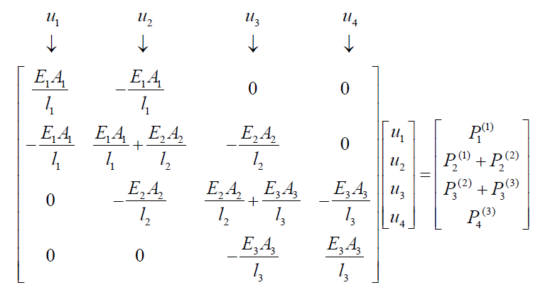

# Chap1 有限元分析过程概要

## 有限元思路引进

研究一个复杂函数在给定空间上的特征，可以进行简化后分析。简化一共有 2 中方式：
- 基于全域的展开
- 基于子域的分段函数组合

一个一维函数的例子如下：

可以发现，第一种方式基本函数复杂，但他是是高次连续函数，一般情况下，仅采用几个基底函数就可以得到较高的逼近精度；第二种方式所采用的基本函数非常简单，而且是在子域定义的，但它是线性函数，函数的连续性阶次较低，因此需要使用较多的分段才能得到较好的逼近效果，则计算工作量较大。

对于第一种的函数逼近方式，就是力学分析中的经典瑞利 - 里兹方法 (Rayleigh-Ritz principle) 的思想，而针对第二种的函数逼近方式，就是现代力学分析中的有限元方法的思想，其中的分段就是“单元”的概念。

## 有限元形式

### 1D 杆单元例子

一个标准杆单元如下图所示：

将单元位移和外力列写如下：

$$
\begin{array}{c}
	q^e=\left[ \begin{array}{c}
	u_1\\
	u_2\\
\end{array} \right] =\left[ \begin{matrix}
	u_1&		u_2\\
\end{matrix} \right] ^T\\
	P^e=\left[ \begin{array}{c}
	P_1\\
	P_2\\
\end{array} \right] =\left[ \begin{matrix}
	P_1&		P_2\\
\end{matrix} \right] ^T\\
\end{array}
$$

由于应力应变关系，有内力列阵可以写为：

$$
\left[ \begin{array}{c}
	-I_1\\
	I_2\\
\end{array} \right] =\left[ \begin{matrix}
	\frac{EA}{l}&		-\frac{EA}{l}\\
	-\frac{EA}{l}&		\frac{EA}{l}\\
\end{matrix} \right] \left[ \begin{array}{c}
	u_1\\
	u_2\\
\end{array} \right] 
$$

另一方面，有节点内力和外力平衡，故：

$$
\left[ \begin{matrix}
	\frac{EA}{l}&		-\frac{EA}{l}\\
	-\frac{EA}{l}&		\frac{EA}{l}\\
\end{matrix} \right] \left[ \begin{array}{c}
	u_1\\
	u_2\\
\end{array} \right] =\left[ \begin{array}{c}
	P_1\\
	P_2\\
\end{array} \right] 
$$

进一步可以写成：

$$
\begin{array}{c}
	\boldsymbol{K}^e\boldsymbol{q}^e=\boldsymbol{P}^e\\
	\boldsymbol{K}^e=\left[ \begin{matrix}
	\frac{EA}{l}&		-\frac{EA}{l}\\
	-\frac{EA}{l}&		\frac{EA}{l}\\
\end{matrix} \right] =\left[ \begin{matrix}
	K_{11}&		K_{12}\\
	K_{21}&		K_{22}\\
\end{matrix} \right]\\
\end{array}
$$

可以看出上面方程是内力和外力的**平衡方程**，$K^e$被称为单元的刚度矩阵，其对应的矩阵项被称为刚度矩阵的刚度系数

### 1D 有限元分析过程应用

::: warning problem
使用杆单元方法，求解下面这个结构的所有力学参数。相关的材料参数为：

:::

所谓基于单元的分析方法，就是将原整体结构按几何形状的变化性质划分节点并进行编号，然后将其分解为一个个小的构件（即：单元），基于节点位移，建立每一个单元的节点平衡关系（叫做单元刚度方程）；下一步就是将各个单元进行组合和集成，以得到该结构的整体平衡方程（也叫做整体刚度方程），按实际情况对方程中一些节点位移和节点力给定相应的值（叫做处理边界条件），就可以求解出所有的节点位移和支反力，最后在得到所有的节点位移后，就可以计算每一个单元的其它力学参量（如应变、应力）；下面给出该问题的有限元分析过程

1. 节点编号和单元划分

2. 计算单元的刚度方程并组装

参考上面式子，带入参数可以建立刚度方程。之后对方程进行组装如下：

其中右边的外力向量对应的就是各个节点上的合成节点力，有：P1=-100，P2=0，P3=50，P4 为支座支反力。下面准备求解。

3. 处理边界条件并求解

带入问题参数得到：

由于 u4=0，可以直接划掉这个矩阵的第 4 行和第 4 列，求解得到 
$$
\begin{array}{c}
	u_1=-4.583\times 10^{-3}\mathrm{m}\\
	u_2=-2.083\times 10^{-3}\mathrm{m}\\
	u_3=-4.167\times 10^{-3}\mathrm{m}\\
\end{array}
$$

4. 求解问题目标

带入求得的位移可以得到问题的所有物理参数，这里不做赘述

---
可以发现，有限元分析的最大特点就是标准化和规范化，这种特点使得大规模分析和计算成为可能，当采用了现代化的计算机以及所编制的软件作为实现平台时，则复杂工程问题的大规模分析就变为了现实。实现有限元分析标准化和规范化的载体就是单元，这就需要我们构建起各种各样的具有代表性的单元，一旦有了这些单元，就好像建筑施工中有了一些标准的预制构件 (如梁、楼板等)，可以按设计要求搭建出各种各样的复杂结构，如图 2-11 所示。

图 2-11 中所示的基本构件，实际上就是有限元分析中的“单元”，而搭建出的复杂结构就是我们需要分析的“对象”，下面用图示的方法列出有限元分析中常用的一些典型单元 (见图 2-12)。

