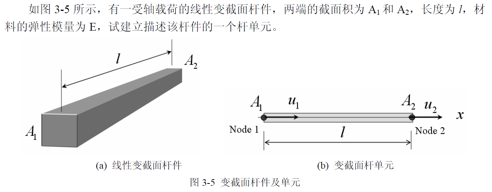

# Chap2 杆梁结构有限元分析方法

# Chap2 杆梁结构有限元分析方法

单元的描述包括单元的几何及节点描述、位移场、应变场、应力场、势能，也就是要充分利用描述问题的三大类变量以及三大类方程来计算单元的势能，然后，由最小势能原理 (或虚功原理) 来得到单元的方程。实际上，**单元内位移场的描述就是它的试函数的选取**

## 杆梁结构分析基础
下面来对杆单元进行基本的描述和分析

### 局部坐标系杆单元

##### 单元的几何和节点描述

这是一个局部坐标系中的杆单元，由于有 2 个端节点，基本变量为节点位移向量 $\boldsymbol{q}^e$

$$
\boldsymbol{q}^e=\left[ \begin{array}{c}
	u_1\\
	u_2\\
\end{array} \right] 
$$

类似可以定义节点力向量

##### 单元位移场的表达

假设单元位移场为 u(x)，由 Taylor 级数可以表示为：

$$
u\left( x \right) =a_0+a_1x+a_2x^2+\cdots 
$$

这个函数将由两个端节点的位移 u1 和 u2 来进行插值确定，从而取上式前两项作为该单元的位移插值模式
::: note todo
#todo 或许这里可以可以和深度学习结合起来？插值函数的确定不就是优化函数空间吗
:::

从而选取单元位移场为 
$$
u\left( x \right) =a_0+a_1x,
\\
\text{满足}:\begin{cases}
	u\left( x \right) |_{x=0}=u_1\\
	u\left( x \right) |_{x=l^e}=u_2\\
\end{cases}
$$

解之可得：
$$
\begin{cases}
	a_1=u_1\\
	a_2=\frac{u_2-u_1}{l^e}\\
\end{cases}
$$

从而最终的单元位移场函数为：

$$
\begin{array}{c}
	u\left( x \right) =u_1+\frac{u_2-u_1}{l^e}x=\left( 1-\frac{x}{l^e} \right) u_1+\left( \frac{x}{l^e} \right) u_2=\boldsymbol{N}\left( x \right) \cdot \boldsymbol{q}^e\\
	\boldsymbol{N}\left( x \right) =\left[ \begin{matrix}
	1-\frac{x}{l^e}&		\frac{x}{l^e}\\
\end{matrix} \right]\\
\end{array}
$$

其中 N 被称为**形函数矩阵**

##### 单元应变场和应力场的表达

由弹性力学中的几何方程，1D 问题的应变满足：

$$
\begin{array}{c}
	\varepsilon \left( x \right) =\frac{\mathrm{d}u\left( x \right)}{\mathrm{d}x}=\left[ \begin{matrix}
	-\frac{1}{l^e}&		\frac{1}{l^e}\\
\end{matrix} \right] \left[ \begin{array}{c}
	u_1\\
	u_2\\
\end{array} \right] =\boldsymbol{B}\left( x \right) \cdot \boldsymbol{q}^e\\
	\boldsymbol{B}\left( x \right) =\frac{\mathrm{d}}{\mathrm{d}x}\boldsymbol{N}\left( x \right) =\left[ \begin{matrix}
	-\frac{1}{l^e}&		\frac{1}{l^e}\\
\end{matrix} \right]\\
\end{array}
$$

B (x) 被称为**几何矩阵**

对应力有：
$$
\begin{array}{c}
	\sigma \left( x \right) =E^e\varepsilon \left( x \right) =E^e\boldsymbol{B}\left( x \right) \cdot \boldsymbol{q}^e=\boldsymbol{S}\left( x \right) \cdot \boldsymbol{q}^e\\
	\boldsymbol{S}\left( x \right) =E^e\boldsymbol{B}\left( x \right) =\left[ \begin{matrix}
	-\frac{E^e}{l^e}&		\frac{E^e}{l^e}\\
\end{matrix} \right]\\
\end{array}
$$
S(x) 被称为**应力矩阵**

##### 单元势能和刚度方程

根据上面式子，推导单元的势能为：
$$
\Pi ^e=U^e-W^e
$$

其中 U 代表应变能，W 代表外力功，从而有：

$$
\begin{aligned}
	\Pi ^e&=U^e-W^e=\frac{1}{2}\int_{\varOmega ^e}{\sigma \left( x \right) \cdot \varepsilon \left( x \right) \mathrm{d}\varOmega}-\left( P_{1}^{e}u_1+P_{2}^{e}u_2 \right)\\
	&=\frac{1}{2}\int_0^{l^e}{q^TS^TBqA\mathrm{d}x}-\left( P_{1}^{e}u_1+P_{2}^{e}u_2 \right)\\
	&=\frac{1}{2}q^T\left[ \begin{matrix}
	\frac{E^eA^e}{l^e}&		-\frac{E^eA^e}{l^e}\\
	-\frac{E^eA^e}{l^e}&		\frac{E^eA^e}{l^e}\\
\end{matrix} \right] q-\left[ \begin{matrix}
	P_{1}^{e}&		P_{2}^{e}\\
\end{matrix} \right] q\\
	&=\frac{1}{2}q^TKq-P^Tq\\
\end{aligned}
$$

其中 K 被称为**单元刚度矩阵**，P 被称为节点力向量

注意到势能应取最小值，对 Pi 做微分有：

$$
\begin{aligned}
	\Pi ^e&=\frac{1}{2}q^TKq-P^Tq\\
	\frac{\mathrm{d}}{\mathrm{d}q}\Pi ^e&=\left( \frac{1}{2}q^T\left( K+K^T \right) -P^T \right) ^T\\
	&=\left( \frac{1}{2}\left( K+K^T \right) q-P \right)\\
\end{aligned}
$$

由于 K 是对称矩阵，可以得到最终**单元的刚度方程**为 
$$
\boldsymbol{K}^e\boldsymbol{q}^e=\boldsymbol{P}^e
$$

---

类似上面过程，下面可以推导一个变截面杆单元的形式：

建立截面杆如图 (b) 所示，截面积满足：

$$
A\left( x \right) =\left( 1-\frac{x}{l} \right) A_1+\frac{x}{l}A_2
$$

取单元位移模式为：

$$
u\left( x \right) =a_0+a_1x=\boldsymbol{N}\left( x \right) \boldsymbol{q}^e
$$

得到单元形函数矩阵为：

$$
\boldsymbol{N}\left( x \right) =\left[ \begin{matrix}
	1-\frac{x}{l^e}&		\frac{x}{l^e}\\
\end{matrix} \right] 
$$

进一步得到几何矩阵 B(x) 为：

$$
\boldsymbol{B}\left( x \right) =\frac{\mathrm{d}}{\mathrm{d}x}\boldsymbol{N}\left( x \right) =\left[ \begin{matrix}
	-\frac{1}{l^e}&		\frac{1}{l^e}\\
\end{matrix} \right] 
$$

求刚度矩阵为：

$$
\begin{aligned}
	2U^e&=\int_{\varOmega}{\sigma \cdot \varepsilon \mathrm{d}\varOmega}=\int_{\varOmega}{\left( EBq \right) \cdot \left( Bq \right) \mathrm{d}\varOmega}\\
	&=\int_{\varOmega}{\left( EBq \right) ^T\left( Bq \right) \mathrm{d}\varOmega}=\int_{\varOmega}{q^TB^TE^TBq\mathrm{d}\varOmega}\\
	&=q^T\int_{\varOmega}{B^TE^TB\mathrm{d}\varOmega}q\Rightarrow K=\int_{\varOmega}{B^TE^TB\mathrm{d}\varOmega}\\
	K&=\int_0^l{\left[ \begin{array}{c}
	-\frac{1}{l}\\
	\frac{1}{l}\\
\end{array} \right] E\left[ \begin{matrix}
	-\frac{1}{l}&		\frac{1}{l}\\
\end{matrix} \right] A\left( x \right) \mathrm{d}x}\\
	&=\int_0^l{\frac{E}{l^2}\left[ \begin{matrix}
	1&		-1\\
	-1&		1\\
\end{matrix} \right] \left( \left( 1-\frac{x}{l} \right) A_1+\frac{x}{l}A_2 \right) \mathrm{d}x}\\
	&=\frac{E\left( A_1+A_2 \right)}{2l}\left[ \begin{matrix}
	1&		-1\\
	-1&		1\\
\end{matrix} \right]\\
\end{aligned}
$$

可以发现，相对等截面杆这里**线性变截面杆**取了平均面积

### 杆单元的坐标转换

#### 平面杆单元转换

在工程实际中，杆单元可能处于整体坐标系 (global coordinate system) 中的任意一个位置，如图 3-6 所示，这需要将原来在局部坐标系 (local coordinate system) 中所得到的单元表达等价地变换到整体坐标系中，这样，不同位置的单元才有公共的坐标基准，以便对各个单元进行集成 (即组装)

如上图 3-6 所示，假设局部坐标系中节点位移为：

$$
q^e=\left[ \begin{array}{c}
	u_1\\
	u_2\\
\end{array} \right] 
$$

整体坐标系中节点位移为：

$$
\overline{q^e}=\left[ \begin{array}{c}
	\overline{u_1}\\
	\overline{v_1}\\
	\overline{u_2}\\
	\overline{v_2}\\
\end{array} \right] 
$$

则应该满足方程：

$$
q^e=\left[ \begin{array}{c}
	u_1\\
	u_2\\
\end{array} \right] =\left[ \begin{matrix}
	\cos \alpha&		\sin \alpha&		&		\\
	&		&		\cos \alpha&		\sin \alpha\\
\end{matrix} \right] \left[ \begin{array}{c}
	\overline{u_1}\\
	\overline{v_1}\\
	\overline{u_2}\\
	\overline{v_2}\\
\end{array} \right] =T^e\overline{q^e}
$$

其中 T 为坐标变换矩阵 (可以看成旋转矩阵 R 转置的第一列拼凑起来的)
从而可以将问题放到全局坐标系下看：

$$
\begin{array}{c}
	\Pi ^e=\frac{1}{2}q^TKq-P^Tq\\
	=\frac{1}{2}\bar{q}^T\left( T^TKT \right) \bar{q}-\left( TP \right) ^T\bar{q}\\
	=\frac{1}{2}\bar{q}^T\bar{K}\bar{q}-\bar{P}^T\bar{q}\\
	\bar{K}=T^TKT,\bar{P}=TP\,\,\\
\end{array}
$$

其中 $\bar{K}$ 为整体坐标系下的单元刚度矩阵。类似的可以得到争议坐标系中的刚度方程：

$$
\boldsymbol{\bar{K}}^e\boldsymbol{\bar{q}}^e=\boldsymbol{\bar{P}}^e
$$

具体来说在上面的杆单元中，其刚度矩阵为：

$$

\overline{\mathbf{K}}_{(4 \times 4)}^{e}=\frac{E^{e} A^{e}}{l^{e}}\left[\begin{array}{cccc}
\cos ^{2} \alpha & \cos \alpha \sin \alpha & -\cos ^{2} \alpha & -\cos \alpha \sin \alpha \\
\cos \alpha \sin \alpha & \sin ^{2} \alpha & -\cos \alpha \sin \alpha & -\sin ^{2} \alpha \\
-\cos ^{2} \alpha & -\cos \alpha \sin \alpha & \cos ^{2} \alpha & \cos \alpha \sin \alpha \\
-\cos \alpha \sin \alpha & -\sin ^{2} \alpha & \cos \alpha \sin \alpha & \sin ^{2} \alpha
\end{array}\right]

$$

#### 空间杆单元转换

相对于平面杆单元，空间杆单元稍微复杂点，
其转换坐标矩阵满足：

其余基本没有太大变化

### 杆单元分析 Matlab 实现

最简单的线性杆单元的程序应该包括单元刚度矩阵、单元组装、单元应力等几个基本计算程序

参考 `E:\Code\Matlab\Packages\FEM` 中 的实现

#### 计算实例

如上图 3-8 所示，各杆的弹性模量和横截面积都是 $E=29.5\times 10^4/\mathrm{mm}^2$，$A=100\mathrm{mm}^2$, 求解各个结构的节点位移、单元应力和支反力

##### 结构离散化和编号

##### 各个单元矩阵描述

##### 建立整体刚度方程

##### 边界条件处理和刚度方程求解

##### 各个单元应力计算

##### 支反力计算

## 梁结构有限元分析

针对梁结构，如下图 3-9 所示，由于简支梁的宽度较小，外载沿宽度方向无变化，该问题可以认为是一个 xoy 平面内的问题，可以有以下两种方法来建立基本方程。
- 方法之一是采用一般的建模及分析方法，即从对象取出 dxdy 微元体进行分析，建立最一般的方程，见第 4.2 节中关于 2D 问题的基本变量及方程，这样，所用的变量较多，方程复杂，未考虑到这一具体问题的特征。
- 方法之二是针对细长梁用“特征建模”(characterized modeling) 的简化方法来推导三大方程，其基本思想是采用工程宏观特征量来进行问题的描述；图 3-9 所示问题的特征为：1 梁为细长梁（long beam），因此可只用 x 坐标来刻画，2 主要变形为垂直于 x 的挠度，可只用**挠度**(deflection) 来描述位移场；针对这两个特征，可以对梁沿高度方向的变形做出以下设定：(1) 变形后的直线假定；(2) 小变形假定。这两个假定对于细长梁的实际情况也是符合的

### 平面梁的基本方程

首先建立平面梁的基本模型，其变量如下：
- 位移：$v(x,\hat{y}=0)$（中性层的挠度）
- 应力：$\sigma$（采用 $\sigma_x$，其他应力分量很小，不考虑），该变量对应于梁截面上的弯矩 M
- 应变：$\varepsilon$（采用 $\varepsilon_x$，沿高度方向满足直线假定）

参考 [chap11 弯曲应力](./../材料力学简析/材料力学简析.md#chap11-弯曲应力)，建立平面梁的基本方程：

##### 平衡方程

$$
M=\int_A{\sigma _x\hat{y}\mathrm{d}A}
$$

其中 $\hat{y}$ 是以梁的中性层为起点的 y 坐标，M 是界面上的弯矩

利用 y 方向合力为 0 和玩具平衡的性质，有：

$$
\begin{array}{c}
	\mathrm{d}Q+\bar{p}\left( x \right) \mathrm{d}x=0\\
	\mathrm{d}M-Q\mathrm{d}x=0\\
\end{array}
$$

##### 几何方程

考虑梁的春晚变形，容易推出：

$$
\varepsilon _x\left( x,\hat{y} \right) =-\frac{\hat{y}}{R}=-\hat{y}\frac{\mathrm{d}^2v}{\mathrm{d}x^2}
$$

##### 物理方程

考虑胡克定律，整理上面方程有：

$$
\sigma _x=E\varepsilon _x
\\
\Rightarrow \begin{cases}
	-EI\frac{\mathrm{d}^4v}{\mathrm{d}x^4}+\bar{p}\left( x \right) =0\quad y\text{方向平衡}\\
	M\left( x \right) =\int_A{\sigma _x\hat{y}\mathrm{d}A}=-EI\frac{\mathrm{d}^2v}{\mathrm{d}x^2}\quad x\text{方向平衡}\\
	\sigma _x\left( x \right) =-E\hat{y}\frac{\mathrm{d}^2v}{\mathrm{d}x^2}\quad \text{物理方程}\\
	\varepsilon _x\left( x \right) =-\hat{y}\frac{\mathrm{d}^2v}{\mathrm{d}x^2}\quad \text{几何方程}\\
\end{cases}
$$

其中 $I=\int_A{\hat{y}^2\mathrm{d}A}$ 是梁截面的**惯性矩**，可以看出：将原始基本变量定为中性层的挠度，而其它力学参量都可以基于它来表达

##### 边界条件

- 两端的位移边界

$$
BC\left( u \right) :\quad v|_{x=0}=0,\quad v|_{x=l}=0
$$

- 两端的力边界

$$
BC\left( p \right) :\quad M|_{x=0}=0,\quad M|_{x=l}=0
$$

根据这些边界条件，存在好几种求解方式

##### 问题求解

###### 微分方程

参考
- [数理方程](./../数学物理方程/数学物理方程.md)
- [工程力学](./../材料力学简析/材料力学简析.md)
- [Chap3 弹性体振动](.//)

###### 虚功原理

虚功原理是通过静平衡状态下，内外力做虚功为 0 这一思想进行求解的，因此这里需要先求出虚功的表达式，这就依赖于如何表示位移场。这暗示我们首先假设一个位移场的形式，类似前面的形函数。

::: note note
有种里斯表示定理的感觉
:::

比如这里我们假设位移场为：

$$
\hat{v}\left( x \right) =c_1\sin \frac{\pi x}{l}
$$

其中 c1 为待定系数，那么得到虚位移场为：

$$
\delta \hat{v}\left( x \right) =\delta c_1\cdot \sin \frac{\pi x}{l}
$$

可以发现，提出的虚位移场满足边界条件，这类满足边界条件的试函数也叫做**许可位移**
根据提出的许可位移形式，其虚应变能为：

$$
\delta U=\int_{\varOmega}{\sigma _x\delta \varepsilon _x\mathrm{d}\varOmega}=\int_0^l{\int_A{E\varepsilon _x\delta \varepsilon _x\mathrm{d}A\mathrm{d}\varOmega}}
$$

其中 A 是梁的横截面，而对梁的弯曲问题，有集合方程：

$$
\varepsilon _x=-\frac{\hat{y}}{R}=-\hat{y}\frac{\mathrm{d}^2\hat{v}}{\mathrm{d}x^2}
$$

从而带入有：

$$
\begin{array}{c}
	\delta U=\int_0^l{E\left( \int_A{\left( \hat{y}^2\mathrm{d}A \right)} \right) \left( \frac{\mathrm{d}^2\hat{v}}{\mathrm{d}x^2} \right) \left( \frac{\mathrm{d}^2\delta \hat{v}}{\mathrm{d}x^2} \right) \mathrm{d}\varOmega}\\
	=\int_0^l{EI\left( \frac{\pi}{l} \right) ^2c_1\left( \sin \frac{\pi x}{l} \right) ^2\left( \frac{\pi}{l} \right) ^2\delta c_1\mathrm{d}x}\\
	=\frac{EIl}{2}\left( \frac{\pi}{l} \right) ^4c_1\delta c_1,I=\int_A{\hat{y}^2\mathrm{d}A}\\
\end{array}
$$

其中 I 是截面惯性矩。

而对外力，其虚功为：

$$
\delta W=\int_0^l{\bar{p}_0\delta \hat{v}\mathrm{d}x}=\bar{p}_0\delta c_1\int_0^l{\sin \frac{\pi x}{l}\mathrm{d}x}
\\
=\frac{2l\bar{p}_0}{\pi}\delta c_1
$$

由虚功原理，有：

$$
\begin{array}{c}
	\frac{2l\bar{p}_0}{\pi}\delta c_1=\frac{EIl}{2}\left( \frac{\pi}{l} \right) ^4c_1\delta c_1\\
	c_1=\frac{4l^4}{EI\pi ^5}\bar{p}_0,\quad \hat{v}\left( x \right) =\frac{4l^4}{EI\pi ^5}\bar{p}_0\sin \frac{\pi x}{l}\\
\end{array}
$$

###### 最小势能原理

类似 1D 杆单元情形，选取许可许可位移许可位移场为：

$$
\hat{v}\left( x \right) =c_1\sin \frac{\pi x}{l}+c_2\sin \frac{3\pi x}{l}
$$

计算应变能：

$$
\begin{aligned}
	U=&\frac{1}{2}\int_{\Omega}{\sigma _x}\cdot \varepsilon _x\cdot \mathrm{d}\Omega\\
	=&\frac{1}{2}\int_0^l{E}I\cdot \left( \frac{\mathrm{d}^2\hat{v}}{\mathrm{d}x^2} \right) ^2\mathrm{d}x\\
	=&\frac{1}{2}\int_0^l{E}I\left[ c_{1}^{2}\left( \frac{\pi}{l} \right) ^4\sin ^2\left( \frac{\pi x}{l} \right) +c_{2}^{2}\left( \frac{3\pi}{l} \right) ^4\sin ^2\left( \frac{3\pi x}{l} \right) +2c_1c_2\left( \frac{\pi}{l} \right) ^2\left( \frac{3\pi}{l} \right) ^2\sin \frac{\pi x}{l}\sin \frac{3\pi x}{l} \right] \mathrm{d}x\\
	=&\frac{EI}{2}\left[ c_{1}^{2}\left( \frac{\pi}{l} \right) ^4\frac{l}{2}+c_{2}^{2}\left( \frac{3\pi}{l} \right) ^4\frac{l}{2} \right]\\
\end{aligned}
$$

对应的外力功 W 为：

$$
\begin{aligned}
	W&=\int_0^l{\bar{p}_0\left( c_1\sin \frac{\pi x}{l}+c_2\sin \frac{3\pi x}{l} \right) \mathrm{d}x}\\
	&=\bar{p}_0\left( c_1\frac{2l}{\pi}+c_2\frac{2l}{3\pi} \right)\\
\end{aligned}
$$

从而总势能满足 $\Pi =U-W$ ：

$$
\left\{ \begin{array}{c}
	\frac{\partial \Pi}{\partial c_1}=\frac{EI}{2}\left( 2c_1\left( \frac{\pi}{l} \right) ^4\frac{l}{2} \right) -\bar{p}_0\frac{2l}{\pi}=0\\
	\frac{\partial \Pi}{\partial c_2}=\frac{EI}{2}\left( 2c_2\left( \frac{3\pi}{l} \right) ^4\frac{l}{2} \right) -\bar{p}_0\frac{2l}{3\pi}=0\\
\end{array} \right. 
$$

从而可以求出 c1 和 c2，进而得到 v(x) 的表达式：

$$
\hat{v}\left( x \right) =\frac{4\bar{p}_0l^4}{\pi ^5EI}\sin \frac{\pi x}{l}+\frac{4\bar{p}_0l^4}{243\pi ^5EI}\sin \frac{3\pi x}{l}
$$

可以发现，这里由于虚位移取了 2 项，相比前面虚功原理的一项，其第一阶形式相同，但由于存在第 2 阶，其精度更高。此外，上面求解所用的是函数是许可基地函数的线性组合，因此这也是一种**瑞利 - 里兹方法**

上面两个求解方法都是基于**试函数的能量方法 (也称为泛函极值方法)**，基本要点是不需求解原微分方程，但需要假设一个满足位移边界条件 BC(u) 的许可位移场。因此，如何寻找或构建满足所需要求的许可位移场是一个关键，并且，还期望这种构建许可位移场的方法还应具有标准化和规范性。下面则主要依赖**单元的位移函数**的构建，使得最终的位移场满足性质

### 局部坐标平面梁单元

上图是一个局部坐标系中的纯弯梁单元，长度 l，弹性模量 E，横截面惯性矩为 Iz，下面讨论其单元描述

##### 单元的几何节点和节点描述

假设两个端节点对应的节点位移向量为：

$$
\boldsymbol{q}^e=\left[ \begin{array}{c}
	v_1\\
	\theta _1\\
	v_2\\
	\theta _2\\
\end{array} \right] 
$$

对应的节点力向量为：

$$
\boldsymbol{P}^e=\left[ \begin{array}{c}
	P_{v1}\\
	M_1\\
	P_{v2}\\
	M_2\\
\end{array} \right] 
$$

##### 单元位移场

由于有 4 个位移节点条件，假设纯弯梁单元的位移场挠度为具有 4 个待定系数的函数模式：

$$
v\left( x \right) =a_0+a_1x+a_2x^2+a_3x^3
$$

考虑到单元节点位移条件，有：

$$
\begin{cases}
	v|_{x=0}=v_1\\
	v'|_{x=0}=\theta _1\\
	v|_{x=l}=v_2\\
	v'|_{x=l}=\theta _2\\
\end{cases}\Rightarrow \begin{cases}
	a_0=v_1\\
	a_1=\theta _1\\
	a_2=\frac{1}{l^2}\left( -3v_1-2\theta _1l+3v_2-\theta _2l \right)\\
	a_3=\frac{1}{l^3}\left( 2v_1+\theta _1l-2v_2+\theta _2l \right)\\
\end{cases}
$$

从而可以重写位移场函数：

$$
\begin{aligned}
	v(x)&=\left( 1-3\xi ^2+2\xi ^3 \right) v_1+l\left( \xi -2\xi ^2+\xi ^3 \right) \theta _1+\left( 3\xi ^2-2\xi ^3 \right) v_2+l\left( \xi ^3-\xi ^2 \right) \theta _2\\
	&=\mathbf{N}(\xi )\cdot \mathbf{q}^e\\
	\xi &=\frac{x}{l},\mathbf{N}(\xi )=\left[ \begin{matrix}{l}
	\left( 1-3\xi ^2+2\xi ^3 \right)&		l\left( \xi -2\xi ^2+\xi ^3 \right)&		\left( 3\xi ^2-2\xi ^3 \right)&		l\left( \xi ^3-\xi ^2 \right)\\
\end{matrix} \right]\\
\end{aligned}
$$

类似可以得到单元应变场：

$$
\begin{aligned}
	\varepsilon (x,\hat{y})&=-\hat{y}\frac{\mathrm{d}^2v(x)}{\mathrm{d}x^2}\\
	&=-\hat{y}\left[ \frac{1}{l^2}(12\xi -6)\quad \frac{1}{l}(6\xi -4)\quad -\frac{1}{l^2}(12\xi -6)\quad \frac{1}{l}(6\xi -2) \right] \cdot \mathbf{q}^e\\
	&=\mathbf{B}(\xi )\cdot \mathbf{q}^e\\
\end{aligned}
$$

其中 $\hat{y}$ 是以中性层为起点的 y 方向的坐标，B 是单元的几何矩阵

##### 单元应力场

结合梁的物理方程可以得到单元的应力矩阵 S

$$
\sigma \left( x,\hat{y} \right) =E\varepsilon \left( x,\hat{y} \right) =E\mathbf{B}\left( x,\hat{y} \right) \cdot \mathbf{q}^e=S\left( x,\hat{y} \right) \cdot \mathbf{q}^e
$$

##### 单元势能

$$
\Pi ^e=U^e-W^e
$$

其中应变能满足：

$$
\begin{array}{c}
	U^e=\frac{1}{2}\boldsymbol{q}^TK^e\boldsymbol{q}\\
	K^e=\int_0^l{\int_A{B^TEB\mathrm{d}A}\mathrm{d}x}=\int_A{\left( -\hat{y} \right) ^2E\mathrm{d}A\int_0^l{\frac{B^TB}{\left( -\hat{y} \right) ^2}\mathrm{d}x}}\\
	=\frac{EI_z}{l^3}\left[ \begin{matrix}
	12&		6l&		-12&		6l\\
	6l&		4l^2&		-6l&		2l^2\\
	-12&		-6l&		12&		-6l\\
	6l&		2l^2&		-6l&		4l^2\\
\end{matrix} \right]\\
\end{array}
$$

外力功满足：

$$
W^e=P^{eT}q^e
$$

##### 单元的刚度方程

同上面的最小势能原理，取最小值有：

$$
K^eq^e=P^e
$$

### 局部坐标一般平面梁单元

为推导局部坐标系中的一般平面梁单元，在图 3-13 所示的纯弯梁的基础上叠加进轴向位移 (由于为线弹性问题，满足叠加原理)，这时的节点位移自由度 (DOF) 共有 6 个，见图 3-13。此时平面梁单元的节点位移向量和节点力向量为：

$$
\begin{array}{c}
	\boldsymbol{q}^e=\left[ \begin{matrix}
	u_1&		v_1&		\theta _1&		u_2&		v_2&		\theta _2\\
\end{matrix} \right] ^T\\
	\boldsymbol{P}^e=\left[ \begin{matrix}
	P_{u1}&		P_{v1}&		M_1&		P_{u2}&		P_{v2}&		M_2\\
\end{matrix} \right] ^T\\
\end{array}
$$

对应的刚度方程为：

$$
\begin{array}{c}
	Kq=P\\
	\underset{(6\times 6)}{\mathbf{K}^e}=\left[ \begin{matrix}
	\frac{EA}{l}&		0&		0&		-\frac{EA}{l}&		0&		0\\
	0&		\frac{12EI}{l^3}&		\frac{6EI}{l^2}&		0&		-\frac{12EI}{l^3}&		\frac{6EI}{l^2}\\
	0&		\frac{6EI}{l^2}&		\frac{4EI}{l}&		0&		-\frac{6EI}{l^2}&		\frac{2EI}{l}\\
	-\frac{EA}{l}&		0&		0&		\frac{EA}{l}&		0&		0\\
	0&		-\frac{12EI}{l^3}&		-\frac{6EI}{l^2}&		0&		\frac{12EI}{l^3}&		-\frac{6EI}{l^2}\\
	0&		\frac{6EI}{l^2}&		\frac{2EI}{l}&		0&		-\frac{6EI}{l^2}&		\frac{4EI}{l}\\
\end{matrix} \right]\\
\end{array}
$$

### 平面梁单元的坐标变换

类似 [杆单元的坐标转换](./#杆单元的坐标转换) 上的分析，这里也引入一个坐标变换矩阵，设计矩阵如下所示：
- 局部坐标系下节点向量：
$$
 q^e=\left[ \begin{matrix}
	u_1&		v_1&		\theta _1&		u_2&		v_2&		\theta _2\\
\end{matrix} \right] ^T 
$$

- 全局坐标系下节点向量：
$$
\bar{q}^e=\left[ \begin{matrix}
	\bar{u}_1&		\bar{v}_1&		\theta _1&		\bar{u}_2&		\bar{v}_2&		\theta _2\\
\end{matrix} \right] ^T
$$

注意，在两个坐标系下，其转角 $\theta$ 是相同的，因为这个角对应的向量垂直于这个平面:)

写成矩阵形式有：

$$
\begin{array}{c}
	q^e=T^e\bar{q}^e\\
	T^e=\left[ \begin{matrix}
	\cos \alpha&		\sin \alpha&		&		&		&		\\
	-\sin \alpha&		\cos \alpha&		&		&		&		\\
	&		&		1&		&		&		\\
	&		&		&		\cos \alpha&		\sin \alpha&		\\
	&		&		&		-\sin \alpha&		\cos \alpha&		\\
	&		&		&		&		&		1\\
\end{matrix} \right]\\
\end{array}
$$

因此做坐标变换可以发现：

$$
\begin{array}{c}
	\bar{K}\bar{q}=\bar{P}\\
	\bar{K}=T^TKT,\bar{P}=T^TP\\
\end{array}
$$

### 空间梁单元分析

#### 空间梁单元建模

空间梁单元除承受轴力和弯矩外，还可能承受扭矩的作用，而且弯矩可能同时在两个坐标面内存在。图 3-18 所示为一局部坐标系中的空间梁单元，其长度为 l，弹性模量为 E，横截面的惯性矩为 (绕并行于 z 轴的中性轴) 和 (绕并行于 y 轴的中性轴)，横截面的扭转惯性矩为 J

类似，设计 2 个端节点，每个节点的位移自由度为 6 个，单元有 12 个自由度；在局部坐标系下的节点位移向量和节点力向量如下：

$$
\begin{array}{c}
	q^e=\left[ \begin{matrix}
	u_1&		v_1&		w_1&		\theta _{x1}&		\theta _{y1}&		\theta _{z1}&		u_2&		v_2&		w_2&		\theta _{x2}&		\theta _{y2}&		\theta _{z2}\\
\end{matrix} \right] ^T\\
	P^e=\left[ \begin{matrix}
	P_{u1}&		P_{v1}&		P_{w1}&		M_{x1}&		M_{y1}&		M_{z1}&		P_{u2}&		P_{v2}&		P_{w2}&		M_{x2}&		M_{y2}&		M_{z2}\\
\end{matrix} \right] ^T\\
\end{array}
$$

可以直接构造刚度矩阵，可以分成 4 个小部分：

###### 节点位移刚度矩阵 (u1,u2)

对应杆单元的刚度矩阵参考前面 [单元势能和刚度方程](./#单元势能和刚度方程)，有：

$$
K_{u_1u_2}^{e}=\frac{EA}{l}\left[ \begin{matrix}
	1&		-1\\
	-1&		1\\
\end{matrix} \right] 
$$

###### 扭转位移刚度矩阵 ($\theta_{x1},\theta_{x2}$)

注意到扭转问题和前面的纯拉伸问题接近，因此其刚度矩阵形式基本一样，如下：

$$
K_{\theta _1\theta _2}^{e}=\frac{GJ}{l}\left[ \begin{matrix}
	1&		-1\\
	-1&		1\\
\end{matrix} \right] 
$$

###### Oxy 平面的节点位移 ($v_1,\theta _{z1},v_2,\theta _{z2}$)

从上面推得的公式有：
$$
K_{Oxy}^{e}=\frac{EI_z}{l^3}\left[ \begin{matrix}
	12&		6l&		-12&		6l\\
	6l&		4l^2&		-6l&		2l^2\\
	-12&		-6l&		12&		-6l\\
	6l&		2l^2&		-6l&		4l^2\\
\end{matrix} \right] 
$$

###### Oxz 平面的节点位移 ($w_1,\theta _{y1},w_2,\theta _{y2}$)

和上一节公式一样

###### 合并整体单元刚度矩阵

$$
K^e=\left[ \begin{matrix}
	\frac{EA}{l}&		&		&		&		&		&		-\frac{EA}{l}&		&		&		&		&		\\
	&		\frac{12EI_z}{l^3}&		&		&		&		\frac{6EI_z}{l^2}&		&		-\frac{12EI_z}{l^3}&		&		&		&		\frac{6EI_z}{l^2}\\
	&		&		\frac{12EI_y}{l^3}&		&		-\frac{6EI_y}{l^2}&		&		&		&		-\frac{12EI_y}{l^3}&		&		-\frac{6EI_y}{l^2}&		\\
	&		&		&		\frac{GJ}{l}&		&		&		&		&		&		-\frac{GJ}{l}&		&		\\
	&		&		-\frac{6EI_y}{l^2}&		&		\frac{4EI_y}{l}&		&		&		&		\frac{6EI_y}{l^2}&		&		\frac{2EI_y}{l}&		\\
	&		\frac{6EI_z}{l^2}&		&		&		&		\frac{4EI_z}{l}&		&		-\frac{6EI_z}{l^2}&		&		&		&		\frac{2EI_z}{l}\\
	-\frac{EA}{l}&		&		&		&		&		&		\frac{EA}{l}&		&		&		&		&		\\
	&		-\frac{12EI_z}{l^3}&		&		&		&		-\frac{6EI_z}{l^2}&		&		\frac{12EI_z}{l^3}&		&		&		&		-\frac{6EI_z}{l^2}\\
	&		&		-\frac{12EI_3}{l^3}&		&		\frac{6EI_y}{l^2}&		&		&		&		\frac{12EI_y}{l^3}&		&		\frac{6EI_y}{l^2}&		\\
	&		&		&		-\frac{GJ}{l}&		&		&		&		&		&		\frac{GJ}{l}&		&		\\
	&		&		\frac{6EI_y}{l^2}&		&		\frac{2EI_y}{l}&		&		&		&		\frac{6EI_y}{l^2}&		&		\frac{4EI_y}{l}&		\\
	&		\frac{6EI_z}{l^2}&		&		&		&		\frac{2EI_z}{l}&		&		-\frac{6EI_z}{l^2}&		&		&		&		\frac{4EI_z}{l}\\
\end{matrix} \right] 
$$

#### 空间梁单元的坐标变换

类似前面的定义，可以建立空间坐标转换矩阵，假定从全局坐标系转换为局部坐标系的旋转矩阵为 R，则有：

$$
\begin{array}{c}
	\boldsymbol{q}=T\boldsymbol{\bar{q}}\\
	T=\left[ \begin{matrix}
	R^T&		&		&		\\
	&		R^T&		&		\\
	&		&		R^T&		\\
	&		&		&		R^T\\
\end{matrix} \right]\\
\end{array}
$$

#### 梁单元常用等效节点载荷

参考 [@cengYouXianYuanFenXiJiChuJiaoCheng2021](./../../paper/@cengYouXianYuanFenXiJiChuJiaoCheng2021.md) 书 P67 页

### 梁单元分析的 Matlab 程序
