# Chap3 连续体结构有限元分析

# Chap3 连续体结构有限元分析

## 连续体分析基本概念

最简单的 1D 几何图形就是直线，最简单的 2D 几何图形就是三角形，最简单的 3D 几何图形就是四面体，杆单元以及梁单元从局部坐标系来看可以说是 1D 单元，本章将重点讨论用于连续体结构离散的 2D 单元及 3D 单元

#### 基本方程

对连续体问题，其具有几个基本变量，如下分类：
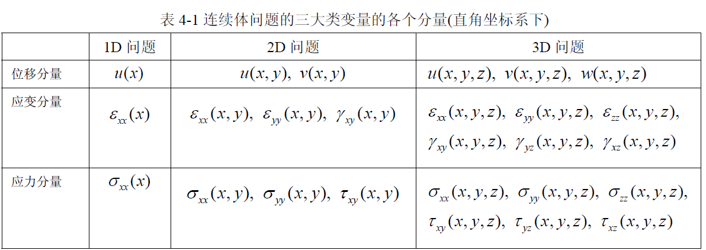
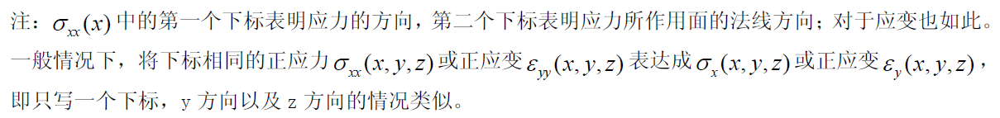

对应基本变量，可以类写出基本方程和边界条件：

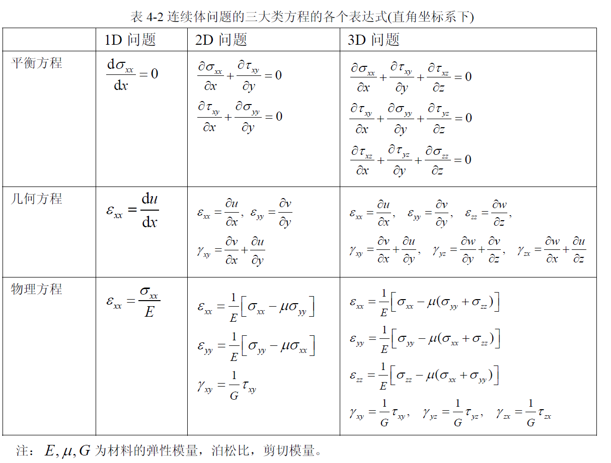
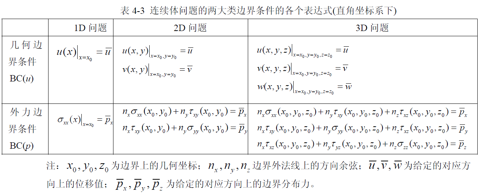

#### 求解算法

对列写出的方程和边界条件，需要进行求解。对 2D、3D 问题，其变量和方程的个数都比较多，且方程式偏微分方程，除了一些简单的形状外一般很难直接求解。我们首先约定，一个好的求解算法具有的特征：

- 几何形状的适应性
- 数学力学原理上的标准化（不需要过多的技巧，比较容易掌握）
- 处理过程的规范型（具有统一的处理流程）
- 操作实施的可行性（可处理大规模线性方程组）
- 分析误差的可控制性（可确定计算的效率，方法具有好的收敛性）

针对弹性问题的三大类变量和方程，从第一层次 (求解方法论) 的思路上说，总体上有两大类求解方法：直接法 (直接求解原始微分方程)、以及试函数法 (基于假设解的调试方法)

从第二层次 (求解策略) 的思路上说，对于三大类变量，要同时进行联立求解一般比较困难，需要将变量先进行代换，最好是代换成一种类型的变量先进行求解，然后再求解另外类型的变量。

对于直接法，也就是解析方法，若将要求解的基本变量先确定为应力的话，这就是应力方法，最常用的有**Airy 应力函数**(stress function) 方法，还有一些诸如逆解法、半逆解法的方法，但这些方法虽然可以获得解析解，但仅针对一些简单几何形状，而大量的实际问题目前还不能获得解析解；而且，对求解的数学技巧也要求较高。因此，这类方法大部分不具备上面提到的几个特征。

而对于试函数法，可以追溯到**Rayleigh**(1870 年)、以及**Ritz**(1909 年)，它首先假设一个可能的解 (即试函数，其中包含一些待定系数)，将试函数再带入到原方程中，通过确定相应误差函数的最小值来获得其中的待定系数，这样就求出以试函数 (确认了待定系数) 为结果的解，这种方法大大降低了求解的难度和技巧，方法也具有标准化和规范性，但由于最早的试函数是基于整个几何全域来选择的，因此，它的几何形状的适应性也是受到一定限制的，加上过去还没有合适的计算工具，它实施的可行性也不具备。但到现在，出现了这样一种思想：* 将基于整个几何全域的试函数变为基于分片 (子区域) 的多项式函数表达 (可以很好适应任意复杂的几何形状)，然后再将分片的函数进行集成组合得到全域的试函数 *。。这种分片就是“单元”，分片的过程就是将整体区域进行离散的过程，将这种基于分片函数描述的试函数方法叫做有限元方法，相关的示意见下图：

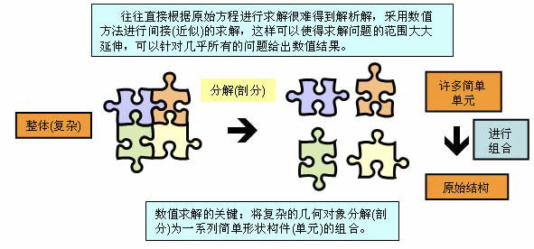

对一个一般的连续体，可以使用虚功原理来确定试函数的系数：

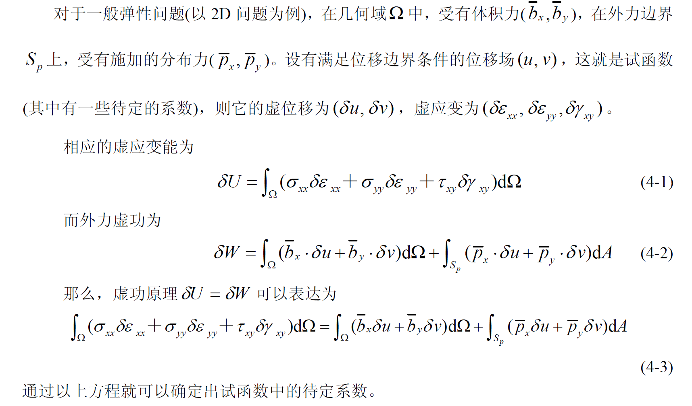

从最小势能原理角度也可以推到等价的结论：

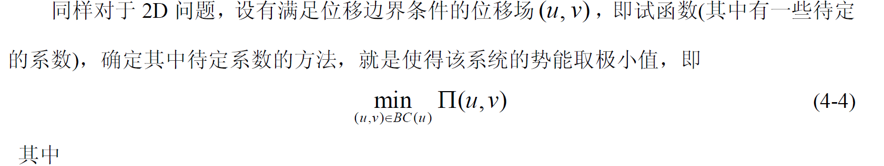
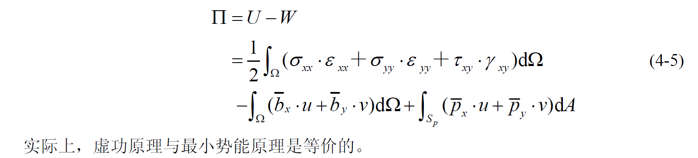
^fig-energy

#### 强度校核

在通过上面的有限元方法确定了结构的应力应变后，还应该对结构的状态进行判定，这就引入了几种**强度判断准则**，可以参考 [chap14 复杂应力状态强度问题](./../材料力学简析/材料力学简析.md#chap14-复杂应力状态强度问题)，主要有下面几种：

##### 最大拉应力准则

若材料发生脆性断裂失效，其原因是材料内所承受的最大拉应力达到了所能承受的极限 (一般用于脆性材料)

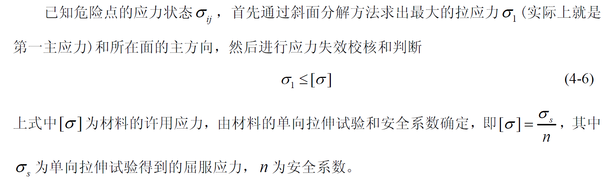

##### 最大剪应力准则

若材料发生屈服 (或剪断)，其原因是材料内所承受的最大剪应力达到了所能承受的极限 (一般用于韧性材料)

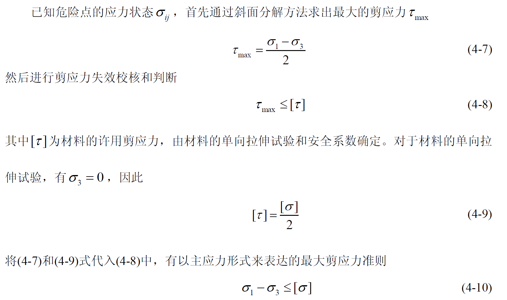

##### 最大畸变能准则

若材料发生屈服 (或剪断)，其原因是材料内的畸变能密度达到了所能承受的极限 (一般用于韧性材料，也称为 Mises 等效应力强度准则)

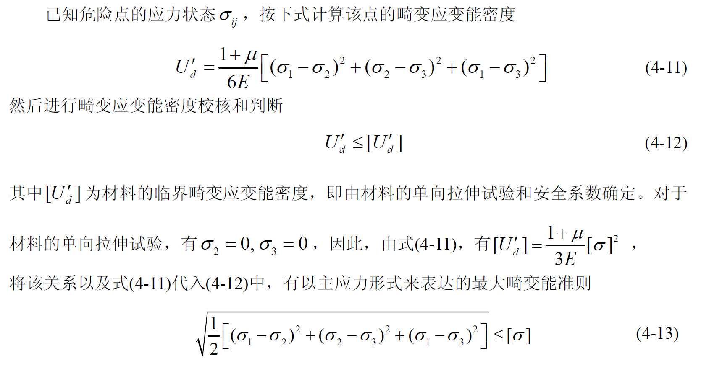
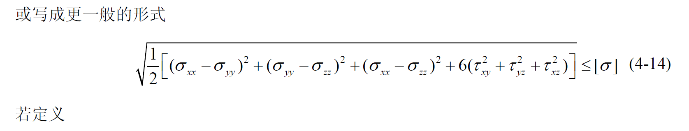
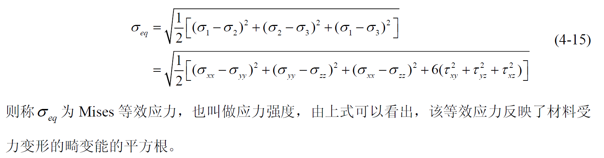

## 平面问题有限元分析的标准结构

### 平面 3 节点三角形单元

平面问题 3 节点单元具有几何特征简单、描述能力强的特点，是平面问题有限元分析中最基础的单元，也是最重要的单元之一

#### 单元的几何和节点描述

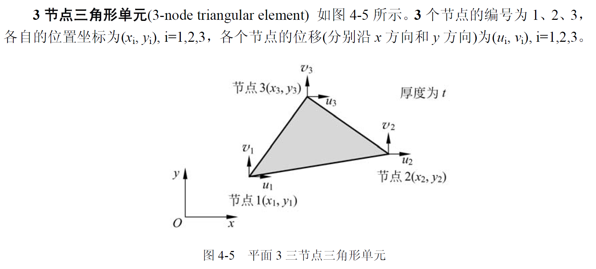

这个单元一共有 6 个节点位移自由度。将所有节点上的位移组成一个列阵，记为 $q^e$，节点上的所有力也组成一个列阵，记为 $P^e$，则：

$$

\begin{gathered}
\underset{(6 \times 1)}{\mathbf{q}^{e}}=\left[\begin{array}{llllll}
u_{1} & v_{1} & u_{2} & v_{2} & u_{3} & v_{3}
\end{array}\right]^{T} \\
\underset{(6 \times 1)}{\mathbf{P}^{e}}=\left[\begin{array}{llllll}
P_{x 1} & P_{y 1} & P_{x 2} & P_{y 2} & P_{x 3} & P_{y 3}
\end{array}\right]^{T}
\end{gathered}

$$

::: note note
如果外力是分布外载，也可以将其等效到节点上来表示为上面的节点力形式
:::

#### 单元位移场表示

就如图 4-5 所示的平面 3 节点三角形单元，由于有 3 个节点，每一个节点有两个位移，因此共有 6 个节点位移，考虑到简单性、完备性、连续性及待定系数的唯一确定性原则，分别选取单元中各个方向的位移模式为：

$$

\left.\begin{array}{l}
u(x, y)=\bar{a}_{0}+\bar{a}_{1} x+\bar{a}_{2} y \\
v(x, y)=\bar{b}_{0}+\bar{b}_{1} x+\bar{b}_{2} y
\end{array}\right\}

$$

::: note comment
这里选取的为线性的是为了计算简单，事实上完全可以换一个形式
:::

带入节点变形条件有：

$$

\left.\begin{array}{l}
u\left(x_{i}, y_{i}\right)=u_{i} \\
v\left(x_{i}, y_{i}\right)=v_{i}
\end{array}\right\} \mathrm{i}=1,2,3

$$

从而解得待定系数：

$$

\begin{aligned}
&\bar{a}_{0}=\frac{1}{2 A}\left|\begin{array}{lll}
u_{1} & x_{1} & y_{1} \\
u_{2} & x_{2} & y_{2} \\
u_{3} & x_{3} & y_{3}
\end{array}\right|=\frac{1}{2 A}\left(a_{1} u_{1}+a_{2} u_{2}+a_{3} u_{3}\right) \\
&\bar{a}_{1}=\frac{1}{2 A}\left|\begin{array}{lll}
1 & u_{1} & y_{1} \\
1 & u_{2} & y_{2} \\
1 & u_{3} & y_{3}
\end{array}\right|=\frac{1}{2 A}\left(b_{1} u_{1}+b_{2} u_{2}+b_{3} u_{3}\right) \\
&\bar{a}_{2}=\frac{1}{2 A}\left|\begin{array}{lll}
1 & x_{1} & u_{1} \\
1 & x_{2} & u_{2} \\
1 & x_{3} & u_{3}
\end{array}\right|=\frac{1}{2 A}\left(c_{1} u_{1}+c_{2} u_{2}+c_{3} u_{3}\right) \\
&\bar{b}_{0}=\frac{1}{2 A}\left(a_{1} v_{1}+a_{2} v_{2}+a_{3} v_{3}\right) \\
&\bar{b}_{1}=\frac{1}{2 A}\left(b_{1} v_{1}+b_{2} v_{2}+b_{3} v_{3}\right) \\
&\bar{b}_{2}=\frac{1}{2 A}\left(c_{1} v_{1}+c_{2} v_{2}+c_{3} v_{3}\right)
\end{aligned}

$$

其中：

$$
A=\frac{1}{2}\left|\begin{array}{lll}1 & x_{1} & y_{1} \\ 1 & x_{2} & y_{2} \\ 1 & x_{3} & y_{3}\end{array}\right|=\frac{1}{2}\left(a_{1}+a_{2}+a_{3}\right)=\frac{1}{2}\left(b_{1} c_{2}-b_{2} c_{1}\right)
$$

$$

a_{1}=\left|\begin{array}{ll}
x_{2} & y_{2} \\
x_{3} & y_{3}
\end{array}\right|=x_{2} y_{3}-x_{3} y_{2} \mid

$$

$$

b_{1}=-\left|\begin{array}{ll}
1 & y_{2} \\
1 & y_{3}
\end{array}\right|=y_{2}-y_{3} \quad(1,2,3)

$$

$$

c_{1}=\left|\begin{array}{ll}
1 & x_{2} \\
1 & x_{3}
\end{array}\right|=-x_{2}+x_{3}

$$

上式中的符号（1，2，3）表示下标轮换，如 1→2，2→3，3→1 同时更换

将系数带入试函数的位移函数中解得：

$$

\underset{(2 \times 1)}{\mathbf{u}}(x, y)=\left[\begin{array}{c}
u(x, y) \\
v(x, y)
\end{array}\right]=\left[\begin{array}{cccccc}
N_{1} & 0 & N_{2} & 0 & N_{3} & 0 \\
0 & N_{1} & 0 & N_{2} & 0 & N_{3}
\end{array}\right]\left[\begin{array}{l}
u_{1} \\
v_{1} \\
u_{2} \\
v_{2} \\
u_{3} \\
v_{3}
\end{array}\right]=\underset{(2 \times 6)}{\mathbf{N}}(x, y) \cdot \underset{(6 \times 1)}{\mathbf{q}^{e}}

$$

^eqn-triangle-move

其中 $\mathbf{N}(x, y)$ 为形状函数矩阵, 即

$$

\underset{(2 \times 6)}{\mathbf{N}}(x, y)=\left[\begin{array}{cccccc}
N_{1} & 0 & N_{2} & 0 & N_{3} & 0 \\
0 & N_{1} & 0 & N_{2} & 0 & N_{3}
\end{array}\right]

$$

而

$$

N_{i}=\frac{1}{2 A}\left(a_{i}+b_{i} x+c_{i} y\right) \quad, \quad i=1,2,3

$$

其中的系数 $a_{i}, b_{i}, c_{i}$ 见式 (4-27)。

#### 单元应变场表示

根据弹性力学平面问题的几何方程（矩阵形式）：

$$

\underset{(3 \times 1)}{\varepsilon}(x, y)=\left[\begin{array}{l}
\varepsilon_{x x} \\
\varepsilon_{y y} \\
\gamma_{x y}
\end{array}\right]=\left[\begin{array}{c}
\frac{\partial u}{\partial x} \\
\frac{\partial v}{\partial y} \\
\frac{\partial u}{\partial y}+\frac{\partial v}{\partial x}
\end{array}\right]=\left[\begin{array}{cc}
\frac{\partial}{\partial x} & 0 \\
0 & \frac{\partial}{\partial y} \\
\frac{\partial}{\partial y} & \frac{\partial}{\partial x}
\end{array}\right]\left[\begin{array}{c}
u(x, y) \\
v(x, y)
\end{array}\right]=\underset{(3 \times 2) }{[\partial]} \underset{(2 \times 1)}{\mathbf{u}}

$$

其中 $[\partial]$ 为几何方程的算子矩阵 (operator matrix), 即

$$

[\partial]=\left[\begin{array}{cc}
\frac{\partial}{\partial x} & 0 \\
0 & \frac{\partial}{\partial y} \\
\frac{\partial}{\partial y} & \frac{\partial}{\partial x}
\end{array}\right]

$$

进而其应变场可以表示为：

$$

\underset{(3 \times 1)}{\boldsymbol{\varepsilon}}(x, y)=\underset{(3 \times 2)}{[\partial]} \underset{(2 \times 6)}{\mathbf{N}}(x, y) \cdot \underset{(6 \times 1)}{\mathbf{q}^{e}}=\underset{(3 \times 6)}{\mathbf{B}}(x, y) \cdot \underset{(6 \times 1)}{\mathbf{q}^{e}}

$$

其中几何矩阵 $\mathbf{B}(x, y)$ 为

$$

\underset{(3\times 6)}{\mathbf{B}}(x,y)=\underset{\left( 3\times 2 \right)}{\left[ \partial \right]}\underset{(2\times 6)}{\mathbf{N}}=\left[ \begin{matrix}
	\frac{\partial}{\partial x}&		0\\
	0&		\frac{\partial}{\partial y}\\
	\frac{\partial}{\partial y}&		\frac{\partial}{\partial x}\\
\end{matrix} \right] \left[ \begin{matrix}
	N_1&		0&		N_2&		0&		N_3&		0\\
	0&		N_1&		0&		N_2&		0&		N_3\\
\end{matrix} \right]

$$

$$

\underset{(3 \times 6)}{\mathbf{B}}(x, y)=\frac{1}{2 A}\left[\begin{array}{cccccc}
b_{1} & 0 & b_{2} & 0 & b_{3} & 0 \\
0 & c_{1} & 0 & c_{2} & 0 & c_{3} \\
c_{1} & b_{1} & c_{2} & b_{2} & c_{3} & b_{3}
\end{array}\right]=\left[\begin{array}{ccc}
\mathbf{B}_{1} & \mathbf{B}_{2} & \mathbf{B}_{3} \\
(3 \times 2) & (3 \times 2) & (3 \times 2)
\end{array}\right]

$$

其中

$$

\underset{(3 \times 2)}{\mathbf{B}_{i}}=\frac{1}{2 A}\left[\begin{array}{cc}
b_{i} & 0 \\
0 & c_{i} \\
c_{i} & b_{i}
\end{array}\right], \quad i=1,2,3

$$

#### 单元应力场表示

根据弹性力学中的物理方程，有应力和应变满足下面的形式：

$$

\underset{(3\times 1)}{\boldsymbol{\sigma }}(x,y,z)=\left[ \begin{array}{l}
	\sigma _{xx}\\
	\sigma _{yy}\\
	\tau _{xy}\\
\end{array} \right] =\frac{E}{1-\mu ^2}\left[ \begin{matrix}
	1&		\mu&		0\\
	\mu&		1&		0\\
	0&		0&		\frac{1-\mu}{2}\\
\end{matrix} \right] \left[ \begin{array}{l}
	\varepsilon _{xx}\\
	\varepsilon _{yy}\\
	\gamma _{xy}\\
\end{array} \right] =\underset{(3\times 3)}{\mathbf{D}}\cdot \underset{(3\times 1)}{\varepsilon}

$$

其中弹性系数矩阵 D 满足：

$$

\underset{(3 \times 3)}{\mathbf{D}}=\frac{E}{1-\mu^{2}}\left[\begin{array}{ccc}
1 & \mu & 0 \\
\mu & 1 & 0 \\
0 & 0 & \frac{1-\mu}{2}
\end{array}\right]

$$

带入应变场的形式可以有：

$$

\underset{(3 \times 1)}{\boldsymbol{\sigma}}=\underset{(3 \times 3)}{\mathbf{D}} \cdot \underset{(3 \times 6)}{\mathbf{B}} \cdot \mathbf{q}_{(6 \times 1)}^{e}=\underset{(3 \times 6)}{\mathbf{S}} \cdot \mathbf{q}_{(6 \times 1)}^{e}

$$

#### 单元势能场表达

带入 [^fig-energy](./#^fig-energy) 有：

$$

\begin{aligned}
\Pi^{e} &=\frac{1}{2} \int_{\Omega^{e}} \boldsymbol{\sigma}^{T} \cdot \mathbf{\varepsilon} \mathrm{d} \Omega-\left[\int_{\Omega^{e}} \overline{\mathbf{b}}^{T} \cdot \mathbf{u d} \Omega+\int_{S_{p}^{e}} \overline{\mathbf{p}}^{T} \cdot \mathbf{u d} A\right] \\
&=\frac{1}{2} \mathbf{q}^{e T}\left(\int_{\Omega^{e}} \mathbf{B}^{T} \mathbf{D} \mathbf{B} \mathrm{d} \Omega\right) \mathbf{q}^{e}-\left(\int_{\Omega^{e}} \mathbf{N}^{T} \overline{\mathbf{b}} \mathrm{d} \Omega+\int_{S_{p}^{e}} \mathbf{N}^{T} \overline{\mathbf{p}} \mathrm{d} A\right)^{T} \mathbf{q}^{e} \\
&=\frac{1}{2} \mathbf{q}^{e T} \mathbf{K}^{e} \mathbf{q}^{e}-\mathbf{P}^{e T} \mathbf{q}^{e}
\end{aligned}

$$

^eqn-triangle-energy

其中 $\mathbf{K}^{e}$ 是单元刚度矩阵, 即

$$

\underset{(6 \times 6)}{\mathbf{K}^{e}}=\int_{\Omega^{e}} \underset{(6 \times 3)}{\mathbf{B}^{T}} \underset{(3 \times 3)}{\mathbf{D}} \underset{(3 \times 6)}{\mathbf{B}} \mathrm{d} \Omega=\int_{A^{e}} \mathbf{B}^{T} \mathbf{D} \mathbf{B} \cdot \mathrm{d} A \cdot t

$$

$t$ 为平面问题的厚度。由 $\mathbf{B}$ 矩阵定义式可知, 这时 $\mathbf{B}$ 矩阵为常系数矩阵, 因此上式可以写成

$$

\underset{(6 \times 6)}{\mathbf{K}^{e}}=\underset{(6 \times 3)}{\mathbf{B}^{T}} \underset{(3 \times 3)}{\mathbf{D}} \underset{(3 \times 6)}{\mathbf{B}} t A=\left[\begin{array}{lll}
\mathbf{k}_{11} & \mathbf{k}_{12} & \mathbf{k}_{13} \\
\mathbf{k}_{21} & \mathbf{k}_{22} & \mathbf{k}_{23} \\
\mathbf{k}_{31} & \mathbf{k}_{32} & \mathbf{k}_{33}
\end{array}\right]

$$

其中的各个子块矩阵为

$$

\underset{\substack{(2 \times 2)}}{\mathbf{k}_{r s}}=\mathbf{B}_{r}^{T} \mathbf{D} \mathbf{B}_{s} t A=\frac{E t}{4\left(1-\mu^{2}\right) A}\left[\begin{array}{ll}
k_{1} & k_{3} \\
k_{2} & k_{4}
\end{array}\right], \quad r, s=1,2,3

$$

其中

$$

\begin{aligned}
&k_{1}=b_{r} b_{s}+\frac{1-\mu}{2} c_{r} c_{s} \\
&k_{2}=\mu c_{r} b_{s}+\frac{1-\mu}{2} b_{r} c_{s} \\
&k_{3}=\mu b_{r} c_{s}+\frac{1-\mu}{2} c_{r} b_{s} \\
&k_{4}=c_{r} c_{s}+\frac{1-\mu}{2} b_{r} b_{s}
\end{aligned}

$$

而式[^eqn-triangle-energy](./#^eqn-triangle-energy) 中的 $\mathbf{P}^{\mathrm{e}}$ 为单元节点等效载荷, 即

$$

\begin{aligned}
\underset{(6 \times 1)}{\mathbf{P}^{e}} &=\int_{\Omega^{e}} \mathbf{N}^{T} \overline{\mathbf{b}} \mathrm{d} \Omega+\int_{S_{p}^{e}} \mathbf{N}^{T} \overline{\mathbf{p}} \mathrm{d} A \\
&=\int_{A^{e}} \underset{(6 \times 2)}{\mathbf{N}^{T}} \underset{(2 \times 1)}{\mathbf{b}} t \mathrm{~d} A+\int_{l_{p}^{e}(6 \times 2)} \mathbf{N}^{T} \underset{(2 \times 1)}{\mathbf{p}} t \mathrm{~d} l
\end{aligned}

$$

其中 $l_{p}^{e}$ 为单元上作用有外载荷的边, $\int \mathrm{d} l$ 为线积分。

#### 单元的刚度方程

将单元的势能表达式对节点位移做一阶微分可以得到单元的刚度方程：

$$
\underset{\left( 6\times 6 \right)}{\mathbf{K}^e}\cdot \underset{\left( 6\times 1 \right)}{\mathbf{q}^e}=\underset{\left( 6\times 1 \right)}{\mathbf{P}^e}
$$

^eqn-triangle-sol

单元在承受非节点载荷时，如在边线上承受一个分布载荷，这时应根据外力功的计算公式来获得节点载荷的等效值，常见的平面问题 3 节点三角形单元的节点等效外载荷列阵如下表所示：

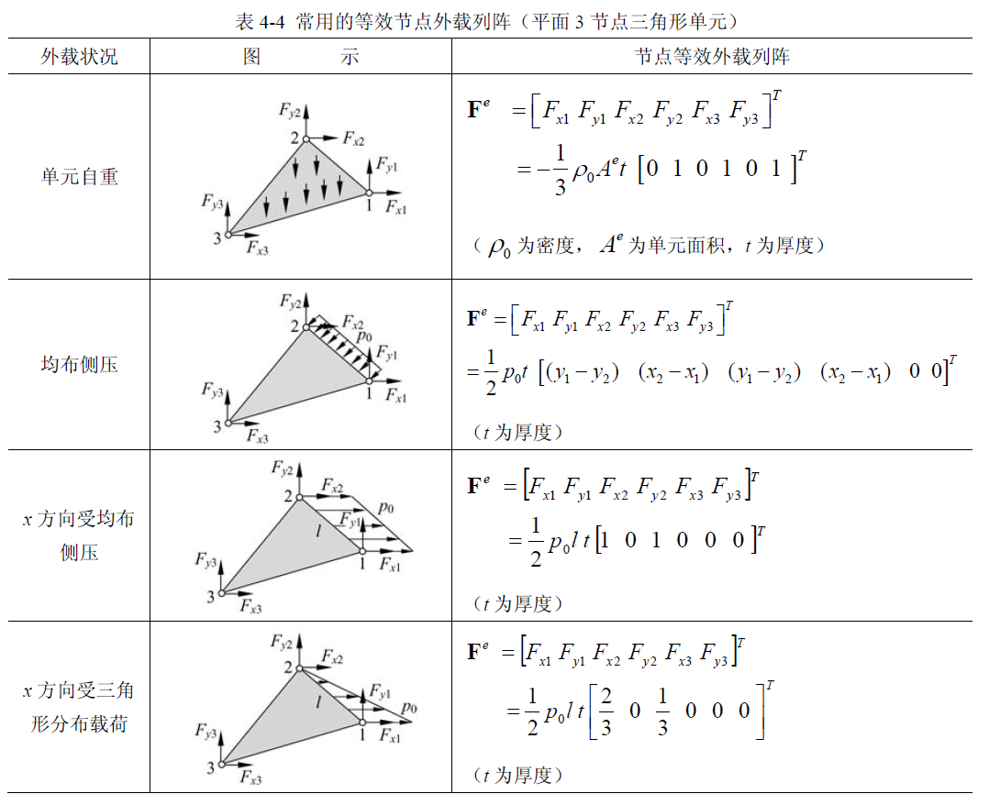
^fig-triangle-equivalent-load

#### 一些 Note

##### 位移坐标变换问题

由于该单元的节点位移是以整体坐标系中的 x 方向位移 u 和 y 方向方向位移 v 来定义的，所以没有坐标变换问题

##### 平面 3 节点三角形单元的常系数应变和应力

由于该单元的位移场为 [线性关系式](./)，且其系数只和对应的坐标位置有关，从而其各个单元矩阵都是常系数的，不随 x, y 变化。进而表明，单元内任意一点的应变和应力都为常数。，3 节点三角形单元称为**常应变**(应力)**CST 单元**(constant strain triangle)。这也暗示我们，* 在实际使用过程中，对于应变梯度较大（也即应力梯度比较大）的区域，单元划分应适当加密，否则将不能反映应变 (应力) 的真实变化情况，从而导致较大的误差 *

### 平面 4 节点矩形单元

**矩形单元**(rectangular element) 由于形状简单和规范将作为**基准单元**(parent element) 进行研究，在实际的应用中，可以根据真实情况将矩形单元“映射”(mapping) 为所需要的任意四边形单元。

#### 单元的几何和节点描述
