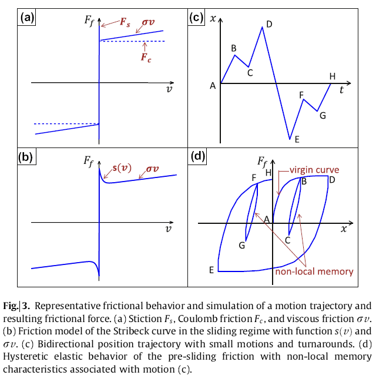
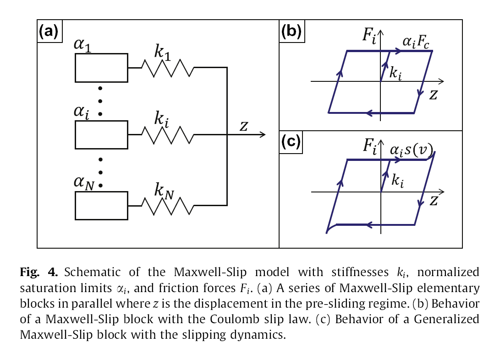
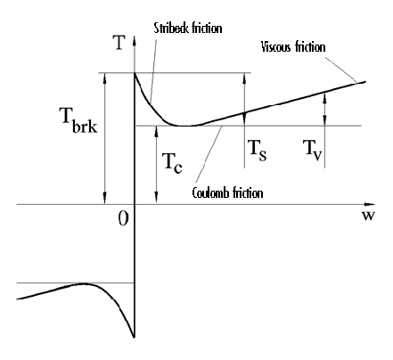
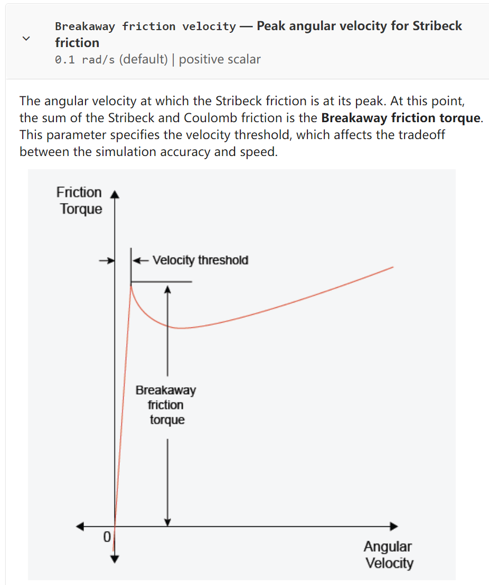
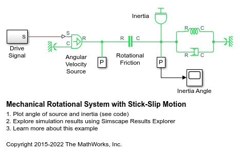
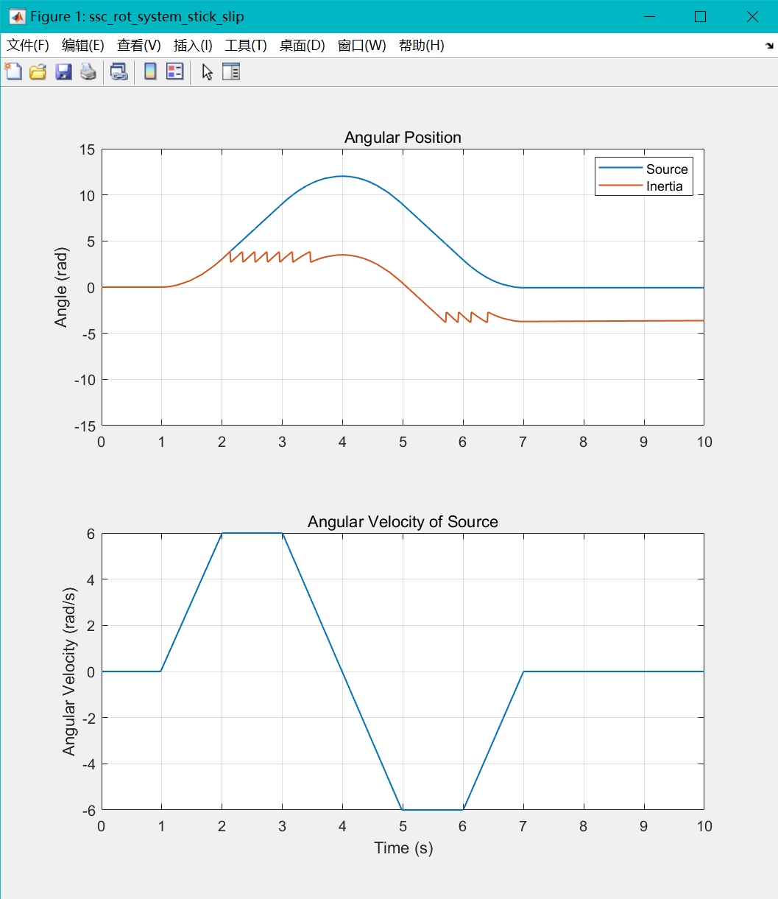
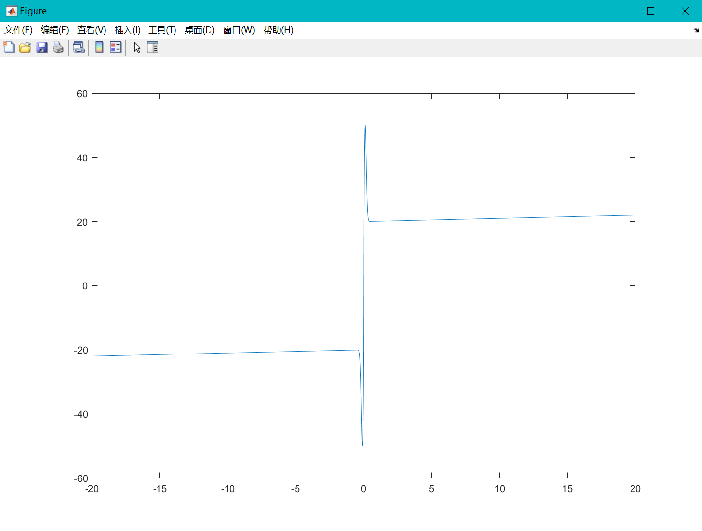
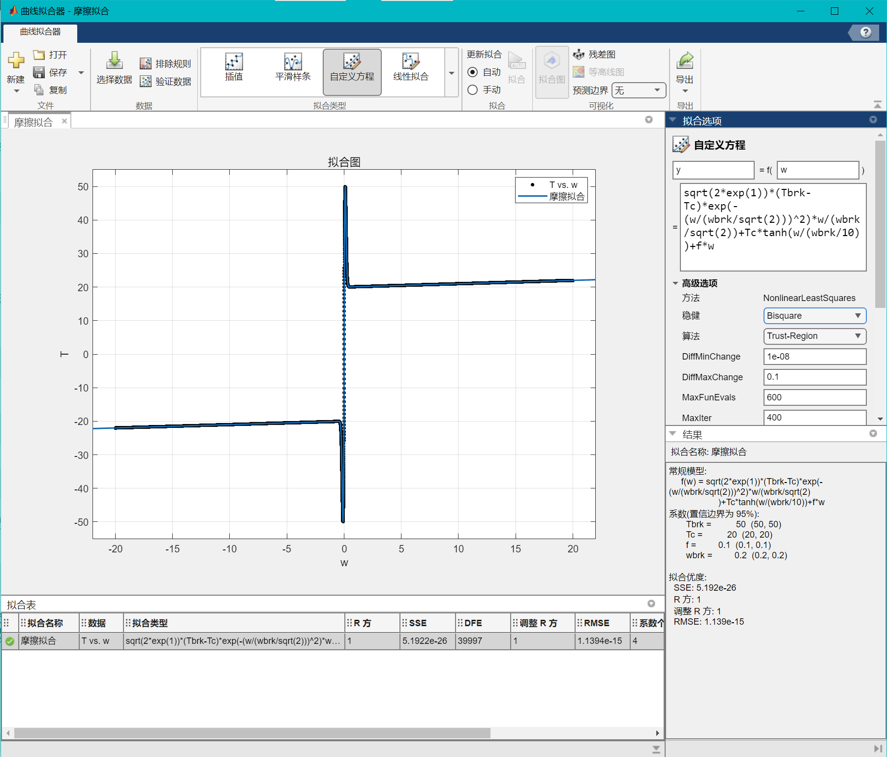

# 摩擦力建模


## 定义

对摩擦力的模型进行介绍，并介绍了解到的辨识方法，主要分为：
- 平动摩擦
- 转动摩擦

## 方案

### 平动摩擦


### 转动摩擦

#### 动力学模型

##### 经典模型

经典的平动的摩擦模型是 $F=\mu N$，这是一种库伦摩擦力的体现。当其中引入了 static friction 和一个线性的 viscous drag term 后，其摩擦力图景如图 [^img-fig3](./#^img-fig3) 的 (a) 所示。如果增加了滑动状态下的连续速度依赖性，就得到了 Stribeck 提出的模型，如图 (b) 所示，形式为：


$$

F\left( v \right) =s\left( v \right) +\sigma v=\text{sgn} \left( v \right) \left( F_c+\left( F_s-F_c \right) \exp \left( \left| \frac{v}{V_s} \right|^{\delta} \right) \right) +\sigma v

$$


其中包含了 vsicous friction，且：

- $F_{c}$ 代表 Coulomb friction
- $F_{s}$ 代表 Static friction
- $V_{s}$ 代表 stribeck velocity
- $\delta$ 代表 shape factor
- $\sigma$ 代表 viscous coefficient

这一模型经常被称为 static 的因为该模型的参数是可以直接通过常值速度下的试验测量得到的。这一模型有一个大的缺点在于其 0 点不连续性，从而无法解释：
- friction lag
- rate-dependent breakaway force
- hysteresis with non-local memory



^img-fig3

##### 扩展模型——GMS

为了解决上面提出的问题，提出了 GMS 模型


$$

\begin{array}{l}
	\frac{\mathrm{d}F_i}{\mathrm{d}t}=k_iv, \mathrm{if} stick\\
	\frac{\mathrm{d}F_i}{\mathrm{d}t}=\text{sgn} \left( v \right) C\left( \alpha _i-\frac{F_i}{s\left( v \right)} \right) , \mathrm{if} slip\\
	F_f=\sum_{i=1}^N{F_i\left( t \right)}+\sigma v\left( t \right)\\
\end{array}

$$


其中 C 是一个 attraction factor 决定了 slipping dynamics 跟随速度曲线的变化速率



其参数辨识和具体细节可以参考：

[@yoonFrictionModelingIdentification2014](./../../paper/@yoonFrictionModelingIdentification2014.md)


##### 经典模型——形式 2

转动摩擦的动力学模型被写为下面的形式：



其中可以分为 3 个部分：
- Stribeck friction $T_{S}$ ：在低速情况下的反向曲线
- Coulomb friction $T_{C}$ ：在任何速度下的恒定力矩
- Viscous friction $T_{V}$ ：和相对速度成正比的力矩

完整的摩擦力力矩表达式为：


$$

\begin{aligned}
	T&=\sqrt{2e}\left( T_{brk}-T_C \right) \cdot \exp \left( -\left( \frac{\omega}{\omega _{St}} \right) ^2 \right) \cdot \frac{\omega}{\omega _{St}}+T_C\cdot \tanh \left( \frac{\omega}{\omega _{Coul}} \right) +f\omega\\
	\omega _{St}&=\omega _{brk}\sqrt{2}\\
	w_{Coul}\,\,&=\omega _{brk}/10\\
	\omega &=\omega _R-\omega _C\\
\end{aligned}

$$


其中：

- $T$ 是摩擦力矩
- $T_{C}$ 是 Coluomb 摩擦力矩
- $T_{brk}$ 是启动的 breakaway 力矩
- $w_{brk}$ 是 breakaway friction velocity
	- 
- $w_{St}$ 是 Stribeck velocity threshold
- $w_{Coul}$ 是 Coulomb velocity threshold
- $w_{R},w_{C}$ 是相对的两物体 R 和 C 的角速度
- $w$ 是相对速度
- $f$ 是 viscous friction 系数

其相关的数值模拟可以参考：

- [Mechanical Rotational System with Stick-Slip Motion - MATLAB & Simulink - MathWorks 中国](https://ww2.mathworks.cn/help/simscape/ug/mechanical-rotational-system-with-stick-slip-motion.html)





###### 摩擦辨识测试

根据提供的摩擦力式子，构造摩擦力如下：


```matlab
P.Tbrk = 50;
P.Tc = 20;
P.wbrk = 0.2;
P. f = 0.1;

w = -20:1e-3:20;
T = arrayfun(@(x) fm1(x, P), w);
plot(w, T)
```

其中函数为：

```shell
function T = fm1(w, P)
Tbrk = P.Tbrk;
Tc = P.Tc;
wbrk = P.wbrk;
f = P.f;

wst = wbrk/sqrt(2);
wcoul = wbrk/10;

T = sqrt(2*exp(1))*(Tbrk-Tc)*exp(-(w/wst)^2)*w/wst + Tc*tanh(w/wcoul) + f*w;

end
```

用于拟合的函数为：

```matlab
sqrt(2*exp(1))*(Tbrk-Tc)*exp(-(w/(wbrk/sqrt(2)))^2)*w/(wbrk/sqrt(2))+ Tc*tanh(w/(wbrk/10)) + f*w;
```

做出的摩擦力图为：



使用 matlab 的曲线拟合工具的自定义曲线拟合，结果如下：



可以发现精度很好，牛的

代码参考：

- [摩擦拟合](./assets/摩擦拟合/摩擦拟合.sfit)
- [frictionCalibration](./assets/摩擦拟合/frictionCalibration.mlx)

## 参考

##### 引文

- [@yoonFrictionModelingIdentification2014](./../../paper/@yoonFrictionModelingIdentification2014.md)
- [Friction in contact between rotating bodies - MATLAB - MathWorks 中国](https://ww2.mathworks.cn/help/simscape/ref/rotationalfriction.html;jsessionid=2c5ca3c8405d8163ea1dba8debe8)
##### 脚注
