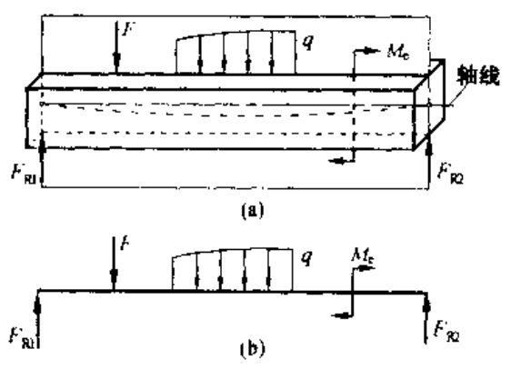
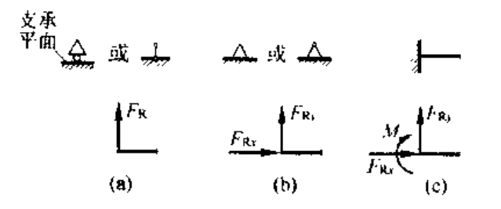
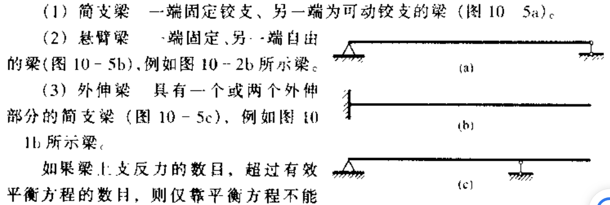
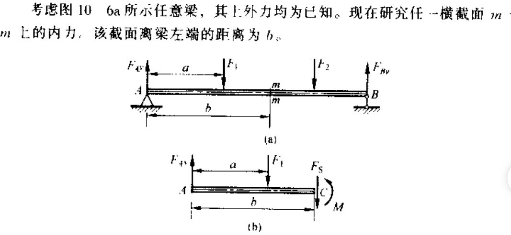
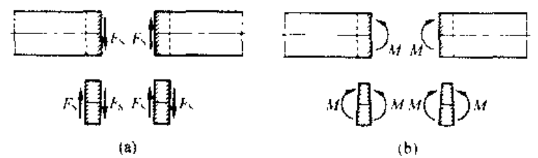
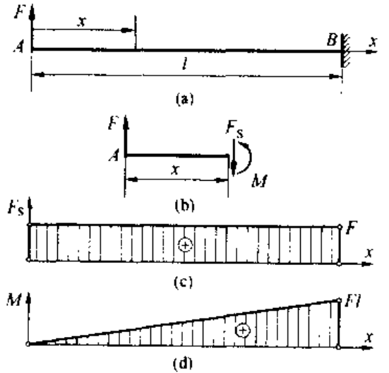
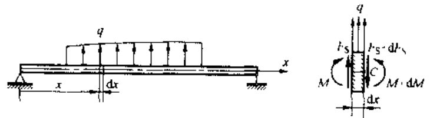
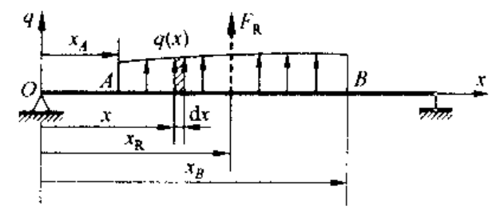

# chap10 弯曲内力

## chap10 弯曲内力

### 基本介绍

一般来讲，在杆件承受垂直于其轴线的外力时，或者在轴线平面外作用有外力偶时，杆的轴线将从直线变为曲线。这类以轴线变弯为主要特征的变型形式被称为 **弯曲**，以弯曲为主要变形的杆件称为 **梁**

#### 梁的计算简图

- 支座约束类型
  - 
- 梁的类型 (静定梁)
  - 

#### 剪力与弯矩

考虑一个简单例子：

使用力平衡方程和力矩平衡方程有：

$$

F_s=F_{Ay}-F_1
\\
M=F_{Ay}b-F_1\left( b-a \right)

$$

定义弯矩和剪力的正负符号：

- 在所切横截面的内侧取微端，凡是使得微端沿着顺时针转动剪力为正，使微端弯曲呈现凹型的弯矩为正；如下图所示
- 反之亦然

#### 剪力、弯矩图

根据上面定义的正负符号，如下例做出弯矩和剪力图为：

### 剪力、弯矩和载荷集度微分关系

从一个基本的梁进行分析，采取微端进行分析：

考虑平衡方程为：

$$

\begin{array}{c}
	\sum{F_y}=0\Rightarrow F_s+q\mathrm{d}x-\left( F_s+\mathrm{d}F_s \right) =0\\
	\sum{M_c}=0\Rightarrow M+\mathrm{d}M-q\mathrm{d}x\frac{\mathrm{d}x}{2}-F_s\mathrm{d}x-M=0\\
\end{array}

$$

因此有下面的微分方程：

$$

{\color{red}{\frac{\mathrm{d}F_s}{\mathrm{d}x}=q,\frac{\mathrm{d}M}{\mathrm{d}x}=F_s,\frac{\mathrm{d}^2M}{\mathrm{d}x^2}=q}}

$$

#### 非均布载荷梁的剪力和弯矩

对下图所示的非均布梁：

在 AB 区段，分布载荷的合力为：

$$

F_R=\int_{x_A}^{x_B}{q\left( x \right) \mathrm{d}x}

$$

在作用线至原点 O 的距离为：

$$

x_R=\frac{\int_{x_A}^{x_B}{xq\left( x \right) \mathrm{d}x}}{F_R}

$$

也就是说，在区间 AB 内，分布载荷的合力数值上即等于该区间内载荷分布图的面积，载荷作用线通过形心

此外，根据微分方程求解力也是可行的
